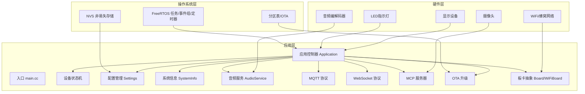
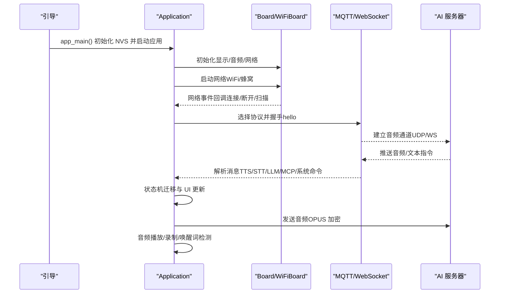
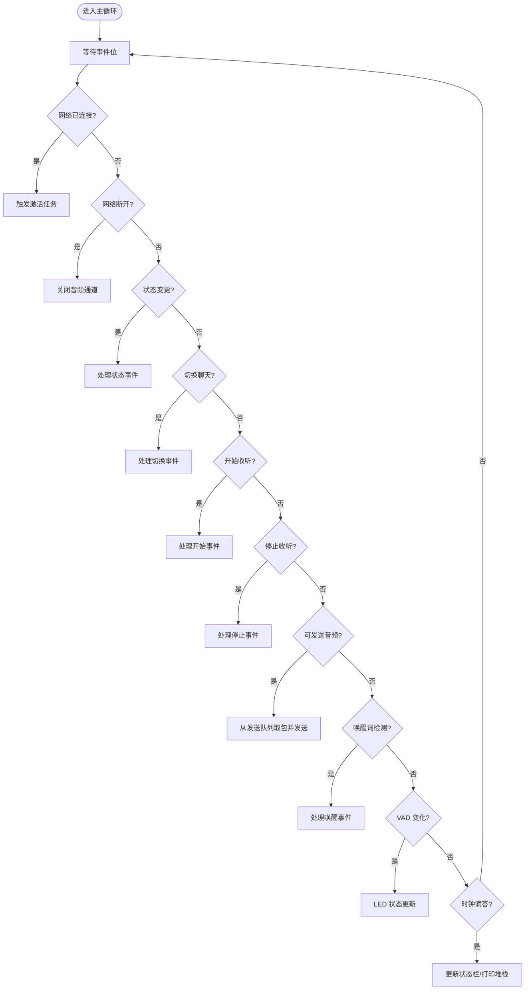
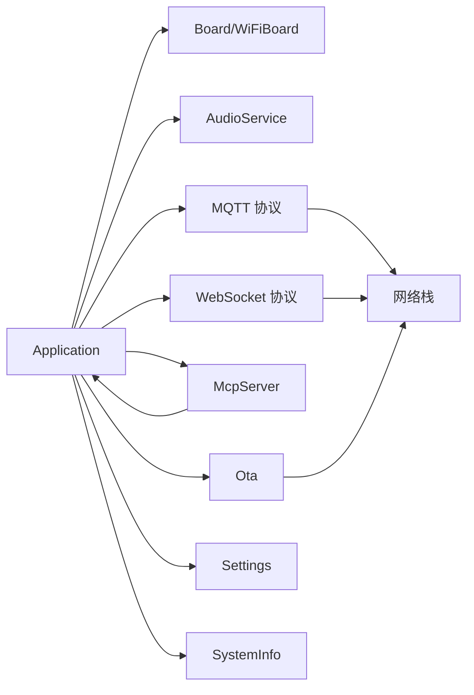
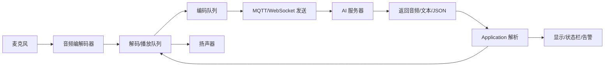
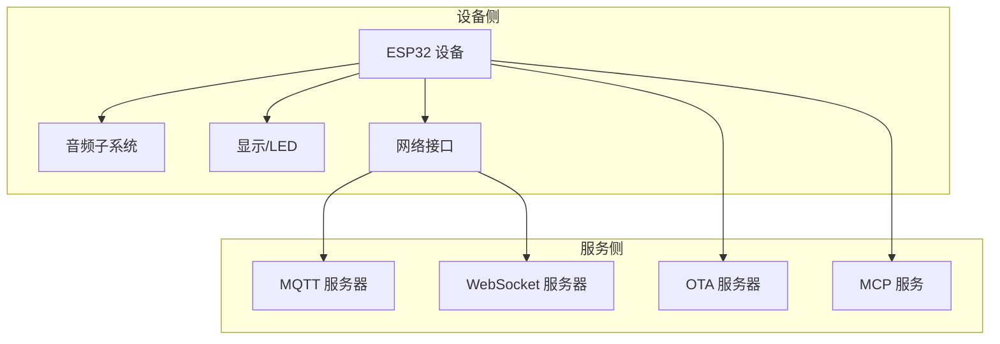

# 系统集成架构

<cite>
**本文档引用的文件**
- [main/main.cc](file://main/main.cc)
- [main/application.cc](file://main/application.cc)
- [main/settings.cc](file://main/settings.cc)
- [main/system_info.cc](file://main/system_info.cc)
- [main/device_state_machine.cc](file://main/device_state_machine.cc)
- [main/mcp_server.cc](file://main/mcp_server.cc)
- [main/ota.cc](file://main/ota.cc)
- [main/boards/common/board.cc](file://main/boards/common/board.cc)
- [main/boards/common/wifi_board.cc](file://main/boards/common/wifi_board.cc)
- [main/protocols/mqtt_protocol.cc](file://main/protocols/mqtt_protocol.cc)
- [main/protocols/websocket_protocol.cc](file://main/protocols/websocket_protocol.cc)
- [main/audio/audio_service.cc](file://main/audio/audio_service.cc)
- [docs/mcp-protocol.md](file://docs/mcp-protocol.md)
</cite>

## 目录
1. [引言](#引言)
2. [项目结构](#项目结构)
3. [核心组件](#核心组件)
4. [架构总览](#架构总览)
5. [详细组件分析](#详细组件分析)
6. [依赖关系分析](#依赖关系分析)
7. [性能考量](#性能考量)
8. [故障排查指南](#故障排查指南)
9. [结论](#结论)
10. [附录](#附录)

## 引言
本文件面向系统集成工程师与运维人员，系统性梳理 XiaoZhi ESP32 项目的系统集成架构。文档覆盖硬件层、操作系统层、应用层的分层设计，详述系统边界与集成点（AI 服务器 API、OTA 升级服务、MCP 协议服务），阐述从音频采集到语音识别再到结果返回的完整数据流与处理管道，说明配置与参数管理、监控与诊断机制，并提供部署拓扑与集成架构图，最后给出扩展性与可维护性设计建议。

## 项目结构
项目采用 ESP-IDF 分层组织，核心目录与职责如下：
- main：应用入口、主控制器、协议栈、音频子系统、设备抽象与工具集
- main/boards：硬件板卡抽象与适配，含通用板卡基类与各型号板卡实现
- main/protocols：网络协议适配（MQTT/WebSocket）
- main/audio：音频编解码、处理、唤醒词检测、播放队列与任务调度
- docs：协议与使用文档（含 MCP 协议说明）

图表来源
- [main/main.cc](file://main/main.cc#L15-L30)
- [main/application.cc](file://main/application.cc#L61-L163)
- [main/boards/common/board.cc](file://main/boards/common/board.cc#L15-L23)
- [main/boards/common/wifi_board.cc](file://main/boards/common/wifi_board.cc#L52-L88)
- [main/ota.cc](file://main/ota.cc#L28-L44)
- [main/mcp_server.cc](file://main/mcp_server.cc#L23-L31)
- [main/protocols/mqtt_protocol.cc](file://main/protocols/mqtt_protocol.cc#L55-L57)
- [main/protocols/websocket_protocol.cc](file://main/protocols/websocket_protocol.cc#L23-L26)
- [main/audio/audio_service.cc](file://main/audio/audio_service.cc#L40-L60)

章节来源
- [main/main.cc](file://main/main.cc#L15-L30)
- [main/application.cc](file://main/application.cc#L61-L163)

## 核心组件
- 应用入口与主循环：负责 NVS 初始化、应用实例化与主事件循环驱动
- 应用控制器 Application：统一协调设备状态机、音频服务、协议栈、UI 更新、OTA 升级与 MCP 服务
- 设备状态机 DeviceStateMachine：严格的状态迁移控制，确保系统行为可预期
- 配置管理 Settings：基于 NVS 的键值配置读写，支持字符串、整型、布尔
- 系统信息 SystemInfo：芯片信息、内存统计、任务与电源锁信息
- 板卡抽象 Board/WiFiBoard：设备唯一标识、系统信息 JSON、网络接口、电源策略
- 音频服务 AudioService：OPUS 编解码、重采样、VAD、唤醒词、播放队列与任务调度
- 协议栈 MQTT/WebSocket：与 AI 服务器的双向通信，音频通道加密传输
- OTA 升级 Ota：版本检查、激活、固件下载与刷写、服务器时间同步
- MCP 服务器 McpServer：设备侧工具发现与调用，支持用户工具与系统工具

章节来源
- [main/application.cc](file://main/application.cc#L23-L56)
- [main/device_state_machine.cc](file://main/device_state_machine.cc#L24-L131)
- [main/settings.cc](file://main/settings.cc#L8-L19)
- [main/system_info.cc](file://main/system_info.cc#L18-L55)
- [main/boards/common/board.cc](file://main/boards/common/board.cc#L15-L23)
- [main/audio/audio_service.cc](file://main/audio/audio_service.cc#L40-L60)
- [main/protocols/mqtt_protocol.cc](file://main/protocols/mqtt_protocol.cc#L55-L57)
- [main/protocols/websocket_protocol.cc](file://main/protocols/websocket_protocol.cc#L23-L26)
- [main/ota.cc](file://main/ota.cc#L28-L44)
- [main/mcp_server.cc](file://main/mcp_server.cc#L23-L31)

## 架构总览
系统采用“事件驱动 + 状态机”的主循环模型，通过 FreeRTOS 事件组协调网络、音频、UI、协议与 OTA 等模块；协议层支持 MQTT 与 WebSocket，二者均通过“hello”握手协商会话与音频参数；MCP 协议嵌入在基础协议消息体中，用于设备工具发现与调用。

图表来源
- [main/main.cc](file://main/main.cc#L15-L30)
- [main/application.cc](file://main/application.cc#L61-L163)
- [main/boards/common/wifi_board.cc](file://main/boards/common/wifi_board.cc#L52-L88)
- [main/protocols/mqtt_protocol.cc](file://main/protocols/mqtt_protocol.cc#L113-L151)
- [main/protocols/websocket_protocol.cc](file://main/protocols/websocket_protocol.cc#L175-L200)

## 详细组件分析

### 应用控制器 Application
- 初始化阶段：加载显示、音频、网络、MCP 工具、时钟定时器与事件组
- 主循环：监听事件位，按优先级处理网络连接/断开、激活完成、状态变更、聊天切换、开始/停止收听、发送音频、唤醒词检测、VAD 变化、定时刷新等
- 协议初始化：根据 OTA 配置选择 MQTT 或 WebSocket，注册回调（连接、网络错误、音频通道打开/关闭、JSON 指令解析）
- OTA 流程：版本检查、激活、资产更新、固件升级、标记有效版本
- UI 与告警：根据状态与事件更新状态栏、表情、聊天消息与声音提示

图表来源
- [main/application.cc](file://main/application.cc#L165-L259)

章节来源
- [main/application.cc](file://main/application.cc#L61-L163)
- [main/application.cc](file://main/application.cc#L261-L338)
- [main/application.cc](file://main/application.cc#L473-L610)

### 设备状态机 DeviceStateMachine
- 定义合法状态迁移路径，避免非法跳转
- 提供监听器回调，便于 UI 与日志感知状态变化
- 与 Application 协作，驱动 UI 与协议状态联动

章节来源
- [main/device_state_machine.cc](file://main/device_state_machine.cc#L34-L131)

### 配置管理 Settings 与系统信息 SystemInfo
- Settings：基于 NVS 的命名空间读写，支持字符串/整型/布尔，自动提交与擦除
- SystemInfo：芯片型号、MAC 地址、闪存容量、最小空闲堆、任务列表、电源锁、PM 锁等

章节来源
- [main/settings.cc](file://main/settings.cc#L21-L38)
- [main/system_info.cc](file://main/system_info.cc#L18-L55)

### 板卡抽象 Board 与 WiFiBoard
- Board：生成设备 UUID、系统信息 JSON（含分区表、应用元数据、显示信息等）、通用设备状态查询
- WiFiBoard：WiFi 管理、热点配置模式、超时重连、RSSI 图标、网络事件转发、电源策略

章节来源
- [main/boards/common/board.cc](file://main/boards/common/board.cc#L15-L23)
- [main/boards/common/board.cc](file://main/boards/common/board.cc#L70-L178)
- [main/boards/common/wifi_board.cc](file://main/boards/common/wifi_board.cc#L52-L88)
- [main/boards/common/wifi_board.cc](file://main/boards/common/wifi_board.cc#L107-L146)
- [main/boards/common/wifi_board.cc](file://main/boards/common/wifi_board.cc#L285-L300)

### 音频服务 AudioService
- OPUS 编解码、输入/输出重采样、VAD、唤醒词检测、播放队列与测试队列
- 多任务模型：输入采集、编码/解码、输出播放、音频功率管理定时器
- 与协议层配合，按帧时序发送/接收音频包

章节来源
- [main/audio/audio_service.cc](file://main/audio/audio_service.cc#L62-L123)
- [main/audio/audio_service.cc](file://main/audio/audio_service.cc#L125-L167)
- [main/audio/audio_service.cc](file://main/audio/audio_service.cc#L327-L446)

### 协议栈 MQTT 与 WebSocket
- MQTT：基于 hello 握手建立 UDP 音频通道，AES-CTR 加密，周期性重连
- WebSocket：按版本封装二进制协议，握手后建立音频通道，支持 JSON 控制消息

章节来源
- [main/protocols/mqtt_protocol.cc](file://main/protocols/mqtt_protocol.cc#L59-L152)
- [main/protocols/mqtt_protocol.cc](file://main/protocols/mqtt_protocol.cc#L215-L295)
- [main/protocols/websocket_protocol.cc](file://main/protocols/websocket_protocol.cc#L83-L201)

### OTA 升级 Ota
- 版本检查：HTTP 请求携带系统信息与语言，解析响应中的 MQTT/WebSocket 配置、激活信息、服务器时间
- 激活：支持带 HMAC 的挑战-响应激活（若设备具备 EFUSE 序列号）
- 固件升级：下载、校验、写入、设置启动分区、重启
- 标记有效版本：取消回滚

章节来源
- [main/ota.cc](file://main/ota.cc#L77-L245)
- [main/ota.cc](file://main/ota.cc#L267-L387)
- [main/ota.cc](file://main/ota.cc#L458-L492)

### MCP 协议服务
- 嵌入在基础协议（MQTT/WebSocket）的消息体中，遵循 JSON-RPC 2.0
- 设备侧工具发现与调用：tools/list、tools/call
- 用户工具与系统工具分离，支持屏幕截图上传、预览图片、升级固件、设置资产下载地址等

章节来源
- [main/mcp_server.cc](file://main/mcp_server.cc#L333-L436)
- [main/mcp_server.cc](file://main/mcp_server.cc#L455-L509)
- [main/mcp_server.cc](file://main/mcp_server.cc#L511-L563)
- [docs/mcp-protocol.md](file://docs/mcp-protocol.md#L1-L270)

## 依赖关系分析
- 组件耦合与内聚
  - Application 对 Board、AudioService、Protocol、McpServer、OTA、Settings、SystemInfo 具有高内聚依赖
  - Board/WiFiBoard 与网络栈、显示、音频编解码器耦合
  - 协议层对网络栈与 AES 加密库有直接依赖
- 外部依赖与集成点
  - AI 服务器：MQTT/WebSocket 通道、音频/文本协议、MCP 工具调用
  - OTA 服务器：版本检查、激活、固件下载
  - MCP 服务：设备工具发现与调用
- 潜在环形依赖
  - Application 与 Protocol 通过回调解耦，避免直接环依赖
  - McpServer 通过 Application 的调度接口异步执行工具，避免阻塞主循环

图表来源
- [main/application.cc](file://main/application.cc#L61-L163)
- [main/boards/common/wifi_board.cc](file://main/boards/common/wifi_board.cc#L245-L248)
- [main/protocols/mqtt_protocol.cc](file://main/protocols/mqtt_protocol.cc#L82-L83)
- [main/protocols/websocket_protocol.cc](file://main/protocols/websocket_protocol.cc#L95-L96)
- [main/mcp_server.cc](file://main/mcp_server.cc#L554-L562)
- [main/ota.cc](file://main/ota.cc#L55-L72)

章节来源
- [main/application.cc](file://main/application.cc#L61-L163)

## 性能考量
- 音频处理
  - OPUS 编解码与重采样在独立任务中执行，避免阻塞主循环
  - 音频功率管理定时器降低空闲时功耗
- 事件驱动与队列
  - 事件组与条件变量协调多任务，限制队列长度防止内存压力
- 网络与协议
  - MQTT 支持自动重连与 AES 加密，WebSocket 支持二进制协议版本协商
- 存储与配置
  - NVS 延迟提交与批量写入减少磨损
- OTA 升级
  - 下载进度回调与速度统计，验证失败回滚

章节来源
- [main/audio/audio_service.cc](file://main/audio/audio_service.cc#L125-L167)
- [main/audio/audio_service.cc](file://main/audio/audio_service.cc#L327-L446)
- [main/protocols/mqtt_protocol.cc](file://main/protocols/mqtt_protocol.cc#L17-L34)
- [main/ota.cc](file://main/ota.cc#L318-L328)

## 故障排查指南
- 网络连接问题
  - WiFiBoard 提供扫描、连接、断开、配置模式进入/退出事件，结合 Application 的网络事件处理定位
  - MQTT/WebSocket 连接失败时检查配置项（端点、令牌、版本）与服务器可达性
- 协议异常
  - MQTT：检查 hello 握手、UDP 通道建立、AES 密钥/Nonce 解码
  - WebSocket：检查版本协商、二进制协议头字段
- 音频异常
  - 检查编解码器初始化、重采样配置、VAD 与唤醒词模型
  - 查看音频队列长度与任务调度状态
- OTA 失败
  - 检查版本检查响应、激活挑战-响应、下载完整性与镜像校验
- 日志与诊断
  - SystemInfo 提供任务 CPU 使用率、堆栈统计、PM/电源锁信息
  - Application 在错误事件中弹出告警并更新 UI

章节来源
- [main/boards/common/wifi_board.cc](file://main/boards/common/wifi_board.cc#L107-L146)
- [main/protocols/mqtt_protocol.cc](file://main/protocols/mqtt_protocol.cc#L134-L151)
- [main/protocols/websocket_protocol.cc](file://main/protocols/websocket_protocol.cc#L175-L200)
- [main/audio/audio_service.cc](file://main/audio/audio_service.cc#L682-L695)
- [main/system_info.cc](file://main/system_info.cc#L57-L140)
- [main/application.cc](file://main/application.cc#L187-L190)

## 结论
XiaoZhi ESP32 项目通过清晰的分层与事件驱动架构，实现了从音频采集到云端 AI 服务的完整链路，同时提供了灵活的协议适配、完善的配置与诊断能力、以及可扩展的 MCP 工具体系。该架构适合在多硬件平台与多网络环境下快速集成与迭代。

## 附录

### 数据流与处理管道（从音频采集到结果返回）

图表来源
- [main/audio/audio_service.cc](file://main/audio/audio_service.cc#L184-L228)
- [main/audio/audio_service.cc](file://main/audio/audio_service.cc#L394-L446)
- [main/protocols/mqtt_protocol.cc](file://main/protocols/mqtt_protocol.cc#L166-L190)
- [main/protocols/websocket_protocol.cc](file://main/protocols/websocket_protocol.cc#L28-L58)
- [main/application.cc](file://main/application.cc#L521-L607)

### 系统配置与参数管理
- 运行时配置：Settings 命名空间（如 wifi、mqtt、websocket、assets），支持字符串/整型/布尔
- 网络配置：WiFiBoard 读取 SSID 列表、热点配置、超时重连
- 设备配置：Board 生成 UUID、系统信息 JSON、显示/摄像头/背光能力
- OTA 配置：版本检查响应中的 MQTT/WebSocket 配置、激活参数、服务器时间

章节来源
- [main/settings.cc](file://main/settings.cc#L21-L89)
- [main/boards/common/wifi_board.cc](file://main/boards/common/wifi_board.cc#L56-L59)
- [main/boards/common/board.cc](file://main/boards/common/board.cc#L70-L178)
- [main/ota.cc](file://main/ota.cc#L146-L186)

### 系统监控与诊断机制
- 任务与 CPU：SystemInfo 打印任务 CPU 使用率与任务列表
- 内存：最小空闲堆与当前空闲 SRAM 统计
- 电源与 PM：电源锁与 PM 锁信息打印
- 应用告警：错误事件触发 UI 与声音提示

章节来源
- [main/system_info.cc](file://main/system_info.cc#L57-L140)
- [main/application.cc](file://main/application.cc#L187-L190)

### 部署拓扑与集成架构图
- 部署拓扑
  - 设备侧：ESP32 + 音频编解码器 + 显示/摄像头 + WiFi/蜂窝
  - 服务侧：AI 服务器（MQTT/WebSocket）、OTA 服务器、MCP 服务
- 集成架构
  - Application 作为中枢，桥接协议层、音频层、UI 层与工具层
  - OTA 与 MCP 作为可插拔扩展点，通过配置与回调接入

图表来源
- [main/application.cc](file://main/application.cc#L473-L610)
- [main/boards/common/wifi_board.cc](file://main/boards/common/wifi_board.cc#L245-L248)
- [main/ota.cc](file://main/ota.cc#L46-L72)
- [main/mcp_server.cc](file://main/mcp_server.cc#L333-L436)