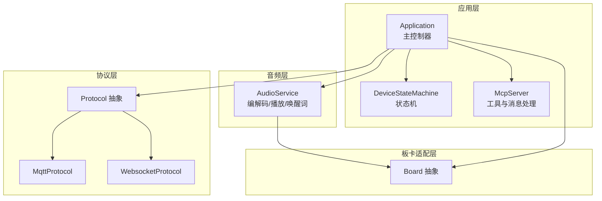
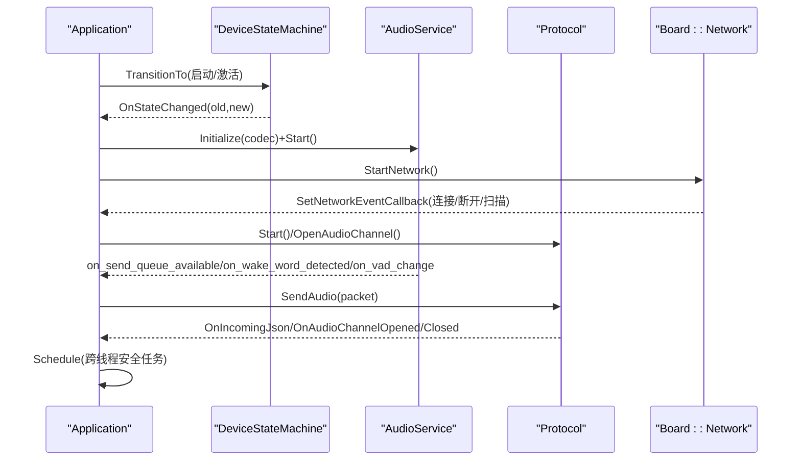
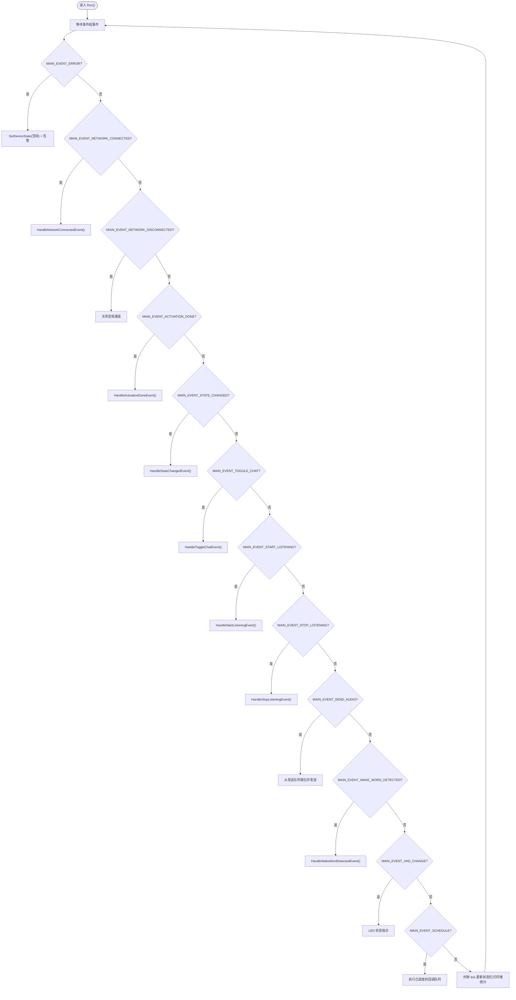
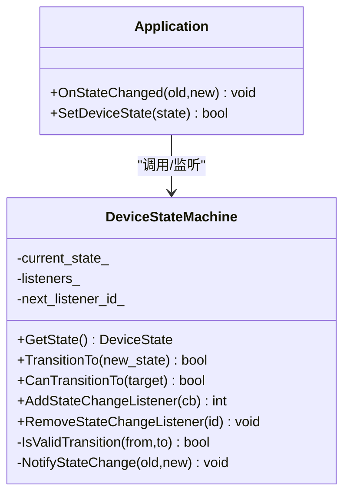
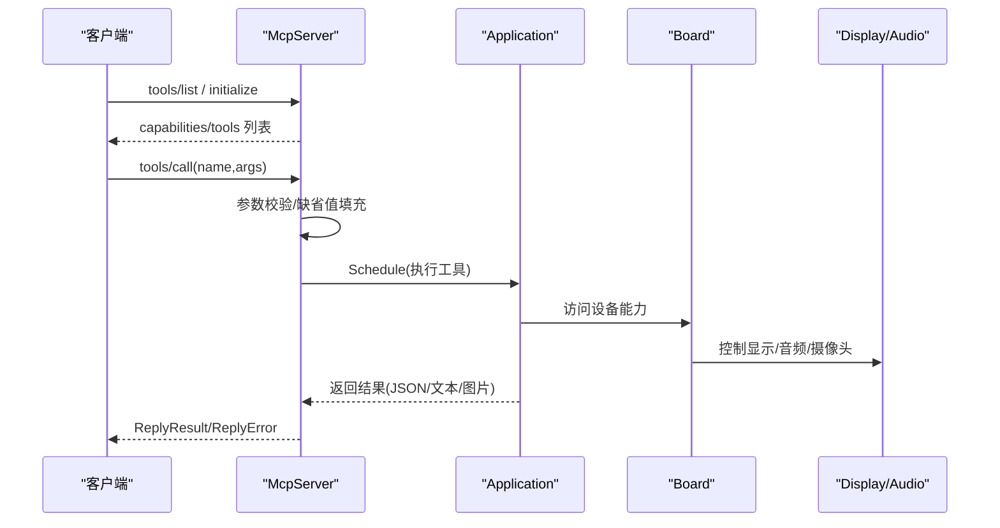
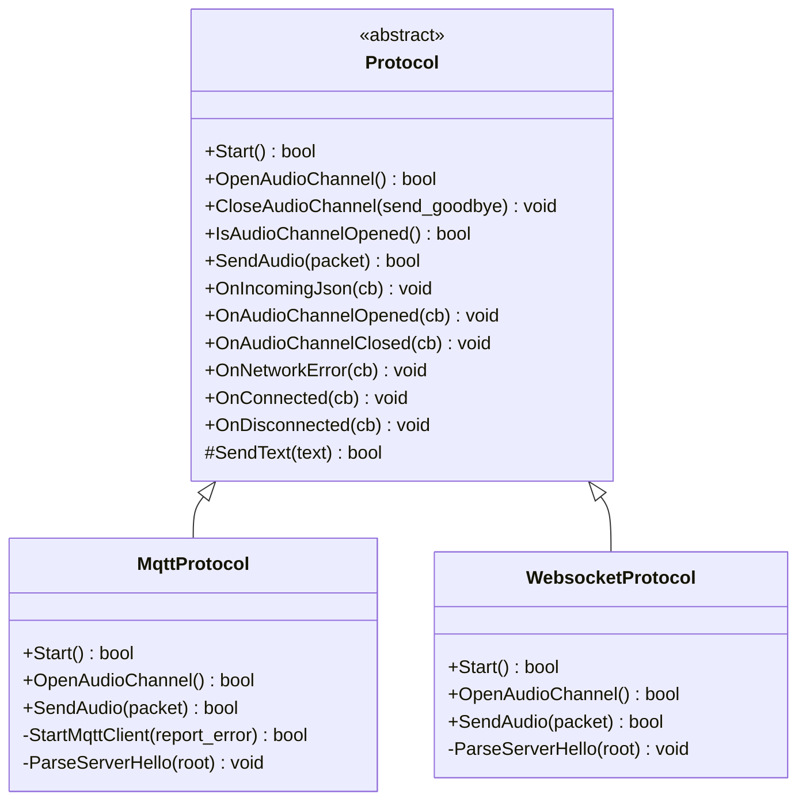
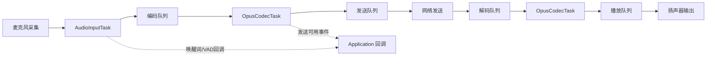
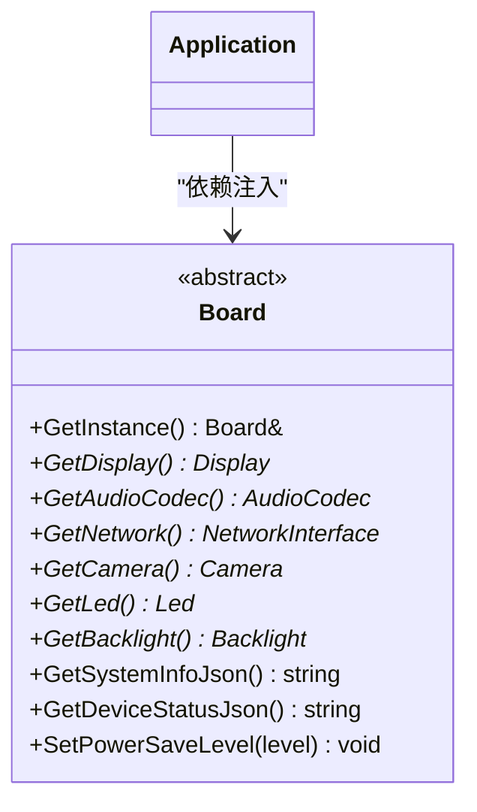
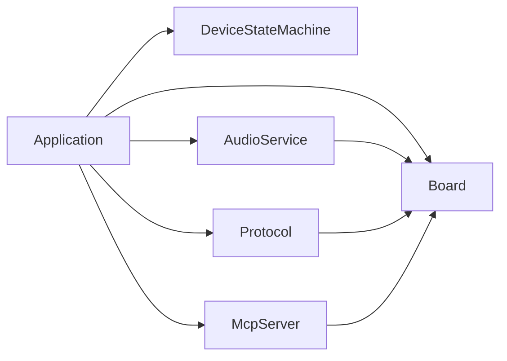

# 组件交互模式

<cite>
**本文引用的文件**
- [main/application.h](file://main/application.h)
- [main/application.cc](file://main/application.cc)
- [main/device_state_machine.h](file://main/device_state_machine.h)
- [main/device_state_machine.cc](file://main/device_state_machine.cc)
- [main/mcp_server.h](file://main/mcp_server.h)
- [main/mcp_server.cc](file://main/mcp_server.cc)
- [main/protocols/protocol.h](file://main/protocols/protocol.h)
- [main/protocols/mqtt_protocol.h](file://main/protocols/mqtt_protocol.h)
- [main/protocols/websocket_protocol.h](file://main/protocols/websocket_protocol.h)
- [main/audio/audio_service.h](file://main/audio/audio_service.h)
- [main/audio/audio_service.cc](file://main/audio/audio_service.cc)
- [main/boards/common/board.h](file://main/boards/common/board.h)
- [main/boards/common/board.cc](file://main/boards/common/board.cc)
- [main/device_state.h](file://main/device_state.h)
</cite>

## 目录
1. [引言](#引言)
2. [项目结构](#项目结构)
3. [核心组件](#核心组件)
4. [架构总览](#架构总览)
5. [详细组件分析](#详细组件分析)
6. [依赖分析](#依赖分析)
7. [性能考量](#性能考量)
8. [故障排查指南](#故障排查指南)
9. [结论](#结论)
10. [附录](#附录)

## 引言
本文件面向架构师与高级开发者，系统性梳理 XiaoZhi ESP32 项目的组件交互模式与运行机制。重点覆盖以下方面：
- 设计模式应用：观察者模式（状态变更通知）、工厂模式（协议选择）、策略模式（不同协议实现）。
- 组件通信机制：事件组事件驱动、回调函数、消息分发、跨线程任务调度。
- 松耦合与模块化：通过接口抽象、依赖注入、单例与静态工厂实现低耦合。
- 生命周期管理：初始化顺序、资源分配与释放、优先级与定时器管理。
- 错误传播与异常处理：事件驱动的错误上报、超时检测与重连策略。
- 时序与数据流图：以图示化方式呈现复杂交互。

## 项目结构
项目采用“按功能域分层 + 按板卡适配”的组织方式：
- 应用层：Application 作为主控制器，协调状态机、音频、网络协议、显示与设备能力。
- 协议层：Protocol 抽象 + MQTT/WebSocket 具体实现，负责音频通道与文本消息的传输。
- 音频层：AudioService 提供编码/解码、播放、唤醒词检测、音频测试等能力。
- 板卡适配层：Board 抽象 + 各型号具体实现，统一电源、网络、显示、摄像头等外设接口。
- MCP 服务器：基于 Model Context Protocol 的工具调用与能力暴露。

图表来源
- [main/application.cc](file://main/application.cc#L61-L163)
- [main/device_state_machine.h](file://main/device_state_machine.h#L17-L81)
- [main/mcp_server.h](file://main/mcp_server.h#L314-L342)
- [main/protocols/protocol.h](file://main/protocols/protocol.h#L44-L95)
- [main/protocols/mqtt_protocol.h](file://main/protocols/mqtt_protocol.h#L26-L62)
- [main/protocols/websocket_protocol.h](file://main/protocols/websocket_protocol.h#L13-L32)
- [main/audio/audio_service.h](file://main/audio/audio_service.h#L105-L193)
- [main/boards/common/board.h](file://main/boards/common/board.h#L49-L85)

章节来源
- [main/application.cc](file://main/application.cc#L61-L163)
- [main/boards/common/board.h](file://main/boards/common/board.h#L49-L85)

## 核心组件
- Application：全局单例，负责初始化、事件循环、状态切换、协议与OTA初始化、UI与告警、跨线程任务调度。
- DeviceStateMachine：严格的状态机，定义合法状态转移与监听回调，实现观察者模式。
- McpServer：基于 MCP 规范的工具注册与调用框架，支持用户可见/不可见工具、参数校验与结果回传。
- Protocol/MqttProtocol/WebsocketProtocol：协议抽象与两种实现，负责音频通道打开/关闭、文本与音频帧收发、错误与超时处理。
- AudioService：多任务音频流水线（输入/编解码/输出），提供唤醒词检测、音频测试、AEC 支持等。
- Board：设备抽象，统一电源、网络、显示、摄像头、LED 等能力访问。

章节来源
- [main/application.h](file://main/application.h#L42-L172)
- [main/device_state_machine.h](file://main/device_state_machine.h#L17-L81)
- [main/mcp_server.h](file://main/mcp_server.h#L314-L342)
- [main/protocols/protocol.h](file://main/protocols/protocol.h#L44-L95)
- [main/audio/audio_service.h](file://main/audio/audio_service.h#L105-L193)
- [main/boards/common/board.h](file://main/boards/common/board.h#L49-L85)

## 架构总览
系统采用“事件驱动 + 状态机 + 多任务音频流水线”的混合架构：
- 事件驱动：使用 FreeRTOS 事件组承载网络、音频、状态、定时器等事件；Application 主循环等待并分发处理。
- 状态机：DeviceStateMachine 保证状态转移合法性，所有组件通过回调感知状态变化。
- 音频流水线：AudioService 分离输入/输出与编解码任务，使用队列与条件变量实现背压与解耦。
- 协议抽象：Protocol 定义统一接口，MqttProtocol/WebsocketProtocol 实现具体细节，Application 在激活阶段按配置动态选择。

图表来源
- [main/application.cc](file://main/application.cc#L61-L163)
- [main/device_state_machine.cc](file://main/device_state_machine.cc#L108-L131)
- [main/audio/audio_service.h](file://main/audio/audio_service.h#L78-L83)
- [main/protocols/protocol.h](file://main/protocols/protocol.h#L58-L75)
- [main/boards/common/board.h](file://main/boards/common/board.h#L77-L78)

## 详细组件分析

### Application：事件驱动主控制器
- 初始化流程：初始化显示、音频、状态机监听、定时器、MCP 工具注册，启动网络。
- 事件循环：等待事件组位，逐类处理网络连接/断开、状态变更、音频发送、唤醒词检测、VAD 变化、定时器等。
- 跨线程调度：通过互斥队列与事件位实现从任意任务向主任务投递回调，保证 UI/状态更新一致性。
- 协议与OTA：激活阶段根据配置选择协议，完成后释放OTA对象，降低内存占用。
- 错误处理：网络错误通过事件上报，弹出告警并回到空闲态。

图表来源
- [main/application.cc](file://main/application.cc#L165-L259)

章节来源
- [main/application.h](file://main/application.h#L42-L172)
- [main/application.cc](file://main/application.cc#L61-L163)
- [main/application.cc](file://main/application.cc#L165-L259)

### DeviceStateMachine：观察者模式与状态迁移
- 观察者：AddStateChangeListener 注册回调，NotifyStateChange 在状态变更时广播。
- 迁移规则：IsValidTransition 定义状态图，保证非法跳转被拒绝。
- 线程安全：内部使用互斥锁保护监听器列表与回调触发。

图表来源
- [main/device_state_machine.h](file://main/device_state_machine.h#L17-L81)
- [main/device_state_machine.cc](file://main/device_state_machine.cc#L108-L161)
- [main/application.cc](file://main/application.cc#L88-L91)

章节来源
- [main/device_state_machine.h](file://main/device_state_machine.h#L17-L81)
- [main/device_state_machine.cc](file://main/device_state_machine.cc#L108-L161)
- [main/application.cc](file://main/application.cc#L88-L91)

### McpServer：工具注册与调用（含工厂/策略思想）
- 工具注册：AddCommonTools/AddUserOnlyTools 两类工具集合，支持参数类型与默认值、范围约束。
- 调用流程：ParseMessage → tools/call → 参数校验 → Application::Schedule → 回调执行 → ReplyResult/ReplyError。
- 结果封装：ReturnValue 使用 variant 支持字符串/布尔/整数/JSON/Image，统一序列化为 MCP 内容数组。
- 策略选择：在 Application 初始化阶段根据 OTA 配置选择 MQTT 或 WebSocket 协议，体现策略模式。

图表来源
- [main/mcp_server.cc](file://main/mcp_server.cc#L353-L436)
- [main/mcp_server.cc](file://main/mcp_server.cc#L511-L563)
- [main/mcp_server.h](file://main/mcp_server.h#L208-L312)
- [main/application.cc](file://main/application.cc#L96-L99)

章节来源
- [main/mcp_server.h](file://main/mcp_server.h#L208-L312)
- [main/mcp_server.cc](file://main/mcp_server.cc#L353-L436)
- [main/mcp_server.cc](file://main/mcp_server.cc#L511-L563)

### Protocol/MqttProtocol/WebsocketProtocol：策略模式与事件驱动
- 抽象接口：Protocol 定义 Start/Open/Close/SendAudio 等统一方法与回调注册。
- 策略选择：Application 在激活阶段依据 OTA 配置选择 MqttProtocol 或 WebsocketProtocol。
- 事件与超时：心跳/重连/错误回调通过事件组与定时器驱动，避免阻塞主循环。
- 文本与音频：统一 JSON 文本通道与二进制音频通道，支持服务端 AEC 时间戳透传。

图表来源
- [main/protocols/protocol.h](file://main/protocols/protocol.h#L44-L95)
- [main/protocols/mqtt_protocol.h](file://main/protocols/mqtt_protocol.h#L26-L62)
- [main/protocols/websocket_protocol.h](file://main/protocols/websocket_protocol.h#L13-L32)

章节来源
- [main/protocols/protocol.h](file://main/protocols/protocol.h#L44-L95)
- [main/protocols/mqtt_protocol.h](file://main/protocols/mqtt_protocol.h#L26-L62)
- [main/protocols/websocket_protocol.h](file://main/protocols/websocket_protocol.h#L13-L32)

### AudioService：多任务音频流水线与背压控制
- 任务分离：输入/输出独立任务，编解码任务独立，避免阻塞。
- 队列与背压：发送/解码/播放/测试队列配合条件变量与上限阈值，防止内存暴涨。
- 功能模块：唤醒词检测、音频处理器、音频调试器、设备侧 AEC 开关、采样率转换。
- 电源管理：定时器检测输入/输出空闲，自动关闭编解码器以节能。

图表来源
- [main/audio/audio_service.h](file://main/audio/audio_service.h#L28-L46)
- [main/audio/audio_service.cc](file://main/audio/audio_service.cc#L230-L288)
- [main/audio/audio_service.cc](file://main/audio/audio_service.cc#L327-L446)

章节来源
- [main/audio/audio_service.h](file://main/audio/audio_service.h#L105-L193)
- [main/audio/audio_service.cc](file://main/audio/audio_service.cc#L230-L288)
- [main/audio/audio_service.cc](file://main/audio/audio_service.cc#L327-L446)

### Board：依赖注入与模块化
- 依赖注入：Board::GetInstance 通过工厂函数 create_board 返回具体板卡实例，Application 仅依赖抽象。
- 统一接口：Display/AudioCodec/Network/Camera/Led 等能力通过虚函数统一访问。
- 设备信息：GetSystemInfoJson/GetDeviceStatusJson 为 MCP 工具提供只读能力。

图表来源
- [main/boards/common/board.h](file://main/boards/common/board.h#L49-L85)
- [main/boards/common/board.cc](file://main/boards/common/board.cc#L70-L178)

章节来源
- [main/boards/common/board.h](file://main/boards/common/board.h#L49-L85)
- [main/boards/common/board.cc](file://main/boards/common/board.cc#L70-L178)

## 依赖分析
- 组件耦合度：Application 与各子系统通过抽象接口耦合，McpServer 与 Board 通过回调访问设备能力，Protocol 与 Board 解耦。
- 关键依赖链：
  - Application → DeviceStateMachine/Board/AudioService/Protocol/McpServer/Ota
  - AudioService → Board(AudioCodec)/Board(Display/Led)
  - Protocol → Board(Network)
  - McpServer → Board(Display/Audio/Camera/Settings)

图表来源
- [main/application.cc](file://main/application.cc#L61-L163)
- [main/audio/audio_service.h](file://main/audio/audio_service.h#L138-L142)
- [main/protocols/protocol.h](file://main/protocols/protocol.h#L77-L84)
- [main/mcp_server.cc](file://main/mcp_server.cc#L324-L331)

章节来源
- [main/application.cc](file://main/application.cc#L61-L163)
- [main/audio/audio_service.h](file://main/audio/audio_service.h#L138-L142)
- [main/protocols/protocol.h](file://main/protocols/protocol.h#L77-L84)
- [main/mcp_server.cc](file://main/mcp_server.cc#L324-L331)

## 性能考量
- 事件驱动与背压：事件组与条件变量减少忙轮询，队列上限避免内存峰值。
- 任务分离：音频输入/输出/编解码分离，降低相互阻塞风险。
- 采样率与帧长：统一 16kHz/60ms 帧长，减少重采样与抖动。
- 功耗优化：空闲检测定时器自动关闭编解码器，电源保存等级由 Board 控制。
- 协议选择：MQTT/WebSocket 二选一，结合 OTA 配置动态选择，平衡实时性与兼容性。

## 故障排查指南
- 网络错误：Application 收到 MAIN_EVENT_ERROR 后弹出告警并回到空闲态；检查 OnNetworkError 回调与重试逻辑。
- 协议通道：确认 OpenAudioChannel 成功与 OnAudioChannelOpened 回调；若失败，检查服务器握手与加密参数。
- 音频无声/破音：检查发送队列是否积压、解码采样率是否匹配、是否启用设备侧 AEC。
- 唤醒词无效：确认唤醒词模型加载成功、输入采样率一致、切换模式后重置重采样器。
- MCP 工具报错：核对参数类型/范围、工具名称、Application::Schedule 是否执行。

章节来源
- [main/application.cc](file://main/application.cc#L493-L496)
- [main/audio/audio_service.cc](file://main/audio/audio_service.cc#L448-L482)
- [main/mcp_server.cc](file://main/mcp_server.cc#L511-L563)

## 结论
XiaoZhi ESP32 通过“事件驱动 + 状态机 + 多任务音频流水线 + 协议抽象”的组合，实现了高内聚、低耦合的嵌入式语音交互系统。观察者模式保障状态一致性，工厂/策略模式实现协议与板卡的灵活替换，MCP 服务器提供可扩展的设备控制面。整体设计兼顾实时性、稳定性与可维护性，适合在资源受限的嵌入式平台上构建复杂交互场景。

## 附录
- 设计模式索引
  - 观察者模式：DeviceStateMachine 监听器列表与广播。
  - 工厂模式：Board::GetInstance 与 create_board 工厂。
  - 策略模式：Protocol 抽象 + MqttProtocol/WebsocketProtocol 实现。
- 关键路径参考
  - Application 初始化与事件循环：[main/application.cc](file://main/application.cc#L61-L163), [main/application.cc](file://main/application.cc#L165-L259)
  - 状态机定义与回调：[main/device_state_machine.cc](file://main/device_state_machine.cc#L108-L161)
  - MCP 工具注册与调用：[main/mcp_server.cc](file://main/mcp_server.cc#L333-L436), [main/mcp_server.cc](file://main/mcp_server.cc#L511-L563)
  - 协议选择与回调：[main/application.cc](file://main/application.cc#L473-L610), [main/protocols/mqtt_protocol.h](file://main/protocols/mqtt_protocol.h#L26-L62), [main/protocols/websocket_protocol.h](file://main/protocols/websocket_protocol.h#L13-L32)
  - 音频流水线与背压：[main/audio/audio_service.h](file://main/audio/audio_service.h#L28-L46), [main/audio/audio_service.cc](file://main/audio/audio_service.cc#L327-L446)