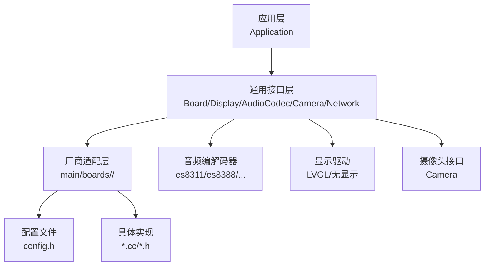
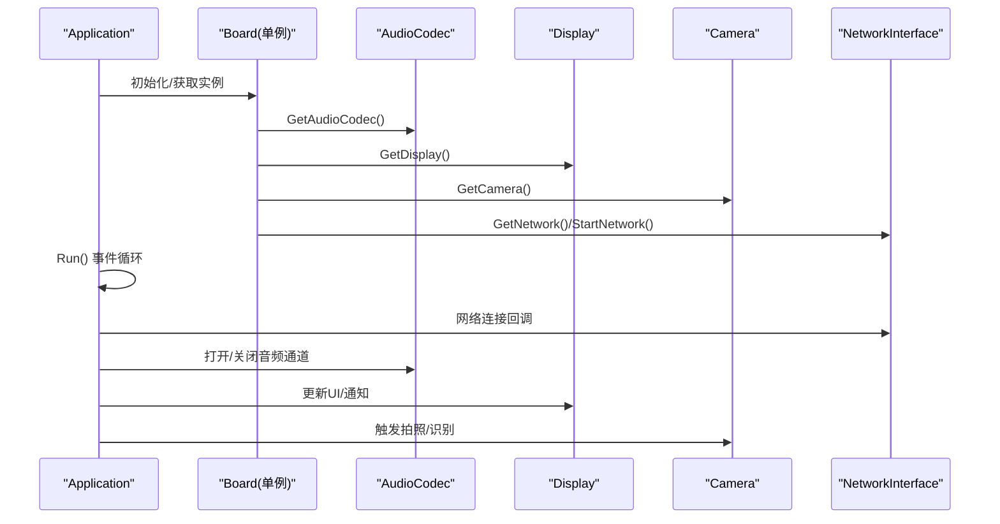
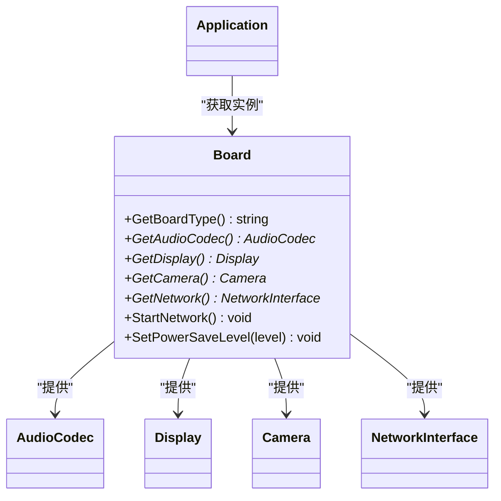

# 支持的硬件平台

<cite>
**本文引用的文件**
- [README.md](file://README.md)
- [board.h](file://main/boards/common/board.h)
- [application.h](file://main/application.h)
- [display.h](file://main/display/display.h)
- [camera.h](file://main/boards/common/camera.h)
- [es8311_audio_codec.h](file://main/audio/codecs/es8311_audio_codec.h)
- [es8388_audio_codec.h](file://main/audio/codecs/es8388_audio_codec.h)
- [config.h (LiChuang 开发板)](file://main/boards/lichuang-dev/config.h)
- [config.h (M5Stack CoreS3)](file://main/boards/m5stack-core-s3/config.h)
- [config.h (LILYGO T-Circle-S3)](file://main/boards/lilygo-t-circle-s3/config.h)
- [config.h (DFRobot K10)](file://main/boards/df-k10/config.h)
- [config.h (AiPi Lite)](file://main/boards/aipi-lite/config.h)
- [config.h (ATK DN ESP32S3)](file://main/boards/atk-dnesp32s3/config.h)
- [config.h (ESP32-S3 BOX3)](file://main/boards/esp-box-3/config.h)
- [config.h (ESP-HI)](file://main/boards/esp-hi/config.h)
- [config.h (XiaGe Mini C3)](file://main/boards/xmini-c3/config.h)
</cite>

## 目录
1. [简介](#简介)
2. [项目结构](#项目结构)
3. [核心组件](#核心组件)
4. [架构总览](#架构总览)
5. [详细组件分析](#详细组件分析)
6. [依赖关系分析](#依赖关系分析)
7. [性能考量](#性能考量)
8. [故障排查指南](#故障排查指南)
9. [结论](#结论)
10. [附录](#附录)

## 简介
本文件面向XiaoZhi ESP32项目的硬件平台支持与选型，基于仓库中已实现的70+开源硬件平台，按厂商与功能维度进行系统化梳理。重点覆盖以下方面：
- 按厂商分组：LiChuang、M5Stack、Waveshare、LILYGO、DFRobot、Espressif等
- 平台特性：ESP32-S3、ESP32-C3系列开发板的差异与优势
- 外设能力：音频编解码、显示驱动、网络连接、摄像头等
- 选型建议：依据应用场景（语音交互、机器人、监控、教育套件等）给出推荐
- 购买与社区：提供购买渠道与社区支持参考

说明：本文严格基于仓库现有代码与文档，不虚构未实现的功能或平台。

章节来源
- file://README.md#L51-L103

## 项目结构
XiaoZhi ESP32通过“通用Board接口 + 各厂商定制配置”的方式实现多硬件平台适配。核心结构如下：
- 通用接口层：Board、Display、AudioCodec、Camera、NetworkInterface等抽象
- 应用层：Application负责状态机、事件循环、协议与OTA管理
- 厂商适配层：各平台在main/boards/<vendor>/<board>/下提供config.h与实现文件
- 外设驱动层：音频编解码器、显示驱动、摄像头、按键、背光等

图表来源
- [board.h](file://main/boards/common/board.h#L49-L85)
- [application.h](file://main/application.h#L42-L172)
- [display.h](file://main/display/display.h#L28-L61)
- [camera.h](file://main/boards/common/camera.h#L6-L14)

章节来源
- file://main/boards/common/board.h#L49-L85
- file://main/application.h#L42-L172
- file://main/display/display.h#L28-L61
- file://main/boards/common/camera.h#L6-L14

## 核心组件
- Board接口：统一获取音频编解码器、显示、摄像头、网络、电源管理等能力，并提供UUID、系统信息、电源策略等
- Application：事件驱动主循环，处理网络、状态机、唤醒词、音视频通道、OTA升级等
- Display：抽象显示接口，支持LVGL主题与通知、聊天消息展示
- Camera：抽象摄像头接口，支持拍照与可选解释服务

章节来源
- file://main/boards/common/board.h#L49-L85
- file://main/application.h#L42-L172
- file://main/display/display.h#L28-L61
- file://main/boards/common/camera.h#L6-L14

## 架构总览
下图展示了从应用到硬件平台的调用链路与关键职责划分：

图表来源
- [board.h](file://main/boards/common/board.h#L62-L84)
- [application.h](file://main/application.h#L57-L121)

章节来源
- file://main/boards/common/board.h#L62-L84
- file://main/application.h#L57-L121

## 详细组件分析

### LiChuang 开发板
- 平台定位：ESP32-S3开发板，具备I2S音频、I2C音频编解码、SPI/OLED/LCD显示、OV2640摄像头等
- 关键引脚与外设
  - 音频：I2S引脚、PCA9557扩展、ES8311/ES7210编解码器
  - 显示：320×240像素，镜像/旋转/偏移配置
  - 摄像头：XCLK=20MHz，数据线完整映射
- 适用场景：教学演示、原型验证、语音+视觉结合的AI应用

章节来源
- file://main/boards/lichuang-dev/config.h#L11-L16
- file://main/boards/lichuang-dev/config.h#L17-L22
- file://main/boards/lichuang-dev/config.h#L28-L39
- file://main/boards/lichuang-dev/config.h#L40-L60

### M5Stack CoreS3
- 平台定位：官方CoreS3开发板，集成AW88298扬声器、ES7210麦克风、I2C音频编解码
- 关键引脚与外设
  - 音频：I2S引脚、AW88298/ES7210地址配置
  - 显示：320×240像素，背光引脚与镜像配置
  - 摄像头：XCLK=20MHz，完整数据线映射
- 适用场景：机器人、教育套件、语音助手、多模态交互

章节来源
- file://main/boards/m5stack-core-s3/config.h#L12-L21
- file://main/boards/m5stack-core-s3/config.h#L28-L41
- file://main/boards/m5stack-core-s3/config.h#L44-L62

### LILYGO T-Circle-S3
- 平台定位：圆形屏幕+触控+双I2S音频（MIC/SPK）
- 关键引脚与外设
  - 音频：独立MIC与SPK的I2S引脚，MAX98357A/MSM261配置
  - 显示：GC9D01N圆形屏，背光与SPI引脚
  - 触控：I2C触控引脚
- 适用场景：可穿戴、便携式AI设备、情感交互

章节来源
- file://main/boards/lilygo-t-circle-s3/config.h#L11-L18
- file://main/boards/lilygo-t-circle-s3/config.h#L20-L26
- file://main/boards/lilygo-t-circle-s3/config.h#L28-L44

### DFRobot K10
- 平台定位：ESP32-S3 + K10摄像头模块，I2C音频编解码
- 关键引脚与外设
  - 音频：ES8311/ES7210，PA控制引脚
  - 显示：240×320像素，镜像/旋转配置
  - 摄像头：K10专用引脚映射，XCLK=6MHz
- 适用场景：低成本视觉+语音方案、巡检机器人

章节来源
- file://main/boards/df-k10/config.h#L11-L21
- file://main/boards/df-k10/config.h#L32-L42
- file://main/boards/df-k10/config.h#L44-L74

### AiPi Lite
- 平台定位：小尺寸OLED/彩色屏，低功耗设计
- 关键引脚与外设
  - 音频：ES8311，PA引脚
  - 显示：128×128像素，SPI接口，RGB顺序与颜色反转
  - 电源：ADC电量检测、电源控制引脚
- 适用场景：入门级语音助手、可穿戴设备

章节来源
- file://main/boards/aipi-lite/config.h#L11-L21
- file://main/boards/aipi-lite/config.h#L25-L37
- file://main/boards/aipi-lite/config.h#L39-L46
- file://main/boards/aipi-lite/config.h#L47-L52

### ATK DN ESP32S3 系列
- 平台定位：多形态盒子（WiFi/4G），I2C音频编解码
- 关键引点与外设
  - 音频：ES8388编解码器
  - 显示：320×240像素，SPI引脚配置
  - 摄像头：OV2640引脚映射
- 适用场景：智能音箱、IoT盒子、边缘AI

章节来源
- file://main/boards/atk-dnesp32s3/config.h#L11-L19
- file://main/boards/atk-dnesp32s3/config.h#L31-L41
- file://main/boards/atk-dnesp32s3/config.h#L43-L62

### ESP32-S3 BOX3（Espressif）
- 平台定位：官方BOX3，集成双编解码器与PA
- 关键引脚与外设
  - 音频：ES8311/ES7210，PA引脚
  - 显示：320×240像素，背光配置
- 适用场景：官方参考设计、教学与演示

章节来源
- file://main/boards/esp-box-3/config.h#L11-L21
- file://main/boards/esp-box-3/config.h#L28-L38

### ESP-HI 机器人
- 平台定位：低成本机器狗，ST7789串行屏
- 关键引脚与外设
  - 音频：PDM麦克风/扬声器引脚，ADC通道
  - 显示：160×80像素ST7789，串行接口
  - 机械：四轮驱动GPIO
- 适用场景：教育机器人、低成本移动平台

章节来源
- file://main/boards/esp-hi/config.h#L12-L16
- file://main/boards/esp-hi/config.h#L22-L33
- file://main/boards/esp-hi/config.h#L34-L46

### XiaGe Mini C3（ESP32-C3）
- 平台定位：ESP32-C3单片机，小尺寸OLED
- 关键引脚与外设
  - 音频：ES8311，I2S引脚
  - 显示：128×64像素OLED
- 适用场景：入门级语音助手、轻量AI

章节来源
- file://main/boards/xmini-c3/config.h#L9-L18
- file://main/boards/xmini-c3/config.h#L23-L27

### 其他厂商与平台（示例）
- Waveshare ESP32-S3 系列：多尺寸触控屏（1.32/1.43/1.75/1.8/2.06等），支持AMOLED与LCD版本
- Movecall CuiCan：AI吊坠灯，ESP32-S3
- WMnologo Xingzhi：1.54寸TFT，WiFi/4G可选
- SenseCAP Watcher：工业环境监测，SSCMA摄像头
- Electron Bot：表情屏+运动模块，ESP32-S3
- Magic Button 2.4：极简交互入口

章节来源
- file://README.md#L58-L64
- file://README.md#L82-L102

## 依赖关系分析
- 板级抽象与实现解耦：Board接口屏蔽不同厂商引脚差异；各平台仅需提供config.h与对应实现
- 音频编解码器：ES8311/ES8388等通过I2C与I2S连接，Sample Rate统一为24kHz或16kHz
- 显示驱动：LVGL作为默认UI框架，部分平台提供无显示实现
- 摄像头：Camera接口统一抽象，具体平台通过config.h映射引脚

图表来源
- [board.h](file://main/boards/common/board.h#L49-L85)
- [application.h](file://main/application.h#L42-L172)

章节来源
- file://main/boards/common/board.h#L49-L85
- file://main/application.h#L42-L172

## 性能考量
- 音频采样率：多数平台采用24kHz采样率，部分平台（如ESP-HI）使用16kHz以提升稳定性
- I2S与MCLK：不同平台对MCLK与BCLK/WCLK配置不同，需确保与编解码器匹配
- 显示刷新与UI：LVGL渲染与背光控制影响功耗，建议按场景调整亮度与刷新策略
- 摄像头XCLK：高分辨率/高帧率会显著增加功耗，建议按需开启
- 电源策略：Board提供PowerSaveLevel枚举，可在低功耗、平衡、性能间切换

章节来源
- file://main/boards/esp-hi/config.h#L6-L10
- file://main/boards/aipi-lite/config.h#L8-L9
- file://main/boards/df-k10/config.h#L6-L7
- file://main/boards/common/board.h#L35-L40

## 故障排查指南
- 音频无声/杂音
  - 检查I2S引脚与编解码器地址是否与config.h一致
  - 确认MCLK与BCLK/WCLK频率匹配
  - 参考音频编解码器类初始化参数
- 显示异常
  - 确认SPI/RGB引脚与分辨率配置
  - 检查背光输出极性与偏移设置
- 摄像头无法采集
  - 核对XCLK、VSYNC/HREF/PCLK与数据线映射
  - 确认XCLK频率与config.h一致
- 网络连接失败
  - 查看Application的网络事件回调与日志
  - 确认SIM卡/天线/路由器配置

章节来源
- file://main/audio/codecs/es8311_audio_codec.h#L32-L35
- file://main/audio/codecs/es8388_audio_codec.h#L30-L33
- file://main/display/display.h#L33-L42
- file://main/boards/common/camera.h#L8-L13
- file://main/application.h#L152-L153

## 结论
XiaoZhi ESP32通过统一的Board接口与丰富的厂商适配，实现了对70+开源硬件平台的支持。不同平台在音频、显示、摄像头与网络方面存在差异，但均遵循相同的软件架构。建议根据应用场景选择：
- 语音+视觉：M5Stack CoreS3、LiChuang S3、LILYGO T-Circle-S3
- 工业/巡检：DFRobot K10、SenseCAP Watcher
- 教育/机器人：ESP-HI、Electron Bot、Movecall CuiCan
- 入门级：AiPi Lite、XiaGe Mini C3

## 附录

### 主流平台对比（ESP32-S3、ESP32-C3）
- ESP32-S3
  - 优势：更强算力、更高主频、更大内存、双核并行
  - 典型平台：M5Stack CoreS3、LiChuang S3、Waveshare S3系列、ESP32-S3 BOX3
- ESP32-C3
  - 优势：成本更低、功耗更低、适合轻量应用
  - 典型平台：XiaGe Mini C3、Magic Button C3系列

章节来源
- file://README.md#L34-L35
- file://main/boards/xmini-c3/config.h#L9-L18

### 音频编解码器差异
- ES8311：常见于多款S3平台，支持I2S与PA控制
- ES8388：ATK系列盒子，支持输入/输出双通道
- AW88298/ES7210：M5Stack CoreS3组合，集成扬声器与麦克风
- PDM/ADC：ESP-HI使用PDM麦克风与ADC通道

章节来源
- file://main/audio/codecs/es8311_audio_codec.h#L32-L35
- file://main/audio/codecs/es8388_audio_codec.h#L30-L33
- file://main/boards/m5stack-core-s3/config.h#L20-L21
- file://main/boards/esp-hi/config.h#L12-L16

### 显示驱动差异
- LVGL：默认UI框架，支持主题、表情、聊天消息
- 无显示：部分平台提供NoDisplay实现
- 屏幕类型：OLED、彩色SPI、RGB、AMOLED、触控屏等

章节来源
- file://main/display/display.h#L6-L9
- file://main/display/display.h#L79-L85

### 网络连接与购买渠道
- 官方固件默认连接xiaoZhi服务器，支持WS/MQTT+UDP两种协议
- 购买渠道与社区支持：README中提供了多个平台的链接与图片展示，便于用户了解与购买

章节来源
- file://README.md#L107-L114
- file://README.md#L51-L103