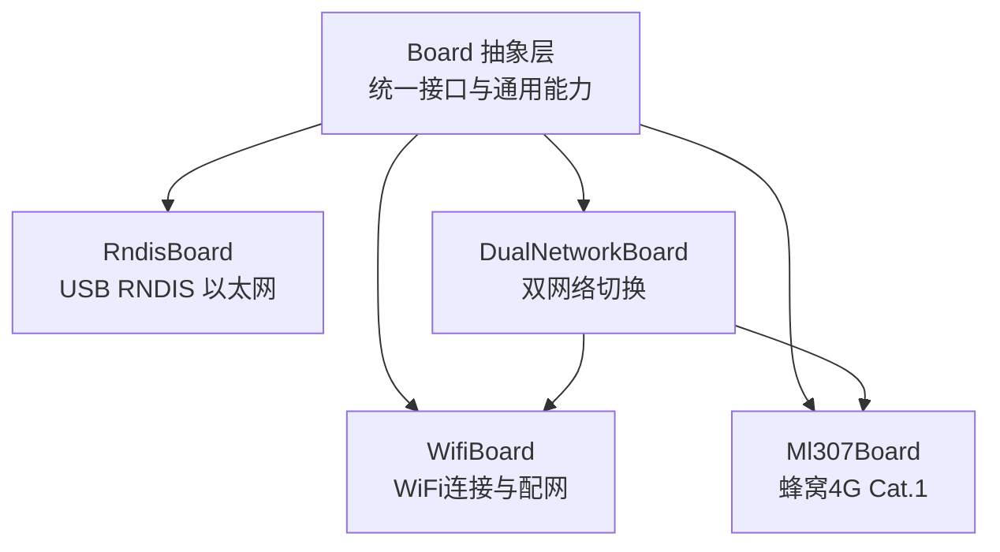
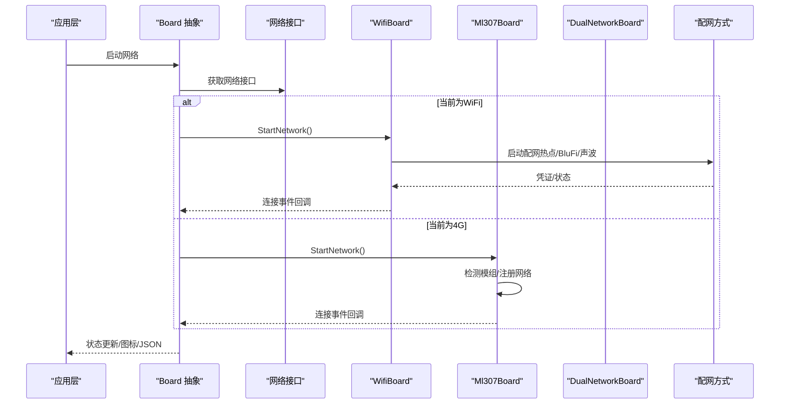
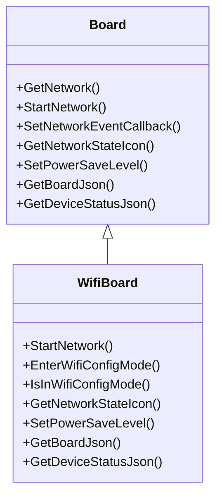
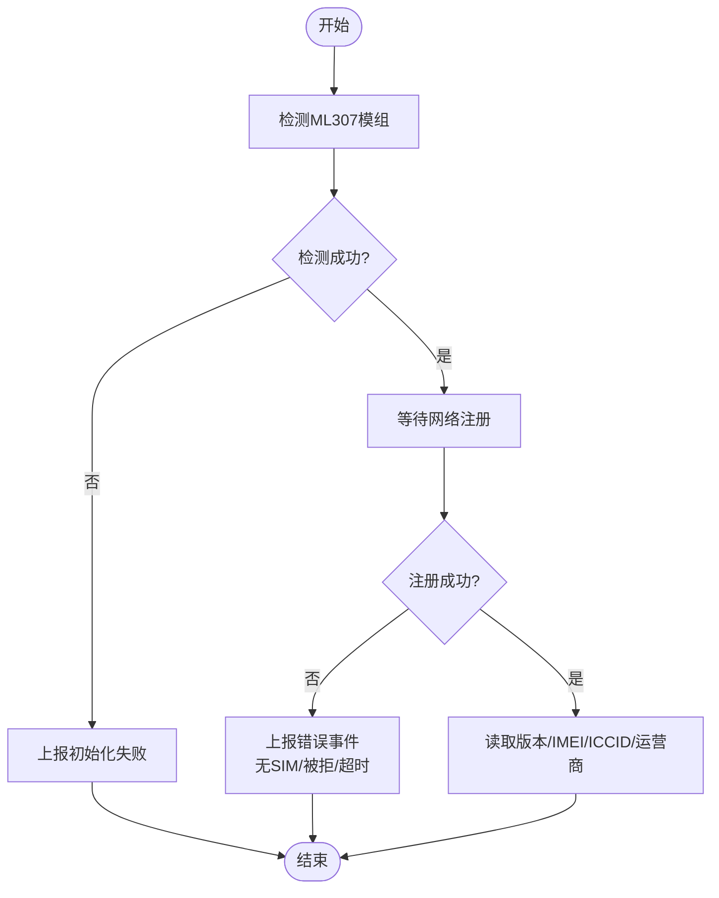
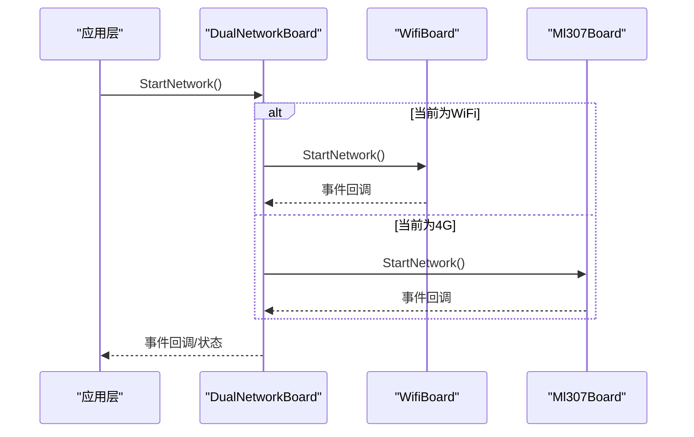
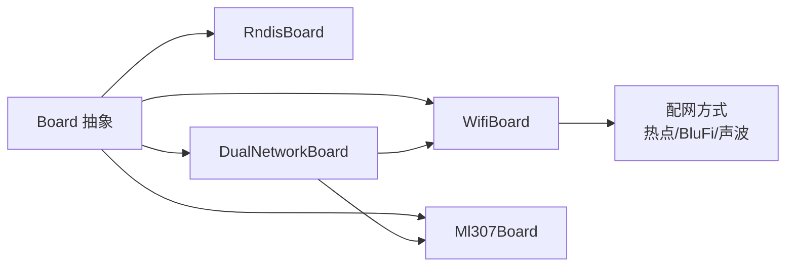

# 网络连接平台

<cite>
**本文引用的文件**
- [README.md](file://README.md)
- [board.h](file://main/boards/common/board.h)
- [board.cc](file://main/boards/common/board.cc)
- [wifi_board.h](file://main/boards/common/wifi_board.h)
- [wifi_board.cc](file://main/boards/common/wifi_board.cc)
- [ml307_board.h](file://main/boards/common/ml307_board.h)
- [ml307_board.cc](file://main/boards/common/ml307_board.cc)
- [dual_network_board.h](file://main/boards/common/dual_network_board.h)
- [dual_network_board.cc](file://main/boards/common/dual_network_board.cc)
- [rndis_board.h](file://main/boards/common/rndis_board.h)
- [rndis_board.cc](file://main/boards/common/rndis_board.cc)
- [blufi.md](file://docs/blufi.md)
- [blufi.cpp](file://main/boards/common/blufi.cpp)
- [power_save_timer.cc](file://main/boards/common/power_save_timer.cc)
- [power_manager.h](file://main/boards/electron-bot/power_manager.h)
- [jiuchuan_power_controller.h](file://main/boards/jiuchuan-s3/power_controller.h)
- [xingzhi_wifi_board.cc](file://main/boards/xingzhi-metal-1.54-wifi/xingzhi-metal-1.54-wifi.cc)
- [magiclick_2p5_board.cc](file://main/boards/magiclick-2p5/magiclick_2p5_board.cc)
- [esp32s3_korvo2_v3_board.cc](file://main/boards/esp32s3-korvo2-v3-rndis/esp32s3_korvo2_v3_board.cc)
</cite>

## 目录
1. [简介](#简介)
2. [项目结构](#项目结构)
3. [核心组件](#核心组件)
4. [架构总览](#架构总览)
5. [详细组件分析](#详细组件分析)
6. [依赖关系分析](#依赖关系分析)
7. [性能与功耗特性](#性能与功耗特性)
8. [故障排查指南](#故障排查指南)
9. [结论](#结论)
10. [附录](#附录)

## 简介
本文件面向XiaoZhi ESP32项目，系统化梳理其“网络连接平台”能力与硬件实现，聚焦以下平台：
- WiFi：支持传统WiFi连接、多种配网方式（热点配网、BluFi、声波配网）。
- 4G/5G（Cat.1）：基于ML307模组的蜂窝数据连接，支持SIM卡注册与信号强度上报。
- 双网络切换：在同一硬件上动态在WiFi与4G之间切换。
- 以太网（USB RNDIS）：通过USB转以太网实现有线网络连接。
- 蓝牙：作为配网通道（BluFi）与设备发现的一部分能力。

文档还提供平台特性对比、典型应用场景、成本与部署复杂度考量，以及选择指南，帮助用户根据实际需求选择合适的连接方案。

## 项目结构
围绕网络连接能力，项目采用“平台抽象 + 具体实现”的分层设计：
- 抽象层：Board统一接口，定义网络接口、事件回调、状态图标、电源管理等通用能力。
- 平台层：WiFiBoard、Ml307Board、RndisBoard分别实现不同网络接入方式。
- 组合层：DualNetworkBoard在运行时在WiFi与4G之间切换，兼顾灵活性与成本。
- 配网层：支持热点配网、BluFi（BLE Wi‑Fi Provisioning）、声波配网等多种方式。
- 功耗层：PowerSaveTimer与各板卡的电源策略协同，实现低功耗与唤醒机制。

图表来源
- [board.h](file://main/boards/common/board.h#L49-L93)
- [wifi_board.h](file://main/boards/common/wifi_board.h#L9-L70)
- [ml307_board.h](file://main/boards/common/ml307_board.h#L9-L39)
- [rndis_board.h](file://main/boards/common/rndis_board.h#L17-L47)
- [dual_network_board.h](file://main/boards/common/dual_network_board.h#L16-L60)

章节来源
- [board.h](file://main/boards/common/board.h#L17-L93)
- [board.cc](file://main/boards/common/board.cc#L70-L179)

## 核心组件
- Board抽象层：定义网络接口、事件回调、状态图标、电源管理、系统信息等统一能力，确保上层协议与UI无需关心具体硬件差异。
- WifiBoard：封装WiFi连接、扫描、超时处理、配网模式入口（热点配网、BluFi、声波配网），并提供网络状态图标与设备状态JSON。
- Ml307Board：封装ML307蜂窝模组检测、网络注册、错误事件上报、CSQ信号强度与运营商信息，提供蜂窝网络状态JSON。
- DualNetworkBoard：在WiFi与4G之间动态切换，持久化记录当前网络类型，并在重启后恢复。
- RndisBoard：通过USB RNDIS驱动创建以太网接口，用于有线网络场景。
- 配网能力：热点配网（AP + Web）、BluFi（BLE Wi‑Fi Provisioning）、声波配网（音频承载Wi‑Fi凭证）。

章节来源
- [board.h](file://main/boards/common/board.h#L17-L93)
- [wifi_board.h](file://main/boards/common/wifi_board.h#L9-L70)
- [wifi_board.cc](file://main/boards/common/wifi_board.cc#L52-L105)
- [ml307_board.h](file://main/boards/common/ml307_board.h#L9-L39)
- [ml307_board.cc](file://main/boards/common/ml307_board.cc#L134-L141)
- [dual_network_board.h](file://main/boards/common/dual_network_board.h#L16-L60)
- [dual_network_board.cc](file://main/boards/common/dual_network_board.cc#L45-L57)
- [rndis_board.h](file://main/boards/common/rndis_board.h#L17-L47)
- [rndis_board.cc](file://main/boards/common/rndis_board.cc#L118-L170)

## 架构总览
下图展示从应用层到网络层的关键交互路径，以及配网与状态上报的流程。

图表来源
- [board.h](file://main/boards/common/board.h#L67-L85)
- [wifi_board.cc](file://main/boards/common/wifi_board.cc#L52-L105)
- [ml307_board.cc](file://main/boards/common/ml307_board.cc#L134-L141)
- [dual_network_board.cc](file://main/boards/common/dual_network_board.cc#L64-L73)

## 详细组件分析

### WiFi平台
- 连接与配网
  - 支持热点配网（AP + Web界面）与BluFi（BLE Wi‑Fi Provisioning）两种主要配网方式。
  - 支持声波配网（音频承载Wi‑Fi凭证），通过独立任务执行。
  - 自动超时机制：连接超时后自动进入配网模式。
- 状态与显示
  - 提供网络状态图标（强/中/弱/无）。
  - 设备状态JSON包含SSID、RSSI、信道、IP、MAC等。
- 电源管理
  - 支持低功耗、平衡、高性能三种电源策略，映射至WiFi电源策略。

图表来源
- [board.h](file://main/boards/common/board.h#L49-L93)
- [wifi_board.h](file://main/boards/common/wifi_board.h#L9-L70)

章节来源
- [wifi_board.h](file://main/boards/common/wifi_board.h#L9-L70)
- [wifi_board.cc](file://main/boards/common/wifi_board.cc#L52-L105)
- [wifi_board.cc](file://main/boards/common/wifi_board.cc#L160-L198)
- [wifi_board.cc](file://main/boards/common/wifi_board.cc#L245-L283)
- [wifi_board.cc](file://main/boards/common/wifi_board.cc#L285-L300)
- [wifi_board.cc](file://main/boards/common/wifi_board.cc#L302-L359)
- [blufi.md](file://docs/blufi.md#L15-L38)
- [blufi.cpp](file://main/boards/common/blufi.cpp#L105-L139)

### 4G平台（ML307）
- 模组检测与注册
  - 自动检测ML307模组，支持多次重试。
  - 注册网络并上报错误事件（无SIM、注册被拒、初始化失败、超时）。
- 状态与信息
  - 提供CSQ信号强度、运营商名称、模块版本、IMEI、ICCID、注册状态等。
  - 设备状态JSON包含蜂窝网络类型、运营商、信号强度等级。
- 电源管理
  - 保留接口占位，当前未实现具体节能策略。

图表来源
- [ml307_board.cc](file://main/boards/common/ml307_board.cc#L67-L132)

章节来源
- [ml307_board.h](file://main/boards/common/ml307_board.h#L9-L39)
- [ml307_board.cc](file://main/boards/common/ml307_board.cc#L134-L141)
- [ml307_board.cc](file://main/boards/common/ml307_board.cc#L147-L166)
- [ml307_board.cc](file://main/boards/common/ml307_board.cc#L168-L179)
- [ml307_board.cc](file://main/boards/common/ml307_board.cc#L186-L271)

### 双网络平台（WiFi/4G）
- 切换机制
  - 从设置中读取当前网络类型，默认4G。
  - 切换时持久化记录并重启生效。
- 接口转发
  - 将StartNetwork、事件回调、网络接口、状态图标、电源策略等请求转发给当前活动板卡。

图表来源
- [dual_network_board.cc](file://main/boards/common/dual_network_board.cc#L64-L73)
- [dual_network_board.cc](file://main/boards/common/dual_network_board.cc#L45-L57)

章节来源
- [dual_network_board.h](file://main/boards/common/dual_network_board.h#L16-L60)
- [dual_network_board.cc](file://main/boards/common/dual_network_board.cc#L23-L33)
- [dual_network_board.cc](file://main/boards/common/dual_network_board.cc#L45-L57)
- [dual_network_board.cc](file://main/boards/common/dual_network_board.cc#L64-L73)
- [dual_network_board.cc](file://main/boards/common/dual_network_board.cc#L80-L98)

### 以太网平台（USB RNDIS）
- 实现要点
  - 通过USB RNDIS驱动安装以太网栈，创建网络接口并挂载事件。
  - 提供固定状态图标（强信号）与基础设备信息JSON。
- 适用场景
  - 固定部署、高带宽、低延迟、稳定性的有线网络环境。

章节来源
- [rndis_board.h](file://main/boards/common/rndis_board.h#L17-L47)
- [rndis_board.cc](file://main/boards/common/rndis_board.cc#L118-L170)
- [rndis_board.cc](file://main/boards/common/rndis_board.cc#L173-L189)

### 蓝牙平台（作为配网通道）
- BluFi能力
  - 支持BLE Wi‑Fi Provisioning，允许手机端通过BLE发送Wi‑Fi凭证。
  - 与热点配网互斥，二者只能启用其一。
- 协议与实现
  - 初始化BLE控制器与主机，注册回调，处理配网事件。
  - 与WifiManager配合，完成扫描、连接与状态反馈。

章节来源
- [blufi.md](file://docs/blufi.md#L15-L38)
- [blufi.cpp](file://main/boards/common/blufi.cpp#L105-L139)
- [blufi.cpp](file://main/boards/common/blufi.cpp#L141-L161)
- [blufi.cpp](file://main/boards/common/blufi.cpp#L311-L341)

## 依赖关系分析
- 抽象与实现解耦：Board抽象屏蔽具体网络实现细节，便于扩展其他网络类型。
- 板卡组合：DualNetworkBoard聚合WiFi与4G，实现运行时切换。
- 配网方式并存：热点配网、BluFi、声波配网三者可共存于WiFiBoard中，按配置启用。
- 电源策略：PowerSaveTimer与各板卡的SetPowerSaveLevel协作，实现低功耗与唤醒。

图表来源
- [board.h](file://main/boards/common/board.h#L49-L93)
- [wifi_board.h](file://main/boards/common/wifi_board.h#L9-L70)
- [ml307_board.h](file://main/boards/common/ml307_board.h#L9-L39)
- [rndis_board.h](file://main/boards/common/rndis_board.h#L17-L47)
- [dual_network_board.h](file://main/boards/common/dual_network_board.h#L16-L60)

章节来源
- [board.h](file://main/boards/common/board.h#L49-L93)
- [board.cc](file://main/boards/common/board.cc#L70-L179)

## 性能与功耗特性
- 连接速度
  - WiFi：通常高于4G，延迟更低，适合高频数据传输与实时交互。
  - 4G：受运营商与信号影响较大，适合移动场景与广域覆盖。
  - 以太网：稳定高带宽，适合固定站点与高吞吐量场景。
- 稳定性
  - WiFi：易受干扰与漫游影响；可通过RSSI与状态图标辅助判断。
  - 4G：信号强度（CSQ）与运营商网络质量决定稳定性。
  - 以太网：物理连接稳定，适合长期在线。
- 功耗
  - WiFiBoard支持低功耗策略，结合PowerSaveTimer实现睡眠与唤醒。
  - Ml307Board保留接口，当前未实现特定节能策略。
  - 部分具体板卡示例中，根据电池状态动态启用/禁用省电计时器，实现更精细的功耗控制。

章节来源
- [wifi_board.cc](file://main/boards/common/wifi_board.cc#L285-L300)
- [power_save_timer.cc](file://main/boards/common/power_save_timer.cc#L79-L117)
- [xingzhi_wifi_board.cc](file://main/boards/xingzhi-metal-1.54-wifi/xingzhi-metal-1.54-wifi.cc#L193-L198)
- [magiclick_2p5_board.cc](file://main/boards/magiclick-2p5/magiclick_2p5_board.cc#L311-L316)
- [power_manager.h](file://main/boards/electron-bot/power_manager.h#L109-L128)
- [jiuchuan_power_controller.h](file://main/boards/jiuchuan-s3/power_controller.h#L8-L58)

## 故障排查指南
- WiFi无法连接
  - 检查是否进入配网模式（热点/BluFi/声波），确认凭证正确。
  - 关注连接超时与断开事件，必要时重新触发配网。
- 4G无SIM或注册失败
  - 检查SIM卡插入与PIN状态，关注“无SIM/注册被拒/超时”等错误事件。
  - 查看CSQ与运营商信息，确认网络可用性。
- 配网冲突
  - BluFi与热点配网不可同时启用，需在配置中二选一。
- 以太网无IP
  - 确认USB RNDIS设备识别与驱动安装，检查事件回调与IP事件。

章节来源
- [wifi_board.cc](file://main/boards/common/wifi_board.cc#L107-L146)
- [wifi_board.cc](file://main/boards/common/wifi_board.cc#L152-L158)
- [ml307_board.cc](file://main/boards/common/ml307_board.cc#L31-L65)
- [ml307_board.cc](file://main/boards/common/ml307_board.cc#L100-L123)
- [blufi.md](file://docs/blufi.md#L31-L38)
- [rndis_board.cc](file://main/boards/common/rndis_board.cc#L88-L112)

## 结论
XiaoZhi ESP32项目在网络连接方面提供了灵活而强大的平台组合：
- WiFi平台具备完善的配网能力与状态可视化，适合大多数室内与移动场景。
- 4G平台通过ML307实现广域连接，适合需要移动性的应用。
- 双网络平台在两者间无缝切换，兼顾成本与可靠性。
- 以太网提供稳定高带宽的有线连接，适用于固定站点。
- 蓝牙作为配网通道，提升用户体验与部署效率。

## 附录
- 应用场景建议
  - 远程控制：WiFi优先，若需移动部署可选4G；固定站点可选以太网。
  - 数据传输：以太网或WiFi；4G适合大包或移动采集。
  - 云端服务：任一网络均可，注意带宽与稳定性；4G需关注信号与计费。
- 选择指南
  - 成本：以太网与WiFi最经济；4G需SIM与流量费用。
  - 部署复杂度：WiFi/以太网简单；4G需SIM与网络适配。
  - 功耗：结合PowerSaveTimer与板卡电源策略，优化待机与唤醒周期。