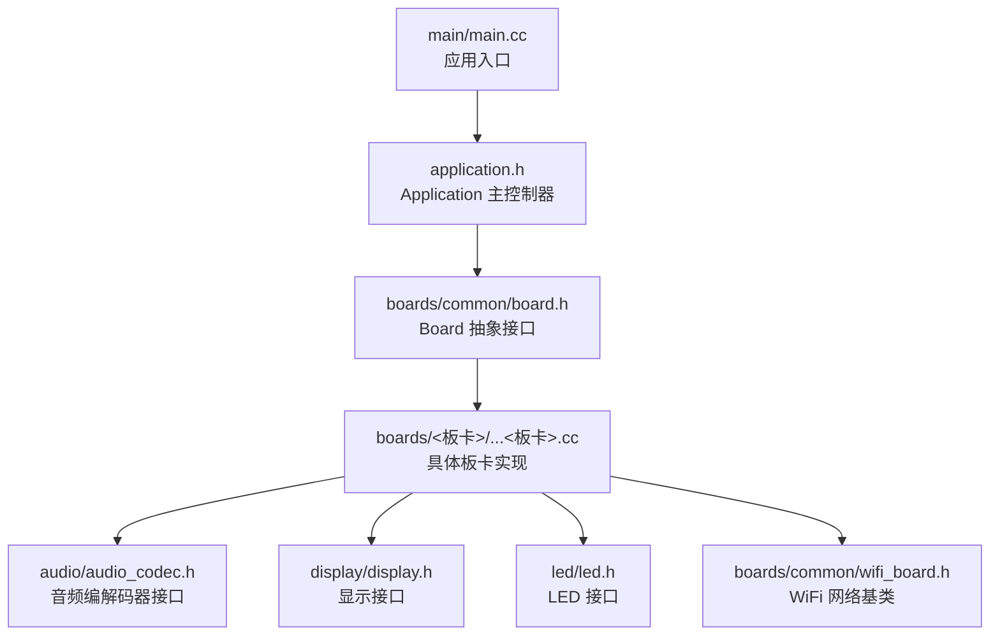
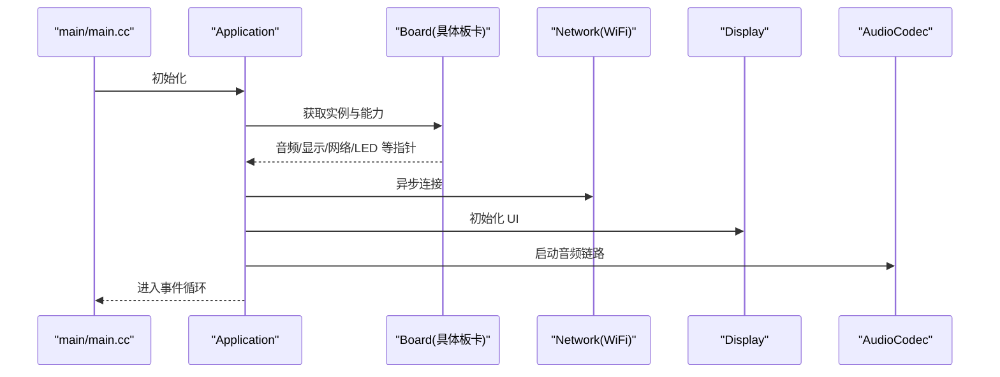
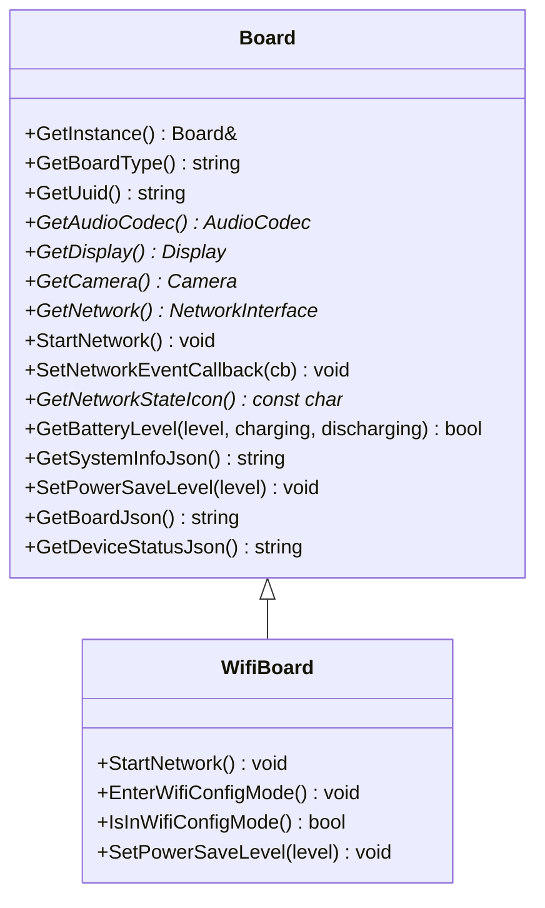
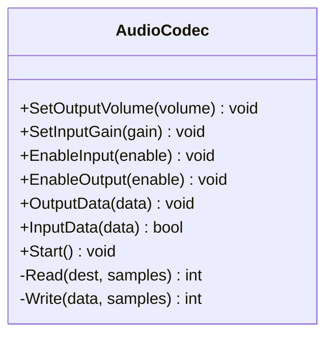
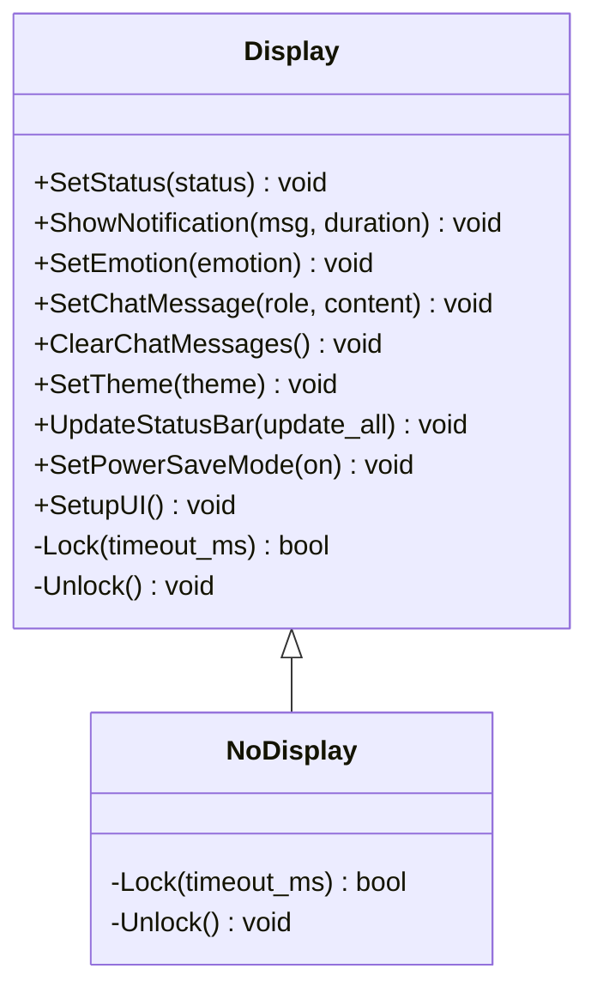
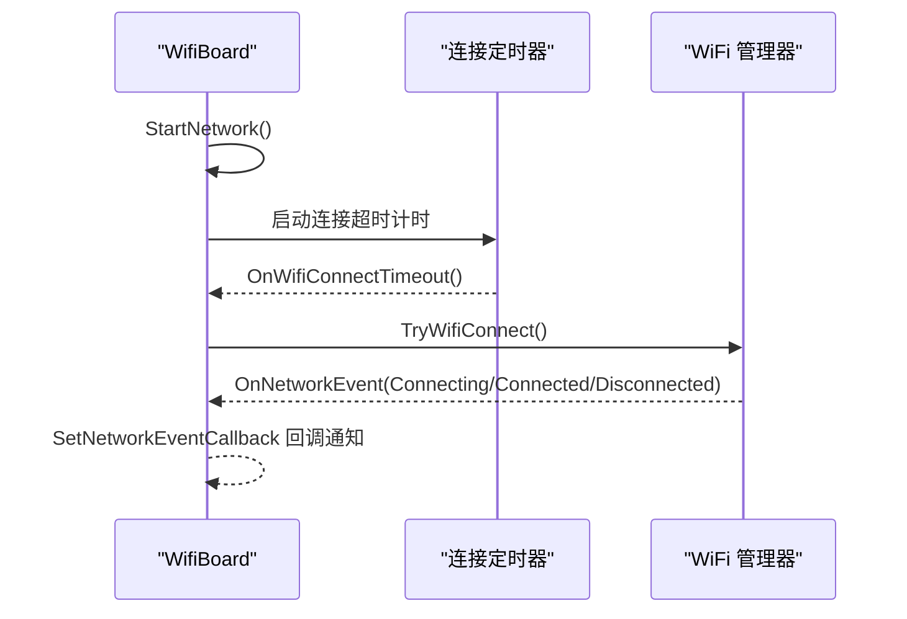
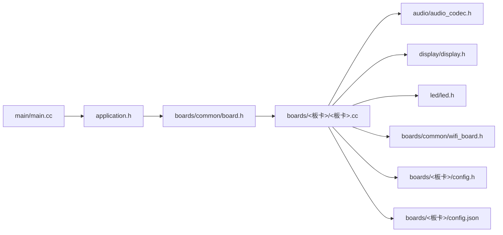

# 新硬件平台适配

<cite>
**本文引用的文件**
- [main.cc](file://main/main.cc)
- [application.h](file://main/application.h)
- [board.h](file://main/boards/common/board.h)
- [board.cc](file://main/boards/common/board.cc)
- [wifi_board.h](file://main/boards/common/wifi_board.h)
- [aipi-lite.cc](file://main/boards/aipi-lite/aipi-lite.cc)
- [config.h](file://main/boards/aipi-lite/config.h)
- [config.json](file://main/boards/aipi-lite/config.json)
- [audio_codec.h](file://main/audio/audio_codec.h)
- [display.h](file://main/display/display.h)
- [led.h](file://main/led/led.h)
- [README.md](file://README.md)
</cite>

## 目录
1. [简介](#简介)
2. [项目结构](#项目结构)
3. [核心组件](#核心组件)
4. [架构总览](#架构总览)
5. [详细组件分析](#详细组件分析)
6. [依赖关系分析](#依赖关系分析)
7. [性能考虑](#性能考虑)
8. [故障排查指南](#故障排查指南)
9. [结论](#结论)
10. [附录](#附录)

## 简介
本指南面向硬件工程师与嵌入式开发者，提供从零开始为 XiaoZhi ESP32 项目适配新硬件平台的完整流程。内容涵盖硬件分析、接口定义、代码实现、配置文件解析、关键组件集成、调试与测试方法，以及常见问题与最佳实践。

## 项目结构
XiaoZhi ESP32 采用“平台无关抽象 + 具体板卡实现”的分层设计：
- 应用入口与主循环位于顶层，负责系统初始化与事件驱动运行。
- 抽象层定义统一的 Board 接口，屏蔽不同硬件差异。
- 各具体板卡在各自目录下实现 Board 子类，并通过宏导出工厂函数。
- 音频、显示、网络、LED 等子系统通过 Board 接口注入到应用中。

图表来源
- [main.cc](file://main/main.cc#L15-L30)
- [application.h](file://main/application.h#L42-L67)
- [board.h](file://main/boards/common/board.h#L49-L85)
- [wifi_board.h](file://main/boards/common/wifi_board.h#L9-L67)

章节来源
- [main.cc](file://main/main.cc#L15-L30)
- [application.h](file://main/application.h#L42-L67)
- [board.h](file://main/boards/common/board.h#L49-L85)
- [wifi_board.h](file://main/boards/common/wifi_board.h#L9-L67)

## 核心组件
- Board 抽象层：定义获取设备类型、UUID、音频编解码器、显示、摄像头、网络、电源管理、系统信息等统一接口。
- WifiBoard：在 Board 基础上封装 WiFi 连接、配网模式、网络事件回调等通用逻辑。
- Application：应用主控制器，负责状态机、事件循环、协议通道、OTA、音频服务等。
- 具体板卡：继承 Board 或 WifiBoard，完成硬件初始化、引脚映射、外设绑定与功能扩展。

章节来源
- [board.h](file://main/boards/common/board.h#L49-L85)
- [board.cc](file://main/boards/common/board.cc#L15-L46)
- [wifi_board.h](file://main/boards/common/wifi_board.h#L9-L67)
- [application.h](file://main/application.h#L42-L67)

## 架构总览
应用启动后，通过 Board 工厂函数获取单例 Board 实例，随后由 Application 统一调度各子系统工作。

图表来源
- [main.cc](file://main/main.cc#L26-L30)
- [application.h](file://main/application.h#L57-L64)
- [board.h](file://main/boards/common/board.h#L68-L84)

## 详细组件分析

### Board 抽象与生命周期
- 单例获取：通过静态工厂函数 create_board 返回 Board 派生类实例。
- UUID 生成：首次运行自动生成并持久化，用于设备唯一标识。
- 默认行为：未实现的功能返回空或默认值（如无显示时返回 NoDisplay）。

图表来源
- [board.h](file://main/boards/common/board.h#L49-L85)
- [wifi_board.h](file://main/boards/common/wifi_board.h#L9-L67)

章节来源
- [board.h](file://main/boards/common/board.h#L49-L85)
- [board.cc](file://main/boards/common/board.cc#L15-L46)

### 配置文件解析：config.h 与 config.json
- config.h：定义硬件引脚、采样率、显示参数、电源 ADC 等编译期常量，直接影响驱动初始化。
- config.json：定义目标芯片、构建选项（如分区表、闪存大小），用于 SDK 配置追加。

示例参考
- aipi-lite 的引脚与显示参数定义：[config.h](file://main/boards/aipi-lite/config.h#L8-L52)
- aipi-lite 的构建目标与分区表：[config.json](file://main/boards/aipi-lite/config.json#L1-L12)

章节来源
- [config.h](file://main/boards/aipi-lite/config.h#L8-L52)
- [config.json](file://main/boards/aipi-lite/config.json#L1-L12)

### 具体板卡实现：继承与重写
- 继承关系：多数板卡继承 WifiBoard，复用 WiFi 通用逻辑；若仅需基础能力可直接继承 Board。
- 必须重写接口：GetBoardType、GetAudioCodec、GetDisplay、GetNetwork、StartNetwork、SetPowerSaveLevel、GetBoardJson、GetDeviceStatusJson。
- 可选扩展：GetBacklight、GetBatteryLevel、GetTemperature、SetNetworkEventCallback 等。

示例参考
- AIPILite 板卡完整实现与关键重写点：[aipi-lite.cc](file://main/boards/aipi-lite/aipi-lite.cc#L26-L244)

章节来源
- [aipi-lite.cc](file://main/boards/aipi-lite/aipi-lite.cc#L26-L244)

### 音频编解码器集成
- 接口抽象：AudioCodec 定义输入输出增益、音量、采样率、通道数等属性与读写接口。
- 设备侧实现：各板卡在 GetAudioCodec 中返回具体编解码器实例（如 ES8311、ES8374 等）。
- I2S 通道：通过 tx_handle_/rx_handle_ 管理发送/接收通道。

图表来源
- [audio_codec.h](file://main/audio/audio_codec.h#L17-L59)

章节来源
- [audio_codec.h](file://main/audio/audio_codec.h#L17-L59)
- [aipi-lite.cc](file://main/boards/aipi-lite/aipi-lite.cc#L205-L212)

### 显示驱动集成
- 接口抽象：Display 提供状态栏、通知、表情、聊天消息、主题切换、省电模式等统一接口。
- 无显示回退：未实现显示时返回 NoDisplay。
- UI 锁：提供 DisplayLockGuard 保证 UI 更新线程安全。

图表来源
- [display.h](file://main/display/display.h#L28-L87)

章节来源
- [display.h](file://main/display/display.h#L28-L87)
- [aipi-lite.cc](file://main/boards/aipi-lite/aipi-lite.cc#L128-L132)

### 网络接口与 WiFi 集成
- WifiBoard 提供 WiFi 连接、配网模式、网络事件回调、超时处理等通用能力。
- 板卡只需实现 GetNetwork、StartNetwork、SetPowerSaveLevel 等接口即可接入。

图表来源
- [wifi_board.h](file://main/boards/common/wifi_board.h#L22-L37)

章节来源
- [wifi_board.h](file://main/boards/common/wifi_board.h#L22-L37)

### LED 与背光控制
- Led 接口：根据设备状态切换 LED。
- Backlight：通过 PWM 控制背光亮度，支持恢复与省电模式。

章节来源
- [led.h](file://main/led/led.h#L4-L15)
- [aipi-lite.cc](file://main/boards/aipi-lite/aipi-lite.cc#L216-L223)

## 依赖关系分析
- 应用入口依赖 Application；Application 依赖 Board 抽象；Board 在具体板卡实现中被实例化。
- 板卡实现依赖音频、显示、网络、LED 等子系统接口。
- 配置文件决定编译期引脚与参数，影响驱动初始化路径。

图表来源
- [main.cc](file://main/main.cc#L26-L30)
- [application.h](file://main/application.h#L42-L67)
- [board.h](file://main/boards/common/board.h#L49-L85)
- [aipi-lite.cc](file://main/boards/aipi-lite/aipi-lite.cc#L26-L244)
- [config.h](file://main/boards/aipi-lite/config.h#L8-L52)
- [config.json](file://main/boards/aipi-lite/config.json#L1-L12)

## 性能考虑
- 功耗管理：通过 PowerSaveLevel 与 PowerSaveTimer 控制休眠与唤醒，结合电池状态动态调整。
- 音频缓冲：合理设置 DMA 描述符数量与帧长度，避免阻塞与欠载。
- 显示刷新：使用 DisplayLockGuard 保护 UI 更新，减少锁竞争。
- 网络连接：设置合理的连接超时与重试策略，避免长时间占用 CPU。

## 故障排查指南
- 启动失败（NVS 页损坏）
  - 现象：nvs_flash_init 失败并提示无可用页面或新版本发现。
  - 处理：擦除并重新初始化 NVS。
  - 参考：[main.cc](file://main/main.cc#L17-L24)
- 无显示输出
  - 检查 config.h 中显示参数（分辨率、RGB 顺序、SPI 引脚）是否正确。
  - 确认 GetDisplay 返回有效实例而非 NoDisplay。
  - 参考：[config.h](file://main/boards/aipi-lite/config.h#L25-L45)，[display.h](file://main/display/display.h#L79-L87)
- 音频无声或杂音
  - 检查 I2S 引脚与采样率配置，确认编解码器初始化成功。
  - 参考：[audio_codec.h](file://main/audio/audio_codec.h#L17-L59)，[aipi-lite.cc](file://main/boards/aipi-lite/aipi-lite.cc#L205-L212)
- WiFi 无法连接
  - 检查 WiFi 配置模式是否正确进入，确认网络事件回调是否触发。
  - 参考：[wifi_board.h](file://main/boards/common/wifi_board.h#L32-L37)

章节来源
- [main.cc](file://main/main.cc#L17-L24)
- [display.h](file://main/display/display.h#L79-L87)
- [audio_codec.h](file://main/audio/audio_codec.h#L17-L59)
- [aipi-lite.cc](file://main/boards/aipi-lite/aipi-lite.cc#L205-L212)
- [wifi_board.h](file://main/boards/common/wifi_board.h#L32-L37)

## 结论
适配新硬件平台的关键在于：清晰的接口抽象、规范的配置文件、严谨的板卡实现与完善的测试验证。遵循本文流程与最佳实践，可高效完成从硬件分析到功能上线的全链路适配。

## 附录

### 从零开始适配流程清单
- 硬件分析
  - 确认芯片型号、存储容量、外设资源（I2S、SPI、I2C、ADC、GPIO）。
  - 记录关键引脚：音频、显示、按键、电源控制、充电检测等。
- 创建板卡目录与文件
  - 复制现有板卡作为模板，新建 config.h、config.json、<板卡>.cc。
- 配置文件编写
  - config.h：定义引脚、采样率、显示参数、电源 ADC 等。
  - config.json：设置 target、构建追加项（分区表、闪存大小）。
- Board 实现
  - 继承 Board 或 WifiBoard，重写必需接口，按需扩展功能。
  - 在 <板卡>.cc 中完成 I2C/SPI/I2S 初始化、显示与音频驱动绑定。
- 集成与测试
  - 编译烧录，验证显示、音频、按键、WiFi、电量与休眠。
  - 使用日志与断点定位问题，逐步完善。
- 文档与发布
  - 补充 README 与硬件图示，提交 PR 并更新文档。

章节来源
- [config.h](file://main/boards/aipi-lite/config.h#L8-L52)
- [config.json](file://main/boards/aipi-lite/config.json#L1-L12)
- [aipi-lite.cc](file://main/boards/aipi-lite/aipi-lite.cc#L26-L244)
- [board.h](file://main/boards/common/board.h#L49-L85)
- [wifi_board.h](file://main/boards/common/wifi_board.h#L9-L67)
- [README.md](file://README.md#L122-L128)