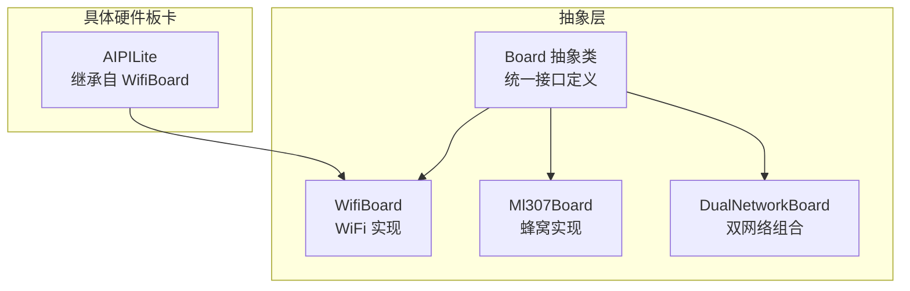
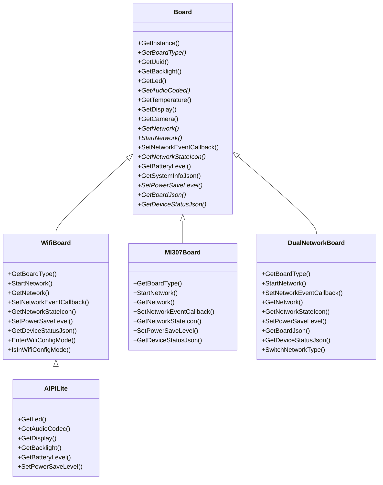
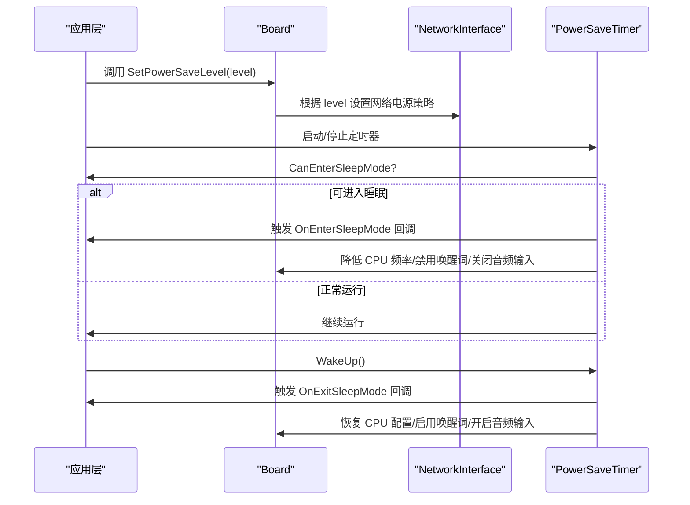
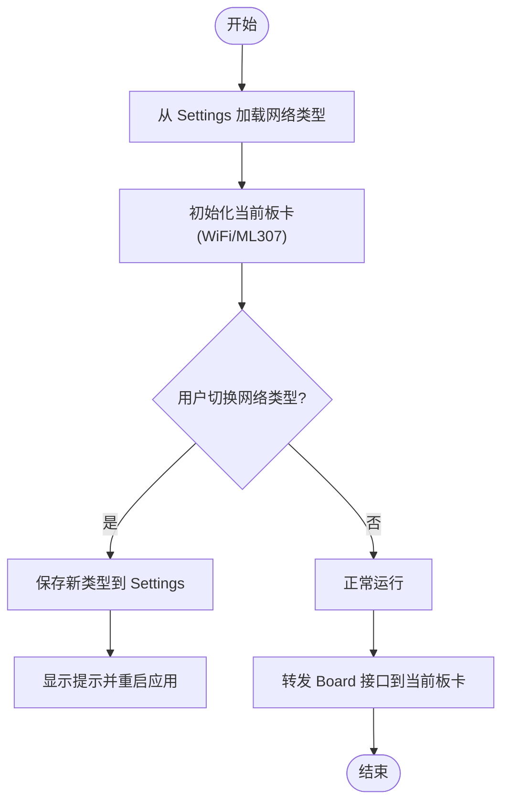
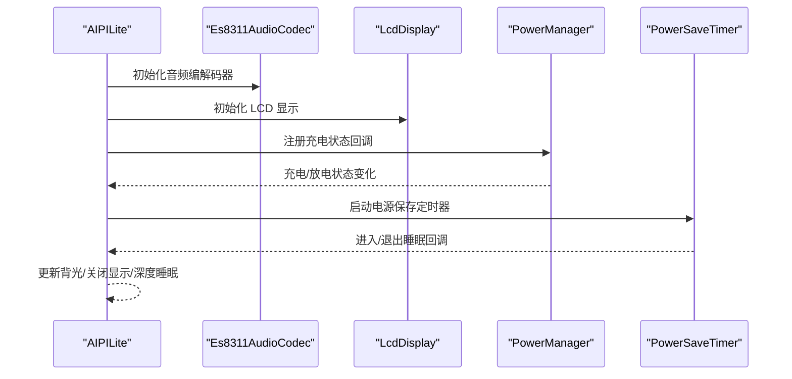
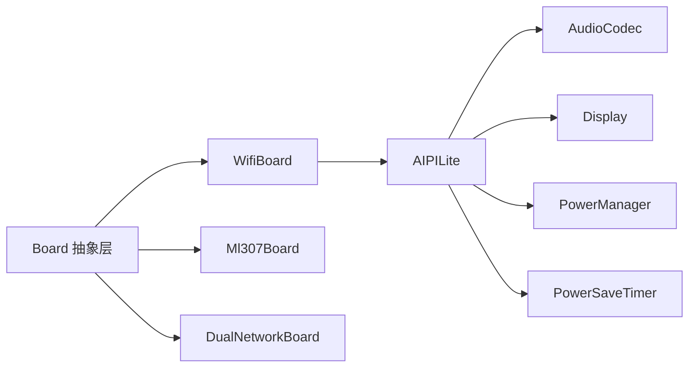

# 硬件抽象层设计

<cite>
**本文档引用的文件**
- [main/boards/common/board.h](file://main/boards/common/board.h)
- [main/boards/common/board.cc](file://main/boards/common/board.cc)
- [main/boards/common/wifi_board.h](file://main/boards/common/wifi_board.h)
- [main/boards/common/wifi_board.cc](file://main/boards/common/wifi_board.cc)
- [main/boards/common/ml307_board.h](file://main/boards/common/ml307_board.h)
- [main/boards/common/ml307_board.cc](file://main/boards/common/ml307_board.cc)
- [main/boards/common/dual_network_board.h](file://main/boards/common/dual_network_board.h)
- [main/boards/common/dual_network_board.cc](file://main/boards/common/dual_network_board.cc)
- [main/boards/aipi-lite/aipi-lite.cc](file://main/boards/aipi-lite/aipi-lite.cc)
- [main/audio/audio_codec.h](file://main/audio/audio_codec.h)
- [main/display/display.h](file://main/display/display.h)
- [main/boards/common/power_save_timer.h](file://main/boards/common/power_save_timer.h)
- [main/boards/common/power_save_timer.cc](file://main/boards/common/power_save_timer.cc)
</cite>

## 目录
1. [简介](#简介)
2. [项目结构](#项目结构)
3. [核心组件](#核心组件)
4. [架构总览](#架构总览)
5. [详细组件分析](#详细组件分析)
6. [依赖关系分析](#依赖关系分析)
7. [性能考量](#性能考量)
8. [故障排查指南](#故障排查指南)
9. [结论](#结论)
10. [附录](#附录)

## 简介
本文件系统性阐述 XiaoZhi ESP32 项目的硬件抽象层（Hardware Abstraction Layer, HAL）设计与实现，重点围绕 Board 基类及其派生类，解释如何通过统一接口屏蔽 70+ 种不同硬件平台的差异，实现“一次编写、多处运行”的跨平台软件架构。文档同时覆盖电源管理（PowerSaveLevel）、网络事件回调（NetworkEvent）等关键设计点，并给出扩展机制与最佳实践，帮助硬件开发者与软件开发者高效协作。

## 项目结构
XiaoZhi ESP32 将硬件抽象集中在 main/boards/common 下，具体硬件板卡位于 main/boards/<vendor>/<board> 子目录中。HAL 的核心由 Board 抽象类定义，WiFi/ML307 双模网络板卡通过组合与委托实现动态切换，典型硬件板卡（如 aipi-lite）继承自 WiFiBoard 并注入具体外设。

图表来源
- [main/boards/common/board.h](file://main/boards/common/board.h#L49-L85)
- [main/boards/common/wifi_board.h](file://main/boards/common/wifi_board.h#L9-L67)
- [main/boards/common/ml307_board.h](file://main/boards/common/ml307_board.h#L9-L36)
- [main/boards/common/dual_network_board.h](file://main/boards/common/dual_network_board.h#L16-L58)
- [main/boards/aipi-lite/aipi-lite.cc](file://main/boards/aipi-lite/aipi-lite.cc#L26-L244)

章节来源
- [main/boards/common/board.h](file://main/boards/common/board.h#L1-L93)
- [main/boards/common/wifi_board.h](file://main/boards/common/wifi_board.h#L1-L70)
- [main/boards/common/ml307_board.h](file://main/boards/common/ml307_board.h#L1-L39)
- [main/boards/common/dual_network_board.h](file://main/boards/common/dual_network_board.h#L1-L60)
- [main/boards/aipi-lite/aipi-lite.cc](file://main/boards/aipi-lite/aipi-lite.cc#L1-L247)

## 核心组件
- Board 抽象类：定义统一的硬件能力接口，包括音频编解码器、显示、网络、电源管理、系统信息等。通过虚函数实现可替换性，配合静态工厂函数 getInstance 提供全局单例访问。
- WifiBoard/Ml307Board：分别封装 WiFi 与蜂窝网络栈，统一对外暴露 NetworkInterface、事件回调、状态图标等接口。
- DualNetworkBoard：组合模式实现 WiFi 与 ML307 的动态切换，屏蔽底层差异。
- 具体硬件板卡（如 AIPILite）：继承自 WifiBoard，注入实际的 I2C/SPI/LCD/AudioCodec 等硬件资源，实现“即插即用”。

章节来源
- [main/boards/common/board.h](file://main/boards/common/board.h#L49-L85)
- [main/boards/common/board.cc](file://main/boards/common/board.cc#L15-L23)
- [main/boards/common/wifi_board.h](file://main/boards/common/wifi_board.h#L9-L67)
- [main/boards/common/ml307_board.h](file://main/boards/common/ml307_board.h#L9-L36)
- [main/boards/common/dual_network_board.h](file://main/boards/common/dual_network_board.h#L16-L58)
- [main/boards/aipi-lite/aipi-lite.cc](file://main/boards/aipi-lite/aipi-lite.cc#L26-L244)

## 架构总览
下图展示了 HAL 的层次关系与交互流程：上层软件仅依赖 Board 接口；Board 通过虚函数委派至具体实现；网络层通过 WifiBoard 或 Ml307Board 提供统一事件模型；电源管理通过 PowerSaveTimer 与 Board 的 PowerSaveLevel 协同工作。

图表来源
- [main/boards/common/board.h](file://main/boards/common/board.h#L49-L85)
- [main/boards/common/wifi_board.h](file://main/boards/common/wifi_board.h#L9-L67)
- [main/boards/common/ml307_board.h](file://main/boards/common/ml307_board.h#L9-L36)
- [main/boards/common/dual_network_board.h](file://main/boards/common/dual_network_board.h#L16-L58)
- [main/boards/aipi-lite/aipi-lite.cc](file://main/boards/aipi-lite/aipi-lite.cc#L26-L244)

## 详细组件分析

### Board 抽象层设计理念与接口规范
- 统一入口：通过静态工厂方法 getInstance 返回全局唯一的 Board 实例，屏蔽具体实现差异。
- 虚函数接口：所有硬件能力均以虚函数形式暴露，子类可选择性覆盖默认行为（如无显示时返回空实现）。
- 可选能力：GetDisplay/Camera/Led 等返回空指针或空实现，避免强制依赖。
- 系统信息：GetSystemInfoJson 汇聚芯片、分区表、OTA 等信息，便于诊断与升级。
- 扩展宏：通过 DECLARE_BOARD 宏注册具体板卡类，简化构建期绑定。

章节来源
- [main/boards/common/board.h](file://main/boards/common/board.h#L49-L85)
- [main/boards/common/board.cc](file://main/boards/common/board.cc#L15-L23)
- [main/boards/common/board.cc](file://main/boards/common/board.cc#L56-L68)
- [main/boards/common/board.cc](file://main/boards/common/board.cc#L70-L178)

### 核心接口详解
- GetAudioCodec：返回音频编解码器实例，用于设置音量、增益、输入输出开关与数据流。
- GetDisplay：返回显示实例，支持状态栏、表情、聊天消息与主题切换。
- GetNetwork：返回网络接口，WiFiBoard 返回 WiFi 管理器，Ml307Board 返回蜂窝调制解调器。
- StartNetwork/SetPowerSaveLevel：启动网络连接与电源策略；PowerSaveLevel 支持低功耗、平衡、高性能三种模式。
- SetNetworkEventCallback/NetworkEvent：统一网络事件回调，包含扫描、连接、断开、配网模式进入/退出以及蜂窝错误事件。
- GetNetworkStateIcon：根据当前网络状态返回图标编码，便于 UI 展示。
- GetBatteryLevel/GetTemperature：可选能力，硬件板卡可选择性实现。
- GetBoardJson/GetDeviceStatusJson：前者输出板卡特定信息，后者输出设备实时状态（屏幕、电池、网络、芯片温度等）。

章节来源
- [main/boards/common/board.h](file://main/boards/common/board.h#L17-L44)
- [main/boards/common/board.h](file://main/boards/common/board.h#L68-L84)
- [main/audio/audio_codec.h](file://main/audio/audio_codec.h#L17-L61)
- [main/display/display.h](file://main/display/display.h#L28-L61)

### 网络事件与电源管理
- NetworkEvent：统一 WiFi 与蜂窝事件，便于 UI 与业务逻辑一致处理。
- PowerSaveLevel：映射到 WiFiBoard 的电源策略，结合 PowerSaveTimer 实现自动休眠与唤醒。
- PowerSaveTimer：周期检查应用是否可进入睡眠，必要时降低 CPU 频率、暂停唤醒词检测与音频输入，超时后触发关机回调。

图表来源
- [main/boards/common/wifi_board.cc](file://main/boards/common/wifi_board.cc#L285-L300)
- [main/boards/common/power_save_timer.cc](file://main/boards/common/power_save_timer.cc#L62-L104)
- [main/boards/common/power_save_timer.cc](file://main/boards/common/power_save_timer.cc#L106-L132)

章节来源
- [main/boards/common/wifi_board.cc](file://main/boards/common/wifi_board.cc#L285-L300)
- [main/boards/common/power_save_timer.h](file://main/boards/common/power_save_timer.h#L8-L34)
- [main/boards/common/power_save_timer.cc](file://main/boards/common/power_save_timer.cc#L10-L28)

### 双网络板卡（DualNetworkBoard）
- 设计目标：在 WiFi 与 ML307 之间动态切换，无需修改上层代码。
- 实现方式：组合当前活动板卡，转发 Board 接口调用；通过 Settings 记录网络类型，重启生效。
- 用户交互：提供 SwitchNetworkType，结合 UI 提示并重启应用以完成切换。

图表来源
- [main/boards/common/dual_network_board.cc](file://main/boards/common/dual_network_board.cc#L10-L21)
- [main/boards/common/dual_network_board.cc](file://main/boards/common/dual_network_board.cc#L45-L57)
- [main/boards/common/dual_network_board.cc](file://main/boards/common/dual_network_board.cc#L64-L98)

章节来源
- [main/boards/common/dual_network_board.h](file://main/boards/common/dual_network_board.h#L16-L58)
- [main/boards/common/dual_network_board.cc](file://main/boards/common/dual_network_board.cc#L10-L99)

### 典型硬件板卡（AIPILite）
- 继承关系：AIPILite 继承自 WifiBoard，复用 WiFi 网络栈与配网流程。
- 外设注入：通过 I2C/SPI 初始化音频编解码器、LCD 显示、背光、按键与电源管理。
- 电源策略：结合 PowerSaveTimer 实现自动休眠/唤醒，长按关机与深度睡眠。
- 电池状态：通过 PowerManager 提供电量、充电状态，并联动电源策略。

图表来源
- [main/boards/aipi-lite/aipi-lite.cc](file://main/boards/aipi-lite/aipi-lite.cc#L36-L65)
- [main/boards/aipi-lite/aipi-lite.cc](file://main/boards/aipi-lite/aipi-lite.cc#L98-L132)
- [main/boards/aipi-lite/aipi-lite.cc](file://main/boards/aipi-lite/aipi-lite.cc#L134-L179)
- [main/boards/aipi-lite/aipi-lite.cc](file://main/boards/aipi-lite/aipi-lite.cc#L238-L243)

章节来源
- [main/boards/aipi-lite/aipi-lite.cc](file://main/boards/aipi-lite/aipi-lite.cc#L26-L244)

### 网络实现对比（WiFi vs 蜂窝）
- WiFiBoard：基于 WiFi 管理器与配网模式，支持超时自动进入配网、Blufi/声学配网等多种方式。
- Ml307Board：基于 AT 调制解调器，检测模块、等待网络注册、查询信号强度与运营商信息。
- 统一接口：两者均实现 Board 的网络相关接口，上层仅需调用 StartNetwork/SetNetworkEventCallback 等即可。

章节来源
- [main/boards/common/wifi_board.h](file://main/boards/common/wifi_board.h#L9-L67)
- [main/boards/common/wifi_board.cc](file://main/boards/common/wifi_board.cc#L52-L105)
- [main/boards/common/ml307_board.h](file://main/boards/common/ml307_board.h#L9-L36)
- [main/boards/common/ml307_board.cc](file://main/boards/common/ml307_board.cc#L134-L141)

## 依赖关系分析
- 板卡与抽象层：具体板卡（如 AIPILite）依赖 Board 抽象层；WiFi/ML307 双模通过组合模式依赖 Board。
- 外设依赖：音频编解码器、显示、按键、电源管理等作为可选组件被板卡注入。
- 网络依赖：WiFiBoard 依赖 WiFi 管理器与配网工具；Ml307Board 依赖 AT 调制解调器。
- 电源依赖：PowerSaveTimer 依赖应用层状态判断与系统电源管理。

图表来源
- [main/boards/common/board.h](file://main/boards/common/board.h#L49-L85)
- [main/boards/common/wifi_board.h](file://main/boards/common/wifi_board.h#L9-L67)
- [main/boards/common/ml307_board.h](file://main/boards/common/ml307_board.h#L9-L36)
- [main/boards/common/dual_network_board.h](file://main/boards/common/dual_network_board.h#L16-L58)
- [main/boards/aipi-lite/aipi-lite.cc](file://main/boards/aipi-lite/aipi-lite.cc#L26-L244)

章节来源
- [main/boards/common/board.h](file://main/boards/common/board.h#L49-L85)
- [main/boards/aipi-lite/aipi-lite.cc](file://main/boards/aipi-lite/aipi-lite.cc#L205-L212)

## 性能考量
- 动态电源策略：通过 PowerSaveTimer 在空闲时降低 CPU 频率、暂停音频输入与唤醒词检测，显著降低功耗。
- 网络电源映射：WiFiBoard 将 PowerSaveLevel 映射到 WiFi 电源策略，减少不必要的扫描与连接尝试。
- 显示与背光：在睡眠模式下关闭显示与背光，避免额外功耗。
- 数据路径优化：音频编解码器采用 DMA 与合适的采样率/通道数配置，减少 CPU 占用。

章节来源
- [main/boards/common/power_save_timer.cc](file://main/boards/common/power_save_timer.cc#L62-L104)
- [main/boards/common/wifi_board.cc](file://main/boards/common/wifi_board.cc#L285-L300)
- [main/audio/audio_codec.h](file://main/audio/audio_codec.h#L17-L61)

## 故障排查指南
- 网络无法连接
  - 检查 WiFiBoard 是否正确进入配网模式，确认 SSID 列表是否存在。
  - 查看 NetworkEvent 回调日志，定位断开原因（超时/配网模式退出）。
- 蜂窝无 SIM/注册失败
  - 检查 Ml307Board 的事件回调，关注无 SIM/注册拒绝/初始化失败等错误。
  - 确认串口引脚配置与波特率。
- 电源管理异常
  - 确认 PowerSaveTimer 是否启用，检查 CanEnterSleepMode 返回值。
  - 检查唤醒词检测与音频输入在睡眠前后的启停逻辑。
- 显示与背光问题
  - 确认 Display 实例已正确初始化，背光 PWM 引脚配置正确。
  - 检查 DisplayLockGuard 的加解锁流程，避免死锁。

章节来源
- [main/boards/common/wifi_board.cc](file://main/boards/common/wifi_board.cc#L107-L146)
- [main/boards/common/ml307_board.cc](file://main/boards/common/ml307_board.cc#L31-L65)
- [main/boards/common/power_save_timer.cc](file://main/boards/common/power_save_timer.cc#L62-L104)
- [main/display/display.h](file://main/display/display.h#L64-L87)

## 结论
XiaoZhi ESP32 的 HAL 通过 Board 抽象层实现了硬件无关的软件架构，结合 WiFiBoard/Ml307Board 与 DualNetworkBoard，有效屏蔽了 70+ 种硬件平台的差异。统一的网络事件模型与电源管理策略使上层应用能够稳定运行于多种硬件之上。通过 DECLARE_BOARD 宏与组合模式，新增硬件平台与外设组件变得简单而清晰。

## 附录

### HAL 扩展机制与最佳实践
- 新增硬件板卡
  - 新建类继承自 Board 或现有 WiFiBoard/Ml307Board，实现必需接口（如 GetAudioCodec/GetDisplay/GetNetwork 等）。
  - 在源文件末尾使用 DECLARE_BOARD(YourBoard) 宏注册。
  - 在构建配置中选择对应板卡。
- 新增硬件组件
  - 将组件封装为独立类（如新的 AudioCodec/Display），在具体板卡中注入并覆写 Board 对应接口。
  - 保持默认行为（如无显示返回空实现），避免强制依赖。
- 电源管理扩展
  - 通过 PowerSaveTimer 注册进入/退出睡眠回调，调整显示、背光、音频与唤醒词状态。
  - 在 SetPowerSaveLevel 中映射到具体网络电源策略。
- 网络事件扩展
  - 在 WifiBoard/Ml307Board 中扩展 NetworkEvent 类型与回调分发逻辑，保持对外一致的回调签名。
- 最佳实践
  - 优先使用组合与委托，避免多重继承。
  - 将硬件初始化与业务逻辑分离，便于测试与维护。
  - 为每个板卡提供最小可运行配置，逐步叠加功能。

章节来源
- [main/boards/common/board.h](file://main/boards/common/board.h#L87-L90)
- [main/boards/common/wifi_board.h](file://main/boards/common/wifi_board.h#L22-L27)
- [main/boards/common/ml307_board.h](file://main/boards/common/ml307_board.h#L20-L24)
- [main/boards/common/power_save_timer.h](file://main/boards/common/power_save_timer.h#L14-L17)