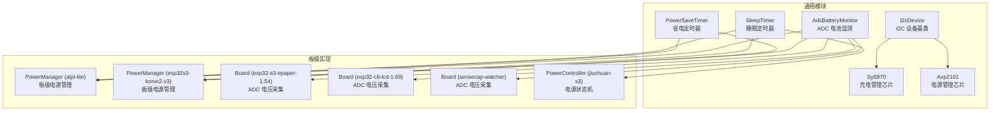
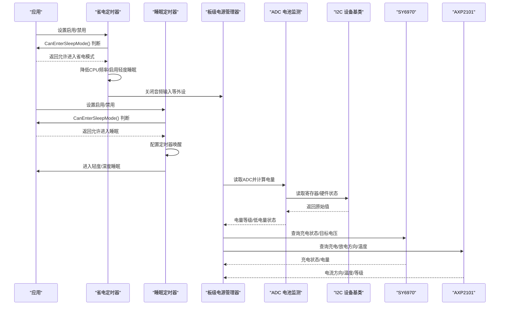
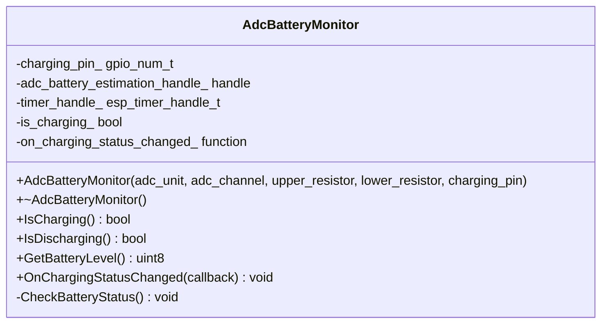
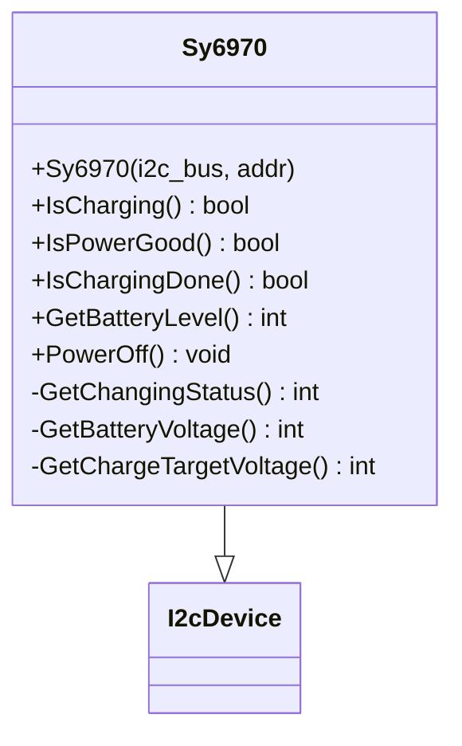
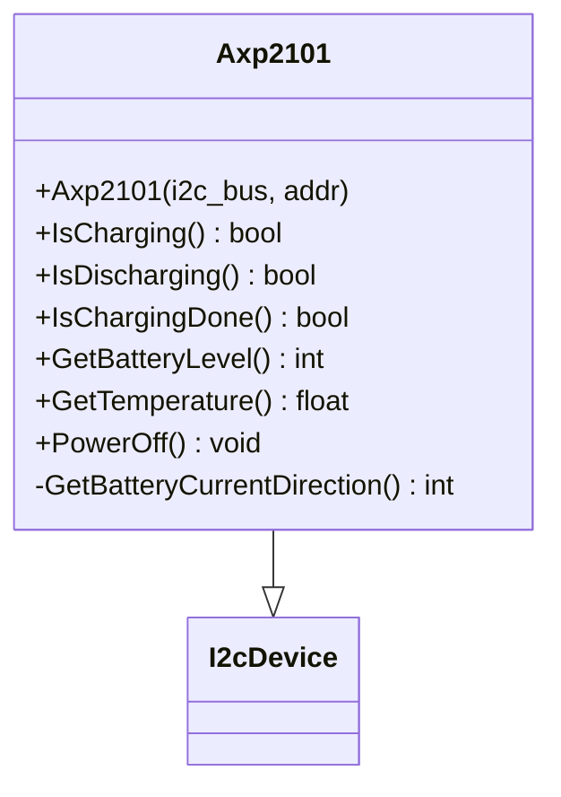
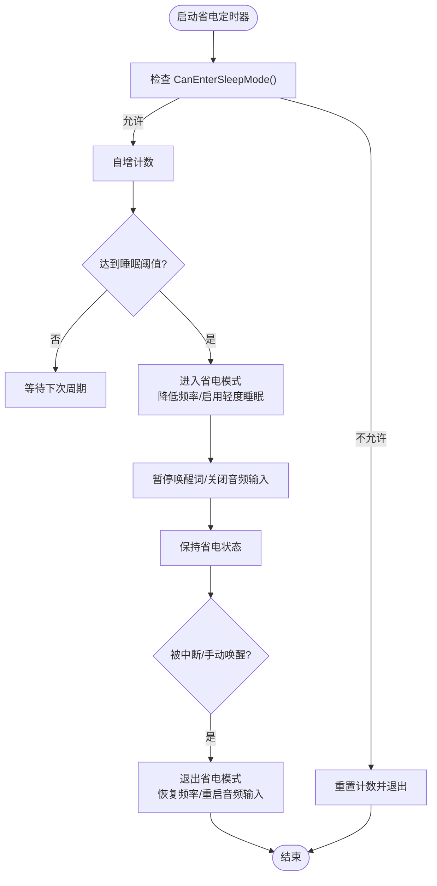
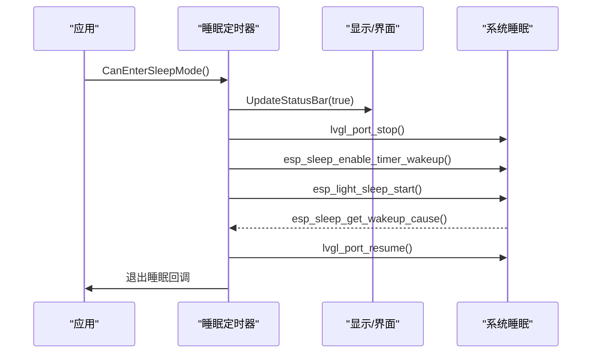
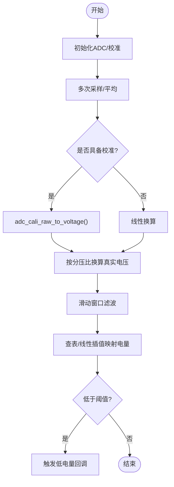
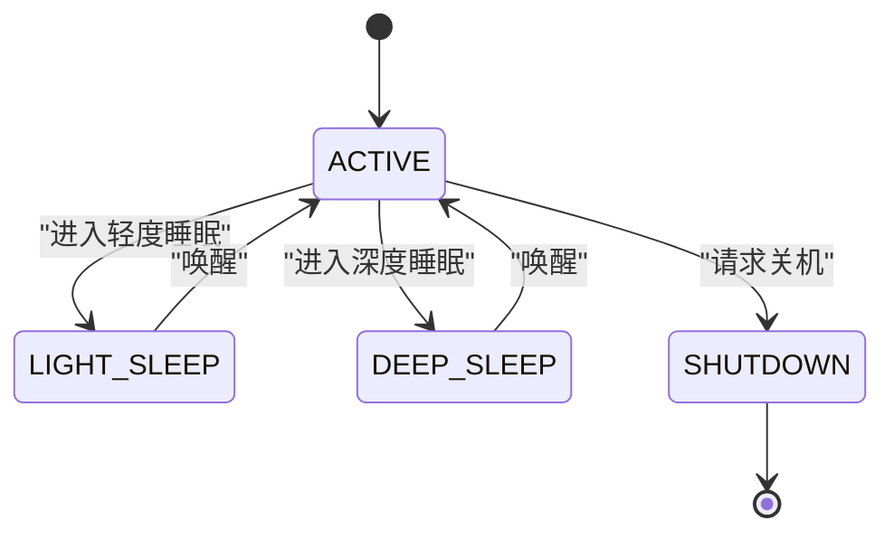
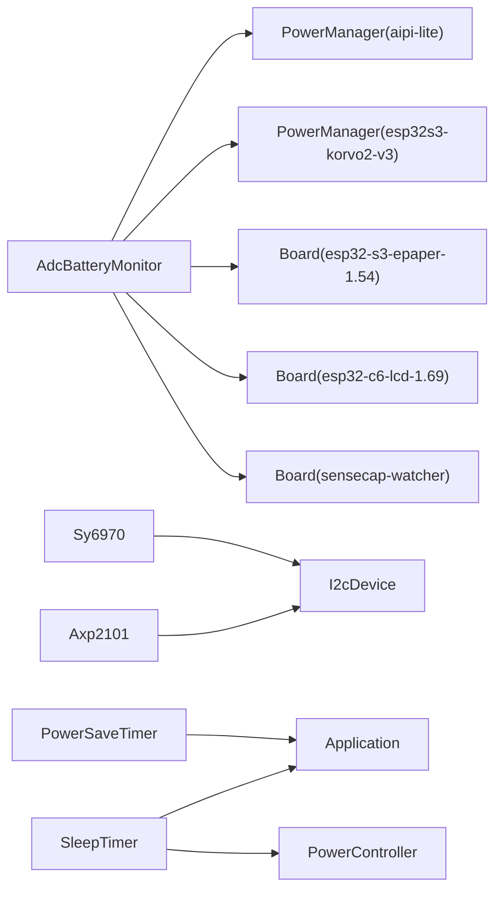

# 电源管理系统

<cite>
**本文引用的文件**
- [adc_battery_monitor.h](file://main/boards/common/adc_battery_monitor.h)
- [adc_battery_monitor.cc](file://main/boards/common/adc_battery_monitor.cc)
- [sy6970.h](file://main/boards/common/sy6970.h)
- [sy6970.cc](file://main/boards/common/sy6970.cc)
- [axp2101.h](file://main/boards/common/axp2101.h)
- [axp2101.cc](file://main/boards/common/axp2101.cc)
- [i2c_device.h](file://main/boards/common/i2c_device.h)
- [power_save_timer.h](file://main/boards/common/power_save_timer.h)
- [power_save_timer.cc](file://main/boards/common/power_save_timer.cc)
- [sleep_timer.h](file://main/boards/common/sleep_timer.h)
- [sleep_timer.cc](file://main/boards/common/sleep_timer.cc)
- [power_manager.h](file://main/boards/aipi-lite/power_manager.h)
- [power_manager.h](file://main/boards/esp32s3-korvo2-v3/power_manager.h)
- [power_manager.h](file://main/boards/waveshare/esp32-s3-epaper-1.54/waveshare-s3-epaper-1.54.cc)
- [power_manager.h](file://main/boards/waveshare/esp32-c6-lcd-1.69/power_manager.h)
- [power_manager.h](file://main/boards/sensecap-watcher/sensecap_watcher.cc)
- [power_controller.h](file://main/boards/jiuchuan-s3/power_controller.h)
</cite>

## 目录
1. [简介](#简介)
2. [项目结构](#项目结构)
3. [核心组件](#核心组件)
4. [架构总览](#架构总览)
5. [详细组件分析](#详细组件分析)
6. [依赖关系分析](#依赖关系分析)
7. [性能考量](#性能考量)
8. [故障排查指南](#故障排查指南)
9. [结论](#结论)
10. [附录](#附录)

## 简介
本文件针对 XiaoZhi ESP32 项目的电源管理系统，系统性梳理并解析不同硬件平台上的电源管理策略与实现细节，覆盖电池监测、充电管理、电源优化（睡眠/深度睡眠）、动态频率调节、外设关闭、异常处理与安全机制等关键能力。文档同时提供 ADC 电池监测的配置方法、采样精度与电量计算思路，并对 SY6970、AXP2101 等电源管理芯片的初始化与配置流程进行说明；最后给出电源芯片选型建议与低功耗设计最佳实践。

## 项目结构
电源管理相关代码主要分布在以下位置：
- 通用模块：ADC 电池监测、SY6970、AXP2101、I2C 设备基类、省电定时器、睡眠定时器
- 板级实现：各开发板的电源管理器与控制器，负责结合具体硬件电路实现电池监测、充电状态判断、低功耗控制与状态机切换

图表来源
- [adc_battery_monitor.h](file://main/boards/common/adc_battery_monitor.h#L1-L31)
- [adc_battery_monitor.cc](file://main/boards/common/adc_battery_monitor.cc#L1-L116)
- [sy6970.h](file://main/boards/common/sy6970.h#L1-L21)
- [sy6970.cc](file://main/boards/common/sy6970.cc#L1-L65)
- [axp2101.h](file://main/boards/common/axp2101.h#L1-L21)
- [axp2101.cc](file://main/boards/common/axp2101.cc#L1-L41)
- [i2c_device.h](file://main/boards/common/i2c_device.h#L1-L19)
- [power_save_timer.h](file://main/boards/common/power_save_timer.h#L1-L35)
- [power_save_timer.cc](file://main/boards/common/power_save_timer.cc#L1-L133)
- [sleep_timer.h](file://main/boards/common/sleep_timer.h#L1-L33)
- [sleep_timer.cc](file://main/boards/common/sleep_timer.cc#L1-L134)
- [power_manager.h](file://main/boards/aipi-lite/power_manager.h#L1-L188)
- [power_manager.h](file://main/boards/esp32s3-korvo2-v3/power_manager.h#L39-L113)
- [power_manager.h](file://main/boards/waveshare/esp32-s3-epaper-1.54/waveshare-s3-epaper-1.54.cc#L103-L140)
- [power_manager.h](file://main/boards/waveshare/esp32-c6-lcd-1.69/power_manager.h#L102-L133)
- [power_manager.h](file://main/boards/sensecap-watcher/sensecap_watcher.cc#L391-L427)
- [power_controller.h](file://main/boards/jiuchuan-s3/power_controller.h#L1-L58)

章节来源
- [adc_battery_monitor.h](file://main/boards/common/adc_battery_monitor.h#L1-L31)
- [sy6970.h](file://main/boards/common/sy6970.h#L1-L21)
- [axp2101.h](file://main/boards/common/axp2101.h#L1-L21)
- [i2c_device.h](file://main/boards/common/i2c_device.h#L1-L19)
- [power_save_timer.h](file://main/boards/common/power_save_timer.h#L1-L35)
- [sleep_timer.h](file://main/boards/common/sleep_timer.h#L1-L33)
- [power_manager.h](file://main/boards/aipi-lite/power_manager.h#L1-L188)
- [power_manager.h](file://main/boards/esp32s3-korvo2-v3/power_manager.h#L39-L113)
- [power_controller.h](file://main/boards/jiuchuan-s3/power_controller.h#L1-L58)

## 核心组件
- ADC 电池监测：通过 ADC 通道与分压电阻网络采集电池电压，支持软件估算与硬件充电检测引脚联动，周期性更新电量等级与低电量状态。
- SY6970 充电管理：通过 I2C 查询充电状态、目标充电电压与当前电池电压，计算电量百分比并提供关机接口。
- AXP2101 电源管理：通过 I2C 查询充电/放电方向、充电完成标志、温度与电池等级，提供关机控制。
- 省电定时器：在应用允许进入省电模式时，降低 CPU 频率、关闭音频输入、启用轻度睡眠以降低功耗。
- 睡眠定时器：在应用允许进入睡眠时，进入轻度睡眠或深度睡眠，支持定时唤醒与状态回调。
- 板级电源管理器：针对不同硬件平台，实现 ADC 校准、多点采样、线性/曲线拟合插值、低电量阈值判断与事件回调。
- 电源控制器：统一管理电源状态机（活跃/轻度睡眠/深度睡眠/关机），配合外部电源开关引脚实现上电/断电控制。

章节来源
- [adc_battery_monitor.cc](file://main/boards/common/adc_battery_monitor.cc#L1-L116)
- [sy6970.cc](file://main/boards/common/sy6970.cc#L1-L65)
- [axp2101.cc](file://main/boards/common/axp2101.cc#L1-L41)
- [power_save_timer.cc](file://main/boards/common/power_save_timer.cc#L1-L133)
- [sleep_timer.cc](file://main/boards/common/sleep_timer.cc#L1-L134)
- [power_manager.h](file://main/boards/aipi-lite/power_manager.h#L1-L188)
- [power_manager.h](file://main/boards/esp32s3-korvo2-v3/power_manager.h#L39-L113)
- [power_controller.h](file://main/boards/jiuchuan-s3/power_controller.h#L1-L58)

## 架构总览
电源管理整体采用“通用设备驱动 + 板级适配”的分层设计：
- 通用层：I2C 设备基类封装寄存器读写；SY6970/Axp2101 提供充电/电源状态查询；ADC 电池监测提供统一接口。
- 应用层：省电定时器与睡眠定时器根据应用状态与配置决定是否进入低功耗模式；板级电源管理器负责 ADC 校准与电量计算；电源控制器统一状态机。

图表来源
- [power_save_timer.cc](file://main/boards/common/power_save_timer.cc#L62-L104)
- [sleep_timer.cc](file://main/boards/common/sleep_timer.cc#L66-L123)
- [adc_battery_monitor.cc](file://main/boards/common/adc_battery_monitor.cc#L68-L102)
- [i2c_device.h](file://main/boards/common/i2c_device.h#L1-L19)
- [sy6970.cc](file://main/boards/common/sy6970.cc#L12-L61)
- [axp2101.cc](file://main/boards/common/axp2101.cc#L12-L35)

## 详细组件分析

### ADC 电池监测（AdcBatteryMonitor）
- 功能要点
  - 支持外部充电检测引脚（可选）与 ADC 软件估算协同工作
  - 周期性定时器触发检查，避免频繁 ADC 采样带来的功耗
  - 提供充电状态变化回调、放电判断、电量等级查询
- 关键实现
  - ADC 初始化与分压电阻配置
  - 可选充电检测回调绑定到 GPIO 引脚
  - 定时器周期（微秒级）与状态缓存，减少重复计算
- 电量计算思路
  - 优先使用库函数估算容量
  - 若不可用则回退到固定阈值表查表/线性插值（见板级实现）

图表来源
- [adc_battery_monitor.h](file://main/boards/common/adc_battery_monitor.h#L9-L28)
- [adc_battery_monitor.cc](file://main/boards/common/adc_battery_monitor.cc#L1-L116)

章节来源
- [adc_battery_monitor.h](file://main/boards/common/adc_battery_monitor.h#L1-L31)
- [adc_battery_monitor.cc](file://main/boards/common/adc_battery_monitor.cc#L1-L116)

### SY6970 充电管理
- 功能要点
  - 查询充电状态、电源良好状态、充电完成标志
  - 读取当前电池电压与目标充电电压，计算电量百分比
  - 提供关机命令
- 关键实现
  - 通过 I2C 读取状态寄存器，解析充电阶段与电源状态
  - 电量计算基于最小电压与目标电压范围映射，限制最大值

图表来源
- [sy6970.h](file://main/boards/common/sy6970.h#L6-L19)
- [sy6970.cc](file://main/boards/common/sy6970.cc#L1-L65)
- [i2c_device.h](file://main/boards/common/i2c_device.h#L6-L16)

章节来源
- [sy6970.h](file://main/boards/common/sy6970.h#L1-L21)
- [sy6970.cc](file://main/boards/common/sy6970.cc#L1-L65)

### AXP2101 电源管理
- 功能要点
  - 判断充电/放电方向、充电完成标志
  - 获取电池等级与温度
  - 提供关机控制
- 关键实现
  - 通过寄存器位域解析当前工作状态
  - 温度与电池等级读取用于健康与电量评估

图表来源
- [axp2101.h](file://main/boards/common/axp2101.h#L6-L18)
- [axp2101.cc](file://main/boards/common/axp2101.cc#L1-L41)
- [i2c_device.h](file://main/boards/common/i2c_device.h#L6-L16)

章节来源
- [axp2101.h](file://main/boards/common/axp2101.h#L1-L21)
- [axp2101.cc](file://main/boards/common/axp2101.cc#L1-L41)

### 省电定时器（PowerSaveTimer）
- 功能要点
  - 在应用允许进入省电模式时，降低 CPU 最大频率、启用轻度睡眠
  - 暂停唤醒词检测与关闭音频输入，减少功耗
  - 支持超时关机回调
- 关键实现
  - 周期性检查与状态切换
  - 与电源管理子系统协作，恢复时重新启用相关功能

图表来源
- [power_save_timer.cc](file://main/boards/common/power_save_timer.cc#L62-L104)
- [power_save_timer.cc](file://main/boards/common/power_save_timer.cc#L106-L132)

章节来源
- [power_save_timer.h](file://main/boards/common/power_save_timer.h#L1-L35)
- [power_save_timer.cc](file://main/boards/common/power_save_timer.cc#L1-L133)

### 睡眠定时器（SleepTimer）
- 功能要点
  - 轻度睡眠：停止 LVGL 界面刷新、启用定时器唤醒
  - 深度睡眠：直接进入深度睡眠，支持超时关机
- 关键实现
  - 与应用层协作，确保在合适时机进入睡眠
  - 支持回调通知进入/退出睡眠

图表来源
- [sleep_timer.cc](file://main/boards/common/sleep_timer.cc#L88-L114)

章节来源
- [sleep_timer.h](file://main/boards/common/sleep_timer.h#L1-L33)
- [sleep_timer.cc](file://main/boards/common/sleep_timer.cc#L1-L134)

### 板级电源管理器（PowerManager）
- aipi-lite
  - 使用 GPIO 充电检测引脚与 ADC 一次性采样，维护最近 N 次 ADC 值，线性插值计算电量
  - 低电量阈值触发回调
- esp32s3-korvo2-v3
  - 多次采样取平均，使用 ADC 校准获取更准确电压
  - 基于分压比换算真实电池电压，查表法映射电量
- waveshare-s3-epaper-1.54 / esp32-c6-lcd-1.69 / sensecap-watcher
  - 各自实现 ADC 初始化、校准与电压换算，部分使用曲线拟合方案，最终输出电压与电量

图表来源
- [power_manager.h](file://main/boards/esp32s3-korvo2-v3/power_manager.h#L57-L113)
- [power_manager.h](file://main/boards/waveshare/esp32-s3-epaper-1.54/waveshare-s3-epaper-1.54.cc#L103-L140)
- [power_manager.h](file://main/boards/waveshare/esp32-c6-lcd-1.69/power_manager.h#L102-L133)
- [power_manager.h](file://main/boards/sensecap-watcher/sensecap_watcher.cc#L391-L427)

章节来源
- [power_manager.h](file://main/boards/aipi-lite/power_manager.h#L1-L188)
- [power_manager.h](file://main/boards/esp32s3-korvo2-v3/power_manager.h#L39-L113)
- [power_manager.h](file://main/boards/waveshare/esp32-s3-epaper-1.54/waveshare-s3-epaper-1.54.cc#L103-L140)
- [power_manager.h](file://main/boards/waveshare/esp32-c6-lcd-1.69/power_manager.h#L102-L133)
- [power_manager.h](file://main/boards/sensecap-watcher/sensecap_watcher.cc#L391-L427)

### 电源控制器（PowerController）
- 功能要点
  - 统一电源状态机：ACTIVE → LIGHT_SLEEP → DEEP_SLEEP → SHUTDOWN
  - 通过 RTC GPIO 控制外部电源使能引脚
  - 状态变更回调，便于上层同步资源释放/恢复
- 关键实现
  - 单例模式保证全局唯一
  - 线程安全的状态切换与回调注册

图表来源
- [power_controller.h](file://main/boards/jiuchuan-s3/power_controller.h#L8-L58)

章节来源
- [power_controller.h](file://main/boards/jiuchuan-s3/power_controller.h#L1-L58)

## 依赖关系分析
- 组件耦合
  - AdcBatteryMonitor 与各板级电源管理器解耦，通过统一接口提供电量与充电状态
  - SY6970/Axp2101 依赖 I2C 设备基类，提供稳定的寄存器访问
  - 省电/睡眠定时器依赖应用层的 CanEnterSleepMode 与系统电源管理 API
- 外部依赖
  - ESP-IDF 的 ADC、I2C、PM、睡眠、LVGL 等组件
- 潜在风险
  - ADC 校准缺失时，线性换算误差可能影响电量精度
  - 睡眠前未正确关闭外设可能导致唤醒后异常

图表来源
- [adc_battery_monitor.h](file://main/boards/common/adc_battery_monitor.h#L1-L31)
- [sy6970.h](file://main/boards/common/sy6970.h#L1-L21)
- [axp2101.h](file://main/boards/common/axp2101.h#L1-L21)
- [i2c_device.h](file://main/boards/common/i2c_device.h#L1-L19)
- [power_save_timer.h](file://main/boards/common/power_save_timer.h#L1-L35)
- [sleep_timer.h](file://main/boards/common/sleep_timer.h#L1-L33)
- [power_controller.h](file://main/boards/jiuchuan-s3/power_controller.h#L1-L58)

## 性能考量
- 采样频率与功耗平衡
  - ADC 采样周期建议在 1~10 秒量级，避免高频采样导致功耗上升
  - 多次采样取平均可提升稳定性，但会增加 CPU 占用
- 电量计算精度
  - 优先使用 ADC 校准（曲线拟合/分段线性）以提升低/高电量区间的精度
  - 分压比需与硬件一致，误差会导致系统误判
- 省电策略
  - 在省电模式下降低 CPU 频率、关闭非必要外设（如音频输入）
  - 使用轻度睡眠而非深度睡眠以减少唤醒延迟与复杂度
- 睡眠唤醒
  - 合理设置定时器唤醒时间，避免频繁唤醒造成抖动
  - 对于需要快速响应的场景，谨慎使用深度睡眠

## 故障排查指南
- 无充电状态变化回调
  - 检查充电检测引脚配置与上拉/下拉设置
  - 确认定时器是否正常运行与回调注册
- 电量显示异常
  - 校验分压电阻参数与 ADC 量程设置
  - 若无校准，确认线性换算系数是否匹配硬件
- 省电/睡眠不生效
  - 检查应用层 CanEnterSleepMode 返回值
  - 确认 PM 配置与外设关闭逻辑执行顺序
- 温度过高或异常
  - AXP2101 提供温度读数，结合环境温度与负载情况评估
  - 必要时降低负载或改善散热

章节来源
- [adc_battery_monitor.cc](file://main/boards/common/adc_battery_monitor.cc#L68-L102)
- [power_save_timer.cc](file://main/boards/common/power_save_timer.cc#L62-L104)
- [sleep_timer.cc](file://main/boards/common/sleep_timer.cc#L66-L123)
- [axp2101.cc](file://main/boards/common/axp2101.cc#L33-L35)

## 结论
XiaoZhi ESP32 的电源管理系统通过通用设备驱动与板级适配相结合的方式，在不同硬件平台上实现了统一的电池监测、充电管理与低功耗控制。ADC 电池监测提供灵活的采样与估算方案；SY6970/Axp2101 提供可靠的充电状态与健康信息；省电与睡眠定时器在保证体验的前提下显著降低功耗。建议在新硬件平台上优先采用 ADC 校准与多点插值策略，并严格遵循外设关闭与唤醒流程，以获得更优的续航表现。

## 附录

### ADC 电池监测配置步骤（通用流程）
- 硬件连接
  - 电池经分压电阻网络接入 ADC 通道
  - 可选：充电检测引脚接入 GPIO，用于快速判断充电状态
- 软件初始化
  - 配置 ADC 单次采样单元与通道衰减
  - 如可用，创建 ADC 校准句柄（曲线拟合）
  - 初始化定时器，周期性触发检查
- 电量计算
  - 多次采样取平均，必要时使用校准函数换算电压
  - 按分压比换算真实电池电压
  - 查表或线性插值得到电量百分比
- 回调与事件
  - 注册充电状态变化与低电量回调，及时更新 UI 或触发保护动作

章节来源
- [adc_battery_monitor.cc](file://main/boards/common/adc_battery_monitor.cc#L3-L54)
- [power_manager.h](file://main/boards/esp32s3-korvo2-v3/power_manager.h#L57-L113)
- [power_manager.h](file://main/boards/waveshare/esp32-s3-epaper-1.54/waveshare-s3-epaper-1.54.cc#L103-L140)

### SY6970 初始化与配置要点
- I2C 地址与总线初始化
- 读取充电状态寄存器，判断是否正在充电/完成
- 读取当前电池电压与目标充电电压，计算电量百分比
- 在需要时调用关机命令，确保安全断电

章节来源
- [sy6970.cc](file://main/boards/common/sy6970.cc#L12-L61)
- [i2c_device.h](file://main/boards/common/i2c_device.h#L13-L16)

### AXP2101 初始化与配置要点
- I2C 地址与总线初始化
- 读取电池电流方向，判断充电/放电
- 读取温度与电池等级，用于健康与电量评估
- 在需要时调用关机命令

章节来源
- [axp2101.cc](file://main/boards/common/axp2101.cc#L12-L41)
- [i2c_device.h](file://main/boards/common/i2c_device.h#L13-L16)

### 电源芯片选型与低功耗设计最佳实践
- 选型建议
  - 若需精确充电状态与电量估算，优先选择具备 I2C 寄存器读取能力的芯片（如 SY6970/Axp2101）
  - 对于仅需简单充电检测与低功耗控制的应用，可结合 GPIO 与 ADC 方案
- 低功耗设计
  - 合理设置 CPU 频率与睡眠模式，避免不必要的唤醒
  - 在睡眠前关闭非关键外设，唤醒后按需恢复
  - 使用定时器唤醒替代持续轮询，降低静态功耗
  - 为电池管理系统预留异常处理路径（过充、过放、过温）