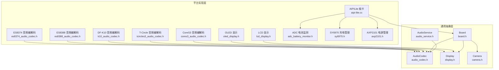
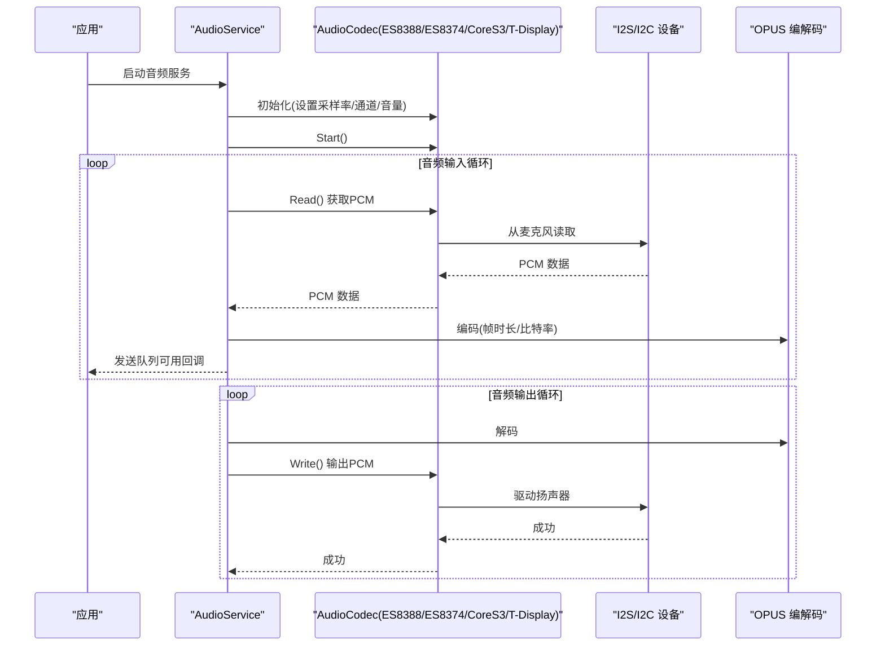
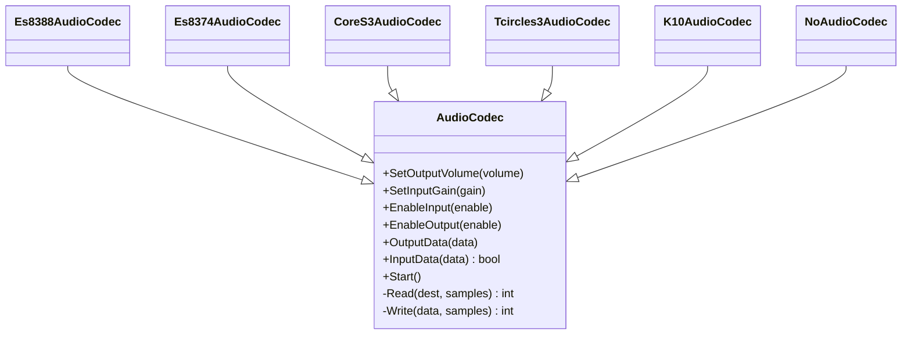
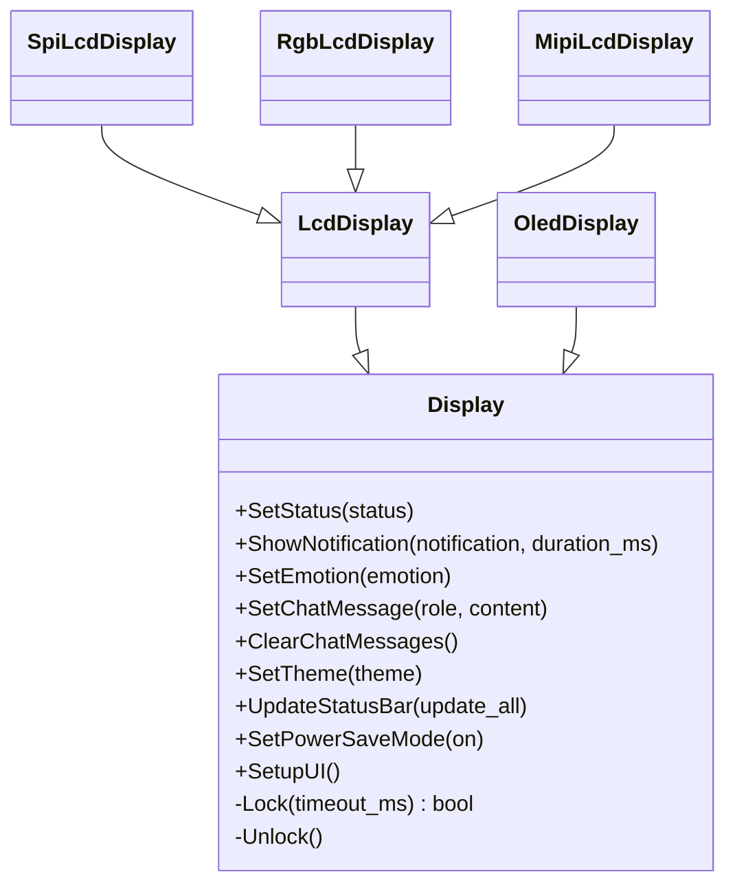
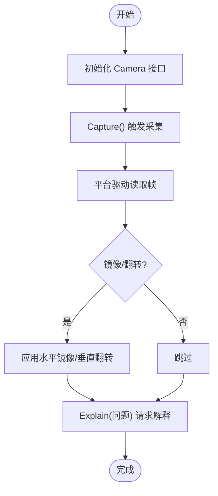
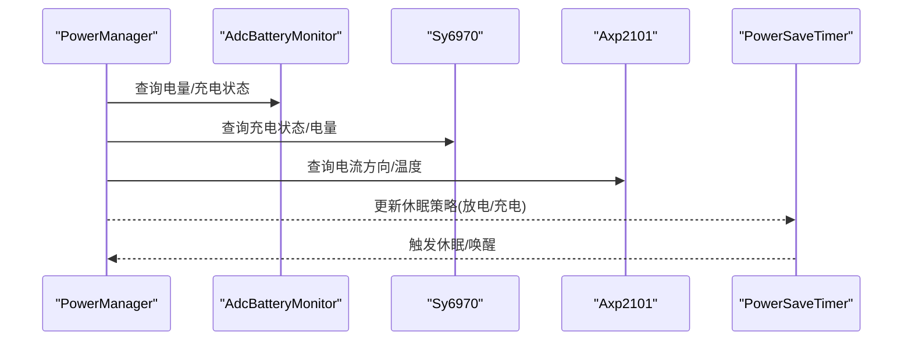
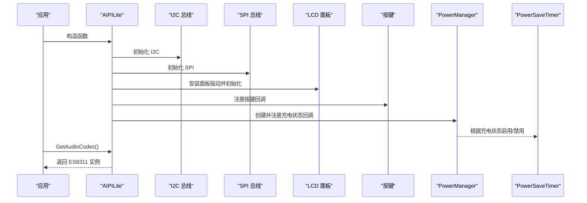
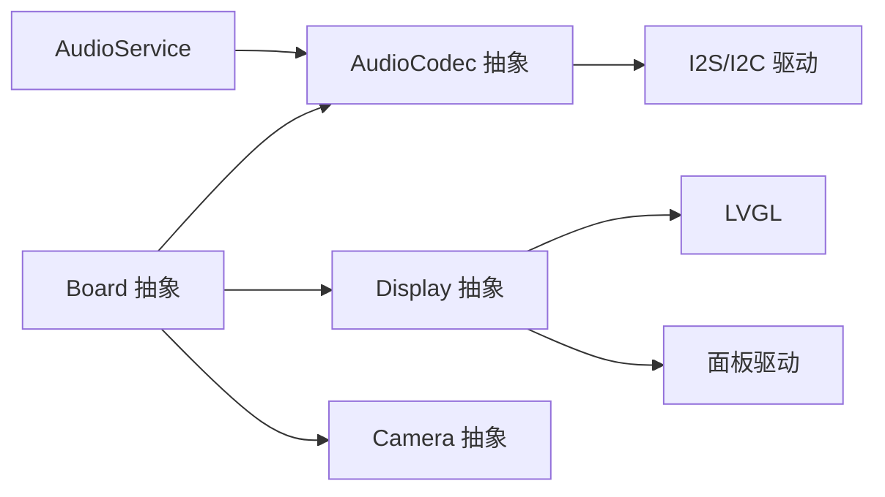

# 硬件特定实现

<cite>
**本文引用的文件**
- [main/audio/audio_codec.h](file://main/audio/audio_codec.h)
- [main/audio/audio_service.h](file://main/audio/audio_service.h)
- [main/audio/codecs/es8388_audio_codec.h](file://main/audio/codecs/es8388_audio_codec.h)
- [main/audio/codecs/es8374_audio_codec.h](file://main/audio/codecs/es8374_audio_codec.h)
- [main/audio/codecs/box_audio_codec.h](file://main/audio/codecs/box_audio_codec.h)
- [main/audio/codecs/no_audio_codec.h](file://main/audio/codecs/no_audio_codec.h)
- [main/display/display.h](file://main/display/display.h)
- [main/display/lcd_display.h](file://main/display/lcd_display.h)
- [main/display/oled_display.h](file://main/display/oled_display.h)
- [main/boards/common/board.h](file://main/boards/common/board.h)
- [main/boards/common/camera.h](file://main/boards/common/camera.h)
- [main/boards/aipi-lite/aipi-lite.cc](file://main/boards/aipi-lite/aipi-lite.cc)
- [main/boards/m5stack-core-s3/cores3_audio_codec.h](file://main/boards/m5stack-core-s3/cores3_audio_codec.h)
- [main/boards/lilygo-t-circle-s3/tcircles3_audio_codec.h](file://main/boards/lilygo-t-circle-s3/tcircles3_audio_codec.h)
- [main/boards/df-k10/k10_audio_codec.h](file://main/boards/df-k10/k10_audio_codec.h)
- [main/boards/common/adc_battery_monitor.h](file://main/boards/common/adc_battery_monitor.h)
- [main/boards/common/sy6970.h](file://main/boards/common/sy6970.h)
- [main/boards/common/axp2101.h](file://main/boards/common/axp2101.h)
</cite>

## 目录
1. [引言](#引言)
2. [项目结构](#项目结构)
3. [核心组件](#核心组件)
4. [架构总览](#架构总览)
5. [详细组件分析](#详细组件分析)
6. [依赖关系分析](#依赖关系分析)
7. [性能考虑](#性能考虑)
8. [故障排查指南](#故障排查指南)
9. [结论](#结论)
10. [附录](#附录)

## 引言
本文件聚焦于 XiaoZhi ESP32 项目的“硬件特定实现”，系统性梳理不同硬件平台在以下方面的差异化实现与最佳实践：
- 音频编解码器：ES8388、ES8374、M5CoreS3、T-Display S3 等多款音频芯片的配置与使用
- 显示驱动：OLED、LCD（SPI/RGB/MIPI）等显示类型及触摸/主题适配
- 摄像头接口：统一 Camera 抽象与图像采集/解释流程
- 电源管理：ADC 电池监测、SY6970、AXP2101 等充电与电量管理方案
- 平台集成：通过 Board 抽象屏蔽差异，实现可插拔的硬件适配

## 项目结构
围绕硬件抽象与平台适配，项目采用“通用抽象 + 平台实现”的分层组织：
- 通用抽象层：audio_codec.h、display.h、board.h、camera.h 等定义跨平台接口
- 具体实现层：各平台目录下的 cc/h 文件实现具体硬件初始化与控制
- 音频子系统：audio_service.h 统一编解码、队列与任务调度；codecs 子目录下为具体芯片实现
- 显示子系统：display.h 定义统一接口，lcd_display.h、oled_display.h 实现不同面板驱动
- 电源管理：adc_battery_monitor.h、sy6970.h、axp2101.h 提供不同供电/充电芯片能力封装

图表来源
- [main/audio/audio_codec.h](file://main/audio/audio_codec.h#L17-L59)
- [main/audio/audio_service.h](file://main/audio/audio_service.h#L105-L194)
- [main/boards/common/board.h](file://main/boards/common/board.h#L49-L85)
- [main/display/display.h](file://main/display/display.h#L28-L61)
- [main/boards/common/camera.h](file://main/boards/common/camera.h#L6-L14)
- [main/boards/aipi-lite/aipi-lite.cc](file://main/boards/aipi-lite/aipi-lite.cc#L26-L247)
- [main/boards/m5stack-core-s3/cores3_audio_codec.h](file://main/boards/m5stack-core-s3/cores3_audio_codec.h#L9-L35)
- [main/boards/lilygo-t-circle-s3/tcircles3_audio_codec.h](file://main/boards/lilygo-t-circle-s3/tcircles3_audio_codec.h#L9-L35)
- [main/boards/df-k10/k10_audio_codec.h](file://main/boards/df-k10/k10_audio_codec.h#L9-L35)
- [main/audio/codecs/es8388_audio_codec.h](file://main/audio/codecs/es8388_audio_codec.h#L12-L38)
- [main/audio/codecs/es8374_audio_codec.h](file://main/audio/codecs/es8374_audio_codec.h#L13-L39)
- [main/display/lcd_display.h](file://main/display/lcd_display.h#L17-L83)
- [main/display/oled_display.h](file://main/display/oled_display.h#L10-L39)
- [main/boards/common/adc_battery_monitor.h](file://main/boards/common/adc_battery_monitor.h#L9-L28)
- [main/boards/common/sy6970.h](file://main/boards/common/sy6970.h#L6-L19)
- [main/boards/common/axp2101.h](file://main/boards/common/axp2101.h#L6-L18)

章节来源
- [main/audio/audio_codec.h](file://main/audio/audio_codec.h#L17-L59)
- [main/audio/audio_service.h](file://main/audio/audio_service.h#L28-L76)
- [main/boards/common/board.h](file://main/boards/common/board.h#L49-L85)
- [main/display/display.h](file://main/display/display.h#L28-L61)
- [main/boards/common/camera.h](file://main/boards/common/camera.h#L6-L14)

## 核心组件
- 音频编解码器抽象：AudioCodec 定义输入输出采样率、通道数、音量增益、启停与读写接口，派生类负责具体芯片驱动与 I2S/I2C 交互
- 音频服务：AudioService 统一编解码、队列与任务调度，支持唤醒词检测、语音处理、OPUS 编解码与播放队列管理
- 显示抽象：Display 定义状态栏、通知、表情、聊天消息、主题切换与电源省电模式；LCD/OLED 分别实现不同面板驱动
- 板卡抽象：Board 提供 GetAudioCodec()/GetDisplay()/GetCamera()/GetNetwork()/GetBatteryLevel()/SetPowerSaveLevel() 等统一接口
- 摄像头抽象：Camera 提供拍照、镜像翻转、解释请求等接口，平台侧实现具体摄像头模块

章节来源
- [main/audio/audio_codec.h](file://main/audio/audio_codec.h#L17-L59)
- [main/audio/audio_service.h](file://main/audio/audio_service.h#L105-L194)
- [main/display/display.h](file://main/display/display.h#L28-L61)
- [main/boards/common/board.h](file://main/boards/common/board.h#L49-L85)
- [main/boards/common/camera.h](file://main/boards/common/camera.h#L6-L14)

## 架构总览
下图展示音频子系统在不同平台上的调用关系与数据流：

图表来源
- [main/audio/audio_service.h](file://main/audio/audio_service.h#L105-L194)
- [main/audio/audio_codec.h](file://main/audio/audio_codec.h#L17-L59)
- [main/audio/codecs/es8388_audio_codec.h](file://main/audio/codecs/es8388_audio_codec.h#L12-L38)
- [main/audio/codecs/es8374_audio_codec.h](file://main/audio/codecs/es8374_audio_codec.h#L13-L39)
- [main/boards/m5stack-core-s3/cores3_audio_codec.h](file://main/boards/m5stack-core-s3/cores3_audio_codec.h#L9-L35)
- [main/boards/lilygo-t-circle-s3/tcircles3_audio_codec.h](file://main/boards/lilygo-t-circle-s3/tcircles3_audio_codec.h#L9-L35)

## 详细组件分析

### 音频编解码器实现差异
- ES8388 音频编解码
  - 使用 esp_codec_dev 接口，通过 I2C 控制、I2S 数据通路实现全双工
  - 支持设置输出音量、启用/禁用输入/输出
  - 关键接口路径：[Es8388AudioCodec 类声明](file://main/audio/codecs/es8388_audio_codec.h#L12-L38)
- ES8374 音频编解码
  - 与 ES8388 类似，但构造参数包含是否使用 MCLK 的选项
  - 关键接口路径：[Es8374AudioCodec 类声明](file://main/audio/codecs/es8374_audio_codec.h#L13-L39)
- M5CoreS3 音频编解码
  - 面向 M5Stack CoreS3 的定制实现，同时管理输入/输出编解码设备
  - 关键接口路径：[CoreS3AudioCodec 类声明](file://main/boards/m5stack-core-s3/cores3_audio_codec.h#L9-L35)
- T-Display S3 音频编解码
  - 面向 Lilygo T-Display S3 的定制实现，独立配置麦克风/扬声器硬件
  - 关键接口路径：[Tcircles3AudioCodec 类声明](file://main/boards/lilygo-t-circle-s3/tcircles3_audio_codec.h#L9-L35)
- DF-K10 音频编解码
  - 复用 I2C 总线，支持 PA 管脚与多芯片地址配置
  - 关键接口路径：[K10AudioCodec 类声明](file://main/boards/df-k10/k10_audio_codec.h#L9-L35)
- 无音频编解码
  - 占位实现，用于不带音频的平台
  - 关键接口路径：[NoAudioCodec 类声明](file://main/audio/codecs/no_audio_codec.h)

图表来源
- [main/audio/audio_codec.h](file://main/audio/audio_codec.h#L17-L59)
- [main/audio/codecs/es8388_audio_codec.h](file://main/audio/codecs/es8388_audio_codec.h#L12-L38)
- [main/audio/codecs/es8374_audio_codec.h](file://main/audio/codecs/es8374_audio_codec.h#L13-L39)
- [main/boards/m5stack-core-s3/cores3_audio_codec.h](file://main/boards/m5stack-core-s3/cores3_audio_codec.h#L9-L35)
- [main/boards/lilygo-t-circle-s3/tcircles3_audio_codec.h](file://main/boards/lilygo-t-circle-s3/tcircles3_audio_codec.h#L9-L35)
- [main/boards/df-k10/k10_audio_codec.h](file://main/boards/df-k10/k10_audio_codec.h#L9-L35)
- [main/audio/codecs/no_audio_codec.h](file://main/audio/codecs/no_audio_codec.h)

章节来源
- [main/audio/codecs/es8388_audio_codec.h](file://main/audio/codecs/es8388_audio_codec.h#L12-L38)
- [main/audio/codecs/es8374_audio_codec.h](file://main/audio/codecs/es8374_audio_codec.h#L13-L39)
- [main/boards/m5stack-core-s3/cores3_audio_codec.h](file://main/boards/m5stack-core-s3/cores3_audio_codec.h#L9-L35)
- [main/boards/lilygo-t-circle-s3/tcircles3_audio_codec.h](file://main/boards/lilygo-t-circle-s3/tcircles3_audio_codec.h#L9-L35)
- [main/boards/df-k10/k10_audio_codec.h](file://main/boards/df-k10/k10_audio_codec.h#L9-L35)
- [main/audio/codecs/no_audio_codec.h](file://main/audio/codecs/no_audio_codec.h)

### 显示驱动实现
- 显示抽象：Display 定义统一接口，包括状态栏、通知、表情、聊天消息、主题切换与电源省电模式
- LCD 显示：LcdDisplay 及其 SPI/RGB/MIPI 派生类，负责面板 IO/驱动初始化、UI 组件布局与动画
- OLED 显示：OledDisplay 针对小尺寸 OLED 的 UI 布局与主题适配
- 锁机制：DisplayLockGuard 提供显示访问互斥保护

图表来源
- [main/display/display.h](file://main/display/display.h#L28-L61)
- [main/display/lcd_display.h](file://main/display/lcd_display.h#L17-L83)
- [main/display/oled_display.h](file://main/display/oled_display.h#L10-L39)

章节来源
- [main/display/display.h](file://main/display/display.h#L28-L61)
- [main/display/lcd_display.h](file://main/display/lcd_display.h#L17-L83)
- [main/display/oled_display.h](file://main/display/oled_display.h#L10-L39)

### 摄像头接口与集成
- Camera 抽象：统一 Capture/SetHMirror/SetVFlip/Explain 接口
- 平台集成：Board.GetCamera() 返回具体摄像头实现，平台侧负责初始化与图像采集
- 流程：Capture 触发采集 → 平台驱动读取帧 → 可选 Explain 调用外部解释服务

图表来源
- [main/boards/common/camera.h](file://main/boards/common/camera.h#L6-L14)

章节来源
- [main/boards/common/camera.h](file://main/boards/common/camera.h#L6-L14)

### 电源管理系统差异
- ADC 电池监测：基于 ADC 电阻分压与充电引脚检测，周期性更新电量与充电状态
- SY6970：I2C 充电管理芯片，提供充电状态、电量估算与关机控制
- AXP2101：PMIC 芯片，提供充电/放电状态、温度与电量估算
- 平台集成：AIPILite 示例中结合 PowerManager/PowerSaveTimer 实现自动休眠与背光控制

图表来源
- [main/boards/common/adc_battery_monitor.h](file://main/boards/common/adc_battery_monitor.h#L9-L28)
- [main/boards/common/sy6970.h](file://main/boards/common/sy6970.h#L6-L19)
- [main/boards/common/axp2101.h](file://main/boards/common/axp2101.h#L6-L18)
- [main/boards/aipi-lite/aipi-lite.cc](file://main/boards/aipi-lite/aipi-lite.cc#L36-L65)

章节来源
- [main/boards/common/adc_battery_monitor.h](file://main/boards/common/adc_battery_monitor.h#L9-L28)
- [main/boards/common/sy6970.h](file://main/boards/common/sy6970.h#L6-L19)
- [main/boards/common/axp2101.h](file://main/boards/common/axp2101.h#L6-L18)
- [main/boards/aipi-lite/aipi-lite.cc](file://main/boards/aipi-lite/aipi-lite.cc#L36-L65)

### 平台集成示例：AIPILite
- 板卡职责：初始化 I2C/SPI、LCD 面板、按键、背光、电源管理与休眠定时器
- 音频：返回 ES8311 音频编解码器实例
- 电源：根据充电状态动态启用/禁用休眠定时器，并在长按/关机按键触发深睡

图表来源
- [main/boards/aipi-lite/aipi-lite.cc](file://main/boards/aipi-lite/aipi-lite.cc#L26-L247)

章节来源
- [main/boards/aipi-lite/aipi-lite.cc](file://main/boards/aipi-lite/aipi-lite.cc#L26-L247)

## 依赖关系分析
- 组件耦合
  - Board 作为工厂与门面，向上提供统一接口，向下依赖具体 AudioCodec/Display/Camera/Network 实现
  - AudioService 依赖 AudioCodec 与音频编解码库，负责任务调度与队列管理
  - 显示层依赖 LVGL 与面板驱动，通过 Display 抽象屏蔽差异
- 外部依赖
  - I2S/I2C 驱动、ESP Codec Dev、LVGL、OPUS 编解码库等
- 平台差异
  - 不同平台通过各自的 .cc/.h 文件实现 Board 抽象，保证上层逻辑一致

图表来源
- [main/boards/common/board.h](file://main/boards/common/board.h#L49-L85)
- [main/audio/audio_service.h](file://main/audio/audio_service.h#L105-L194)
- [main/display/display.h](file://main/display/display.h#L28-L61)

章节来源
- [main/boards/common/board.h](file://main/boards/common/board.h#L49-L85)
- [main/audio/audio_service.h](file://main/audio/audio_service.h#L105-L194)
- [main/display/display.h](file://main/display/display.h#L28-L61)

## 性能考虑
- 音频
  - 合理设置 OPUS 帧时长与 VBR/DTX 参数，平衡延迟与带宽
  - 使用 DMA 描述符与合适的缓冲区大小，避免中断拥塞
  - 输入/输出重采样器仅在必要时启用，降低 CPU 开销
- 显示
  - 在低功耗模式下降低刷新频率或关闭非必要动画
  - 使用 DisplayLockGuard 保护 UI 更新，避免并发冲突
- 电源
  - 根据充电状态动态调整休眠策略，减少不必要的唤醒
  - 对高功耗外设（如摄像头/LCD）在空闲时进入节能模式

## 故障排查指南
- 音频无声/杂音
  - 检查 I2S 引脚配置与 MCLK/BCLK/WS/DIN/DOUT 连接
  - 核对采样率/通道数设置与编解码器支持范围
  - 确认音量/增益设置未被静音或过低
- 显示异常
  - 确认面板驱动初始化顺序（IO → Panel → Reset → Init）
  - 检查 SPI 时钟频率与传输参数
- 电源问题
  - 校准 ADC 分压比与充电检测引脚
  - 检查 SY6970/AXP2101 地址与 I2C 连线
- 按键/休眠
  - 确保唤醒/休眠回调正确注册，避免误触发深睡

## 结论
XiaoZhi ESP32 通过清晰的抽象层与平台化实现，实现了对多种音频芯片、显示面板与电源管理方案的兼容。开发者可在 Board 抽象之上快速移植到新硬件平台，同时利用 AudioService 与 Display 抽象获得一致的音频与显示体验。建议在新平台接入时遵循现有模式：先实现 Board 抽象，再补充具体音频/显示/电源实现，并完善配置参数与性能调优。

## 附录
- 配置参数建议
  - 音频采样率：优先选择 16kHz/48kHz，兼顾质量与带宽
  - OPUS 帧时长：默认 60ms，低延迟场景可降至 20/10ms
  - 音量/增益：从 0~100 线性映射，注意防止削波
  - 显示刷新：根据内容变化动态刷新，避免固定高频刷新
- 最佳实践
  - 将硬件初始化与回调注册集中在 Board 实现中
  - 使用统一的事件组与条件变量管理音频任务同步
  - 对外设进行分层封装，便于替换与测试