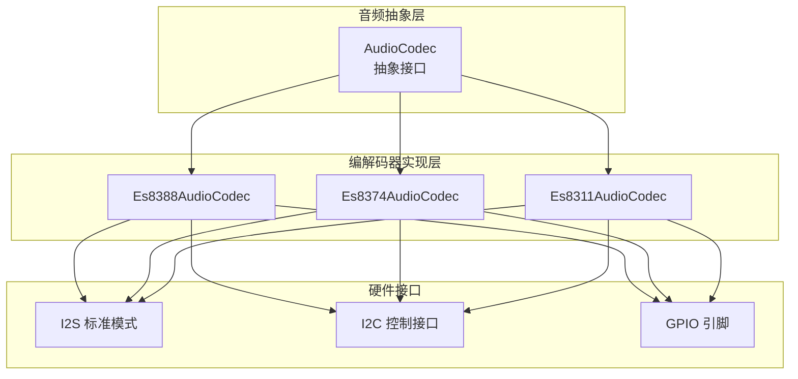
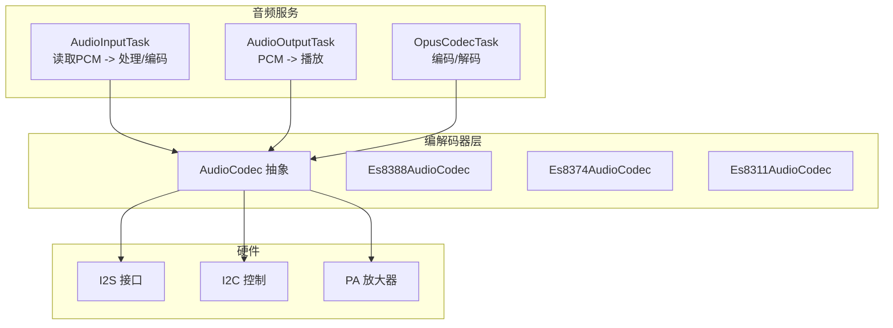
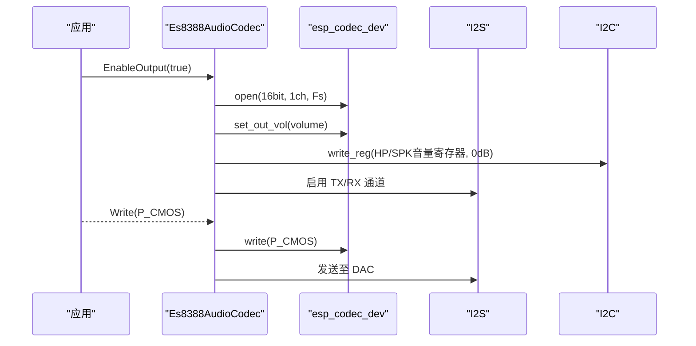
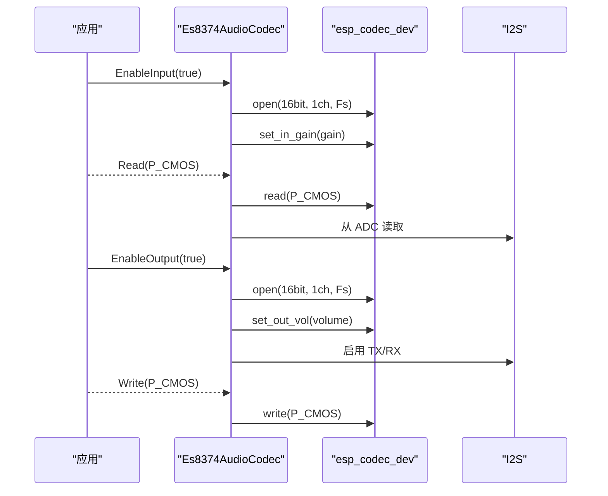
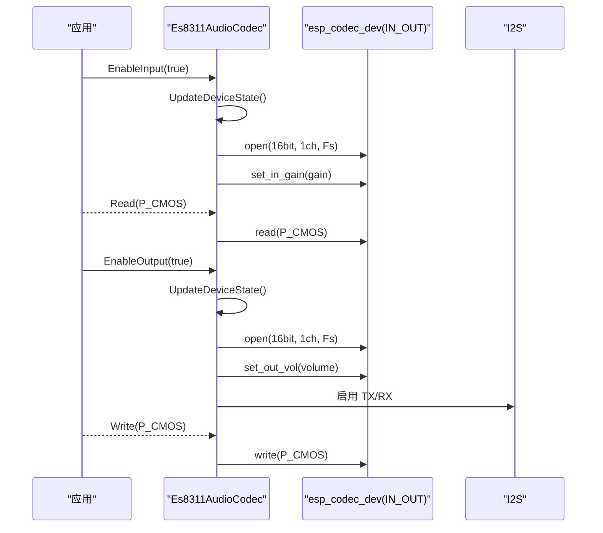
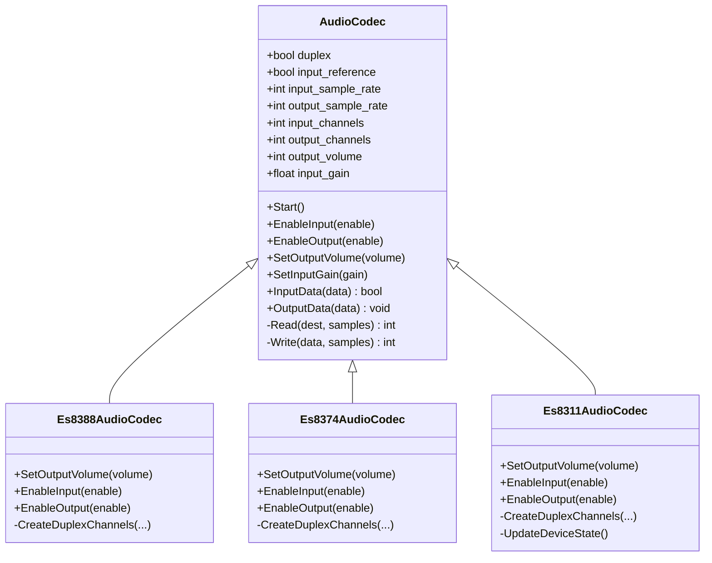
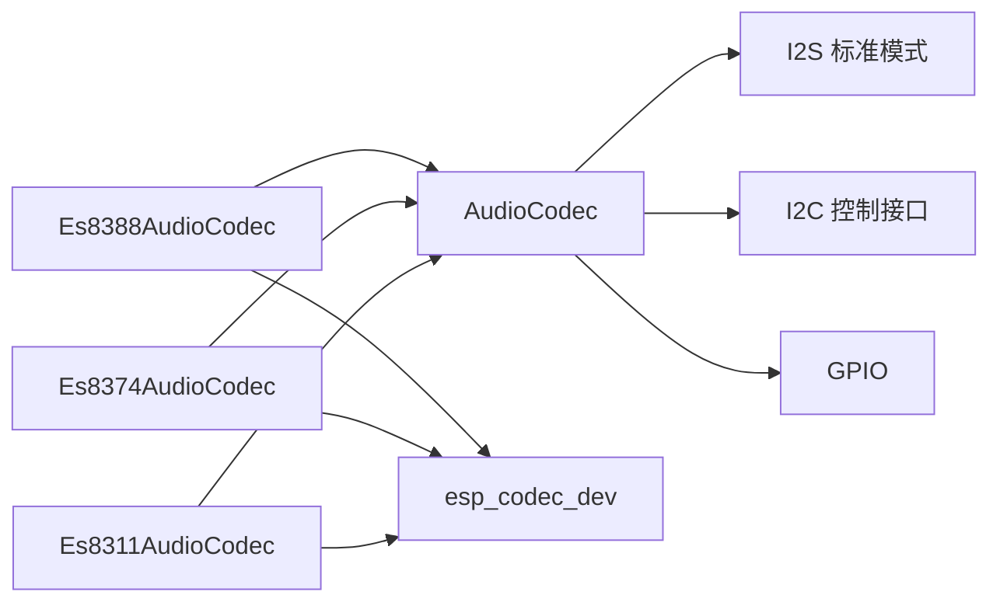

# 音频编解码器实现

<cite>
**本文引用的文件**
- [main/audio/README.md](file://main/audio/README.md)
- [main/audio/audio_codec.h](file://main/audio/audio_codec.h)
- [main/audio/audio_codec.cc](file://main/audio/audio_codec.cc)
- [main/audio/codecs/es8388_audio_codec.h](file://main/audio/codecs/es8388_audio_codec.h)
- [main/audio/codecs/es8388_audio_codec.cc](file://main/audio/codecs/es8388_audio_codec.cc)
- [main/audio/codecs/es8374_audio_codec.h](file://main/audio/codecs/es8374_audio_codec.h)
- [main/audio/codecs/es8374_audio_codec.cc](file://main/audio/codecs/es8374_audio_codec.cc)
- [main/audio/codecs/es8311_audio_codec.h](file://main/audio/codecs/es8311_audio_codec.h)
- [main/audio/codecs/es8311_audio_codec.cc](file://main/audio/codecs/es8311_audio_codec.cc)
</cite>

## 目录
1. [简介](#简介)
2. [项目结构](#项目结构)
3. [核心组件](#核心组件)
4. [架构总览](#架构总览)
5. [详细组件分析](#详细组件分析)
6. [依赖关系分析](#依赖关系分析)
7. [性能考量](#性能考量)
8. [故障排除指南](#故障排除指南)
9. [结论](#结论)
10. [附录](#附录)

## 简介
本文件系统性梳理 XiaoZhi ESP32 项目中音频编解码器的实现与使用，覆盖 ES8388、ES8374、ES8311 等主流音频芯片在不同硬件平台上的配置与集成方式。内容涵盖初始化流程、寄存器与 I2S 配置、采样率与声道设置、音量与增益控制、功耗管理、调试与排障方法，以及在完整音频处理流水线中的优化策略与选型建议。

## 项目结构
音频相关代码主要位于 main/audio 目录，采用“抽象接口 + 多芯片实现”的分层设计：
- 抽象层：AudioCodec 提供统一的编解码器接口（启动、启停、读写、音量/增益设置）。
- 具体实现层：针对 ES8388、ES8374、ES8311 的专用类，封装 I2C 控制接口、I2S 通道、设备句柄与硬件引脚。
- 板级适配：各硬件板卡通过 config.h 中的宏或结构体定义选择对应的编解码器实现，并传入 I2C、MCLK、BCLK、WS、DOUT/DIN、PA 等引脚及地址。

图表来源
- [main/audio/audio_codec.h](file://main/audio/audio_codec.h#L17-L59)
- [main/audio/codecs/es8388_audio_codec.h](file://main/audio/codecs/es8388_audio_codec.h#L12-L38)
- [main/audio/codecs/es8374_audio_codec.h](file://main/audio/codecs/es8374_audio_codec.h#L13-L39)
- [main/audio/codecs/es8311_audio_codec.h](file://main/audio/codecs/es8311_audio_codec.h#L13-L40)

章节来源
- [main/audio/README.md](file://main/audio/README.md#L1-L88)
- [main/audio/audio_codec.h](file://main/audio/audio_codec.h#L1-L62)

## 核心组件
- AudioCodec 抽象基类
  - 职责：统一的编解码器生命周期与能力接口；维护 I2S 双工状态、采样率、声道数、音量与输入增益；提供 Start/Enable/Disable/Volume/Gain 等通用操作。
  - 关键属性：双工标志、输入参考（回声消除）、输入/输出使能、采样率、声道数、音量、输入增益。
  - 关键方法：Start、EnableInput、EnableOutput、SetOutputVolume、SetInputGain、InputData/OutputData、虚函数 Read/Write。
- Es8388AudioCodec
  - 特点：支持输入参考（双声道回声消除），默认启用；内部通过 esp_codec_dev 打开输入/输出设备并设置增益与音量；可配置 PA 放大器引脚。
  - I2S：标准模式，16bit 数据位宽，立体声槽位，MCLK 256×Fs。
  - I2C：用于寄存器访问，初始化时设置耳机/扬声器模拟音量寄存器。
- Es8374AudioCodec
  - 特点：单声道输入，支持 PA 放大器；通过 esp_codec_dev 统一打开/关闭输入/输出设备；硬件兼容性对 I2S 硬件版本有分支处理。
  - I2S：标准模式，16bit，立体声槽位。
- Es8311AudioCodec
  - 特点：输入/输出统一设备句柄（IN_OUT 模式），按需创建/销毁；支持 PA 引脚极性反转；更灵活的设备状态更新逻辑。
  - I2S：标准模式，16bit，立体声槽位。

章节来源
- [main/audio/audio_codec.h](file://main/audio/audio_codec.h#L17-L59)
- [main/audio/audio_codec.cc](file://main/audio/audio_codec.cc#L11-L68)
- [main/audio/codecs/es8388_audio_codec.h](file://main/audio/codecs/es8388_audio_codec.h#L12-L38)
- [main/audio/codecs/es8374_audio_codec.h](file://main/audio/codecs/es8374_audio_codec.h#L13-L39)
- [main/audio/codecs/es8311_audio_codec.h](file://main/audio/codecs/es8311_audio_codec.h#L13-L40)

## 架构总览
音频服务整体采用多任务流水线模型，编解码器作为 I2S 硬件抽象层，向上提供 PCM 数据，向下驱动硬件完成采集与播放。

图表来源
- [main/audio/README.md](file://main/audio/README.md#L14-L88)
- [main/audio/audio_codec.h](file://main/audio/audio_codec.h#L17-L59)
- [main/audio/codecs/es8388_audio_codec.cc](file://main/audio/codecs/es8388_audio_codec.cc#L85-L137)
- [main/audio/codecs/es8374_audio_codec.cc](file://main/audio/codecs/es8374_audio_codec.cc#L76-L132)
- [main/audio/codecs/es8311_audio_codec.cc](file://main/audio/codecs/es8311_audio_codec.cc#L100-L156)

## 详细组件分析

### Es8388AudioCodec 实现
- 初始化流程
  - 创建 I2S 双工通道（发送/接收共享同一 I2S 单元），配置采样率、数据位宽、槽位模式、MCLK 倍数。
  - 初始化 I2C 控制接口与 GPIO 接口，构建 codec_if。
  - 创建输入/输出 esp_codec_dev 设备句柄，设置工作模式与主从模式。
- 寄存器与配置要点
  - 输入参考（回声消除）：当启用输入参考时，通道掩码包含参考通道，同时设置参考增益寄存器。
  - 输出音量：通过 esp_codec_dev 设置数字音量，并额外写入模拟 HP/SPK 音量寄存器以达到 0dB。
  - PA 引脚：启用输出时拉高 PA，禁用时拉低。
- 采样率与声道
  - 采样率必须在输入与输出一致；默认 16bit 立体声槽位。
- 关键调用序列

图表来源
- [main/audio/codecs/es8388_audio_codec.cc](file://main/audio/codecs/es8388_audio_codec.cc#L173-L206)
- [main/audio/codecs/es8388_audio_codec.cc](file://main/audio/codecs/es8388_audio_codec.cc#L139-L142)

章节来源
- [main/audio/codecs/es8388_audio_codec.cc](file://main/audio/codecs/es8388_audio_codec.cc#L7-L71)
- [main/audio/codecs/es8388_audio_codec.cc](file://main/audio/codecs/es8388_audio_codec.cc#L85-L137)
- [main/audio/codecs/es8388_audio_codec.cc](file://main/audio/codecs/es8388_audio_codec.cc#L139-L206)

### Es8374AudioCodec 实现
- 初始化流程
  - 类似 ES8388，但不支持输入参考；通过 esp_codec_dev 打开输入/输出设备。
  - 对 I2S 硬件版本进行条件编译处理，确保兼容性。
- 配置要点
  - 输入增益通过 esp_codec_dev 设置；输出音量通过 esp_codec_dev 设置。
  - PA 引脚在启用输出时拉高。
- 采样率与声道
  - 采样率一致性要求；16bit 立体声槽位。

图表来源
- [main/audio/codecs/es8374_audio_codec.cc](file://main/audio/codecs/es8374_audio_codec.cc#L139-L186)
- [main/audio/codecs/es8374_audio_codec.cc](file://main/audio/codecs/es8374_audio_codec.cc#L76-L132)

章节来源
- [main/audio/codecs/es8374_audio_codec.cc](file://main/audio/codecs/es8374_audio_codec.cc#L7-L62)
- [main/audio/codecs/es8374_audio_codec.cc](file://main/audio/codecs/es8374_audio_codec.cc#L76-L132)
- [main/audio/codecs/es8374_audio_codec.cc](file://main/audio/codecs/es8374_audio_codec.cc#L139-L186)

### Es8311AudioCodec 实现
- 初始化流程
  - 使用 IN_OUT 模式统一设备句柄，按需创建/销毁；支持 MCLK 使用与 PA 极性反转。
- 设备状态更新
  - EnableInput/EnableOutput 仅更新内部状态，实际打开/关闭由 UpdateDeviceState 在需要时执行，降低功耗。
- 配置要点
  - 输入增益与输出音量通过 esp_codec_dev 设置；PA 引脚根据是否反转决定电平。
- 采样率与声道
  - 采样率一致性；16bit 立体声槽位。

图表来源
- [main/audio/codecs/es8311_audio_codec.cc](file://main/audio/codecs/es8311_audio_codec.cc#L70-L98)
- [main/audio/codecs/es8311_audio_codec.cc](file://main/audio/codecs/es8311_audio_codec.cc#L163-L185)

章节来源
- [main/audio/codecs/es8311_audio_codec.cc](file://main/audio/codecs/es8311_audio_codec.cc#L70-L98)
- [main/audio/codecs/es8311_audio_codec.cc](file://main/audio/codecs/es8311_audio_codec.cc#L100-L156)
- [main/audio/codecs/es8311_audio_codec.cc](file://main/audio/codecs/es8311_audio_codec.cc#L158-L185)

### 类关系图

图表来源
- [main/audio/audio_codec.h](file://main/audio/audio_codec.h#L17-L59)
- [main/audio/codecs/es8388_audio_codec.h](file://main/audio/codecs/es8388_audio_codec.h#L12-L38)
- [main/audio/codecs/es8374_audio_codec.h](file://main/audio/codecs/es8374_audio_codec.h#L13-L39)
- [main/audio/codecs/es8311_audio_codec.h](file://main/audio/codecs/es8311_audio_codec.h#L13-L40)

## 依赖关系分析
- 外部库与接口
  - I2S：标准模式配置、DMA 描述符数量与帧大小、MCLK 倍数、槽位模式。
  - I2C：控制接口用于寄存器访问（如 ES8388 的模拟音量寄存器）。
  - esp_codec_dev：统一的编解码器设备抽象，负责打开/关闭设备、设置采样信息、增益与音量。
  - GPIO：PA 放大器使能引脚。
- 内部耦合
  - 各实现类均继承自 AudioCodec，复用统一的启停与参数管理。
  - I2S 通道在构造阶段一次性创建并启用，避免运行期频繁切换。
  - ES8311 采用按需打开的策略，减少空闲时功耗。

图表来源
- [main/audio/codecs/es8388_audio_codec.cc](file://main/audio/codecs/es8388_audio_codec.cc#L20-L70)
- [main/audio/codecs/es8374_audio_codec.cc](file://main/audio/codecs/es8374_audio_codec.cc#L20-L61)
- [main/audio/codecs/es8311_audio_codec.cc](file://main/audio/codecs/es8311_audio_codec.cc#L22-L58)

章节来源
- [main/audio/codecs/es8388_audio_codec.cc](file://main/audio/codecs/es8388_audio_codec.cc#L20-L70)
- [main/audio/codecs/es8374_audio_codec.cc](file://main/audio/codecs/es8374_audio_codec.cc#L20-L61)
- [main/audio/codecs/es8311_audio_codec.cc](file://main/audio/codecs/es8311_audio_codec.cc#L22-L58)

## 性能考量
- I2S 配置
  - 采样率与 MCLK 倍数：统一使用 256×Fs，保证时序稳定。
  - DMA 描述符与帧大小：固定值，平衡中断开销与吞吐。
  - 槽位模式：立体声槽位，满足双声道播放与回声消除需求。
- 功耗管理
  - ES8311 采用 IN_OUT 设备按需打开，空闲时关闭设备句柄，降低功耗。
  - ES8388/ES8374 在输出禁用时关闭设备并拉低 PA 引脚。
- 并发与锁
  - ES8388/ES8374 在启用/关闭输入时加互斥锁，避免并发冲突。
- 优化建议
  - 采样率一致性：输入/输出采样率必须一致，避免额外重采样开销。
  - 增益与音量：优先通过 esp_codec_dev 设置，减少寄存器写入次数。
  - PA 管脚：仅在启用输出时驱动，避免持续功耗。

[本节为通用性能讨论，无需列出具体文件来源]

## 故障排除指南
- 无声/无输入
  - 检查 EnableInput/EnableOutput 是否被正确调用，确认设备已打开。
  - 确认 I2S 通道已启用且采样率一致。
  - ES8311：确认 UpdateDeviceState 已被触发。
- 音量过低或异常
  - ES8388：检查模拟 HP/SPK 音量寄存器是否被写入 0dB。
  - ES8374/ES8311：确认 esp_codec_dev 设置的输出音量与输入增益。
- 回声消除无效
  - ES8388：确认 input_reference 为真且参考通道增益寄存器已设置。
- PA 不工作
  - 确认 PA 引脚配置与极性（ES8311 支持反转）。
- I2C 通信失败
  - 检查 I2C 地址、总线句柄与速率；确认控制接口初始化成功。
- 日志定位
  - 编解码器初始化与启停日志可用于快速定位问题。

章节来源
- [main/audio/codecs/es8388_audio_codec.cc](file://main/audio/codecs/es8388_audio_codec.cc#L139-L206)
- [main/audio/codecs/es8374_audio_codec.cc](file://main/audio/codecs/es8374_audio_codec.cc#L139-L186)
- [main/audio/codecs/es8311_audio_codec.cc](file://main/audio/codecs/es8311_audio_codec.cc#L70-L98)

## 结论
XiaoZhi 项目的音频编解码器实现以 AudioCodec 为抽象核心，围绕 ES8388、ES8374、ES8311 三款芯片提供了清晰的接口与实现。通过统一的 I2S/I2C/esp_codec_dev 抽象，项目实现了稳定的双工音频采集与播放，并在功耗与并发方面具备良好表现。ES8311 的按需设备打开策略尤为适合低功耗场景；ES8388 的输入参考功能适合需要回声消除的应用；ES8374 则在兼容性与易用性上表现突出。

[本节为总结性内容，无需列出具体文件来源]

## 附录
- 术语
  - I2S：音频串行接口，用于主控与编解码器之间的数据传输。
  - I2C：用于编解码器寄存器访问的控制总线。
  - esp_codec_dev：ESP-ADF 提供的编解码器设备抽象层。
  - MCLK：主时钟，通常为采样率的 256 倍。
- 选型建议
  - 需要回声消除：优先 ES8388（支持输入参考）。
  - 低成本与兼容性：ES8374。
  - 低功耗与灵活控制：ES8311（按需打开）。
- 电路设计最佳实践
  - 严格匹配 MCLK、BCLK、WS、DOUT/DIN 的连接与布局。
  - 为编解码器提供稳定的电源与去耦电容。
  - PA 放大器走线短而粗，避免噪声耦合。
  - I2C 上拉电阻与走线长度合理规划，确保通信稳定。

[本节为通用指导内容，无需列出具体文件来源]