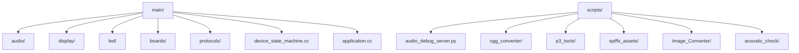
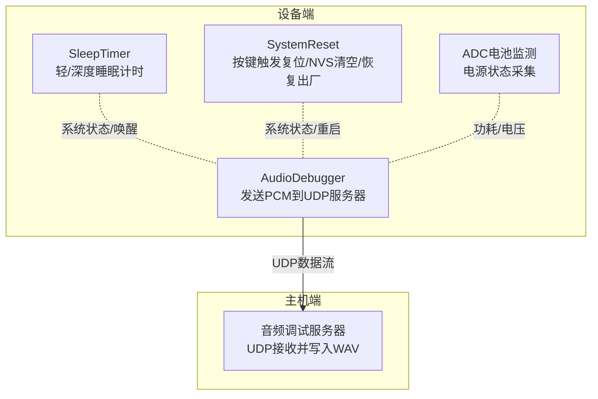
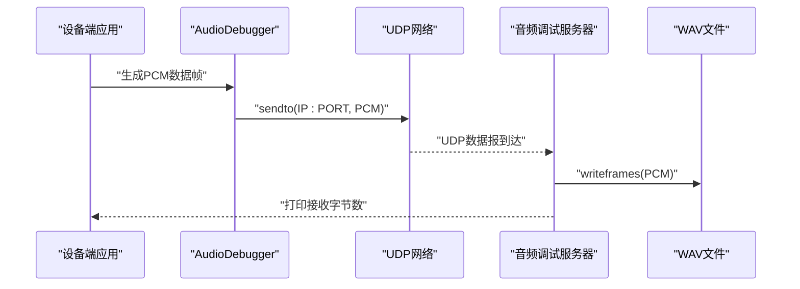
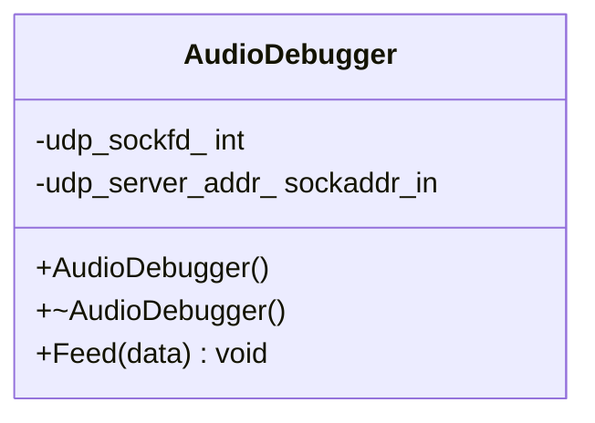
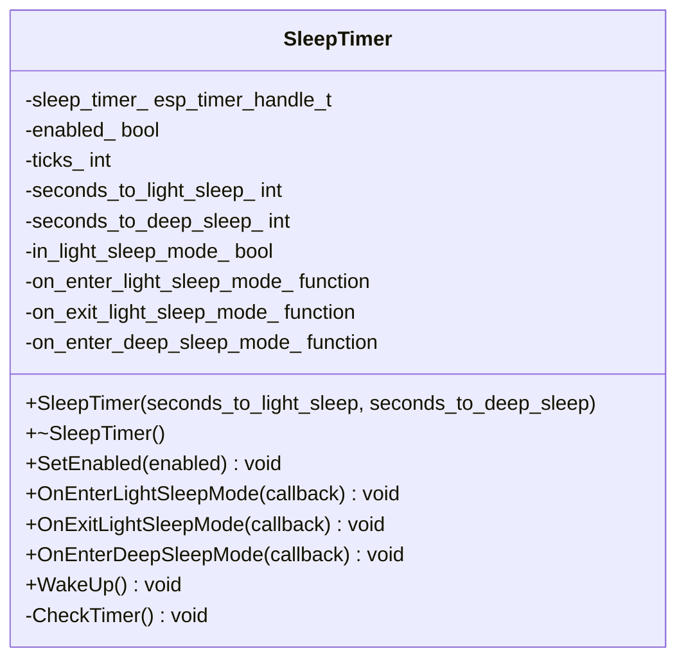
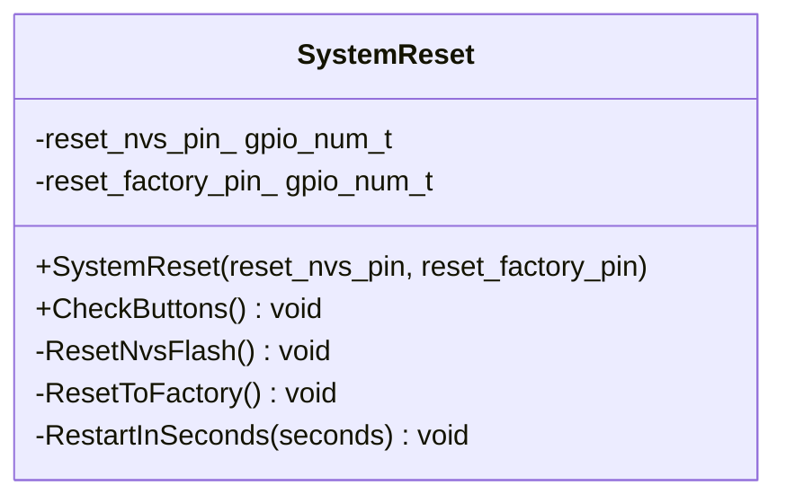
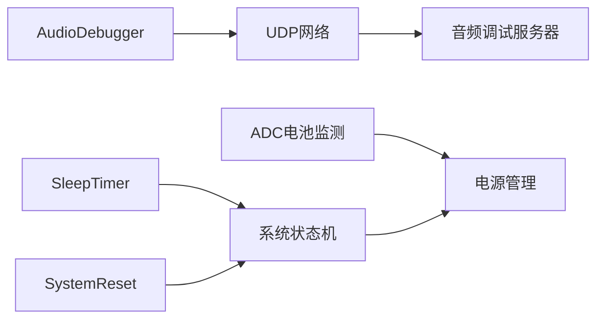

# 硬件调试与测试

<cite>
**本文引用的文件**
- [README.md](file://README.md)
- [audio_debug_server.py](file://scripts/audio_debug_server.py)
- [audio_debugger.h](file://main/audio/processors/audio_debugger.h)
- [audio_debugger.cc](file://main/audio/processors/audio_debugger.cc)
- [sleep_timer.h](file://main/boards/common/sleep_timer.h)
- [system_reset.h](file://main/boards/common/system_reset.h)
- [adc_battery_monitor.h](file://main/boards/common/adc_battery_monitor.h)
</cite>

## 目录
1. [引言](#引言)
2. [项目结构](#项目结构)
3. [核心组件](#核心组件)
4. [架构总览](#架构总览)
5. [详细组件分析](#详细组件分析)
6. [依赖关系分析](#依赖关系分析)
7. [性能考虑](#性能考虑)
8. [故障排查指南](#故障排查指南)
9. [结论](#结论)
10. [附录](#附录)

## 引言
本指南面向硬件工程师与测试人员，围绕 XiaoZhi ESP32 项目的硬件调试与测试展开，覆盖以下主题：
- 调试工具与方法：串口调试、逻辑分析仪、JTAG（若硬件支持）等
- 关键功能测试：系统复位机制、睡眠定时器、电源管理
- 音频调试：音频调试服务器使用、音频质量测试、噪声分析、延迟测量
- 硬件性能测试：功耗测试、温度监测、稳定性验证
- 常见问题诊断与排除：网络连接、音频异常、显示故障
- 最佳实践与自动化测试方案

## 项目结构
本项目采用模块化组织方式，主程序位于 main 目录，包含音频、显示、LED、协议栈、设备状态机等子模块；脚本目录 scripts 提供构建、转换与调试辅助工具；boards 子目录按硬件板型组织，包含各硬件平台的配置与驱动。

图示来源
- [README.md](file://README.md#L1-L174)

章节来源
- [README.md](file://README.md#L1-L174)

## 核心组件
- 音频调试链路：设备端通过 AudioDebugger 将 PCM 数据经 UDP 发送到主机侧的音频调试服务器，后者保存为 WAV 文件以便分析。
- 睡眠定时器：基于 ESP-IDF 定时器实现轻度睡眠与深度睡眠计时，支持回调注册与唤醒控制。
- 系统复位：通过专用按键组合触发 NVS 清空或恢复出厂设置，并可延时重启。
- 电源管理：ADC 电池监测与多款硬件平台的电源管理组件，用于功耗与供电状态监控。

章节来源
- [audio_debugger.h](file://main/audio/processors/audio_debugger.h#L1-L22)
- [audio_debugger.cc](file://main/audio/processors/audio_debugger.cc#L1-L68)
- [audio_debug_server.py](file://scripts/audio_debug_server.py#L1-L55)
- [sleep_timer.h](file://main/boards/common/sleep_timer.h#L1-L33)
- [system_reset.h](file://main/boards/common/system_reset.h#L1-L22)
- [adc_battery_monitor.h](file://main/boards/common/adc_battery_monitor.h)

## 架构总览
下图展示了音频调试链路在设备端与主机端的交互关系，以及与系统复位、睡眠定时器、电源管理的关系。

图示来源
- [audio_debugger.cc](file://main/audio/processors/audio_debugger.cc#L1-L68)
- [audio_debug_server.py](file://scripts/audio_debug_server.py#L1-L55)
- [sleep_timer.h](file://main/boards/common/sleep_timer.h#L1-L33)
- [system_reset.h](file://main/boards/common/system_reset.h#L1-L22)
- [adc_battery_monitor.h](file://main/boards/common/adc_battery_monitor.h)

## 详细组件分析

### 音频调试服务器（主机侧）
- 功能概述：启动本地 UDP 服务，绑定端口，接收来自设备端的 PCM 数据帧，保存为 WAV 文件，便于后续音频质量、噪声与延迟分析。
- 使用要点：
  - 指定采样率与声道数参数，确保与设备端一致。
  - 在设备端正确配置 UDP 服务器地址与端口。
  - 接收过程中注意缓冲区大小与丢包处理策略。

图示来源
- [audio_debugger.cc](file://main/audio/processors/audio_debugger.cc#L54-L66)
- [audio_debug_server.py](file://scripts/audio_debug_server.py#L11-L43)

章节来源
- [audio_debug_server.py](file://scripts/audio_debug_server.py#L1-L55)

### 设备端音频调试组件（AudioDebugger）
- 功能概述：在启用编译选项时，初始化 UDP 套接字，解析服务器地址（IP:PORT），并将 PCM 数据以 UDP 方式发送至主机。
- 关键点：
  - 地址格式必须为“IP:PORT”，否则会记录警告并关闭套接字。
  - 发送失败会记录错误码，便于定位网络或地址配置问题。
  - 建议在开发阶段开启日志，便于观察发送统计与错误信息。

图示来源
- [audio_debugger.h](file://main/audio/processors/audio_debugger.h#L10-L20)
- [audio_debugger.cc](file://main/audio/processors/audio_debugger.cc#L16-L52)

章节来源
- [audio_debugger.h](file://main/audio/processors/audio_debugger.h#L1-L22)
- [audio_debugger.cc](file://main/audio/processors/audio_debugger.cc#L1-L68)

### 睡眠定时器（SleepTimer）
- 功能概述：提供轻度睡眠与深度睡眠的定时能力，支持启用/禁用、进入/退出回调注册、手动唤醒。
- 关键点：
  - 计时基于 ESP-IDF 定时器，tick 数与目标秒数决定唤醒时机。
  - 回调函数可用于在进入/退出睡眠前进行外设关断或唤醒后初始化。
  - 可通过 WakeUp 主动唤醒，避免长时间休眠。

图示来源
- [sleep_timer.h](file://main/boards/common/sleep_timer.h#L8-L32)

章节来源
- [sleep_timer.h](file://main/boards/common/sleep_timer.h#L1-L33)

### 系统复位（SystemReset）
- 功能概述：通过按键检测触发不同复位动作：清空 NVS、恢复出厂设置、延时重启。
- 关键点：
  - 复位逻辑需在按键组合满足条件时执行，避免误触。
  - 建议在 UI 上提示按键操作步骤，提升可发现性。
  - 延时重启可用于在 OTA 或配置变更后安全重启。

图示来源
- [system_reset.h](file://main/boards/common/system_reset.h#L6-L18)

章节来源
- [system_reset.h](file://main/boards/common/system_reset.h#L1-L22)

### 电源管理与电池监测（ADC）
- 功能概述：通过 ADC 采集电池电压，结合硬件平台的电源管理组件，实现低电量告警与节能策略。
- 关键点：
  - 采样频率与滤波策略影响精度与响应速度。
  - 不同硬件平台的分压比与参考电压需正确配置。
  - 建议在固件中集成阈值判断与事件上报。

章节来源
- [adc_battery_monitor.h](file://main/boards/common/adc_battery_monitor.h)

## 依赖关系分析
- 音频调试链路依赖：
  - 设备端：AudioDebugger 依赖 ESP-IDF 网络与日志组件，受编译选项控制。
  - 主机端：音频调试服务器依赖 Python socket 与 wave 模块。
- 睡眠定时器与系统复位：
  - 两者均依赖 ESP-IDF 的定时器与 GPIO 控制，建议在设备状态机中统一调度。
- 电源管理：
  - 与显示、音频、无线模块的电源域协同，避免同时高负载导致电压跌落。

图示来源
- [audio_debugger.cc](file://main/audio/processors/audio_debugger.cc#L16-L52)
- [audio_debug_server.py](file://scripts/audio_debug_server.py#L11-L43)
- [sleep_timer.h](file://main/boards/common/sleep_timer.h#L8-L32)
- [system_reset.h](file://main/boards/common/system_reset.h#L6-L18)
- [adc_battery_monitor.h](file://main/boards/common/adc_battery_monitor.h)

## 性能考虑
- 音频链路：
  - 采样率与声道数直接影响带宽占用，建议在稳定前提下逐步提高以评估网络与存储压力。
  - UDP 无重传机制，需关注丢包与抖动对音频质量的影响。
- 睡眠与唤醒：
  - 合理设置轻/深度睡眠阈值，减少不必要的唤醒次数。
  - 在进入深度睡眠前关闭非必要外设，降低静态电流。
- 电源管理：
  - 优化峰值电流路径，避免瞬态电压过低导致复位或功能异常。
  - 结合温度传感器（若有）与热设计，防止过热降频。

## 故障排查指南
- 网络连接问题（音频调试无法接收）：
  - 检查设备端 UDP 地址格式是否为“IP:PORT”。
  - 确认防火墙与路由器未阻断端口。
  - 使用 ping/arp 工具验证连通性。
- 音频异常（失真、噪声、无声）：
  - 对比采样率与声道数参数，确保两端一致。
  - 使用音频调试服务器录制 WAV，借助频谱分析与 SNR 测试定位噪声源。
  - 检查麦克风/扬声器供电与走线，避免共模干扰。
- 显示故障（黑屏、花屏、闪烁）：
  - 检查背光与电源域供电。
  - 确认 SPI/I2C 时序与速率设置。
  - 在低功耗模式下验证显示刷新策略。
- 复位与重启异常：
  - 确认按键电路与上拉/下拉电阻。
  - 检查复位序列是否被其他任务打断。
- 功耗异常：
  - 使用外部电流表实测各模式电流，核对软件配置与硬件设计。
  - 关注热点器件（DC-DC、LDO、射频）的效率与温升。

## 结论
本指南从调试工具、关键功能测试、音频链路、性能与故障排查等方面提供了系统化的实践方法。建议在开发早期即建立标准化的调试流程与自动化测试方案，结合硬件平台特性持续优化，以提升产品稳定性与交付质量。

## 附录
- 建议的自动化测试清单：
  - 音频链路：连续录音 N 分钟，统计丢包率与误码率，计算平均延迟。
  - 睡眠/唤醒：重复进入/退出轻/深度睡眠，统计唤醒时间与抖动。
  - 电源管理：满载与空闲模式下分别记录电流、电压与温度。
  - 稳定性：长时间运行（7×24 小时）记录异常重启与错误日志。
- 参考文件：
  - [README.md](file://README.md#L1-L174)
  - [audio_debug_server.py](file://scripts/audio_debug_server.py#L1-L55)
  - [audio_debugger.h](file://main/audio/processors/audio_debugger.h#L1-L22)
  - [audio_debugger.cc](file://main/audio/processors/audio_debugger.cc#L1-L68)
  - [sleep_timer.h](file://main/boards/common/sleep_timer.h#L1-L33)
  - [system_reset.h](file://main/boards/common/system_reset.h#L1-L22)
  - [adc_battery_monitor.h](file://main/boards/common/adc_battery_monitor.h)