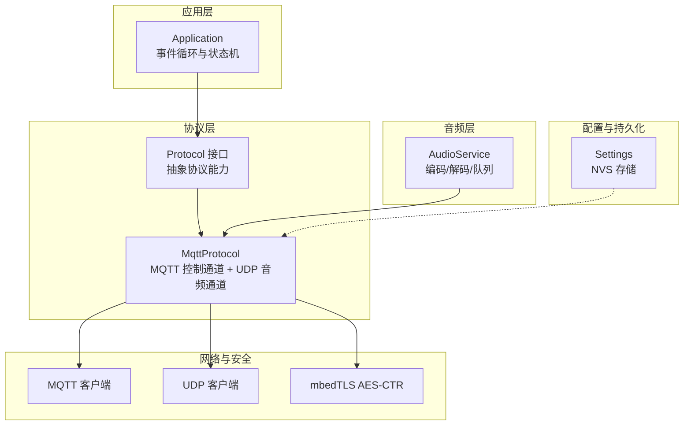
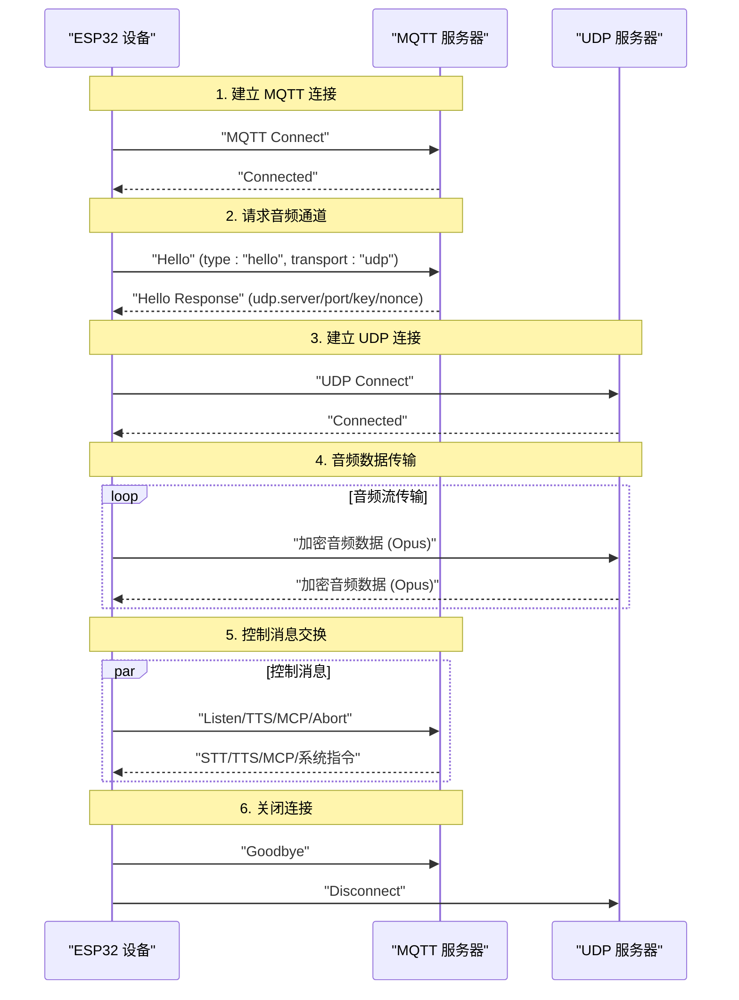
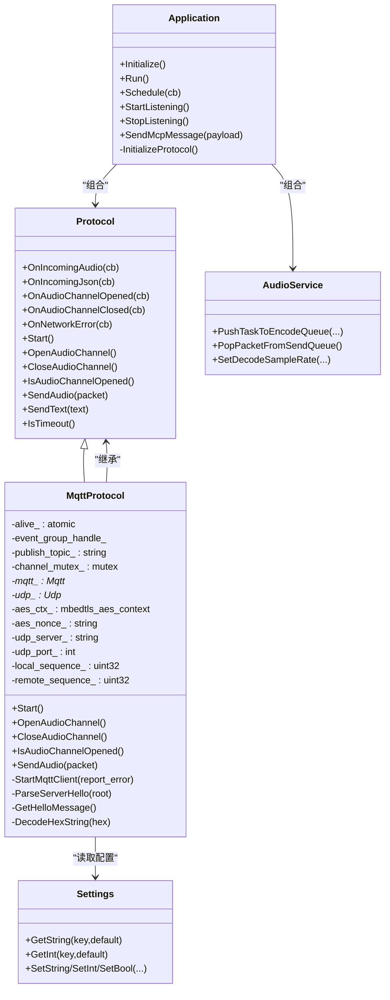

# MQTT+UDP协议

<cite>
**本文引用的文件**
- [docs/mqtt-udp.md](file://docs/mqtt-udp.md)
- [main/protocols/mqtt_protocol.h](file://main/protocols/mqtt_protocol.h)
- [main/protocols/mqtt_protocol.cc](file://main/protocols/mqtt_protocol.cc)
- [main/protocols/protocol.h](file://main/protocols/protocol.h)
- [main/protocols/protocol.cc](file://main/protocols/protocol.cc)
- [main/application.h](file://main/application.h)
- [main/application.cc](file://main/application.cc)
- [main/settings.h](file://main/settings.h)
- [main/settings.cc](file://main/settings.cc)
- [main/audio/audio_service.cc](file://main/audio/audio_service.cc)
</cite>

## 目录
1. [简介](#简介)
2. [项目结构](#项目结构)
3. [核心组件](#核心组件)
4. [架构总览](#架构总览)
5. [详细组件分析](#详细组件分析)
6. [依赖关系分析](#依赖关系分析)
7. [性能考量](#性能考量)
8. [故障排查指南](#故障排查指南)
9. [结论](#结论)
10. [附录](#附录)

## 简介
本文件针对 XiaoZhi ESP32 项目中的 MQTT+UDP 混合通信协议进行深入技术说明。该协议将控制消息通过 MQTT 传输，将实时音频数据通过 UDP 传输，并在 UDP 通道上采用 AES-CTR 加密与序列号管理，以兼顾实时性与安全性。文档覆盖协议设计原理、架构优势、嵌入式环境下的简化实现、消息封装机制、配置参数、可靠性保障、网络适应性、与传统协议的差异与迁移路径，以及性能测试与优化建议。

## 项目结构
围绕 MQTT+UDP 协议的关键目录与文件如下：
- 协议接口与实现：main/protocols
- 应用层编排：main/application.*
- 设置与存储：main/settings.*
- 音频服务：main/audio/audio_service.cc
- 协议文档：docs/mqtt-udp.md

图表来源
- [main/application.cc](file://main/application.cc#L473-L610)
- [main/protocols/protocol.h](file://main/protocols/protocol.h#L44-L95)
- [main/protocols/mqtt_protocol.h](file://main/protocols/mqtt_protocol.h#L26-L62)
- [main/protocols/mqtt_protocol.cc](file://main/protocols/mqtt_protocol.cc#L59-L152)
- [main/settings.cc](file://main/settings.cc#L8-L109)
- [main/audio/audio_service.cc](file://main/audio/audio_service.cc#L67-L84)

章节来源
- [main/application.cc](file://main/application.cc#L473-L610)
- [main/protocols/protocol.h](file://main/protocols/protocol.h#L44-L95)
- [main/protocols/mqtt_protocol.h](file://main/protocols/mqtt_protocol.h#L26-L62)
- [main/protocols/mqtt_protocol.cc](file://main/protocols/mqtt_protocol.cc#L59-L152)
- [main/settings.cc](file://main/settings.cc#L8-L109)
- [main/audio/audio_service.cc](file://main/audio/audio_service.cc#L67-L84)

## 核心组件
- 协议抽象层（Protocol）：定义统一的协议接口，包括音频回调、JSON 回调、通道打开/关闭、文本发送等；并提供超时检测与错误上报。
- MQTT 协议实现（MqttProtocol）：负责 MQTT 连接、Hello 交换、音频通道打开与关闭、音频数据的 AES-CTR 加密与 UDP 发送、接收端解密与序列号校验。
- 应用层（Application）：驱动协议初始化、事件调度、状态机切换、UI 更新与错误提示。
- 音频服务（AudioService）：负责音频采集、编码（Opus）、解码、播放与队列管理。
- 设置（Settings）：基于 NVS 的键值存储，读取 MQTT 服务器地址、端口、鉴权、心跳等配置。

章节来源
- [main/protocols/protocol.h](file://main/protocols/protocol.h#L44-L95)
- [main/protocols/protocol.cc](file://main/protocols/protocol.cc#L35-L90)
- [main/protocols/mqtt_protocol.h](file://main/protocols/mqtt_protocol.h#L26-L62)
- [main/protocols/mqtt_protocol.cc](file://main/protocols/mqtt_protocol.cc#L59-L152)
- [main/application.cc](file://main/application.cc#L473-L610)
- [main/audio/audio_service.cc](file://main/audio/audio_service.cc#L67-L84)
- [main/settings.cc](file://main/settings.cc#L8-L109)

## 架构总览
MQTT+UDP 混合协议的总体交互流程如下：

图表来源
- [docs/mqtt-udp.md](file://docs/mqtt-udp.md#L24-L57)
- [main/protocols/mqtt_protocol.cc](file://main/protocols/mqtt_protocol.cc#L215-L295)
- [main/protocols/mqtt_protocol.cc](file://main/protocols/mqtt_protocol.cc#L100-L132)

章节来源
- [docs/mqtt-udp.md](file://docs/mqtt-udp.md#L24-L57)
- [main/protocols/mqtt_protocol.cc](file://main/protocols/mqtt_protocol.cc#L215-L295)
- [main/protocols/mqtt_protocol.cc](file://main/protocols/mqtt_protocol.cc#L100-L132)

## 详细组件分析

### 协议抽象层（Protocol）
- 职责：统一协议行为，包括音频回调、JSON 回调、通道生命周期管理、文本消息发送、错误上报与超时检测。
- 关键点：
  - 统一的音频包结构（包含采样率、帧时长、时间戳、负载）。
  - 提供超时检测（默认 120 秒），用于判定通道可用性。
  - 提供多种 JSON 控制消息的构造方法（开始/停止监听、唤醒词检测、中止说话、MCP 消息等）。

章节来源
- [main/protocols/protocol.h](file://main/protocols/protocol.h#L44-L95)
- [main/protocols/protocol.cc](file://main/protocols/protocol.cc#L35-L90)

### MQTT 协议实现（MqttProtocol）
- 连接与心跳：从设置中读取 endpoint、client_id、username、password、keepalive、publish_topic，设置 MQTT 心跳间隔，默认 240 秒；断线后定时器触发自动重连。
- Hello 交换：发送包含版本、传输方式、特性与音频参数的 JSON；解析服务器响应，提取会话 ID、服务器音频参数与 UDP 连接信息及密钥/随机数，初始化 AES-CTR 上下文。
- 音频通道管理：创建 UDP 客户端，注册接收回调，按包格式解密并校验序列号，更新远端序列号与最后接收时间；发送侧按包格式加密并通过 UDP 发送。
- 文本消息：通过已配置的主题发布 JSON 控制消息（如 listen、abort、mcp、goodbye）。
- 状态与错误：提供 IsAudioChannelOpened 判断通道可用性；通过 Protocol 基类的超时检测与错误上报机制实现。

章节来源
- [main/protocols/mqtt_protocol.h](file://main/protocols/mqtt_protocol.h#L26-L62)
- [main/protocols/mqtt_protocol.cc](file://main/protocols/mqtt_protocol.cc#L59-L152)
- [main/protocols/mqtt_protocol.cc](file://main/protocols/mqtt_protocol.cc#L215-L295)
- [main/protocols/mqtt_protocol.cc](file://main/protocols/mqtt_protocol.cc#L166-L190)
- [main/protocols/mqtt_protocol.cc](file://main/protocols/mqtt_protocol.cc#L322-L366)
- [main/protocols/mqtt_protocol.cc](file://main/protocols/mqtt_protocol.cc#L387-L390)

### 应用层（Application）
- 初始化：启动显示、音频服务、网络事件回调；异步启动网络。
- 事件循环：处理网络连接/断开、状态变化、唤醒词检测、VAD 变化、定时器等事件；在合适的时机打开/关闭音频通道。
- 协议初始化：根据 OTA 配置选择 MQTT 或 WebSocket 协议实例，注册回调（连接、错误、音频、JSON、通道开启/关闭），并启动协议。
- 音频发送：当发送队列有可用包时，调用协议的 SendAudio 将编码后的音频包通过 UDP 发送。

章节来源
- [main/application.cc](file://main/application.cc#L61-L163)
- [main/application.cc](file://main/application.cc#L165-L259)
- [main/application.cc](file://main/application.cc#L261-L297)
- [main/application.cc](file://main/application.cc#L473-L610)
- [main/application.cc](file://main/application.cc#L220-L226)

### 音频服务（AudioService）
- 编码：使用 Opus 在 16kHz 单声道、60ms 帧时长下进行编码，生成音频包。
- 解码：根据服务器采样率与帧时长动态配置解码器，必要时进行重采样，再交给播放队列。
- 队列：维护发送队列、测试队列与播放队列，提供回调通知发送队列可用。

章节来源
- [main/audio/audio_service.cc](file://main/audio/audio_service.cc#L67-L84)
- [main/audio/audio_service.cc](file://main/audio/audio_service.cc#L401-L442)
- [main/audio/audio_service.cc](file://main/audio/audio_service.cc#L448-L482)

### 设置（Settings）
- 基于 NVS 的键值存储，提供字符串、整型、布尔读写接口；用于读取 MQTT 服务器地址、端口、鉴权、心跳、发布主题等配置。

章节来源
- [main/settings.h](file://main/settings.h#L7-L26)
- [main/settings.cc](file://main/settings.cc#L8-L109)

### UDP 音频包格式与加密
- 包格式（加密前）：type(1B) + flags(1B) + payload_len(2B) + ssrc(4B) + timestamp(4B) + sequence(4B) + payload(可变)。
- 加密：AES-CTR，密钥与随机数由服务器通过 MQTT Hello 分发；随机数包含时间戳与序列号信息，确保计数器唯一性。
- 序列号：本地发送端单调递增，远端接收端验证连续性，拒绝旧序列号，容忍轻微跳跃并记录告警。

章节来源
- [docs/mqtt-udp.md](file://docs/mqtt-udp.md#L188-L223)
- [main/protocols/mqtt_protocol.cc](file://main/protocols/mqtt_protocol.cc#L243-L287)
- [main/protocols/mqtt_protocol.cc](file://main/protocols/mqtt_protocol.cc#L166-L190)
- [main/protocols/mqtt_protocol.cc](file://main/protocols/mqtt_protocol.cc#L322-L366)

### 状态管理
- 状态机：Disconnected → MqttConnecting → MqttConnected → RequestingChannel → ChannelOpened → UdpConnected → AudioStreaming。
- 可用性判断：通道需满足 UDP 已创建、未发生错误、未超时。

章节来源
- [docs/mqtt-udp.md](file://docs/mqtt-udp.md#L228-L256)
- [main/protocols/mqtt_protocol.cc](file://main/protocols/mqtt_protocol.cc#L387-L390)

## 依赖关系分析
- 协议层依赖网络抽象（MQTT/UDP 客户端）与加密库（mbedTLS）。
- 应用层依赖协议层与音频服务，负责事件调度与状态机。
- 音频服务依赖音频编解码器与重采样器。
- 设置模块为协议层提供配置参数。

图表来源
- [main/protocols/protocol.h](file://main/protocols/protocol.h#L44-L95)
- [main/protocols/mqtt_protocol.h](file://main/protocols/mqtt_protocol.h#L26-L62)
- [main/application.h](file://main/application.h#L42-L172)
- [main/settings.h](file://main/settings.h#L7-L26)

章节来源
- [main/protocols/protocol.h](file://main/protocols/protocol.h#L44-L95)
- [main/protocols/mqtt_protocol.h](file://main/protocols/mqtt_protocol.h#L26-L62)
- [main/application.h](file://main/application.h#L42-L172)
- [main/settings.h](file://main/settings.h#L7-L26)

## 性能考量
- 实时性：UDP 通道承载音频数据，避免 TCP 可能引入的握手与拥塞控制开销，适合低延迟语音交互。
- 加密与序列号：AES-CTR 提供轻量加密，结合序列号与时间戳防止重放与乱序。
- 并发与内存：使用互斥锁保护 UDP 连接，智能指针管理音频包，及时释放加密上下文。
- 超时与自愈：默认 120 秒超时检测，MQTT 断线自动重连，网络断开时关闭音频通道并清理资源。

章节来源
- [docs/mqtt-udp.md](file://docs/mqtt-udp.md#L323-L343)
- [main/protocols/protocol.cc](file://main/protocols/protocol.cc#L81-L90)
- [main/protocols/mqtt_protocol.cc](file://main/protocols/mqtt_protocol.cc#L166-L190)

## 故障排查指南
- MQTT 连接失败：检查 endpoint、client_id、username/password、keepalive 是否正确；关注断线回调与重连定时器。
- Hello 超时：确认服务器响应是否包含 udp.server/port/key/nonce；检查网络可达性与防火墙。
- UDP 解密失败：核对密钥与随机数长度与格式；检查 AES-CTR 初始化与计数器设置。
- 序列号异常：观察日志中“旧序列号”或“错误序列号”的告警；确认发送/接收两端时钟一致性。
- 超时断开：检查 last_incoming_time 与 IsTimeout 判定逻辑；排查网络抖动或服务器负载。

章节来源
- [main/protocols/mqtt_protocol.cc](file://main/protocols/mqtt_protocol.cc#L59-L152)
- [main/protocols/mqtt_protocol.cc](file://main/protocols/mqtt_protocol.cc#L215-L295)
- [main/protocols/mqtt_protocol.cc](file://main/protocols/mqtt_protocol.cc#L243-L287)
- [main/protocols/protocol.cc](file://main/protocols/protocol.cc#L81-L90)

## 结论
MQTT+UDP 混合协议通过“控制通道（MQTT）+数据通道（UDP）”的分离设计，在保证控制消息可靠交换的同时，利用 UDP 的低延迟与高带宽效率实现高质量的实时音频传输。配合 AES-CTR 加密与序列号管理，协议在嵌入式设备上实现了安全、稳定且具备自愈能力的音视频通信方案。对于 IoT 场景，该协议在实时性与复杂度之间取得平衡，适合对语音交互质量要求较高的设备。

## 附录

### 配置参数清单
- MQTT 配置（来自设置命名空间 "mqtt"）：
  - endpoint：MQTT 服务器地址与端口（支持 host:port）
  - client_id：客户端标识
  - username/password：认证凭据
  - keepalive：心跳间隔（秒，默认 240）
  - publish_topic：发布主题
- 音频参数（设备端 Hello 消息）：
  - format：opus
  - sample_rate：16000 Hz
  - channels：1（单声道）
  - frame_duration：60 ms

章节来源
- [main/protocols/mqtt_protocol.cc](file://main/protocols/mqtt_protocol.cc#L65-L71)
- [main/protocols/mqtt_protocol.cc](file://main/protocols/mqtt_protocol.cc#L297-L320)
- [docs/mqtt-udp.md](file://docs/mqtt-udp.md#L259-L277)

### 协议可靠性与安全机制
- 可靠性：
  - MQTT：断线自动重连（定时器触发），支持错误上报与清理流程。
  - UDP：序列号连续性检查与超时检测；服务器主动 goodbye 避免“乒乓”。
- 安全：
  - MQTT：支持 TLS/SSL（端口 8883）。
  - UDP：AES-CTR 加密，密钥与随机数通过 MQTT Hello 分发。
  - 防重放：序列号单调递增、拒绝旧包、时间戳校验。

章节来源
- [docs/mqtt-udp.md](file://docs/mqtt-udp.md#L280-L321)
- [main/protocols/mqtt_protocol.cc](file://main/protocols/mqtt_protocol.cc#L85-L98)
- [main/protocols/mqtt_protocol.cc](file://main/protocols/mqtt_protocol.cc#L257-L265)

### 与 WebSocket 协议的对比
- 控制通道：MQTT vs WebSocket
- 音频通道：UDP（加密）vs WebSocket（二进制）
- 实时性：高（UDP）vs 中等（WebSocket）
- 可靠性：中等（UDP）vs 高（WebSocket）
- 复杂度：高（MQTT+UDP）vs 低（WebSocket）
- 加密：AES-CTR vs TLS
- 防火墙友好度：低（UDP）vs 高（WebSocket）

章节来源
- [docs/mqtt-udp.md](file://docs/mqtt-udp.md#L346-L358)

### 迁移指南（从 WebSocket 到 MQTT+UDP）
- 评估网络环境：确保 UDP 端口可达、防火墙放通、必要时考虑 NAT 穿越。
- 服务器改造：部署 MQTT Broker 与 UDP 服务器，实现 Hello 交换与密钥下发。
- 客户端适配：替换协议实现为 MqttProtocol，保留 JSON 控制消息语义，接入 AES-CTR 加密与序列号管理。
- 测试与监控：关注连接成功率、音频延迟、丢包率与解密失败率。

章节来源
- [docs/mqtt-udp.md](file://docs/mqtt-udp.md#L360-L381)
- [main/application.cc](file://main/application.cc#L480-L487)

### 性能测试与优化建议
- 测试方法：
  - 连接成功率与平均耗时（MQTT 连接、Hello 交换、UDP 连接）。
  - 音频传输延迟（端到端时延与抖动）。
  - 数据包丢失率与重传次数。
  - 解密失败率与 CPU 占用。
- 优化建议：
  - UDP 连接复用与数据包大小优化。
  - 合理设置 keepalive 与超时阈值。
  - 在网络不稳定时适当降低帧时长或采样率以提升鲁棒性。
  - 使用互斥锁保护共享资源，避免竞态与死锁。

章节来源
- [docs/mqtt-udp.md](file://docs/mqtt-udp.md#L374-L380)
- [docs/mqtt-udp.md](file://docs/mqtt-udp.md#L323-L343)