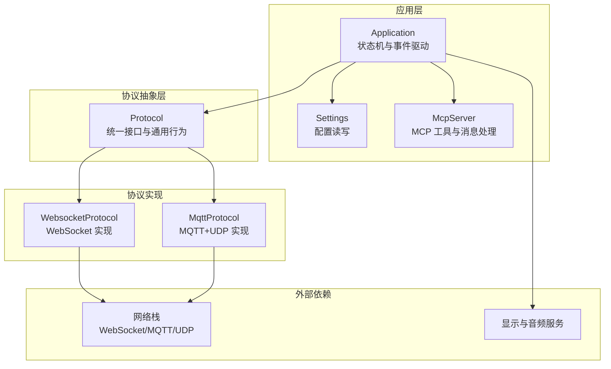
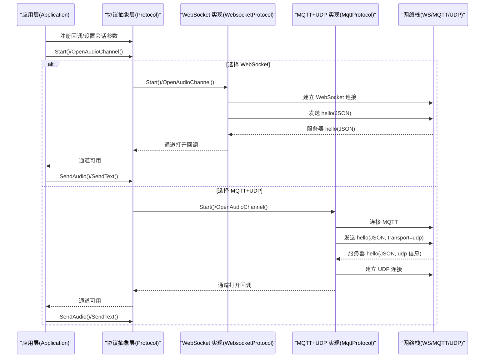
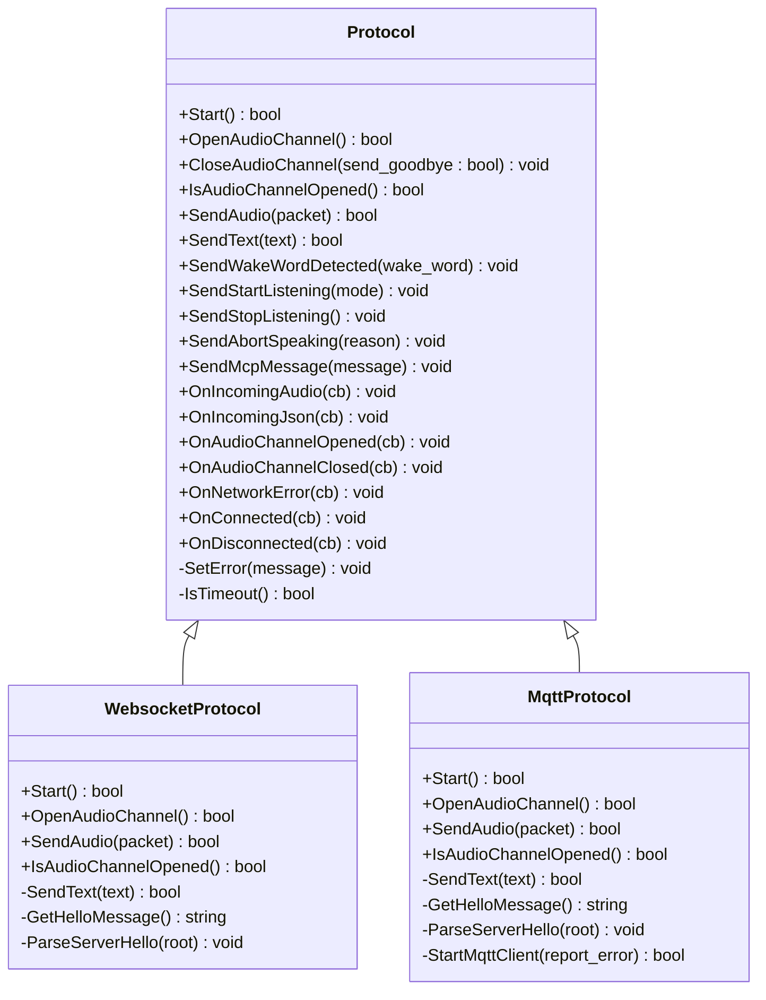
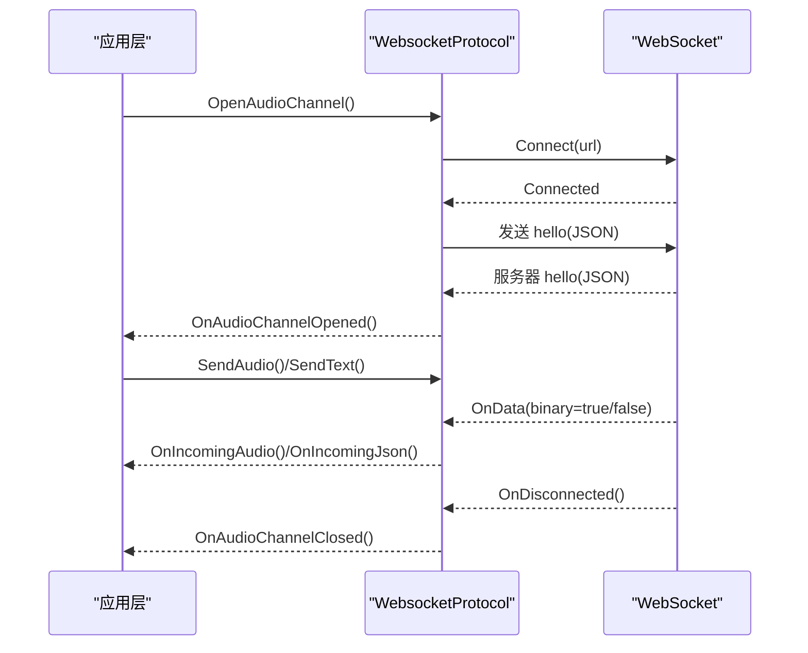
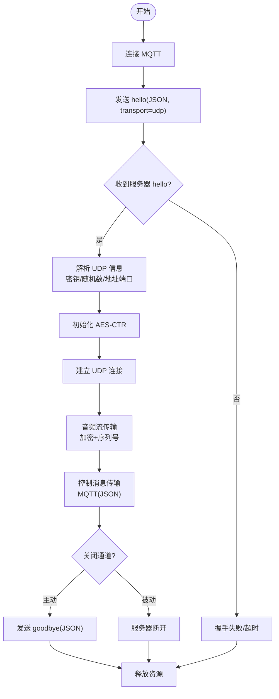
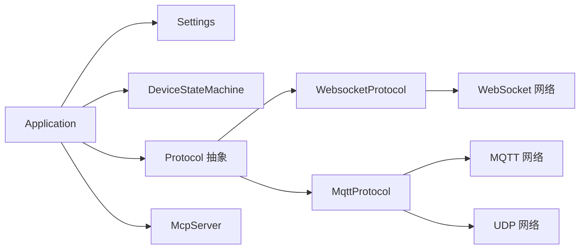

# 通信协议

<cite>
**本文引用的文件**
- [main/protocols/protocol.h](file://main/protocols/protocol.h)
- [main/protocols/protocol.cc](file://main/protocols/protocol.cc)
- [main/protocols/websocket_protocol.h](file://main/protocols/websocket_protocol.h)
- [main/protocols/websocket_protocol.cc](file://main/protocols/websocket_protocol.cc)
- [main/protocols/mqtt_protocol.h](file://main/protocols/mqtt_protocol.h)
- [main/protocols/mqtt_protocol.cc](file://main/protocols/mqtt_protocol.cc)
- [docs/websocket.md](file://docs/websocket.md)
- [docs/mqtt-udp.md](file://docs/mqtt-udp.md)
- [docs/mcp-protocol.md](file://docs/mcp-protocol.md)
- [main/application.h](file://main/application.h)
- [main/application.cc](file://main/application.cc)
- [main/settings.h](file://main/settings.h)
- [main/device_state.h](file://main/device_state.h)
- [main/mcp_server.h](file://main/mcp_server.h)
</cite>

## 目录
1. [简介](#简介)
2. [项目结构](#项目结构)
3. [核心组件](#核心组件)
4. [架构总览](#架构总览)
5. [详细组件分析](#详细组件分析)
6. [依赖关系分析](#依赖关系分析)
7. [性能考量](#性能考量)
8. [故障排查指南](#故障排查指南)
9. [结论](#结论)
10. [附录](#附录)

## 简介
本文件为 XiaoZhi ESP32 项目的通信协议技术文档，聚焦协议抽象层设计、WebSocket 协议实现、MQTT+UDP 混合协议、消息格式与事件处理、安全机制、错误处理与重连策略、调试与监控方法，以及 API 接口说明。目标读者为网络开发者与系统集成人员。

## 项目结构
- 协议抽象层位于 main/protocols，定义统一的协议接口与通用行为（如会话管理、超时检测、回调注册等）
- WebSocket 协议实现位于 main/protocols/websocket_protocol.*
- MQTT+UDP 协议实现位于 main/protocols/mqtt_protocol.*
- 协议使用与状态机位于 main/application.*
- 配置读写位于 main/settings.h
- MCP 协议承载于两类协议之上，文档位于 docs/mcp-protocol.md
- WebSocket 与 MQTT+UDP 的协议细节与流程说明位于 docs/websocket.md 与 docs/mqtt-udp.md

图表来源
- [main/protocols/protocol.h](file://main/protocols/protocol.h#L44-L95)
- [main/protocols/websocket_protocol.h](file://main/protocols/websocket_protocol.h#L13-L32)
- [main/protocols/mqtt_protocol.h](file://main/protocols/mqtt_protocol.h#L26-L62)
- [main/application.h](file://main/application.h#L42-L172)
- [main/settings.h](file://main/settings.h#L7-L26)
- [main/mcp_server.h](file://main/mcp_server.h#L314-L342)

章节来源
- [main/protocols/protocol.h](file://main/protocols/protocol.h#L1-L99)
- [main/protocols/websocket_protocol.h](file://main/protocols/websocket_protocol.h#L1-L35)
- [main/protocols/mqtt_protocol.h](file://main/protocols/mqtt_protocol.h#L1-L66)
- [main/application.h](file://main/application.h#L1-L190)
- [main/settings.h](file://main/settings.h#L1-L29)
- [main/mcp_server.h](file://main/mcp_server.h#L1-L345)

## 核心组件
- 协议抽象层 Protocol
  - 统一接口：Start、OpenAudioChannel、CloseAudioChannel、IsAudioChannelOpened、SendAudio、SendWakeWordDetected、SendStartListening、SendStopListening、SendAbortSpeaking、SendMcpMessage
  - 通用回调：OnIncomingAudio、OnIncomingJson、OnAudioChannelOpened、OnAudioChannelClosed、OnNetworkError、OnConnected、OnDisconnected
  - 通用能力：会话 ID 管理、服务器采样率与帧时长、超时检测、错误上报
- WebSocket 协议 WebsocketProtocol
  - 通过 WebSocket 建立连接，握手阶段发送 hello，支持二进制协议版本（v1/v2/v3）
  - 二进制音频帧封装与解析，文本帧 JSON 消息解析
  - 事件组同步握手完成，超时与断连处理
- MQTT+UDP 协议 MqttProtocol
  - 通过 MQTT 交换控制消息与会话协商，随后建立 UDP 音频通道
  - 使用 AES-CTR 对音频数据进行加密，带有序列号与时间戳
  - 周期性重连与优雅关闭，避免 ping-pong goodbye

章节来源
- [main/protocols/protocol.h](file://main/protocols/protocol.h#L44-L95)
- [main/protocols/protocol.cc](file://main/protocols/protocol.cc#L1-L91)
- [main/protocols/websocket_protocol.h](file://main/protocols/websocket_protocol.h#L13-L32)
- [main/protocols/websocket_protocol.cc](file://main/protocols/websocket_protocol.cc#L23-L255)
- [main/protocols/mqtt_protocol.h](file://main/protocols/mqtt_protocol.h#L26-L62)
- [main/protocols/mqtt_protocol.cc](file://main/protocols/mqtt_protocol.cc#L55-L390)

## 架构总览
协议抽象层向上提供统一接口，向下分别对接 WebSocket 与 MQTT+UDP 两种传输方案。应用层通过事件驱动的状态机协调网络、音频与 UI，MCP 协议以 JSON-RPC 形式承载于任一传输之上。

图表来源
- [main/application.h](file://main/application.h#L123-L172)
- [main/protocols/protocol.h](file://main/protocols/protocol.h#L66-L76)
- [main/protocols/websocket_protocol.cc](file://main/protocols/websocket_protocol.cc#L83-L201)
- [main/protocols/mqtt_protocol.cc](file://main/protocols/mqtt_protocol.cc#L215-L295)

## 详细组件分析

### 协议抽象层 Protocol
- 设计要点
  - 将“音频通道”“文本消息”“事件回调”“会话管理”抽象为统一接口，屏蔽底层差异
  - 通过回调函数解耦应用层与协议实现，便于替换与扩展
  - 提供超时检测与错误上报，保障健壮性
- 关键数据结构
  - AudioStreamPacket：音频帧封装（采样率、帧时长、时间戳、负载）
  - BinaryProtocol2/3：二进制协议头部与负载
- 关键方法
  - Start/OpenAudioChannel/CloseAudioChannel/IsAudioChannelOpened：通道生命周期管理
  - SendAudio/SendText：发送音频/文本
  - SendWakeWordDetected/SendStartListening/SendStopListening/SendAbortSpeaking/SendMcpMessage：业务消息封装

图表来源
- [main/protocols/protocol.h](file://main/protocols/protocol.h#L44-L95)
- [main/protocols/websocket_protocol.h](file://main/protocols/websocket_protocol.h#L13-L32)
- [main/protocols/mqtt_protocol.h](file://main/protocols/mqtt_protocol.h#L26-L62)

章节来源
- [main/protocols/protocol.h](file://main/protocols/protocol.h#L1-L99)
- [main/protocols/protocol.cc](file://main/protocols/protocol.cc#L1-L91)

### WebSocket 协议实现
- 连接建立
  - 仅在需要音频会话时建立连接
  - 读取配置（URL、Token、协议版本），设置请求头（Authorization、Protocol-Version、Device-Id、Client-Id）
  - 连接成功后发送 hello，等待服务器 hello，握手完成后回调通道打开
- 消息格式
  - 文本帧：JSON，包含 type、features、transport、audio_params 等
  - 二进制帧：支持三种协议版本（v1 直传 Opus，v2 带时间戳，v3 简化头）
- 事件处理
  - OnData(binary=true/false) 分支处理音频帧与 JSON
  - OnDisconnected 触发通道关闭回调
- 超时与错误
  - 握手等待超时触发错误回调
  - 发送失败记录错误并上报

图表来源
- [main/protocols/websocket_protocol.cc](file://main/protocols/websocket_protocol.cc#L83-L201)
- [docs/websocket.md](file://docs/websocket.md#L1-L496)

章节来源
- [main/protocols/websocket_protocol.h](file://main/protocols/websocket_protocol.h#L1-L35)
- [main/protocols/websocket_protocol.cc](file://main/protocols/websocket_protocol.cc#L1-L255)
- [docs/websocket.md](file://docs/websocket.md#L1-L496)

### MQTT+UDP 混合协议
- 整体流程
  - 先通过 MQTT 建立控制通道，发送 hello(JSON, transport=udp)
  - 服务器返回包含 UDP 服务器地址、端口、密钥与随机数
  - 建立 UDP 连接，使用 AES-CTR 加密音频数据，带有序列号与时间戳
  - 控制消息通过 MQTT 传输（STT/TTS/MCP/系统命令等）
- 音频通道
  - 加密包结构含 type、flags、payload_len、ssrc、timestamp、sequence、payload
  - 发送端维护本地序列号，接收端校验连续性并丢弃过期包
- 重连与关闭
  - MQTT 断线自动重连定时器
  - 主动关闭时发送 goodbye，避免 ping-pong

图表来源
- [docs/mqtt-udp.md](file://docs/mqtt-udp.md#L24-L57)
- [main/protocols/mqtt_protocol.cc](file://main/protocols/mqtt_protocol.cc#L215-L390)

章节来源
- [main/protocols/mqtt_protocol.h](file://main/protocols/mqtt_protocol.h#L1-L66)
- [main/protocols/mqtt_protocol.cc](file://main/protocols/mqtt_protocol.cc#L1-L390)
- [docs/mqtt-udp.md](file://docs/mqtt-udp.md#L1-L393)

### MCP 协议承载
- MCP 消息封装在基础协议（WebSocket/MQTT）的消息体中，内部遵循 JSON-RPC 2.0
- 典型流程：initialize → tools/list → tools/call，支持通知（notifications/*）
- 设备侧通过 McpServer 维护工具清单与调用回调，返回结构化结果

章节来源
- [docs/mcp-protocol.md](file://docs/mcp-protocol.md#L1-L270)
- [main/mcp_server.h](file://main/mcp_server.h#L314-L342)

## 依赖关系分析
- 协议实现依赖网络抽象（WebSocket/MQTT/UDP），通过 Board 获取网络实例
- 应用层通过 Settings 读取协议配置（URL、Token、MQTT 端点、发布主题等）
- 状态机 DeviceStateMachine 驱动协议通道的开启与关闭
- MCP 服务在应用初始化时注册通用工具与用户专用工具

图表来源
- [main/application.h](file://main/application.h#L123-L172)
- [main/protocols/websocket_protocol.h](file://main/protocols/websocket_protocol.h#L13-L32)
- [main/protocols/mqtt_protocol.h](file://main/protocols/mqtt_protocol.h#L26-L62)
- [main/settings.h](file://main/settings.h#L7-L26)
- [main/mcp_server.h](file://main/mcp_server.h#L314-L342)

章节来源
- [main/application.h](file://main/application.h#L1-L190)
- [main/protocols/websocket_protocol.h](file://main/protocols/websocket_protocol.h#L1-L35)
- [main/protocols/mqtt_protocol.h](file://main/protocols/mqtt_protocol.h#L1-L66)
- [main/settings.h](file://main/settings.h#L1-L29)
- [main/mcp_server.h](file://main/mcp_server.h#L1-L345)

## 性能考量
- WebSocket
  - 适合中小规模、对可靠性要求高、防火墙友好的场景
  - 二进制协议版本可减少元数据开销（v3）
- MQTT+UDP
  - 通过分离控制与数据通道提升实时性，UDP 降低传输时延
  - AES-CTR 加密与序列号保证安全性与顺序性
  - 需考虑 NAT 与防火墙穿透、UDP 可达性与丢包处理
- 资源管理
  - MQTT 通道使用互斥锁保护 UDP 连接
  - 定时器与事件组协同实现优雅重连与握手同步

章节来源
- [docs/mqtt-udp.md](file://docs/mqtt-udp.md#L323-L343)
- [main/protocols/mqtt_protocol.cc](file://main/protocols/mqtt_protocol.cc#L166-L190)

## 故障排查指南
- 连接失败
  - WebSocket：检查 URL、Token、握手超时；查看 Authorization、Protocol-Version、Device-Id、Client-Id 设置
  - MQTT：检查 endpoint、client_id、用户名/密码、keepalive；关注断线重连定时器
- 通道不可用
  - 检查 IsAudioChannelOpened 条件（UDP 存在、未出错、未超时）
  - 查看 last_incoming_time_ 与超时阈值
- 音频异常
  - MQTT+UDP：核对 AES 密钥/随机数、序列号连续性、解密返回值
  - WebSocket：确认二进制协议版本与服务器对齐
- 日志定位
  - 使用 ESP_LOGE/ESP_LOGI 输出关键路径（连接、握手、收发、错误）

章节来源
- [main/protocols/websocket_protocol.cc](file://main/protocols/websocket_protocol.cc#L175-L194)
- [main/protocols/mqtt_protocol.cc](file://main/protocols/mqtt_protocol.cc#L289-L294)
- [main/protocols/protocol.cc](file://main/protocols/protocol.cc#L81-L90)

## 结论
XiaoZhi ESP32 通过协议抽象层实现了对 WebSocket 与 MQTT+UDP 的统一接入，既满足了实时性与可靠性的差异化需求，又通过 MCP 协议提供了标准化的设备能力发现与调用机制。结合完善的错误处理、重连策略与监控手段，可为多样化的语音交互与物联网场景提供稳定的技术支撑。

## 附录

### 协议选择与配置指导
- 选择 WebSocket
  - 适用：中小规模、对可靠性要求高、防火墙友好
  - 配置：websocket.url、websocket.token、websocket.version
- 选择 MQTT+UDP
  - 适用：对实时性要求高、可穿越 NAT/防火墙、具备 UDP 可达性
  - 配置：mqtt.endpoint、mqtt.client_id、mqtt.username、mqtt.password、mqtt.keepalive、mqtt.publish_topic

章节来源
- [docs/websocket.md](file://docs/websocket.md#L82-L91)
- [docs/mqtt-udp.md](file://docs/mqtt-udp.md#L259-L277)

### API 接口文档（摘要）
- 协议回调
  - OnIncomingAudio(fn: AudioStreamPacket)
  - OnIncomingJson(fn: cJSON*)
  - OnAudioChannelOpened(fn: void)
  - OnAudioChannelClosed(fn: void)
  - OnNetworkError(fn: message:string)
  - OnConnected(fn: void)
  - OnDisconnected(fn: void)
- 会话与消息
  - SendWakeWordDetected(wake_word:string)
  - SendStartListening(mode: ListeningMode)
  - SendStopListening()
  - SendAbortSpeaking(reason: AbortReason)
  - SendMcpMessage(payload:string)
- 通道管理
  - Start()、OpenAudioChannel()、CloseAudioChannel(send_goodbye?: bool)、IsAudioChannelOpened()

章节来源
- [main/protocols/protocol.h](file://main/protocols/protocol.h#L58-L76)
- [main/protocols/protocol.cc](file://main/protocols/protocol.cc#L42-L79)

### 安全机制
- WebSocket：TLS 传输（浏览器/服务器握手层面），Authorization 头
- MQTT+UDP：MQTT 可用 TLS（端口 8883），UDP 音频使用 AES-CTR 加密，序列号防重放

章节来源
- [docs/mqtt-udp.md](file://docs/mqtt-udp.md#L303-L321)
- [docs/websocket.md](file://docs/websocket.md#L383-L386)

### 调试与监控
- 日志标签：WS（WebSocket）、MQTT（MQTT+UDP）
- 关键事件：握手完成事件组、断线重连定时器、通道打开/关闭回调
- 指标建议：连接成功率、音频传输延迟、数据包丢失率、解密失败率

章节来源
- [main/protocols/websocket_protocol.cc](file://main/protocols/websocket_protocol.cc#L13-L13)
- [main/protocols/mqtt_protocol.cc](file://main/protocols/mqtt_protocol.cc#L11-L11)
- [docs/mqtt-udp.md](file://docs/mqtt-udp.md#L374-L380)