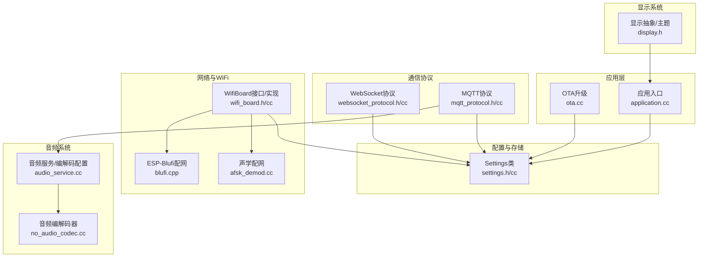
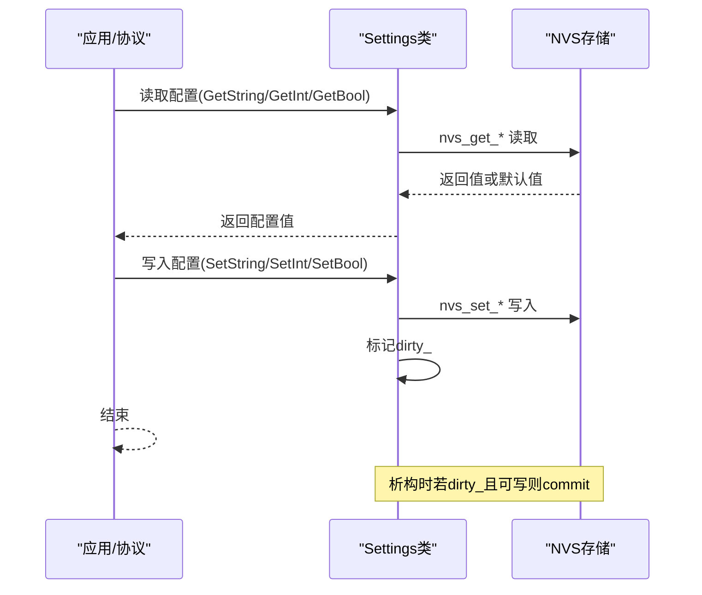
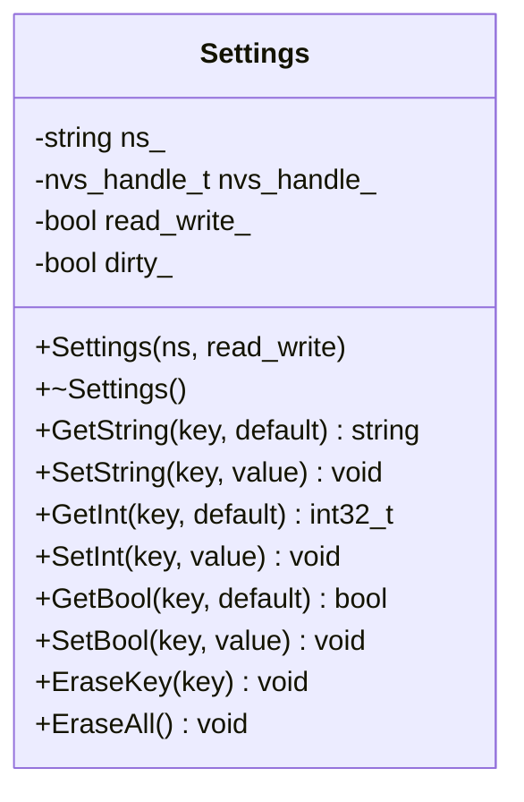
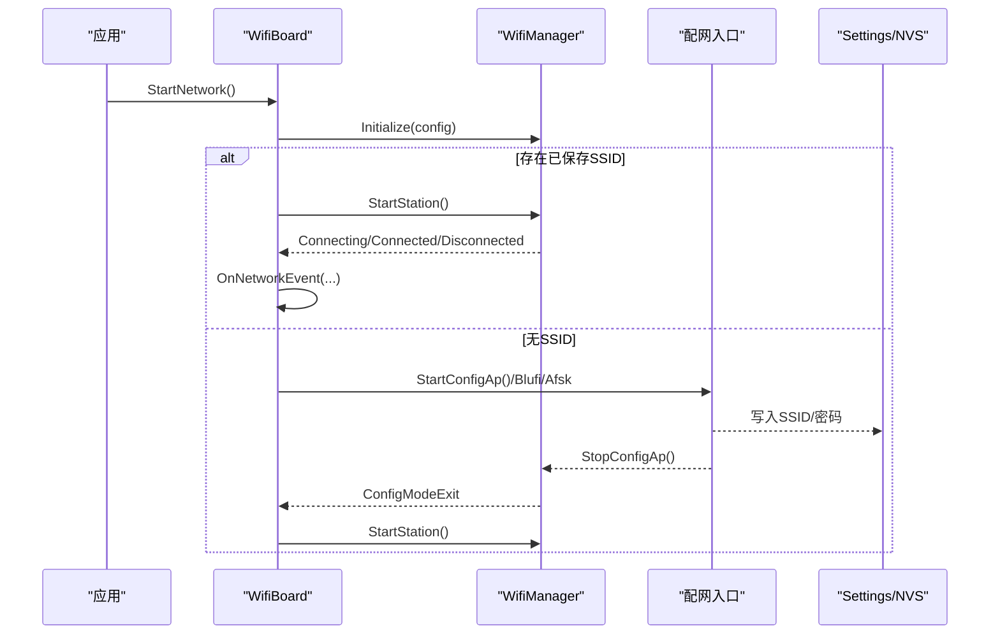
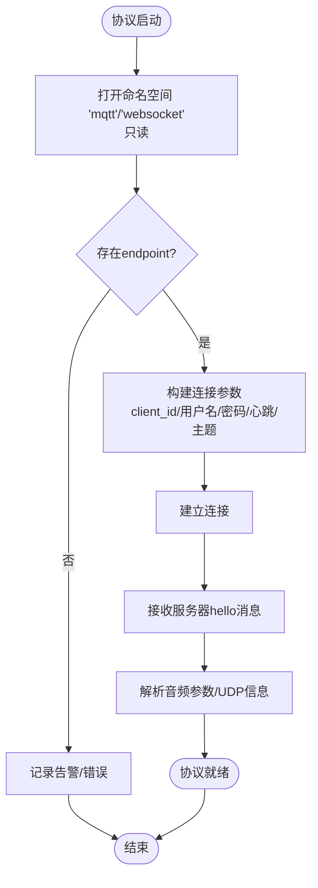
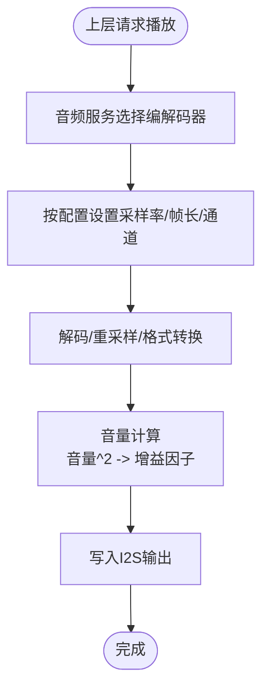
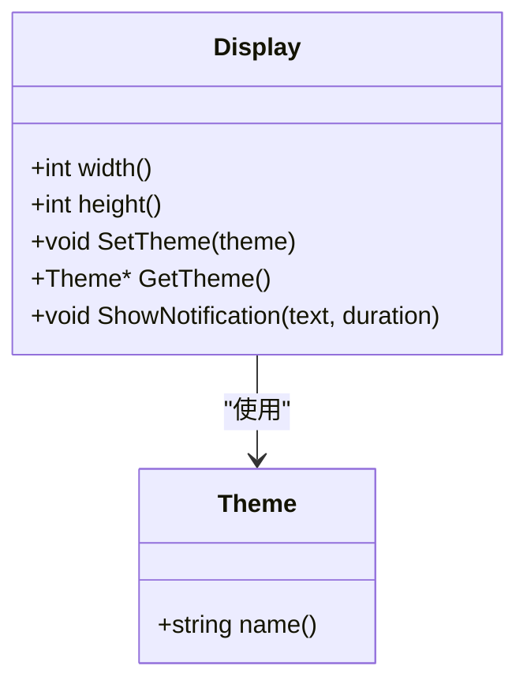
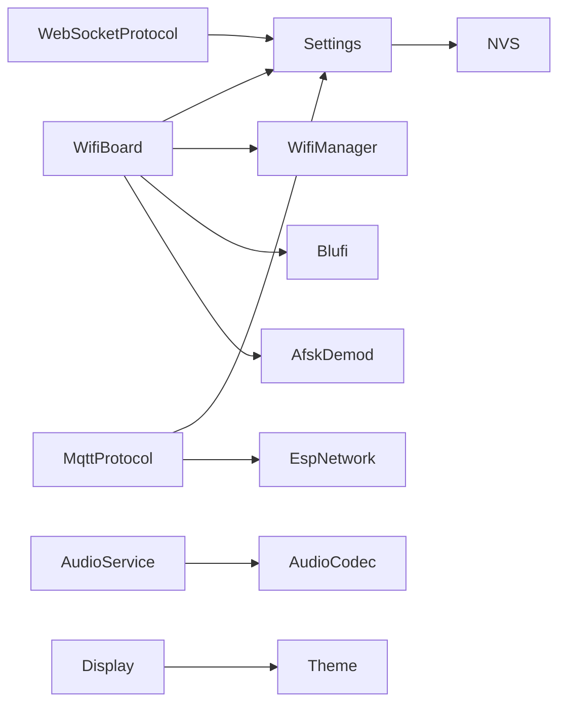

# 系统配置

<cite>
**本文引用的文件**
- [settings.h](file://main/settings.h)
- [settings.cc](file://main/settings.cc)
- [wifi_board.h](file://main/boards/common/wifi_board.h)
- [wifi_board.cc](file://main/boards/common/wifi_board.cc)
- [mqtt_protocol.h](file://main/protocols/mqtt_protocol.h)
- [mqtt_protocol.cc](file://main/protocols/mqtt_protocol.cc)
- [websocket_protocol.h](file://main/protocols/websocket_protocol.h)
- [websocket_protocol.cc](file://main/protocols/websocket_protocol.cc)
- [audio_service.cc](file://main/audio/audio_service.cc)
- [no_audio_codec.cc](file://main/audio/codecs/no_audio_codec.cc)
- [display.h](file://main/display/display.h)
- [ota.cc](file://main/ota.cc)
- [afsk_demod.cc](file://main/boards/common/afsk_demod.cc)
- [blufi.cpp](file://main/boards/common/blufi.cpp)
- [atom-echos3r/config.json](file://main/boards/atom-echos3r/config.json)
- [esp-box-3/config.json](file://main/boards/esp-box-3/config.json)
</cite>

## 目录
1. [简介](#简介)
2. [项目结构](#项目结构)
3. [核心组件](#核心组件)
4. [架构总览](#架构总览)
5. [详细组件分析](#详细组件分析)
6. [依赖关系分析](#依赖关系分析)
7. [性能考量](#性能考量)
8. [故障排查指南](#故障排查指南)
9. [结论](#结论)
10. [附录](#附录)

## 简介
本文件面向XiaoZhi ESP32项目的系统配置，围绕Settings类设计与使用展开，系统性说明键值对存储机制、命名空间管理、数据类型转换与持久化流程；并结合WiFi配置（SSID、密码、连接超时）、通信协议配置（WebSocket/MQTT服务器地址、端口、鉴权、心跳等）、音频系统配置（采样率、帧长、通道数、音量）、显示配置（分辨率、主题、亮度）等实际参数，给出读写示例、验证与错误处理最佳实践，以及配置迁移与备份策略建议。

## 项目结构
本项目采用“功能域+分层”的组织方式：配置与持久化位于main目录；网络与WiFi在boards/common中；通信协议在protocols；音频与显示分别在audio与display；OTA升级流程在ota中。

图表来源
- [settings.h](file://main/settings.h#L7-L26)
- [settings.cc](file://main/settings.cc#L8-L19)
- [wifi_board.h](file://main/boards/common/wifi_board.h#L9-L67)
- [wifi_board.cc](file://main/boards/common/wifi_board.cc#L52-L105)
- [mqtt_protocol.h](file://main/protocols/mqtt_protocol.h#L26-L52)
- [mqtt_protocol.cc](file://main/protocols/mqtt_protocol.cc#L59-L84)
- [websocket_protocol.h](file://main/protocols/websocket_protocol.h)
- [websocket_protocol.cc](file://main/protocols/websocket_protocol.cc)
- [audio_service.cc](file://main/audio/audio_service.cc#L5-L24)
- [no_audio_codec.cc](file://main/audio/codecs/no_audio_codec.cc#L220-L257)
- [display.h](file://main/display/display.h#L28-L61)

章节来源
- [settings.h](file://main/settings.h#L1-L29)
- [settings.cc](file://main/settings.cc#L1-L109)
- [wifi_board.h](file://main/boards/common/wifi_board.h#L1-L70)
- [wifi_board.cc](file://main/boards/common/wifi_board.cc#L1-L359)
- [mqtt_protocol.h](file://main/protocols/mqtt_protocol.h#L1-L52)
- [mqtt_protocol.cc](file://main/protocols/mqtt_protocol.cc#L1-L353)
- [websocket_protocol.h](file://main/protocols/websocket_protocol.h)
- [websocket_protocol.cc](file://main/protocols/websocket_protocol.cc)
- [audio_service.cc](file://main/audio/audio_service.cc#L1-L24)
- [no_audio_codec.cc](file://main/audio/codecs/no_audio_codec.cc#L220-L257)
- [display.h](file://main/display/display.h#L1-L88)

## 核心组件
- Settings类：基于NVS的键值对存储，支持字符串、整型、布尔类型；通过命名空间隔离不同模块配置；仅在读写模式下提交变更。
- WifiBoard：统一WiFi事件回调、连接超时控制、配网模式入口（热点/Blufi/声学）。
- 协议模块：MQTT从NVS读取endpoint/client_id/用户名/密码/心跳/发布主题；WebSocket从独立命名空间读取地址与端口等。
- 音频系统：采样率、帧长、通道数、音量等参数在音频服务与编解码器中体现。
- 显示系统：分辨率、主题、亮度等状态由显示抽象类与具体驱动维护。

章节来源
- [settings.h](file://main/settings.h#L7-L26)
- [settings.cc](file://main/settings.cc#L8-L109)
- [wifi_board.h](file://main/boards/common/wifi_board.h#L9-L67)
- [wifi_board.cc](file://main/boards/common/wifi_board.cc#L52-L105)
- [mqtt_protocol.cc](file://main/protocols/mqtt_protocol.cc#L65-L84)
- [websocket_protocol.h](file://main/protocols/websocket_protocol.h)
- [websocket_protocol.cc](file://main/protocols/websocket_protocol.cc)
- [audio_service.cc](file://main/audio/audio_service.cc#L5-L24)
- [no_audio_codec.cc](file://main/audio/codecs/no_audio_codec.cc#L220-L257)
- [display.h](file://main/display/display.h#L28-L61)

## 架构总览
下图展示配置在系统中的流转路径：应用/协议/设备通过Settings访问NVS命名空间，实现配置读取与持久化；WiFi配网通过多种方式写入SSID列表或直接写入NVS键值；OTA升级解析JSON配置并写入对应命名空间。

图表来源
- [settings.cc](file://main/settings.cc#L21-L89)
- [settings.h](file://main/settings.h#L12-L18)

章节来源
- [settings.cc](file://main/settings.cc#L8-L19)
- [settings.h](file://main/settings.h#L7-L26)

## 详细组件分析

### Settings类设计与使用
- 命名空间管理：构造函数接收ns与是否读写标志，内部以nvs_open打开命名空间；析构时若标记dirty_且可写则调用nvs_commit提交。
- 数据类型转换：提供GetString/GetInt/GetBool与对应的Set版本；布尔以uint8_t存储，字符串以C风格字符串存储。
- 错误处理：只读命名空间写入会记录警告日志；查询失败返回默认值；写入失败通过ESP_ERROR_CHECK抛出异常。
- 典型用途：WiFi配网参数、MQTT/WebSocket配置、音频/显示参数等均以键值形式存取。

图表来源
- [settings.h](file://main/settings.h#L7-L26)
- [settings.cc](file://main/settings.cc#L8-L109)

章节来源
- [settings.h](file://main/settings.h#L7-L26)
- [settings.cc](file://main/settings.cc#L8-L109)

### WiFi配置参数与流程
- 关键参数
  - SSID/密码：通过配网入口写入SSID列表；也可通过声学/Blufi等方式写入NVS键值。
  - 连接超时：默认60秒，超时后自动进入配网模式。
- 流程要点
  - 启动网络：初始化WifiManager，注册统一事件回调，根据是否存在SSID决定直连或进入配网。
  - 超时处理：定时器触发后停止Station并启动配网模式。
  - 配网模式：支持热点网页、ESP-Blufi、声学配网三种方式，完成后触发ConfigModeExit并重试连接。

图表来源
- [wifi_board.cc](file://main/boards/common/wifi_board.cc#L52-L105)
- [wifi_board.cc](file://main/boards/common/wifi_board.cc#L160-L198)
- [afsk_demod.cc](file://main/boards/common/afsk_demod.cc#L83-L104)
- [blufi.cpp](file://main/boards/common/blufi.cpp#L753-L780)

章节来源
- [wifi_board.h](file://main/boards/common/wifi_board.h#L26-L37)
- [wifi_board.cc](file://main/boards/common/wifi_board.cc#L52-L105)
- [wifi_board.cc](file://main/boards/common/wifi_board.cc#L152-L158)
- [wifi_board.cc](file://main/boards/common/wifi_board.cc#L160-L198)
- [afsk_demod.cc](file://main/boards/common/afsk_demod.cc#L83-L104)
- [blufi.cpp](file://main/boards/common/blufi.cpp#L753-L780)

### 通信协议配置（WebSocket/MQTT）
- MQTT配置项（命名空间“mqtt”）
  - 必填：endpoint（服务器地址）
  - 可选：client_id、username、password、keepalive（秒，默认值见实现）、publish_topic
  - 运行时行为：心跳间隔、断线重连间隔、UDP传输参数由服务器hello消息动态下发
- WebSocket配置项（命名空间“websocket”）
  - 地址与端口等键值由OTA升级流程解析JSON并写入对应命名空间
- 读取流程：协议启动时以只读方式打开对应命名空间，读取上述键值并建立连接。

图表来源
- [mqtt_protocol.cc](file://main/protocols/mqtt_protocol.cc#L65-L84)
- [mqtt_protocol.cc](file://main/protocols/mqtt_protocol.cc#L322-L353)
- [ota.cc](file://main/ota.cc#L167-L186)

章节来源
- [mqtt_protocol.h](file://main/protocols/mqtt_protocol.h#L26-L52)
- [mqtt_protocol.cc](file://main/protocols/mqtt_protocol.cc#L59-L84)
- [mqtt_protocol.cc](file://main/protocols/mqtt_protocol.cc#L322-L353)
- [ota.cc](file://main/ota.cc#L154-L190)

### 音频系统配置参数
- 采样率与帧长
  - 采样率：在音频服务配置宏中定义，例如速率转换与Opus解码的采样率参数。
  - 帧长：Opus解码器的帧时长枚举由配置宏生成。
- 通道数
  - 解码通道通常为单声道，编码/播放通道数由编解码器实现决定。
- 音量控制
  - 编解码器内部维护输出音量（0-100），通过平方映射到内部增益因子，再写入I2S。

图表来源
- [audio_service.cc](file://main/audio/audio_service.cc#L5-L24)
- [no_audio_codec.cc](file://main/audio/codecs/no_audio_codec.cc#L220-L257)

章节来源
- [audio_service.cc](file://main/audio/audio_service.cc#L5-L24)
- [no_audio_codec.cc](file://main/audio/codecs/no_audio_codec.cc#L220-L257)

### 显示配置选项
- 分辨率与主题
  - 显示抽象类提供width/height与主题对象；具体驱动在初始化时设置面板参数（如SPI、像素时钟、命令位宽等）。
- 亮度调节
  - 通过背光类（若存在）与显示驱动交互，实现亮度调节；状态JSON中包含当前亮度与主题名称。
- 设备状态JSON
  - 统一输出音频音量、屏幕亮度/主题、电池电量/状态、网络类型/信号强度、芯片温度等信息。

图表来源
- [display.h](file://main/display/display.h#L28-L61)

章节来源
- [display.h](file://main/display/display.h#L28-L61)
- [wifi_board.cc](file://main/boards/common/wifi_board.cc#L302-L358)

### 配置读写操作示例与持久化机制
- 读取示例（以WiFi为例）
  - 打开命名空间“wifi”只读，读取“ssid”“password”等键值；若不存在则返回空串或默认值。
- 写入示例（以OTA升级为例）
  - 解析JSON对象，遍历键值；字符串写入GetString!=value时更新，整型同理；最终标记对应命名空间有配置。
- 持久化机制
  - Settings在析构时若dirty_且可写则commit；否则仅缓存在内存中。
  - NVS事务由底层库保证一致性。

章节来源
- [wifi_board.cc](file://main/boards/common/wifi_board.cc#L269-L283)
- [ota.cc](file://main/ota.cc#L154-L190)
- [settings.cc](file://main/settings.cc#L12-L19)

### 配置验证与错误处理最佳实践
- 参数校验
  - MQTT：必须提供endpoint；可选字段提供默认值；心跳与主题需满足协议要求。
  - WiFi：超时时间合理设置；配网入口需在安全状态下触发。
- 错误处理
  - 只读命名空间写入：记录警告日志，避免崩溃。
  - 查询失败：返回默认值，确保系统可用。
  - 连接失败：记录错误并触发重试或回退到配网模式。
- 幂等性
  - OTA写入前先比较当前值，相同则跳过，减少不必要的写入。

章节来源
- [settings.cc](file://main/settings.cc#L40-L47)
- [settings.cc](file://main/settings.cc#L70-L89)
- [mqtt_protocol.cc](file://main/protocols/mqtt_protocol.cc#L73-L79)
- [wifi_board.cc](file://main/boards/common/wifi_board.cc#L152-L158)

### 配置迁移与备份策略
- 迁移策略
  - 新增键值：提供默认值，避免旧版本缺失导致异常。
  - 命名空间变更：提供一次性迁移任务，读取旧命名空间并写入新命名空间，随后擦除旧键。
- 备份策略
  - 定期导出关键命名空间（如“mqtt”“websocket”“wifi”）为JSON，便于恢复。
  - OTA升级前保留当前配置快照，失败时回滚。
- 版本化
  - 在NVS中保存配置版本号，升级时执行差异迁移。

章节来源
- [ota.cc](file://main/ota.cc#L154-L190)
- [settings.cc](file://main/settings.cc#L91-L108)

## 依赖关系分析
- 组件耦合
  - WifiBoard依赖Settings用于读取配网参数；同时依赖WifiManager/Blufi/Afsk实现配网写入。
  - 协议模块依赖Settings读取连接参数；依赖网络接口创建MQTT/UDP实例。
  - 音频/显示模块通过抽象类与具体驱动解耦，配置参数通过服务层传递。
- 外部依赖
  - NVS：键值对持久化。
  - cJSON：OTA JSON解析。
  - FreeRTOS/esp_timer：定时器与任务调度。

图表来源
- [settings.cc](file://main/settings.cc#L8-L19)
- [wifi_board.cc](file://main/boards/common/wifi_board.cc#L52-L105)
- [mqtt_protocol.cc](file://main/protocols/mqtt_protocol.cc#L81-L84)
- [audio_service.cc](file://main/audio/audio_service.cc#L5-L24)
- [display.h](file://main/display/display.h#L28-L61)

章节来源
- [settings.cc](file://main/settings.cc#L8-L19)
- [wifi_board.cc](file://main/boards/common/wifi_board.cc#L52-L105)
- [mqtt_protocol.cc](file://main/protocols/mqtt_protocol.cc#L81-L84)
- [audio_service.cc](file://main/audio/audio_service.cc#L5-L24)
- [display.h](file://main/display/display.h#L28-L61)

## 性能考量
- NVS写入频率控制：批量写入后一次性commit，避免频繁写盘。
- 任务优先级：配网与协议连接任务优先级适中，避免抢占UI渲染。
- 音频缓冲：根据采样率与帧长合理设置I/O队列深度，降低阻塞概率。
- 显示刷新：在低功耗模式下降低刷新率或启用省电模式。

## 故障排查指南
- 无法连接WiFi
  - 检查“wifi”命名空间是否存在ssid/password；确认超时时间是否过短。
  - 查看配网模式是否成功退出并重新尝试连接。
- MQTT无法连接
  - 检查“mqtt”命名空间endpoint/client_id/用户名/密码/keepalive/publish_topic是否正确。
  - 观察断线重连日志与ping间隔。
- 音频无声或失真
  - 检查音量是否为0；确认采样率/通道数配置与硬件匹配。
  - 校验I2S写入是否成功，查看编解码器增益计算。
- 显示异常
  - 检查分辨率/面板参数是否与硬件一致；确认主题与亮度设置未被覆盖。

章节来源
- [wifi_board.cc](file://main/boards/common/wifi_board.cc#L152-L158)
- [mqtt_protocol.cc](file://main/protocols/mqtt_protocol.cc#L73-L79)
- [no_audio_codec.cc](file://main/audio/codecs/no_audio_codec.cc#L220-L257)
- [display.h](file://main/display/display.h#L28-L61)

## 结论
Settings类提供了统一、简洁的键值对存储与命名空间隔离能力，配合WifiBoard、协议模块与系统其他子模块，实现了从WiFi配网、通信协议到音频/显示的全链路配置管理。通过合理的默认值、错误处理与持久化策略，系统在功能扩展与设备部署方面具备良好可维护性与可靠性。

## 附录

### 配置命名空间与典型键
- 命名空间“wifi”
  - ssid：字符串，WiFi SSID
  - password：字符串，WiFi密码
- 命名空间“mqtt”
  - endpoint：字符串，服务器地址
  - client_id：字符串，客户端ID
  - username/password：字符串，认证信息
  - keepalive：整型，心跳间隔（秒）
  - publish_topic：字符串，发布主题
- 命名空间“websocket”
  - server：字符串，服务器地址
  - port：整型，端口号
  - 其他：按需扩展

章节来源
- [wifi_board.cc](file://main/boards/common/wifi_board.cc#L269-L283)
- [mqtt_protocol.cc](file://main/protocols/mqtt_protocol.cc#L65-L71)
- [ota.cc](file://main/ota.cc#L167-L186)

### 构建与分区配置参考
- 构建目标与分区表示例：不同开发板通过config.json指定目标芯片与分区表，确保Flash布局与容量满足需求。

章节来源
- [atom-echos3r/config.json](file://main/boards/atom-echos3r/config.json#L1-L13)
- [esp-box-3/config.json](file://main/boards/esp-box-3/config.json#L1-L11)