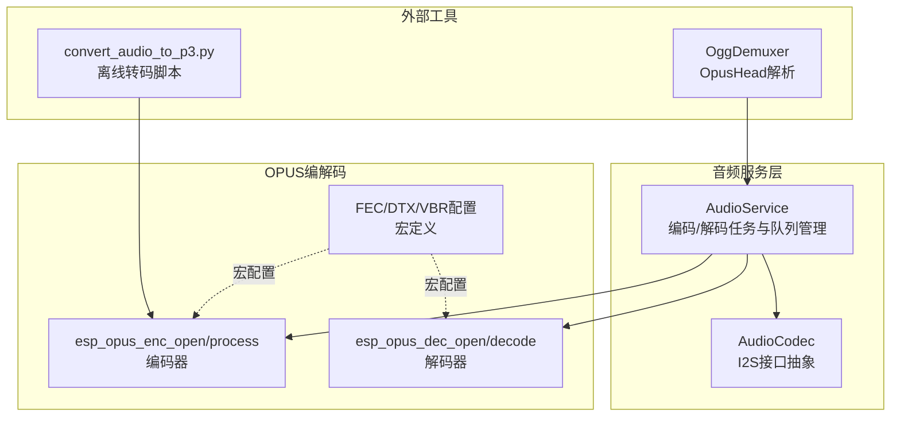
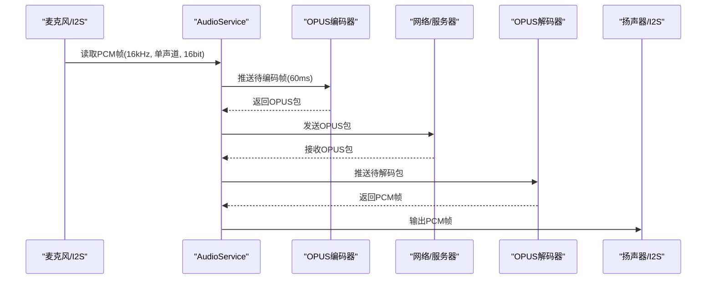
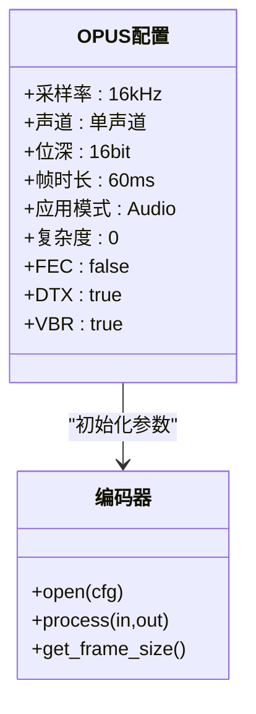
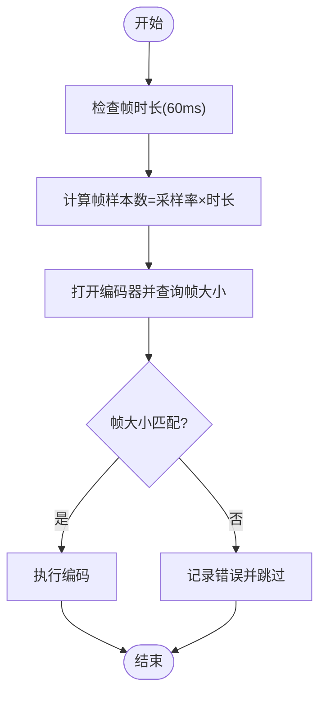
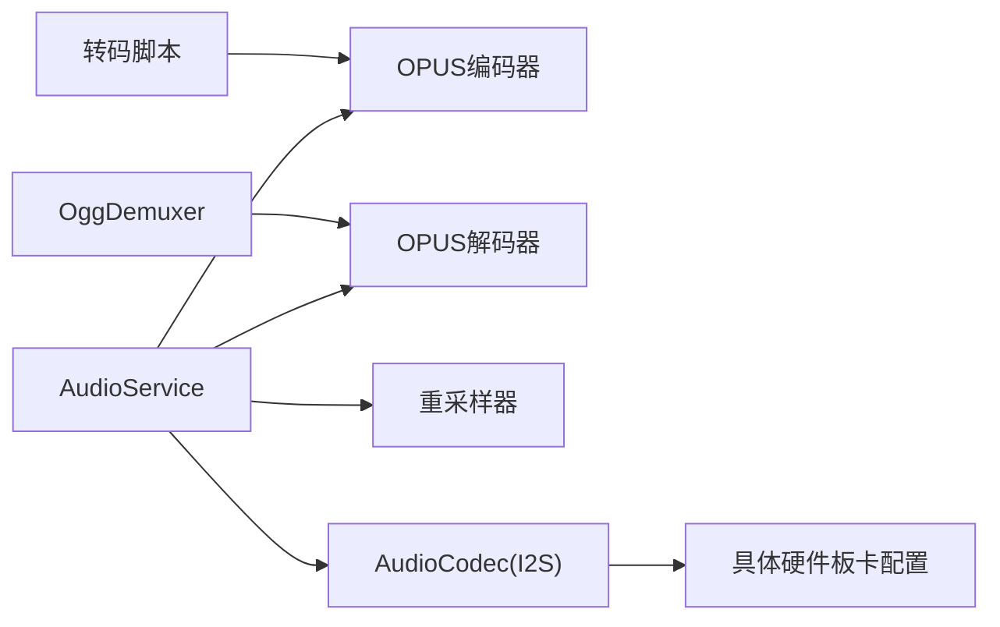

# OPUS编解码器配置

<cite>
**本文档引用的文件**
- [audio_service.h](file://main/audio/audio_service.h)
- [audio_service.cc](file://main/audio/audio_service.cc)
- [convert_audio_to_p3.py](file://scripts/p3_tools/convert_audio_to_p3.py)
- [ogg_demuxer.cc](file://main/audio/demuxer/ogg_demuxer.cc)
- [config.h](file://main/boards/atk-dnesp32s3-box0/config.h)
- [audio_codec.h](file://main/audio/audio_codec.h)
</cite>

## 目录
1. [简介](#简介)
2. [项目结构](#项目结构)
3. [核心组件](#核心组件)
4. [架构总览](#架构总览)
5. [详细组件分析](#详细组件分析)
6. [依赖关系分析](#依赖关系分析)
7. [性能考量](#性能考量)
8. [故障排除指南](#故障排除指南)
9. [结论](#结论)
10. [附录](#附录)

## 简介
本文件面向音频工程师与系统优化专家，围绕 XiaoZhi ESP32 项目中的 OPUS 编解码器配置进行系统化说明。重点覆盖以下方面：
- 关键参数配置：采样率（16 kHz）、声道（单声道）、位深（16 bit）
- 帧持续时间（60 ms）对音质与延迟的影响及权衡
- 比特率（自动比特率）、VBR 编码、DTX 的作用与配置
- 复杂度设置、前向纠错（FEC）与丢包隐藏（如适用）的启用与优化
- 实时音频传输中的性能表现与资源消耗
- 参数调优指南与故障排除、性能监控方法

## 项目结构
与 OPUS 编解码器直接相关的代码集中在 main/audio 子目录中，核心实现位于 AudioService 类及其配置宏定义中；脚本工具用于离线音频转码验证。

**图表来源**
- [audio_service.h](file://main/audio/audio_service.h#L65-L76)
- [audio_service.cc](file://main/audio/audio_service.cc#L62-L93)
- [convert_audio_to_p3.py](file://scripts/p3_tools/convert_audio_to_p3.py#L38-L49)
- [ogg_demuxer.cc](file://main/audio/demuxer/ogg_demuxer.cc#L241-L273)

**章节来源**
- [audio_service.h](file://main/audio/audio_service.h#L39-L76)
- [audio_service.cc](file://main/audio/audio_service.cc#L62-L93)

## 核心组件
- OPUS 编码器配置宏：集中定义采样率、声道、位深、帧时长、应用模式、复杂度、FEC、DTX、VBR 等参数。
- OPUS 解码器配置宏：统一设置采样率、声道、帧时长等。
- AudioService：负责初始化编解码器、输入输出重采样、编码/解码任务调度、队列控制与错误处理。
- 脚本工具：convert_audio_to_p3.py 用于离线将音频转换为 OPUS 流，便于测试与验证。
- OggDemuxer：解析 Ogg 包中的 OpusHead，提取采样率等元信息。

**章节来源**
- [audio_service.h](file://main/audio/audio_service.h#L39-L76)
- [audio_service.cc](file://main/audio/audio_service.cc#L62-L93)
- [convert_audio_to_p3.py](file://scripts/p3_tools/convert_audio_to_p3.py#L11-L49)
- [ogg_demuxer.cc](file://main/audio/demuxer/ogg_demuxer.cc#L241-L273)

## 架构总览
OPUS 在 XiaoZhi ESP32 中采用“双任务”架构：
- 音频输入/处理任务：采集 PCM 数据，按帧大小切分并送入编码队列
- OPUS 编解码任务：从编码队列取出 PCM 帧进行编码，或从解码队列取出 OPUS 包进行解码后播放

**图表来源**
- [audio_service.cc](file://main/audio/audio_service.cc#L131-L166)
- [audio_service.cc](file://main/audio/audio_service.cc#L327-L446)

**章节来源**
- [audio_service.cc](file://main/audio/audio_service.cc#L131-L166)
- [audio_service.cc](file://main/audio/audio_service.cc#L327-L446)

## 详细组件分析

### OPUS 编码器配置
- 采样率：固定为 16 kHz
- 声道：单声道（Mono）
- 位深：16 bit
- 帧时长：通过宏 OPUS_FRAME_DURATION_MS 控制，默认 60 ms
- 应用模式：音频类（Audio）
- 复杂度：0（低复杂度，强调速度与资源占用）
- FEC：禁用
- DTX：启用（静音时降低比特率）
- VBR：启用（自适应可变比特率）

上述配置由宏 AS_OPUS_ENC_CONFIG 统一定义，并在初始化时传入 esp_opus_enc_open。

**图表来源**
- [audio_service.h](file://main/audio/audio_service.h#L65-L76)

**章节来源**
- [audio_service.h](file://main/audio/audio_service.h#L39-L76)
- [audio_service.cc](file://main/audio/audio_service.cc#L75-L84)

### OPUS 解码器配置
- 采样率：来自音频设备输出采样率
- 声道：单声道
- 帧时长：动态根据传入包的帧时长设置
- 自描述：关闭（self-delimited=false）

解码器在首次使用或收到不同帧长/采样率的包时会重建。

**章节来源**
- [audio_service.h](file://main/audio/audio_service.h#L16-L23)
- [audio_service.cc](file://main/audio/audio_service.cc#L350-L482)

### 帧持续时间（60 ms）配置与影响
- 延迟与吞吐权衡：帧越长，单位时间内包数量减少，带宽占用下降；但端到端延迟上升，实时性下降。
- 抖动与缓冲：项目中通过队列上限与定时器控制（最大队列长度与最大时长）平衡延迟与稳定性。
- 采样率与帧大小：16 kHz 下，60 ms 对应帧样本数为 960；编码器会据此查询帧大小与输出缓冲区大小。

**图表来源**
- [audio_service.cc](file://main/audio/audio_service.cc#L80-L84)
- [audio_service.cc](file://main/audio/audio_service.cc#L406-L440)

**章节来源**
- [audio_service.cc](file://main/audio/audio_service.cc#L80-L84)
- [audio_service.cc](file://main/audio/audio_service.cc#L406-L440)

### 比特率、VBR 与 DTX
- 自动比特率（ABR）：结合 VBR 使用，可在保证质量的前提下动态调整码率。
- VBR（可变比特率）：提升语音压缩效率，尤其在非稳态语音场景下。
- DTX（离散吐零）：在静默期插入短序列以改善主观听感与回声处理，同时降低功耗。

这些特性在编码器配置中已启用，适合实时语音传输场景。

**章节来源**
- [audio_service.h](file://main/audio/audio_service.h#L69-L75)

### 复杂度设置、FEC 与丢包隐藏
- 复杂度：当前设为 0，强调低 CPU 占用与快速处理，适合嵌入式平台。
- FEC（前向纠错）：当前禁用，若网络环境较差可考虑开启以提升鲁棒性，但会增加开销。
- 丢包隐藏：未显式配置，通常由底层库在特定模式下提供，需结合网络丢包策略评估。

**章节来源**
- [audio_service.h](file://main/audio/audio_service.h#L72-L74)

### 输入/输出重采样与声道处理
- 输入重采样：当设备输入采样率非 16 kHz 时，使用高速重采样器将输入转换至目标采样率。
- 输出重采样：解码后若设备输出采样率与目标不同，进行重采样适配。
- 声道处理：输入为双声道时，测试模式下仅取左声道作为单声道输入。

**章节来源**
- [audio_service.cc](file://main/audio/audio_service.cc#L86-L93)
- [audio_service.cc](file://main/audio/audio_service.cc#L252-L263)
- [audio_service.cc](file://main/audio/audio_service.cc#L370-L379)

### 离线转码与验证
- 脚本 convert_audio_to_p3.py 将音频按 16 kHz、单声道、60 ms 帧长编码为 OPUS，便于离线验证与测试。
- 可选响度归一化（LUFS），注意对已有响度处理或 TTS 音频可能引入失真。

**章节来源**
- [convert_audio_to_p3.py](file://scripts/p3_tools/convert_audio_to_p3.py#L11-L49)

### Ogg 包解析与采样率提取
- OggDemuxer 在解析 Ogg 包时识别 OpusHead，提取采样率等元信息，用于解码器动态重建。

**章节来源**
- [ogg_demuxer.cc](file://main/audio/demuxer/ogg_demuxer.cc#L241-L273)

## 依赖关系分析
- AudioService 依赖 OPUS 编解码器接口与重采样模块，负责任务调度与队列管理。
- 不同硬件板卡的输入/输出采样率在各自 config.h 中定义，影响运行时重采样路径。
- 脚本工具与运行时配置相互印证，确保离线与在线一致的帧长与采样率。

**图表来源**
- [audio_service.cc](file://main/audio/audio_service.cc#L62-L93)
- [audio_codec.h](file://main/audio/audio_codec.h#L31-L38)
- [config.h](file://main/boards/atk-dnesp32s3-box0/config.h#L43-L44)
- [convert_audio_to_p3.py](file://scripts/p3_tools/convert_audio_to_p3.py#L38-L49)
- [ogg_demuxer.cc](file://main/audio/demuxer/ogg_demuxer.cc#L241-L273)

**章节来源**
- [audio_service.cc](file://main/audio/audio_service.cc#L62-L93)
- [audio_codec.h](file://main/audio/audio_codec.h#L31-L38)
- [config.h](file://main/boards/atk-dnesp32s3-box0/config.h#L43-L44)

## 性能考量
- CPU 占用：复杂度设为 0，优先速度与低功耗，适合 ESP32 平台。
- 内存占用：OPUS 帧大小与输出缓冲区大小在初始化时查询并缓存，避免频繁分配。
- 延迟控制：60 ms 帧长与队列上限共同限制端到端延迟；可通过降低帧长进一步降低延迟，但会提高带宽与 CPU 开销。
- 网络鲁棒性：当前未启用 FEC；在网络抖动较大时可评估启用 FEC 的收益与成本。

**章节来源**
- [audio_service.h](file://main/audio/audio_service.h#L39-L43)
- [audio_service.cc](file://main/audio/audio_service.cc#L80-L84)

## 故障排除指南
- 编码失败：检查帧大小是否与编码器查询结果一致；确认编码器句柄有效。
- 解码失败：检查解码器是否已根据新采样率/帧长重建；确认输入包格式正确。
- 队列积压：关注发送/解码队列长度阈值，必要时降低帧长或优化网络传输。
- 静音期音质：若出现“爆音”或听感突变，检查 DTX 行为与重采样边界处理。
- 采样率不匹配：确认硬件板卡配置与实际设备一致，避免不必要的重采样。

**章节来源**
- [audio_service.cc](file://main/audio/audio_service.cc#L434-L440)
- [audio_service.cc](file://main/audio/audio_service.cc#L384-L392)
- [audio_service.cc](file://main/audio/audio_service.cc#L506-L518)

## 结论
XiaoZhi ESP32 项目中的 OPUS 配置以低复杂度、低延迟为目标，采用 16 kHz 单声道、60 ms 帧长、VBR+DTX 的组合，在保证实时性的前提下兼顾音质与资源消耗。对于网络鲁棒性要求更高的场景，可评估启用 FEC；对于更低延迟需求，可适当缩短帧长并相应调整队列与缓冲策略。

## 附录

### 参数对照表
- 采样率：16 kHz
- 声道：单声道
- 位深：16 bit
- 帧时长：60 ms
- 应用模式：Audio
- 复杂度：0
- FEC：禁用
- DTX：启用
- VBR：启用

**章节来源**
- [audio_service.h](file://main/audio/audio_service.h#L65-L76)