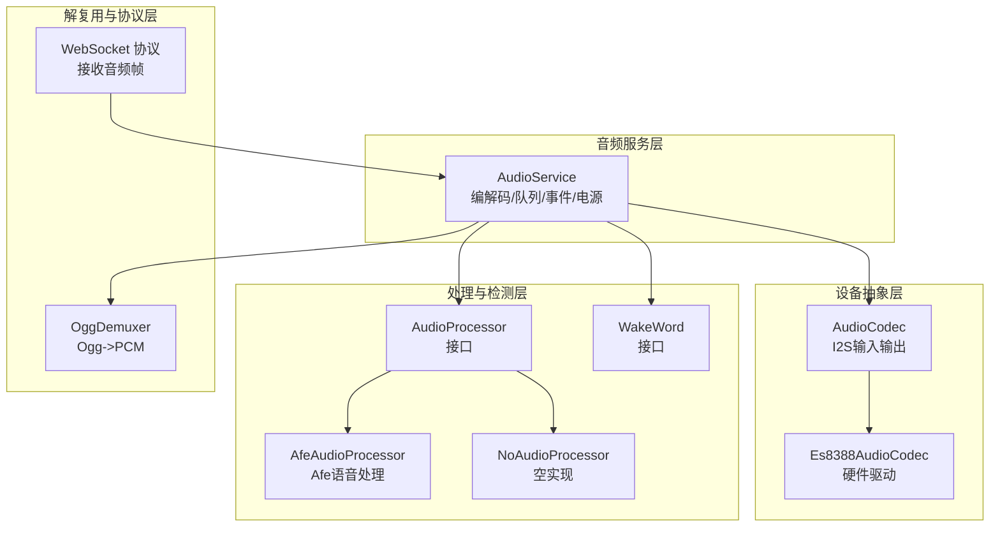
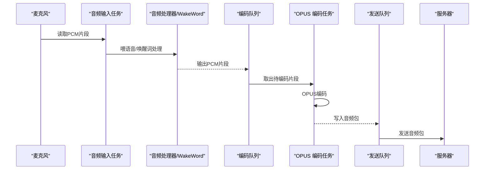
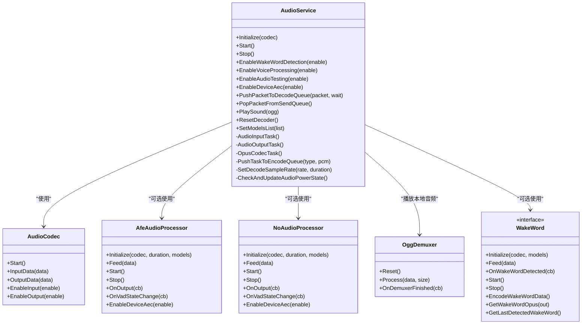
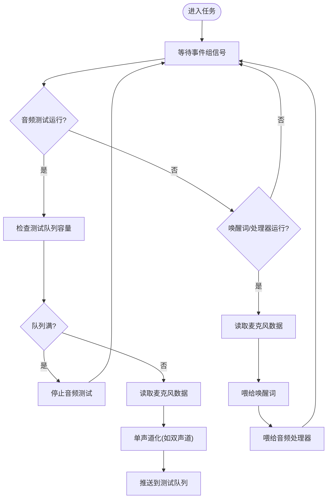
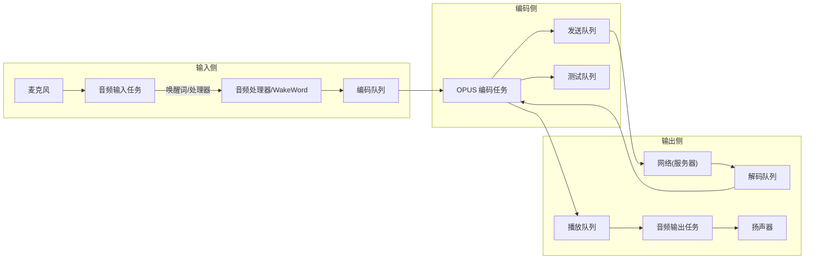
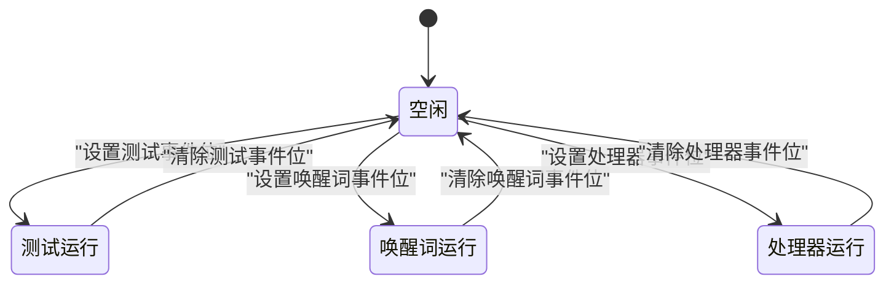
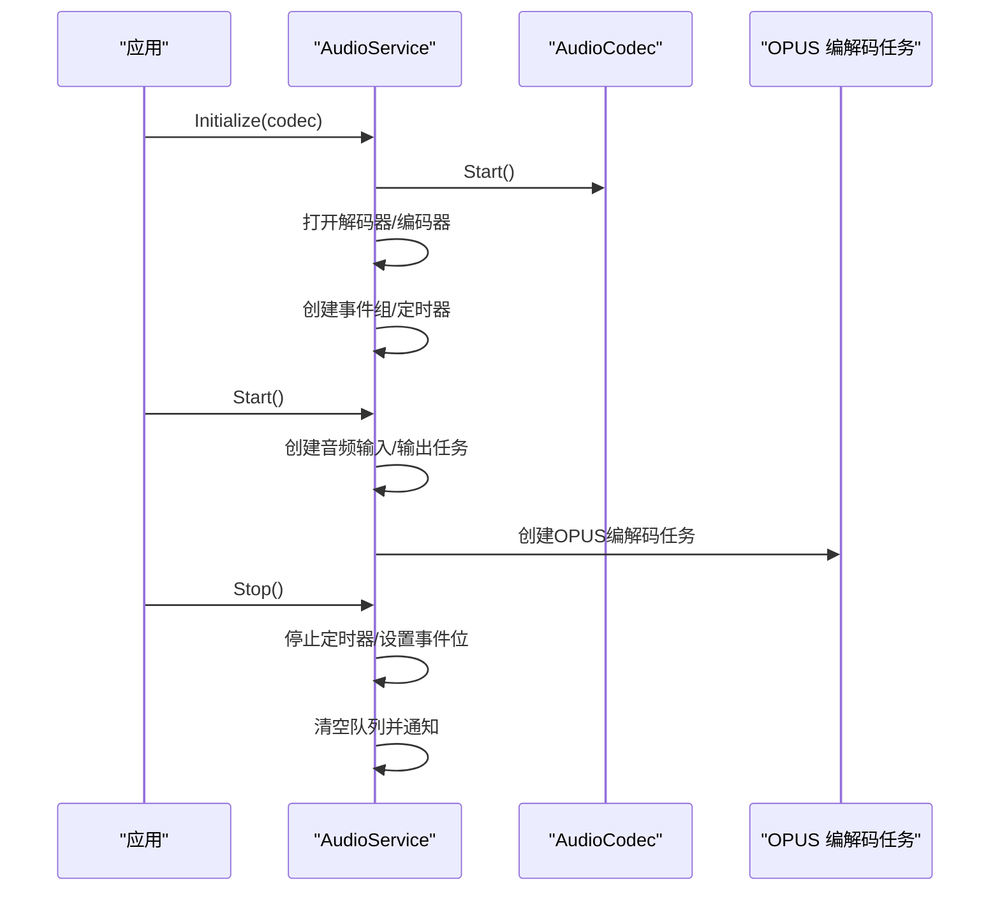
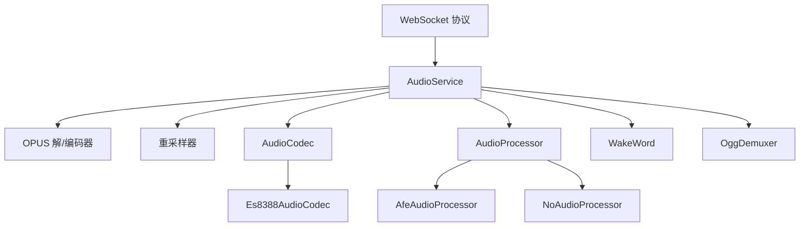

# 音频服务架构

<cite>
**本文引用的文件**
- [audio_service.h](file://main/audio/audio_service.h)
- [audio_service.cc](file://main/audio/audio_service.cc)
- [audio_codec.h](file://main/audio/audio_codec.h)
- [audio_codec.cc](file://main/audio/audio_codec.cc)
- [audio_processor.h](file://main/audio/audio_processor.h)
- [processors/afe_audio_processor.h](file://main/audio/processors/afe_audio_processor.h)
- [processors/no_audio_processor.h](file://main/audio/processors/no_audio_processor.h)
- [processors/audio_debugger.h](file://main/audio/processors/audio_debugger.h)
- [processors/audio_debugger.cc](file://main/audio/processors/audio_debugger.cc)
- [wake_word.h](file://main/audio/wake_word.h)
- [codecs/es8388_audio_codec.h](file://main/audio/codecs/es8388_audio_codec.h)
- [demuxer/ogg_demuxer.h](file://main/audio/demuxer/ogg_demuxer.h)
- [websocket_protocol.cc](file://main/protocols/websocket_protocol.cc)
</cite>

## 目录
1. [简介](#简介)
2. [项目结构](#项目结构)
3. [核心组件](#核心组件)
4. [架构总览](#架构总览)
5. [详细组件分析](#详细组件分析)
6. [依赖关系分析](#依赖关系分析)
7. [性能考量](#性能考量)
8. [故障排查指南](#故障排查指南)
9. [结论](#结论)
10. [附录](#附录)

## 简介
本文件面向音频系统开发者，系统性阐述 XiaoZhi ESP32 项目中的 AudioService 类整体设计与实现，重点覆盖以下方面：
- 音频流处理管道的两条主线：麦克风到服务器（上行）与服务器到扬声器（下行）
- 音频任务模型：音频输入任务、音频输出任务、OPUS 编解码任务的职责划分
- 音频队列管理：发送队列、解码队列、测试队列、播放队列的设计与容量限制
- 音频事件系统与事件组：音频测试、唤醒词检测、音频处理器运行等状态管理
- 初始化、启动、停止的完整流程
- 音频服务质量监控与统计信息收集机制

## 项目结构
围绕音频子系统的文件组织采用“按职责分层 + 按功能模块划分”的方式：
- 核心服务层：AudioService 负责编解码、队列调度、事件控制与设备电源管理
- 设备抽象层：AudioCodec 抽象 I2S 输入输出，具体实现如 Es8388AudioCodec
- 处理器接口层：AudioProcessor 定义语音处理接口；AfeAudioProcessor/NoAudioProcessor 提供具体实现
- 唤醒词接口层：WakeWord 定义唤醒词检测接口
- 解复用层：OggDemuxer 将 Ogg/Opus 流解复用为 PCM 片段
- 协议层：WebSocket 协议接收服务器端音频帧并注入解码队列

图表来源
- [audio_service.h](file://main/audio/audio_service.h#L105-L195)
- [audio_codec.h](file://main/audio/audio_codec.h#L17-L62)
- [processors/afe_audio_processor.h](file://main/audio/processors/afe_audio_processor.h#L17-L48)
- [processors/no_audio_processor.h](file://main/audio/processors/no_audio_processor.h#L11-L34)
- [demuxer/ogg_demuxer.h](file://main/audio/demuxer/ogg_demuxer.h#L9-L63)
- [websocket_protocol.cc](file://main/protocols/websocket_protocol.cc#L115-L137)

章节来源
- [audio_service.h](file://main/audio/audio_service.h#L1-L195)
- [audio_service.cc](file://main/audio/audio_service.cc#L62-L123)

## 核心组件
- AudioService：音频系统的核心协调者，负责编解码器初始化、音频输入/输出任务调度、OPUS 编解码任务、队列管理、事件组控制、设备电源节流、统计计数等
- AudioCodec/AudioCodec 实现：抽象 I2S 输入输出，Es8388AudioCodec 提供具体硬件驱动
- AudioProcessor 接口及实现：AfeAudioProcessor 提供基于 AFE 的语音处理（VAD、AEC 等），NoAudioProcessor 提供空实现
- WakeWord 接口及实现：抽象唤醒词检测能力
- OggDemuxer：将 Ogg/Opus 数据流解复用为 PCM 片段
- WebSocket 协议：接收服务器端音频帧，封装为 AudioStreamPacket 注入解码队列

章节来源
- [audio_service.h](file://main/audio/audio_service.h#L105-L195)
- [audio_codec.h](file://main/audio/audio_codec.h#L17-L62)
- [processors/afe_audio_processor.h](file://main/audio/processors/afe_audio_processor.h#L17-L48)
- [processors/no_audio_processor.h](file://main/audio/processors/no_audio_processor.h#L11-L34)
- [demuxer/ogg_demuxer.h](file://main/audio/demuxer/ogg_demuxer.h#L9-L63)
- [websocket_protocol.cc](file://main/protocols/websocket_protocol.cc#L115-L137)

## 架构总览
AudioService 将音频处理划分为两条主要流水线：
- 上行链路：麦克风采集 → 语音处理器/唤醒词检测 → 编码队列 → OPUS 编码 → 发送队列 → 服务器
- 下行链路：服务器 → 解码队列 → OPUS 解码 → 播放队列 → 扬声器输出

同时，系统采用三任务模型：
- 音频输入任务：负责从麦克风读取音频，按需进行通道/采样率重采样，并将数据喂给唤醒词检测或语音处理器
- 音频输出任务：从播放队列取出 PCM 数据写入 Codec 输出
- OPUS 编解码任务：在独立任务中完成编码/解码，受队列容量与事件组条件驱动

图表来源
- [audio_service.cc](file://main/audio/audio_service.cc#L230-L288)
- [audio_service.cc](file://main/audio/audio_service.cc#L327-L446)
- [audio_service.cc](file://main/audio/audio_service.cc#L484-L504)

章节来源
- [audio_service.h](file://main/audio/audio_service.h#L28-L37)
- [audio_service.cc](file://main/audio/audio_service.cc#L125-L167)

## 详细组件分析

### AudioService 类设计与职责
- 初始化：打开 OPUS 解码器/编码器、根据输入采样率配置输入重采样器、创建事件组、注册音频处理器回调
- 启动：创建音频输入/输出任务与 OPUS 编解码任务，启动电源定时器
- 停止：停止电源定时器，设置事件标志，清空各队列并通知等待线程
- 队列管理：维护解码队列、发送队列、测试队列、编码队列与播放队列，配合条件变量与互斥锁实现线程安全
- 事件系统：使用 FreeRTOS 事件组管理音频测试、唤醒词检测、音频处理器运行等状态位
- 电源管理：通过定时器检测最近输入/输出时间，超时则关闭输入/输出以节能
- 统计计数：记录输入/解码/编码/播放次数，用于质量监控

图表来源
- [audio_service.h](file://main/audio/audio_service.h#L105-L195)
- [audio_codec.h](file://main/audio/audio_codec.h#L17-L62)
- [processors/afe_audio_processor.h](file://main/audio/processors/afe_audio_processor.h#L17-L48)
- [processors/no_audio_processor.h](file://main/audio/processors/no_audio_processor.h#L11-L34)
- [demuxer/ogg_demuxer.h](file://main/audio/demuxer/ogg_demuxer.h#L9-L63)
- [wake_word.h](file://main/audio/wake_word.h#L11-L27)

章节来源
- [audio_service.h](file://main/audio/audio_service.h#L105-L195)
- [audio_service.cc](file://main/audio/audio_service.cc#L62-L123)

### 音频任务模型
- 音频输入任务（AudioInputTask）
  - 依据事件组状态选择音频测试模式或唤醒词/处理器模式
  - 在音频测试模式下，将短时 PCM 片段直接推送到测试队列
  - 在唤醒词/处理器模式下，将短时 PCM 片段喂给 WakeWord 或 AudioProcessor
  - 支持输入预热与异常保护
- 音频输出任务（AudioOutputTask）
  - 从播放队列取出 PCM 片段，确保输出使能后写入 Codec
  - 更新最后输出时间，进行播放计数统计
  - 可选记录时间戳用于服务器 AEC
- OPUS 编解码任务（OpusCodecTask）
  - 解码路径：从解码队列取出音频包，调用 OPUS 解码，重采样至 Codec 输出采样率，放入播放队列
  - 编码路径：从编码队列取出 PCM 片段，调用 OPUS 编码，放入发送队列或测试队列
  - 受队列容量与事件组条件驱动，避免阻塞

图表来源
- [audio_service.cc](file://main/audio/audio_service.cc#L230-L288)

章节来源
- [audio_service.cc](file://main/audio/audio_service.cc#L230-L288)
- [audio_service.cc](file://main/audio/audio_service.cc#L290-L325)
- [audio_service.cc](file://main/audio/audio_service.cc#L327-L446)

### 音频队列管理系统
- 队列类型与用途
  - 解码队列：存放从服务器接收的音频包，等待解码后播放
  - 发送队列：存放编码后的音频包，等待发送到服务器
  - 测试队列：存放音频测试模式下的音频包，测试结束后转入解码队列
  - 播放队列：存放解码后的 PCM 片段，等待输出到扬声器
  - 编码队列：存放待编码的 PCM 片段
- 容量限制与策略
  - 最大发送包数与最大解码包数：基于帧时长与缓冲窗口计算
  - 最大编码任务数与最大播放任务数：限制并发处理数量
  - 最大时间戳队列长度：限制服务器 AEC 时间戳同步数量
  - 队列满时行为：发送/解码路径在非阻塞模式下返回失败；测试路径在满时自动停止测试
- 线程安全
  - 使用互斥锁与条件变量统一保护队列访问与等待/通知

图表来源
- [audio_service.h](file://main/audio/audio_service.h#L39-L48)
- [audio_service.h](file://main/audio/audio_service.h#L163-L176)
- [audio_service.cc](file://main/audio/audio_service.cc#L506-L518)
- [audio_service.cc](file://main/audio/audio_service.cc#L612-L616)

章节来源
- [audio_service.h](file://main/audio/audio_service.h#L39-L48)
- [audio_service.h](file://main/audio/audio_service.h#L163-L176)
- [audio_service.cc](file://main/audio/audio_service.cc#L506-L518)
- [audio_service.cc](file://main/audio/audio_service.cc#L612-L616)

### 音频事件系统与事件组机制
- 事件位定义
  - 音频测试运行：触发音频输入任务进入测试模式
  - 唤醒词运行：触发音频输入任务喂给 WakeWord
  - 音频处理器运行：触发音频输入任务喂给 AudioProcessor
  - 播放队列非空：用于通知音频输出任务有数据可消费
- 控制流程
  - 启动/停止：通过设置/清除事件位控制各处理分支
  - 状态查询：提供公开方法查询各事件位状态
  - 切换保护：在切换处理器/唤醒词时重置重采样器，避免缓冲溢出

图表来源
- [audio_service.h](file://main/audio/audio_service.h#L50-L54)
- [audio_service.cc](file://main/audio/audio_service.cc#L549-L577)
- [audio_service.cc](file://main/audio/audio_service.cc#L579-L604)
- [audio_service.cc](file://main/audio/audio_service.cc#L606-L617)

章节来源
- [audio_service.h](file://main/audio/audio_service.h#L50-L54)
- [audio_service.cc](file://main/audio/audio_service.cc#L549-L577)
- [audio_service.cc](file://main/audio/audio_service.cc#L579-L604)
- [audio_service.cc](file://main/audio/audio_service.cc#L606-L617)

### 音频服务初始化、启动、停止流程
- 初始化
  - 打开 OPUS 解码器/编码器，配置帧时长与比特率
  - 若输入采样率非目标采样率，创建输入重采样器
  - 创建事件组与电源定时器
  - 注册音频处理器输出回调与 VAD 状态回调
- 启动
  - 清除事件位，启动电源定时器
  - 创建音频输入/输出任务与 OPUS 编解码任务
- 停止
  - 停止电源定时器，设置所有事件位
  - 清空各队列并通知等待线程

图表来源
- [audio_service.cc](file://main/audio/audio_service.cc#L62-L123)
- [audio_service.cc](file://main/audio/audio_service.cc#L125-L167)
- [audio_service.cc](file://main/audio/audio_service.cc#L169-L182)

章节来源
- [audio_service.cc](file://main/audio/audio_service.cc#L62-L123)
- [audio_service.cc](file://main/audio/audio_service.cc#L125-L167)
- [audio_service.cc](file://main/audio/audio_service.cc#L169-L182)

### 音频服务质量监控与统计
- 统计项
  - 输入计数：从麦克风读取的次数
  - 解码计数：OPUS 解码成功的次数
  - 编码计数：OPUS 编码成功的次数
  - 播放计数：写入 Codec 的次数
- 计数位置
  - 输入计数：ReadAudioData 中更新
  - 播放计数：AudioOutputTask 中更新
  - 解码/编码计数：OpusCodecTask 中更新
- 电源节流
  - 通过定时器检测最近输入/输出时间，超时关闭输入/输出以降低功耗

章节来源
- [audio_service.h](file://main/audio/audio_service.h#L98-L103)
- [audio_service.cc](file://main/audio/audio_service.cc#L217-L217)
- [audio_service.cc](file://main/audio/audio_service.cc#L313-L313)
- [audio_service.cc](file://main/audio/audio_service.cc#L383-L383)
- [audio_service.cc](file://main/audio/audio_service.cc#L433-L433)
- [audio_service.cc](file://main/audio/audio_service.cc#L682-L695)

## 依赖关系分析
- AudioService 依赖
  - 编解码：OPUS 解码器/编码器、重采样器
  - 设备：AudioCodec 抽象，Es8388AudioCodec 具体实现
  - 处理器：AfeAudioProcessor/NoAudioProcessor
  - 检测：WakeWord 接口
  - 解复用：OggDemuxer
  - 协议：WebSocket 协议接收音频帧并注入解码队列
- 事件与队列耦合
  - 事件组决定输入任务分支
  - 队列容量限制决定编解码任务吞吐
  - 条件变量协调多任务协作

图表来源
- [audio_service.h](file://main/audio/audio_service.h#L14-L26)
- [audio_service.cc](file://main/audio/audio_service.cc#L25-L36)
- [audio_codec.h](file://main/audio/audio_codec.h#L17-L62)
- [processors/afe_audio_processor.h](file://main/audio/processors/afe_audio_processor.h#L17-L48)
- [processors/no_audio_processor.h](file://main/audio/processors/no_audio_processor.h#L11-L34)
- [demuxer/ogg_demuxer.h](file://main/audio/demuxer/ogg_demuxer.h#L9-L63)
- [websocket_protocol.cc](file://main/protocols/websocket_protocol.cc#L115-L137)

章节来源
- [audio_service.h](file://main/audio/audio_service.h#L14-L26)
- [audio_service.cc](file://main/audio/audio_service.cc#L25-L36)

## 性能考量
- 帧时长与吞吐
  - OPUS 帧时长固定为 60ms，影响队列容量与延迟
  - 编码/解码任务受队列容量限制，避免过载
- 重采样
  - 输入/输出重采样器仅在采样率不匹配时启用，减少不必要的 CPU 开销
- 事件驱动
  - 事件组与条件变量协同，避免忙轮询，提高任务切换效率
- 功耗优化
  - 电源定时器在无活动时关闭输入/输出，降低功耗

## 故障排查指南
- 编解码失败
  - 检查 OPUS 编码器/解码器是否成功打开
  - 检查帧大小与输出缓冲区大小是否匹配
- 队列阻塞
  - 发送/解码队列满：确认网络发送速率或播放速度
  - 编码队列积压：检查音频处理器/唤醒词处理是否正常
- 无声/破音
  - 检查输出使能与 Codec 配置
  - 检查重采样器配置与处理结果
- 事件未生效
  - 确认事件位设置/清除逻辑与任务等待条件一致
- 电源无法关闭
  - 检查定时器是否周期性触发，最近输入/输出时间是否更新

章节来源
- [audio_service.cc](file://main/audio/audio_service.cc#L68-L84)
- [audio_service.cc](file://main/audio/audio_service.cc#L434-L440)
- [audio_service.cc](file://main/audio/audio_service.cc#L384-L391)
- [audio_service.cc](file://main/audio/audio_service.cc#L682-L695)

## 结论
AudioService 通过清晰的任务分层与严格的队列/事件管理，实现了稳定高效的双向音频流处理。其设计兼顾实时性与可扩展性，便于在不同硬件平台与算法模块间灵活替换与组合。建议在实际部署中关注队列容量与帧时长的平衡、重采样器的启用条件以及事件驱动的正确性，以获得最佳的音频质量与系统稳定性。

## 附录
- 关键宏与常量
  - OPUS 帧时长：60ms
  - 最大编码任务数：2
  - 最大播放任务数：2
  - 最大解码包数/发送包数：基于 2400ms 窗口与 60ms 帧时长计算
  - 音频测试最大时长：10000ms
  - 最大时间戳队列长度：3
  - 电源超时：15000ms
  - 电源检查间隔：1000ms
- 回调接口
  - 发送队列可用回调
  - 唤醒词检测回调
  - VAD 状态变化回调
  - 音频测试队列满回调

章节来源
- [audio_service.h](file://main/audio/audio_service.h#L39-L48)
- [audio_service.h](file://main/audio/audio_service.h#L78-L83)
- [audio_service.h](file://main/audio/audio_service.h#L128-L128)