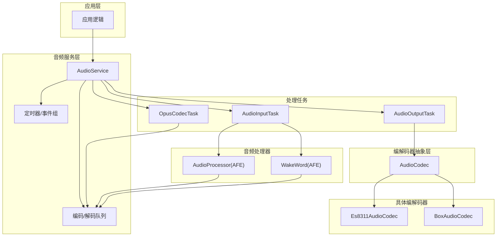
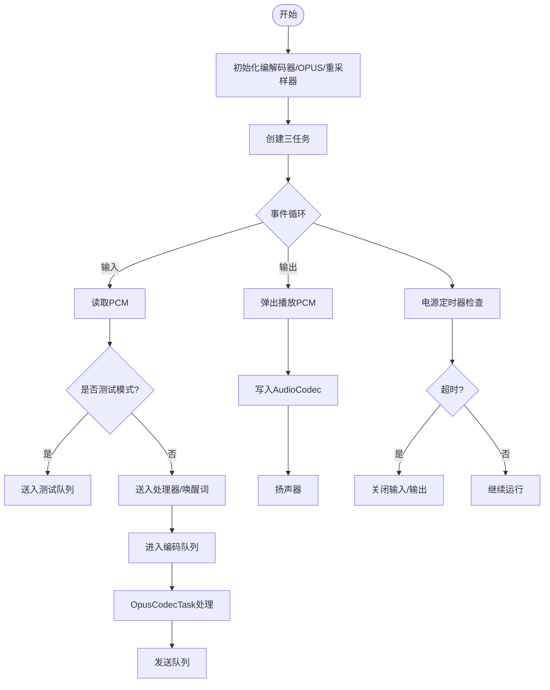
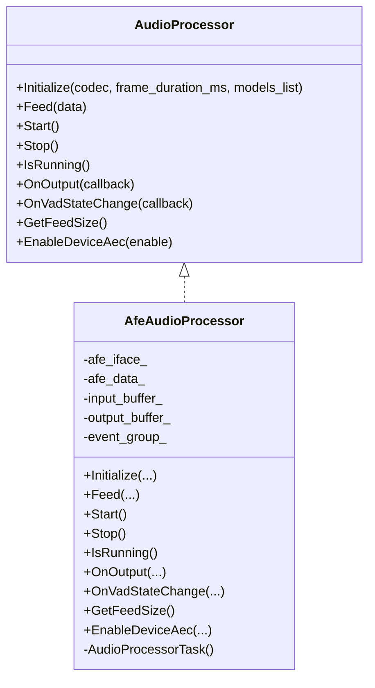
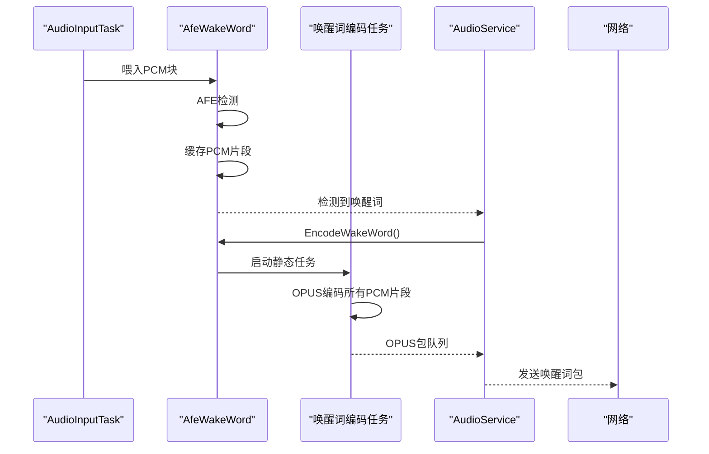
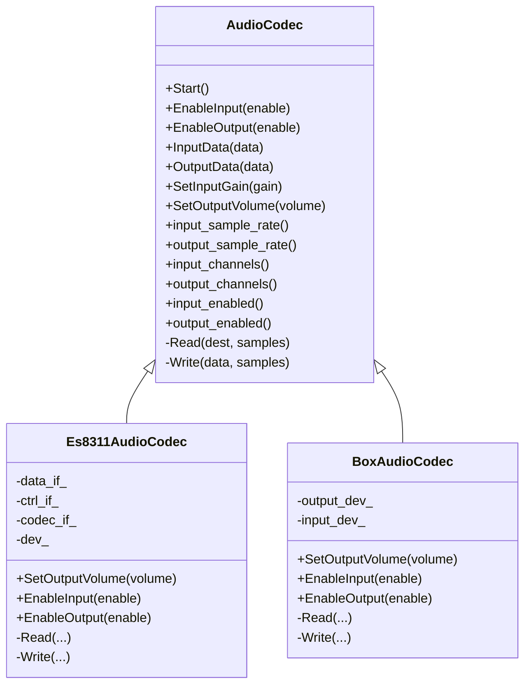
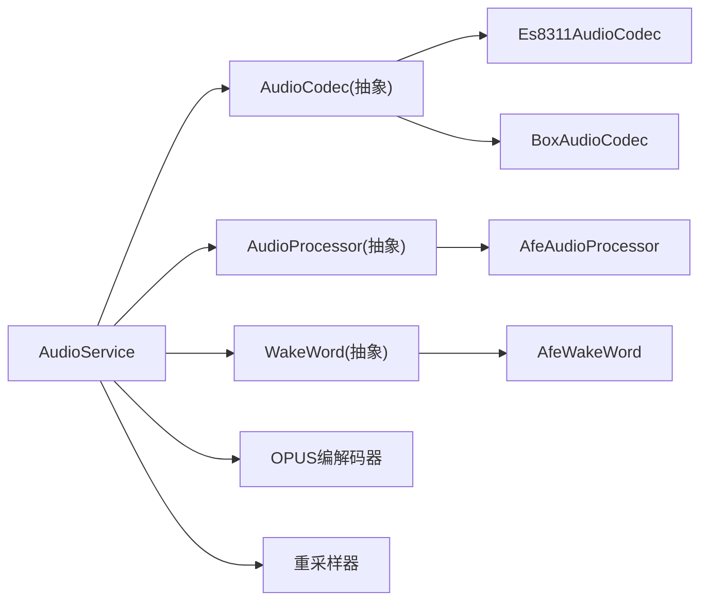

# 音频系统

<cite>
**本文引用的文件**
- [main/audio/README.md](file://main/audio/README.md)
- [main/audio/audio_service.h](file://main/audio/audio_service.h)
- [main/audio/audio_service.cc](file://main/audio/audio_service.cc)
- [main/audio/audio_codec.h](file://main/audio/audio_codec.h)
- [main/audio/codecs/es8311_audio_codec.h](file://main/audio/codecs/es8311_audio_codec.h)
- [main/audio/codecs/es8311_audio_codec.cc](file://main/audio/codecs/es8311_audio_codec.cc)
- [main/audio/codecs/box_audio_codec.h](file://main/audio/codecs/box_audio_codec.h)
- [main/audio/codecs/box_audio_codec.cc](file://main/audio/codecs/box_audio_codec.cc)
- [main/audio/audio_processor.h](file://main/audio/audio_processor.h)
- [main/audio/processors/afe_audio_processor.h](file://main/audio/processors/afe_audio_processor.h)
- [main/audio/processors/afe_audio_processor.cc](file://main/audio/processors/afe_audio_processor.cc)
- [main/audio/processors/audio_debugger.h](file://main/audio/processors/audio_debugger.h)
- [main/audio/wake_words/afe_wake_word.h](file://main/audio/wake_words/afe_wake_word.h)
- [main/audio/wake_words/afe_wake_word.cc](file://main/audio/wake_words/afe_wake_word.cc)
</cite>

## 目录
1. [简介](#简介)
2. [项目结构](#项目结构)
3. [核心组件](#核心组件)
4. [架构总览](#架构总览)
5. [组件详解](#组件详解)
6. [依赖关系分析](#依赖关系分析)
7. [性能与优化](#性能与优化)
8. [测试与调试](#测试与调试)
9. [故障排除](#故障排除)
10. [结论](#结论)

## 简介
本文件面向音频开发者与硬件工程师，系统化梳理 XiaoZhi ESP32 项目的音频系统设计与实现，重点覆盖以下方面：
- 音频服务架构与实时处理流水线
- OPUS 编解码器配置与参数优化
- 音频处理器（AFE）与调试器
- 音频编解码器抽象层与多硬件平台适配
- 音频质量优化策略（采样率、缓冲区、延迟）
- 测试与调试工具及故障排除

## 项目结构
音频子系统位于 main/audio 目录，采用“服务 + 抽象层 + 具体实现”的分层设计：
- 服务层：AudioService 统一调度与协调
- 抽象层：AudioCodec、AudioProcessor、WakeWord 定义通用接口
- 具体实现：ES8311/Box 等音频编解码器；AFE 音频处理器；唤醒词检测器
- 工具与辅助：音频调试器、OGG 解复用器



图表来源
- [main/audio/audio_service.h](file://main/audio/audio_service.h#L105-L195)
- [main/audio/audio_service.cc](file://main/audio/audio_service.cc#L125-L167)
- [main/audio/audio_codec.h](file://main/audio/audio_codec.h#L17-L62)
- [main/audio/codecs/es8311_audio_codec.h](file://main/audio/codecs/es8311_audio_codec.h#L13-L42)
- [main/audio/codecs/box_audio_codec.h](file://main/audio/codecs/box_audio_codec.h#L11-L41)

章节来源
- [main/audio/README.md](file://main/audio/README.md#L1-L88)
- [main/audio/audio_service.h](file://main/audio/audio_service.h#L1-L195)
- [main/audio/audio_service.cc](file://main/audio/audio_service.cc#L1-L732)

## 核心组件
- AudioService：音频中枢，负责初始化、启动/停止、队列管理、任务调度、电源管理与回调通知。
- AudioCodec：硬件抽象层，统一 I2S 读写、增益/音量控制、输入输出使能。
- AudioProcessor：实时音频处理接口，提供 VAD、降噪、回声消除等能力。
- WakeWord：关键词唤醒检测，支持 AFE 模型加载与唤醒后语音片段编码。
- OPUS 编解码器：基于 ESP-Audio 提供的 OPUS 编解码器封装，用于低延迟、高压缩比的语音传输。

章节来源
- [main/audio/audio_service.h](file://main/audio/audio_service.h#L105-L195)
- [main/audio/audio_codec.h](file://main/audio/audio_codec.h#L17-L62)
- [main/audio/audio_processor.h](file://main/audio/audio_processor.h#L11-L27)
- [main/audio/wake_words/afe_wake_word.h](file://main/audio/wake_words/afe_wake_word.h#L22-L63)

## 架构总览
音频系统采用三任务模型：
- AudioInputTask：从 AudioCodec 读取原始 PCM，喂给 WakeWord/AudioProcessor，并按帧大小送入编码队列。
- AudioOutputTask：从播放队列取出 PCM，写入 AudioCodec 播放。
- OpusCodecTask：并发执行编码与解码，维护发送/播放队列。

```mermaid
sequenceDiagram
participant MIC as "麦克风"
participant AC as "AudioCodec"
participant IT as "AudioInputTask"
participant AP as "AudioProcessor"
participant WW as "WakeWord"
participant CT as "OpusCodecTask"
participant NET as "网络"
participant DEC as "OpusDecoder"
participant OUT as "Speaker"
MIC->>AC : 原始PCM
AC-->>IT : PCM数据
IT->>WW : 喂入唤醒词检测
IT->>AP : 喂入音频处理
AP-->>CT : 处理后的PCM帧
WW-->>CT : 唤醒词PCM片段
CT->>CT : OPUS编码
CT-->>NET : OPUS包
NET-->>CT : OPUS包
CT->>DEC : OPUS解码
DEC-->>CT : PCM帧
CT-->>OUT : PCM数据
OUT<-AC : 播放
```

图表来源
- [main/audio/audio_service.cc](file://main/audio/audio_service.cc#L230-L288)
- [main/audio/audio_service.cc](file://main/audio/audio_service.cc#L290-L325)
- [main/audio/audio_service.cc](file://main/audio/audio_service.cc#L327-L446)

章节来源
- [main/audio/README.md](file://main/audio/README.md#L22-L88)
- [main/audio/audio_service.cc](file://main/audio/audio_service.cc#L125-L167)

## 组件详解

### AudioService 服务
- 职责：统一初始化编解码器、OPUS 编解码器与重采样器；创建并调度三个任务；管理队列与事件；电源超时自动休眠。
- 关键队列：
  - audio_encode_queue_/audio_decode_queue_：待编码/待解码的音频任务
  - audio_send_queue_/audio_playback_queue_：发送队列/播放队列
  - audio_testing_queue_：音频测试专用队列
- 关键配置：
  - OPUS 帧长、比特率、VBR/DTX/FEC 等参数
  - 编解码器帧大小与输出缓冲区大小
  - 最大队列长度与最大时间戳队列长度
- 电源管理：基于定时器周期检查最近输入/输出时间，超过阈值关闭 ADC/DAC 通道以节能。



图表来源
- [main/audio/audio_service.cc](file://main/audio/audio_service.cc#L62-L123)
- [main/audio/audio_service.cc](file://main/audio/audio_service.cc#L125-L167)
- [main/audio/audio_service.cc](file://main/audio/audio_service.cc#L682-L695)

章节来源
- [main/audio/audio_service.h](file://main/audio/audio_service.h#L39-L76)
- [main/audio/audio_service.h](file://main/audio/audio_service.h#L105-L195)
- [main/audio/audio_service.cc](file://main/audio/audio_service.cc#L1-L732)

### OPUS 编解码器与配置
- 编码器配置要点：
  - 采样率：16kHz
  - 声道：单声道
  - 位深：16bit
  - 比特率：自动
  - 帧时长：可配置（默认 60ms）
  - 应用模式：音频
  - 复杂度：0
  - FEC：禁用
  - DTX：启用
  - VBR：启用
- 帧大小与输出缓冲区大小通过编解码器查询获得，确保编码/解码流程稳定。
- 解码器按包内采样率与帧时长动态重建，必要时进行输出重采样。

章节来源
- [main/audio/audio_service.h](file://main/audio/audio_service.h#L65-L76)
- [main/audio/audio_service.cc](file://main/audio/audio_service.cc#L66-L84)
- [main/audio/audio_service.cc](file://main/audio/audio_service.cc#L448-L482)

### 音频处理器（AFE）
- 接口职责：Initialize/Feed/Start/Stop/IsRunning/OnOutput/OnVadStateChange/GetFeedSize/EnableDeviceAec。
- 实现要点：
  - 使用 ESP-ADF 的 AFE 接口，支持 VAD、降噪、回声消除等。
  - 内部任务持续 fetch，根据帧时长拼接输出，触发 OnOutput 回调。
  - 支持设备侧 AEC 开关（受编译宏控制）。
- 与服务层协作：AudioService 将处理结果推送到编码队列，同时监听 VAD 状态变化。



图表来源
- [main/audio/audio_processor.h](file://main/audio/audio_processor.h#L11-L27)
- [main/audio/processors/afe_audio_processor.h](file://main/audio/processors/afe_audio_processor.h#L17-L48)
- [main/audio/processors/afe_audio_processor.cc](file://main/audio/processors/afe_audio_processor.cc#L13-L75)

章节来源
- [main/audio/audio_processor.h](file://main/audio/audio_processor.h#L1-L27)
- [main/audio/processors/afe_audio_processor.h](file://main/audio/processors/afe_audio_processor.h#L1-L48)
- [main/audio/processors/afe_audio_processor.cc](file://main/audio/processors/afe_audio_processor.cc#L1-L202)

### 唤醒词检测器（AFE）
- 功能：在独立任务中持续检测唤醒词，检测到后触发回调，并将唤醒前后的音频片段缓存以便后续编码发送。
- 数据路径：输入 PCM → AFE 检测 → 存储 PCM 片段 → 异步编码为 OPUS → 提供给上层发送。
- 与服务层集成：AudioService 在启用唤醒词时，将唤醒词检测与音频处理任务分离，避免相互干扰。



图表来源
- [main/audio/wake_words/afe_wake_word.h](file://main/audio/wake_words/afe_wake_word.h#L22-L63)
- [main/audio/wake_words/afe_wake_word.cc](file://main/audio/wake_words/afe_wake_word.cc#L172-L264)
- [main/audio/audio_service.cc](file://main/audio/audio_service.cc#L531-L547)

章节来源
- [main/audio/wake_words/afe_wake_word.h](file://main/audio/wake_words/afe_wake_word.h#L1-L63)
- [main/audio/wake_words/afe_wake_word.cc](file://main/audio/wake_words/afe_wake_word.cc#L1-L264)
- [main/audio/audio_service.cc](file://main/audio/audio_service.cc#L531-L547)

### 音频编解码器抽象层与多硬件平台适配
- 抽象层接口：统一 Start/EnableInput/EnableOutput/InputData/OutputData/参数查询等。
- ES8311 实现：双工 I2S 通道，支持输入增益与输出音量设置，PA 引脚可选反相。
- Box 实现：双编解码器组合（ES8311 输出 + ES7210 输入），支持多麦克风输入与参考输入（回声消除）。



图表来源
- [main/audio/audio_codec.h](file://main/audio/audio_codec.h#L17-L62)
- [main/audio/codecs/es8311_audio_codec.h](file://main/audio/codecs/es8311_audio_codec.h#L13-L42)
- [main/audio/codecs/es8311_audio_codec.cc](file://main/audio/codecs/es8311_audio_codec.cc#L70-L98)
- [main/audio/codecs/box_audio_codec.h](file://main/audio/codecs/box_audio_codec.h#L11-L41)
- [main/audio/codecs/box_audio_codec.cc](file://main/audio/codecs/box_audio_codec.cc#L94-L182)

章节来源
- [main/audio/audio_codec.h](file://main/audio/audio_codec.h#L1-L62)
- [main/audio/codecs/es8311_audio_codec.h](file://main/audio/codecs/es8311_audio_codec.h#L1-L42)
- [main/audio/codecs/es8311_audio_codec.cc](file://main/audio/codecs/es8311_audio_codec.cc#L1-L199)
- [main/audio/codecs/box_audio_codec.h](file://main/audio/codecs/box_audio_codec.h#L1-L41)
- [main/audio/codecs/box_audio_codec.cc](file://main/audio/codecs/box_audio_codec.cc#L1-L247)

### 音频调试器
- 功能：将原始 PCM 数据通过 UDP 发送至调试服务器，便于网络链路与编解码质量验证。
- 使用场景：开发阶段快速定位音频链路问题，或配合外部分析工具。

章节来源
- [main/audio/processors/audio_debugger.h](file://main/audio/processors/audio_debugger.h#L1-L22)

## 依赖关系分析
- AudioService 依赖：
  - AudioCodec（抽象）
  - AudioProcessor（抽象）
  - WakeWord（抽象）
  - OPUS 编解码器与重采样器
  - FreeRTOS 事件组与定时器
- 编解码器实现依赖：
  - ESP-IDF I2S 驱动
  - ESP-CODEC-DEV 驱动栈
  - AFE/VAD/NS/AEC 模型库（ESP-ADF）



图表来源
- [main/audio/audio_service.h](file://main/audio/audio_service.h#L21-L26)
- [main/audio/audio_service.cc](file://main/audio/audio_service.cc#L25-L36)
- [main/audio/audio_codec.h](file://main/audio/audio_codec.h#L12-L12)
- [main/audio/processors/afe_audio_processor.h](file://main/audio/processors/afe_audio_processor.h#L14-L16)
- [main/audio/wake_words/afe_wake_word.h](file://main/audio/wake_words/afe_wake_word.h#L19-L21)

章节来源
- [main/audio/audio_service.h](file://main/audio/audio_service.h#L21-L26)
- [main/audio/audio_service.cc](file://main/audio/audio_service.cc#L25-L36)

## 性能与优化
- 采样率与帧长
  - 编码采样率固定为 16kHz，帧长可配置（默认 60ms）。更短帧长可降低端到端延迟，但会增加 CPU 占用与抖动风险。
  - 解码采样率按包内参数动态设置，若与板载 DAC 不一致则进行重采样。
- 缓冲区与队列
  - 编码/解码/播放队列均设置上限，防止内存膨胀与阻塞。发送队列与播放队列上限与帧长成比例，保证吞吐与稳定性。
  - 测试模式队列限制为最大测试时长对应的包数，避免长时间占用资源。
- 延迟控制
  - AudioInputTask 以固定帧长喂入处理器，减少跨帧边界带来的处理开销。
  - OpusCodecTask 并发处理编码与解码，避免串行瓶颈。
- 功耗优化
  - 电源定时器在无活动时自动关闭输入/输出通道，降低功耗。
- AEC 与 VAD
  - 设备侧 AEC 受编译宏控制，启用后可显著改善远场拾音质量，但需注意与服务器 AEC 的协同。
  - VAD 状态变化用于驱动上层逻辑（如开始录音、清空队列等）。

章节来源
- [main/audio/audio_service.h](file://main/audio/audio_service.h#L39-L48)
- [main/audio/audio_service.h](file://main/audio/audio_service.h#L65-L76)
- [main/audio/audio_service.cc](file://main/audio/audio_service.cc#L682-L695)
- [main/audio/processors/afe_audio_processor.cc](file://main/audio/processors/afe_audio_processor.cc#L189-L201)

## 测试与调试
- 音频测试模式
  - 通过事件标志启动测试模式，AudioInputTask 以固定帧长采集并送入测试队列，随后转为解码播放。
  - 适合在设备未联网时验证硬件链路与编解码质量。
- 唤醒词测试
  - 唤醒词检测完成后，可调用编码接口生成唤醒词 OPUS 包，便于网络联调。
- 音频调试器
  - 将原始 PCM 通过 UDP 发送，便于网络链路与编解码质量验证。
- OGG 播放
  - 通过 OggDemuxer 解复用后送入解码队列，验证解码链路与播放链路。

章节来源
- [main/audio/audio_service.cc](file://main/audio/audio_service.cc#L606-L617)
- [main/audio/audio_service.cc](file://main/audio/audio_service.cc#L633-L654)
- [main/audio/wake_words/afe_wake_word.cc](file://main/audio/wake_words/afe_wake_word.cc#L172-L264)
- [main/audio/processors/audio_debugger.h](file://main/audio/processors/audio_debugger.h#L1-L22)

## 故障排除
- 编解码失败
  - 现象：日志显示编码/解码错误码。
  - 排查：确认帧大小与输出缓冲区大小查询成功；检查 OPUS 句柄是否正确打开；核对输入 PCM 长度与期望帧大小一致。
- 音频无声
  - 现象：播放队列有数据但无声音。
  - 排查：确认 AudioCodec 输出已启用；检查 PA 引脚配置与电平；核对输出音量设置；确认电源定时器未提前关闭输出。
- 唤醒词无效
  - 现象：无法检测到唤醒词。
  - 排查：确认模型列表包含 WakeNet 模型；检查输入通道格式与参考输入配置；确认 AFE 初始化成功且任务在运行。
- 延迟过大
  - 现象：端到端延迟超出预期。
  - 排查：缩短 OPUS 帧长；检查是否有过多队列堆积；确认未启用不必要的后处理（如高复杂度降噪）。
- 功耗偏高
  - 现象：设备在空闲时仍保持较高电流。
  - 排查：确认电源定时器正常工作；检查是否存在持续活动的任务；确认输入/输出通道在空闲时被关闭。

章节来源
- [main/audio/audio_service.cc](file://main/audio/audio_service.cc#L366-L392)
- [main/audio/audio_service.cc](file://main/audio/audio_service.cc#L435-L440)
- [main/audio/audio_service.cc](file://main/audio/audio_service.cc#L303-L321)
- [main/audio/audio_service.cc](file://main/audio/audio_service.cc#L682-L695)
- [main/audio/wake_words/afe_wake_word.cc](file://main/audio/wake_words/afe_wake_word.cc#L144-L160)

## 结论
XiaoZhi ESP32 的音频系统以 AudioService 为核心，结合 OPUS 编解码器与 AFE 音频处理，在多硬件平台上实现了高可移植性与低延迟的语音处理能力。通过合理的队列与任务划分、动态重采样与电源管理，系统在资源受限的嵌入式环境中实现了稳定的实时音频处理。开发者可根据目标应用场景调整帧长、采样率与后处理模块，进一步优化延迟与质量平衡。