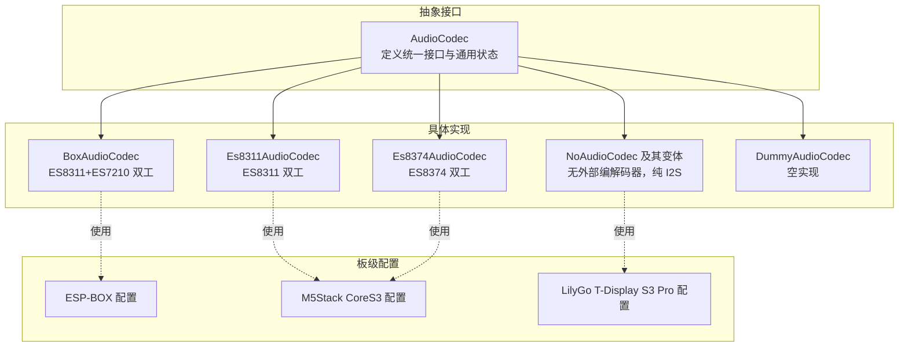
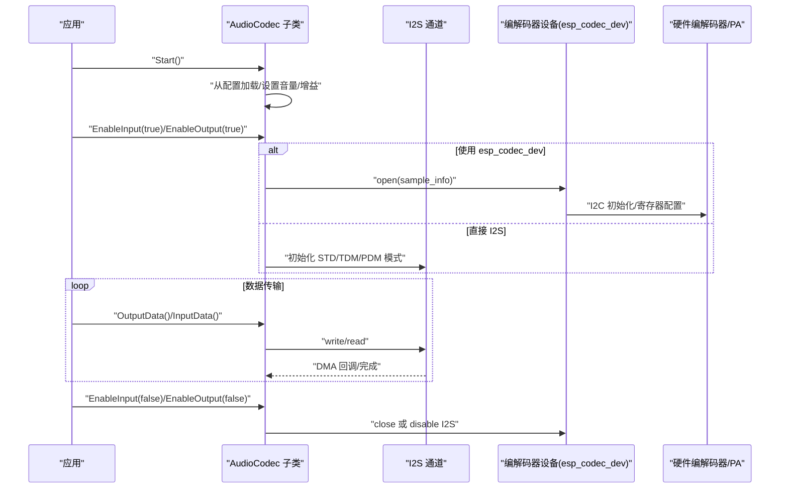
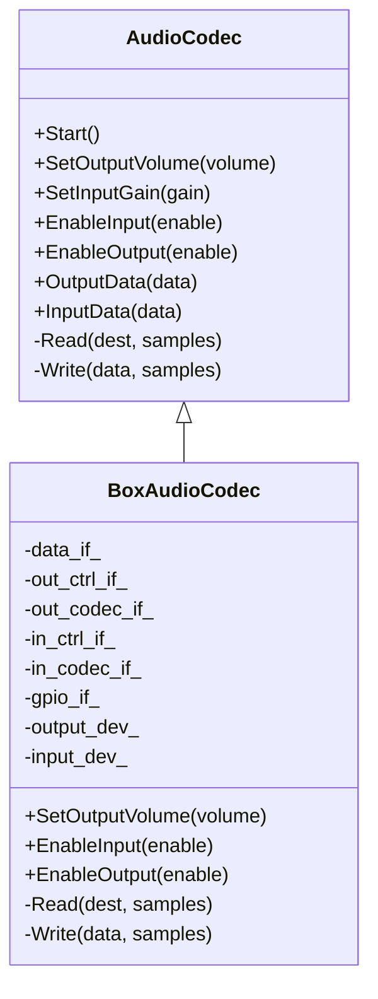
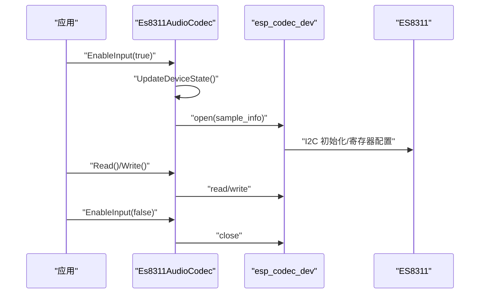
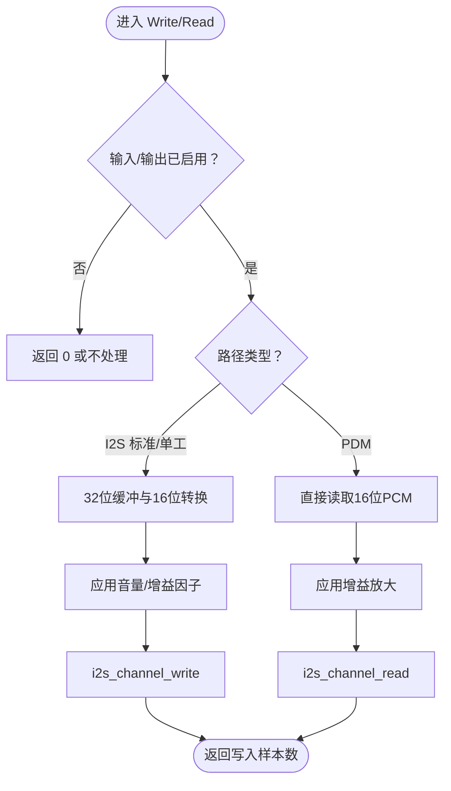
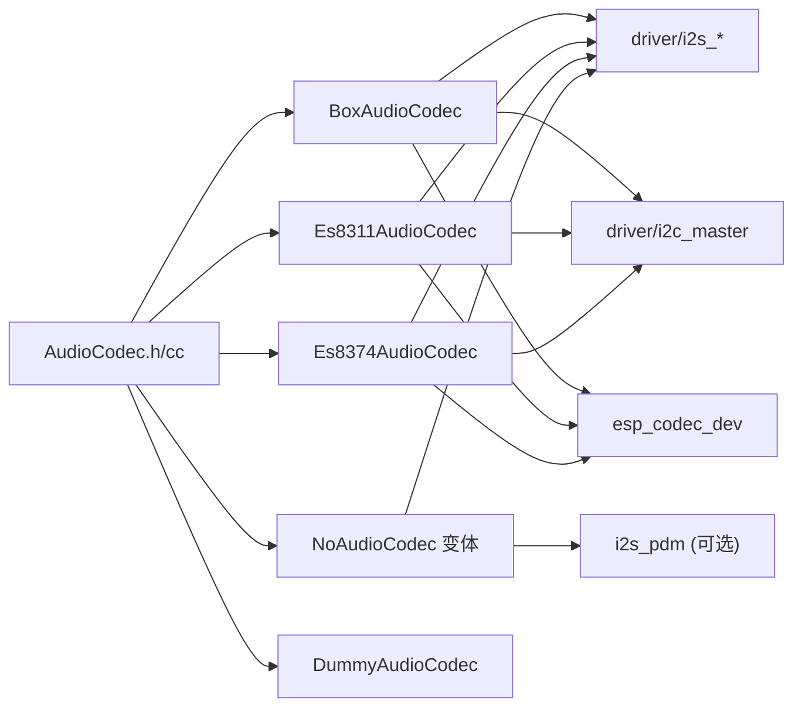

# 音频编解码器实现

<cite>
**本文引用的文件**
- [audio_codec.h](file://main/audio/audio_codec.h)
- [audio_codec.cc](file://main/audio/audio_codec.cc)
- [box_audio_codec.h](file://main/audio/codecs/box_audio_codec.h)
- [box_audio_codec.cc](file://main/audio/codecs/box_audio_codec.cc)
- [no_audio_codec.h](file://main/audio/codecs/no_audio_codec.h)
- [no_audio_codec.cc](file://main/audio/codecs/no_audio_codec.cc)
- [es8311_audio_codec.h](file://main/audio/codecs/es8311_audio_codec.h)
- [es8311_audio_codec.cc](file://main/audio/codecs/es8311_audio_codec.cc)
- [es8374_audio_codec.h](file://main/audio/codecs/es8374_audio_codec.h)
- [es8374_audio_codec.cc](file://main/audio/codecs/es8374_audio_codec.cc)
- [dummy_audio_codec.h](file://main/audio/codecs/dummy_audio_codec.h)
- [dummy_audio_codec.cc](file://main/audio/codecs/dummy_audio_codec.cc)
- [config.h（ESP-BOX）](file://main/boards/esp-box/config.h)
- [config.h（M5Stack CoreS3）](file://main/boards/m5stack-core-s3/config.h)
- [config.h（LilyGo T-Display S3 Pro MVSRLora）](file://main/boards/lilygo-t-display-s3-pro-mvsrlora/config.h)
</cite>

## 目录
1. [简介](#简介)
2. [项目结构](#项目结构)
3. [核心组件](#核心组件)
4. [架构总览](#架构总览)
5. [详细组件分析](#详细组件分析)
6. [依赖关系分析](#依赖关系分析)
7. [性能考量](#性能考量)
8. [故障排除指南](#故障排除指南)
9. [结论](#结论)
10. [附录](#附录)

## 简介
本文件系统性梳理 XiaoZhi ESP32 项目中的音频编解码器实现，围绕 AudioCodec 抽象基类及其多种具体实现展开，重点说明：
- 统一接口设计与硬件无关的适配机制
- 各编解码器的初始化流程、配置参数、采样率与声道设置
- 双工/单工模式、I2S 与 I2C 控制路径、PA 放大器控制
- 在不同硬件平台上的适配方式与典型配置
- 性能对比与选型建议、常见问题排查与调试方法

## 项目结构
音频相关代码主要位于 main/audio 目录，按“抽象接口 + 具体实现 + 板级配置”分层组织：
- 抽象层：AudioCodec 定义统一接口与通用状态管理
- 实现层：BoxAudioCodec、Es8311AudioCodec、Es8374AudioCodec、NoAudioCodec（含多种变体）、DummyAudioCodec
- 板级配置：各 board 的 config.h 提供 I2S 引脚、采样率、I2C 地址等硬件参数

图表来源
- [audio_codec.h](file://main/audio/audio_codec.h#L17-L59)
- [box_audio_codec.h](file://main/audio/codecs/box_audio_codec.h#L11-L38)
- [es8311_audio_codec.h](file://main/audio/codecs/es8311_audio_codec.h#L13-L40)
- [es8374_audio_codec.h](file://main/audio/codecs/es8374_audio_codec.h#L13-L39)
- [no_audio_codec.h](file://main/audio/codecs/no_audio_codec.h#L10-L41)
- [dummy_audio_codec.h](file://main/audio/codecs/dummy_audio_codec.h#L6-L14)
- [config.h（ESP-BOX）](file://main/boards/esp-box/config.h#L6-L21)
- [config.h（M5Stack CoreS3）](file://main/boards/m5stack-core-s3/config.h#L8-L21)
- [config.h（LilyGo T-Display S3 Pro MVSRLora）](file://main/boards/lilygo-t-display-s3-pro-mvsrlora/config.h#L7-L19)

章节来源
- [audio_codec.h](file://main/audio/audio_codec.h#L1-L62)
- [audio_codec.cc](file://main/audio/audio_codec.cc#L1-L68)
- [box_audio_codec.h](file://main/audio/codecs/box_audio_codec.h#L1-L41)
- [box_audio_codec.cc](file://main/audio/codecs/box_audio_codec.cc#L1-L247)
- [no_audio_codec.h](file://main/audio/codecs/no_audio_codec.h#L1-L42)
- [no_audio_codec.cc](file://main/audio/codecs/no_audio_codec.cc#L1-L386)
- [es8311_audio_codec.h](file://main/audio/codecs/es8311_audio_codec.h#L1-L42)
- [es8311_audio_codec.cc](file://main/audio/codecs/es8311_audio_codec.cc#L1-L199)
- [es8374_audio_codec.h](file://main/audio/codecs/es8374_audio_codec.h#L1-L41)
- [es8374_audio_codec.cc](file://main/audio/codecs/es8374_audio_codec.cc#L1-L200)
- [dummy_audio_codec.h](file://main/audio/codecs/dummy_audio_codec.h#L1-L16)
- [dummy_audio_codec.cc](file://main/audio/codecs/dummy_audio_codec.cc#L1-L21)
- [config.h（ESP-BOX）](file://main/boards/esp-box/config.h#L1-L42)
- [config.h（M5Stack CoreS3）](file://main/boards/m5stack-core-s3/config.h#L1-L67)
- [config.h（LilyGo T-Display S3 Pro MVSRLora）](file://main/boards/lilygo-t-display-s3-pro-mvsrlora/config.h#L1-L48)

## 核心组件
- 抽象基类 AudioCodec
  - 职责：统一输出音量、输入增益、输入/输出使能、启动、读写接口；封装 I2S 通道句柄与通用状态
  - 关键属性：采样率、声道数、音量、增益、输入/输出开关、是否双工、是否使用参考输入
  - 关键方法：Start、SetOutputVolume、SetInputGain、EnableInput、EnableOutput、OutputData、InputData；虚函数 Read/Write 交由子类实现
- 子类实现概览
  - BoxAudioCodec：基于 esp_codec_dev，连接 ES8311（DAC）+ ES7210（ADC），支持回声消除参考输入
  - Es8311AudioCodec：仅 DAC，双工，可控制 PA 引脚电平
  - Es8374AudioCodec：双工，分别管理输入/输出设备句柄
  - NoAudioCodec 及变体：无外部编解码器，直接通过 I2S 输出/输入，支持单工/双工、PDM 录音
  - DummyAudioCodec：空实现，用于占位或测试

章节来源
- [audio_codec.h](file://main/audio/audio_codec.h#L17-L59)
- [audio_codec.cc](file://main/audio/audio_codec.cc#L11-L67)
- [box_audio_codec.h](file://main/audio/codecs/box_audio_codec.h#L11-L38)
- [es8311_audio_codec.h](file://main/audio/codecs/es8311_audio_codec.h#L13-L40)
- [es8374_audio_codec.h](file://main/audio/codecs/es8374_audio_codec.h#L13-L39)
- [no_audio_codec.h](file://main/audio/codecs/no_audio_codec.h#L10-L41)
- [dummy_audio_codec.h](file://main/audio/codecs/dummy_audio_codec.h#L6-L14)

## 架构总览
统一的 AudioCodec 接口屏蔽了不同硬件编解码器的差异，具体实现通过 I2S 数据接口与 I2C 控制接口协同工作。典型流程如下：

图表来源
- [audio_codec.cc](file://main/audio/audio_codec.cc#L29-L38)
- [box_audio_codec.cc](file://main/audio/codecs/box_audio_codec.cc#L189-L233)
- [es8311_audio_codec.cc](file://main/audio/codecs/es8311_audio_codec.cc#L163-L185)
- [es8374_audio_codec.cc](file://main/audio/codecs/es8374_audio_codec.cc#L139-L186)
- [no_audio_codec.cc](file://main/audio/codecs/no_audio_codec.cc#L257-L281)

## 详细组件分析

### AudioCodec 抽象基类
- 设计要点
  - 通过虚函数 Read/Write 将“数据路径”与“控制路径”解耦，便于替换不同硬件
  - 通过 Start 从设置中恢复音量等状态，并记录日志
  - 通过 EnableInput/EnableOutput 控制 I2S 或 esp_codec_dev 的打开/关闭，避免资源冲突
- 关键接口
  - 设置/查询：SetOutputVolume、SetInputGain、EnableInput、EnableOutput、Start
  - 访问器：duplex、input_reference、input_sample_rate、output_sample_rate、input_channels、output_channels、output_volume、input_gain、input_enabled、output_enabled
- 通用状态
  - I2S 通道句柄 tx_handle_/rx_handle_
  - 采样率、声道数、音量、增益、输入/输出开关、是否双工、是否使用参考输入

章节来源
- [audio_codec.h](file://main/audio/audio_codec.h#L17-L59)
- [audio_codec.cc](file://main/audio/audio_codec.cc#L11-L67)

### BoxAudioCodec（ES8311 + ES7210）
- 特点
  - 双工：I2S 标准模式用于 DAC，TDM 模式用于 ADC，采样率一致
  - 输入参考：可启用参考输入以支持回声消除
  - 通过 esp_codec_dev 管理 ES8311（DAC）与 ES7210（ADC），I2C 控制
  - 支持 PA 扬声器引脚控制
- 初始化流程
  - 创建 I2S 双工通道（STD/TDM）
  - 初始化 ES8311（输出）与 ES7210（输入）的 I2C 控制接口与 GPIO 接口
  - 构造 esp_codec_dev 输出/输入设备并打开
- 参数与配置
  - 采样率：输入/输出一致
  - 声道：根据是否启用参考输入决定输入声道数
  - I2S 引脚：MCLK/BCLK/WS/DOUT/DIN
  - I2C 地址：ES8311/ES7210
  - PA 引脚：外接功放
- 读写与使能
  - EnableInput/EnableOutput 时根据采样信息 open/close 设备
  - Read/Write 直接委托给 esp_codec_dev

图表来源
- [audio_codec.h](file://main/audio/audio_codec.h#L17-L59)
- [box_audio_codec.h](file://main/audio/codecs/box_audio_codec.h#L11-L38)

章节来源
- [box_audio_codec.h](file://main/audio/codecs/box_audio_codec.h#L11-L38)
- [box_audio_codec.cc](file://main/audio/codecs/box_audio_codec.cc#L9-L78)
- [box_audio_codec.cc](file://main/audio/codecs/box_audio_codec.cc#L189-L233)
- [box_audio_codec.cc](file://main/audio/codecs/box_audio_codec.cc#L235-L247)

### Es8311AudioCodec（ES8311 双工）
- 特点
  - 双工，使用 ES8311，支持 PA 引脚电平控制（可反相）
  - 通过 esp_codec_dev 管理输入/输出，统一 open/close 生命周期
- 初始化流程
  - 创建 I2S 双工通道（STD 模式）
  - 初始化 ES8311 的 I2C 控制接口与 GPIO 接口
  - 构造 esp_codec_dev 并在使能时 open，释放时 close
- 参数与配置
  - 采样率：输入/输出一致
  - I2C 地址：ES8311
  - PA 引脚：可配置是否反相
- 读写与使能
  - UpdateDeviceState 在输入/输出使能变化时动态 open/close 设备

图表来源
- [es8311_audio_codec.cc](file://main/audio/codecs/es8311_audio_codec.cc#L70-L98)
- [es8311_audio_codec.cc](file://main/audio/codecs/es8311_audio_codec.cc#L163-L185)

章节来源
- [es8311_audio_codec.h](file://main/audio/codecs/es8311_audio_codec.h#L13-L40)
- [es8311_audio_codec.cc](file://main/audio/codecs/es8311_audio_codec.cc#L7-L59)
- [es8311_audio_codec.cc](file://main/audio/codecs/es8311_audio_codec.cc#L163-L185)

### Es8374AudioCodec（ES8374 双工）
- 特点
  - 双工，分别管理输入/输出设备句柄
  - 支持 PA 引脚控制
- 初始化流程
  - 创建 I2S 双工通道（STD 模式）
  - 初始化 ES8374 的 I2C 控制接口与 GPIO 接口
  - 分别构造输入/输出 esp_codec_dev 并打开
- 读写与使能
  - EnableInput/EnableOutput 分别 open/close 对应设备
  - 写入时设置输出音量

章节来源
- [es8374_audio_codec.h](file://main/audio/codecs/es8374_audio_codec.h#L13-L39)
- [es8374_audio_codec.cc](file://main/audio/codecs/es8374_audio_codec.cc#L7-L62)
- [es8374_audio_codec.cc](file://main/audio/codecs/es8374_audio_codec.cc#L139-L186)

### NoAudioCodec 及变体（无外部编解码器）
- NoAudioCodecDuplex
  - 双工：I2S 标准模式，左右声道均可配置
  - 采样位宽：32 位（内部转换为 16 位输出）
  - 音量：通过平方映射到 0~65536 的增益因子
- NoAudioCodecSimplex
  - 单工：分别创建 TX/RX 通道，支持自定义 slot_mask
  - 采样位宽：32 位（内部转换为 16 位输出）
- NoAudioCodecSimplexPdm
  - 单工：扬声器标准 I2S，麦克风 PDM 模式
  - PDM 解调后为 16 位 PCM
- 初始化流程
  - 为 TX/RX 分别创建通道并初始化 STD/TDM/PDM 模式
  - 使能时启用对应通道，失能时禁用
- 读写与使能
  - Write：计算音量增益因子，写入 32 位缓冲，自动截断到 16 位
  - Read：从 32 位缓冲右移 12 位还原为 16 位
  - PDM：直接读取 16 位 PCM，按增益放大

图表来源
- [no_audio_codec.cc](file://main/audio/codecs/no_audio_codec.cc#L217-L255)
- [no_audio_codec.cc](file://main/audio/codecs/no_audio_codec.cc#L367-L385)

章节来源
- [no_audio_codec.h](file://main/audio/codecs/no_audio_codec.h#L10-L41)
- [no_audio_codec.cc](file://main/audio/codecs/no_audio_codec.cc#L18-L75)
- [no_audio_codec.cc](file://main/audio/codecs/no_audio_codec.cc#L217-L281)
- [no_audio_codec.cc](file://main/audio/codecs/no_audio_codec.cc#L289-L385)

### DummyAudioCodec（空实现）
- 特点
  - 无实际硬件交互，读写均返回 0
  - 适合测试或占位场景
- 适用场景
  - 快速验证音频服务框架
  - 无音频需求的设备

章节来源
- [dummy_audio_codec.h](file://main/audio/codecs/dummy_audio_codec.h#L6-L14)
- [dummy_audio_codec.cc](file://main/audio/codecs/dummy_audio_codec.cc#L3-L21)

## 依赖关系分析
- 抽象与实现
  - 所有具体编解码器继承自 AudioCodec，统一接口保证上层调用一致性
- 硬件接口
  - I2S：所有实现均依赖 driver/i2s_std/i2s_tdm/i2s_pdm
  - I2C：部分实现依赖 driver/i2c_master 与 esp_codec_dev
  - GPIO：部分实现依赖 gpio 控制 PA 引脚
- 板级配置
  - 各 board 的 config.h 提供采样率、I2S 引脚、I2C 地址等参数，具体编解码器据此初始化

图表来源
- [audio_codec.h](file://main/audio/audio_codec.h#L4-L6)
- [box_audio_codec.cc](file://main/audio/codecs/box_audio_codec.cc#L3-L5)
- [es8311_audio_codec.cc](file://main/audio/codecs/es8311_audio_codec.cc#L1-L4)
- [es8374_audio_codec.cc](file://main/audio/codecs/es8374_audio_codec.cc#L1-L4)
- [no_audio_codec.cc](file://main/audio/codecs/no_audio_codec.cc#L1-L6)

章节来源
- [audio_codec.h](file://main/audio/audio_codec.h#L4-L6)
- [box_audio_codec.cc](file://main/audio/codecs/box_audio_codec.cc#L3-L5)
- [es8311_audio_codec.cc](file://main/audio/codecs/es8311_audio_codec.cc#L1-L4)
- [es8374_audio_codec.cc](file://main/audio/codecs/es8374_audio_codec.cc#L1-L4)
- [no_audio_codec.cc](file://main/audio/codecs/no_audio_codec.cc#L1-L6)

## 性能考量
- 采样率与声道
  - 双工实现通常要求输入/输出采样率一致，避免采样率转换开销
  - 声道数影响 DMA 帧大小与带宽占用，需结合硬件能力与应用需求平衡
- I2S 位宽与缓冲
  - NoAudioCodec 采用 32 位中间缓冲再转 16 位，增加一次算术运算与内存访问
  - BoxAudioCodec/Es8311AudioCodec/Es8374AudioCodec 直接使用 16 位数据流，减少转换成本
- 音量与增益
  - NoAudioCodec 使用平方映射将 0~100 映射到 0~65536，非线性但覆盖范围广
  - 其他实现通过设备驱动设置音量/增益，通常更高效且线性度更好
- PDM 录音
  - NoAudioCodecSimplexPdm 利用硬件 PDM 解调，降低 CPU 占用，适合低功耗场景
- DMA 与回调
  - DMA 描述符数量与帧大小影响中断频率与延迟，需根据实时性要求调整

## 故障排除指南
- 无法初始化编解码器
  - 检查 I2C 地址与总线是否正确，确认编解码器供电与复位引脚
  - 查看日志中 esp_codec_dev 创建失败或 I2S 通道初始化错误
- 无声或声音异常
  - 确认 EnableOutput 已启用，音量未设为 0
  - 检查 PA 引脚电平（如 ES8311），确认外接功放正常
  - 对于 NoAudioCodec，检查音量增益映射是否合理
- 录音无输入或噪声大
  - 确认 EnableInput 已启用，输入增益设置合适
  - 检查麦克风硬件连接与 slot_mask 配置
  - PDM 模式下确认 PDM 支持与采样率匹配
- 双工不同步
  - 确保输入/输出采样率一致
  - 检查 I2S 时序配置（MCLK/BCLK/WS）与硬件引脚映射
- 日志定位
  - 使用日志标签区分不同编解码器模块，关注初始化、open/close、read/write 返回值

章节来源
- [audio_codec.cc](file://main/audio/audio_codec.cc#L29-L38)
- [box_audio_codec.cc](file://main/audio/codecs/box_audio_codec.cc#L189-L233)
- [es8311_audio_codec.cc](file://main/audio/codecs/es8311_audio_codec.cc#L163-L185)
- [es8374_audio_codec.cc](file://main/audio/codecs/es8374_audio_codec.cc#L139-L186)
- [no_audio_codec.cc](file://main/audio/codecs/no_audio_codec.cc#L257-L281)

## 结论
XiaoZhi 项目的音频编解码器通过 AudioCodec 抽象实现了对多种硬件的统一适配：
- 对于具备外部编解码器的方案（ES8311/ES8374/ES8311+ES7210），通过 esp_codec_dev 管理 I2C 控制与 I2S 数据，易于扩展与维护
- 对于无外部编解码器的方案，NoAudioCodec 提供灵活的 I2S 配置与 PDM 支持，满足多样硬件形态
- 板级配置集中于 config.h，便于在不同硬件平台上快速切换与优化

选型建议
- 需要高质量音频与回声消除：优先 BoxAudioCodec（ES8311+ES7210）
- 仅需要播放：Es8311AudioCodec/Es8374AudioCodec，配置简单、性能稳定
- 自研或低成本方案：NoAudioCodec（I2S/TDM/PDM），可灵活适配不同主控与外设
- 测试与占位：DummyAudioCodec

## 附录
- 板级配置示例
  - ESP-BOX：定义了输入采样率、I2S 引脚、I2C 地址与 PA 引脚
  - M5Stack CoreS3：定义了输入采样率、I2S 引脚、I2C 地址
  - LilyGo T-Display S3 Pro：定义了麦克风/扬声器 I2S 引脚与使能引脚

章节来源
- [config.h（ESP-BOX）](file://main/boards/esp-box/config.h#L6-L21)
- [config.h（M5Stack CoreS3）](file://main/boards/m5stack-core-s3/config.h#L8-L21)
- [config.h（LilyGo T-Display S3 Pro MVSRLora）](file://main/boards/lilygo-t-display-s3-pro-mvsrlora/config.h#L7-L19)