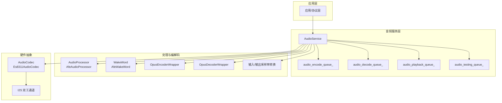
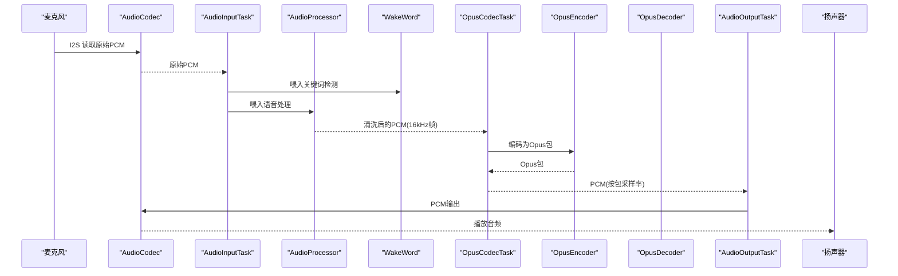
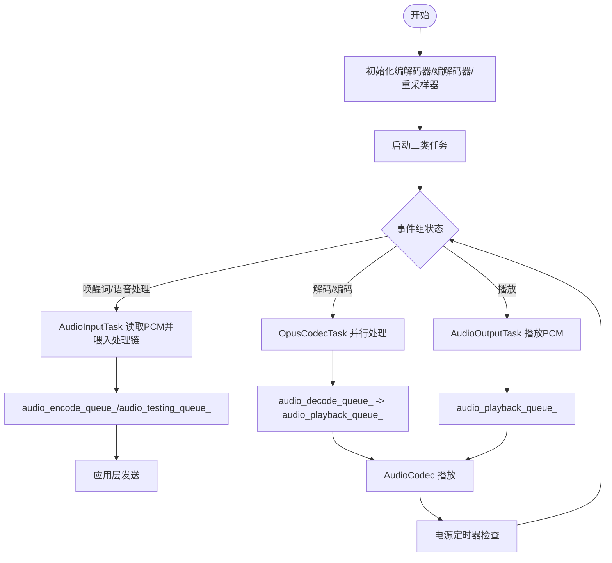
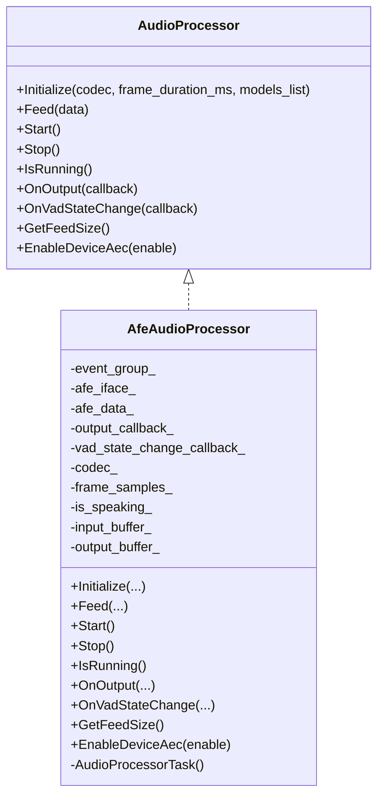
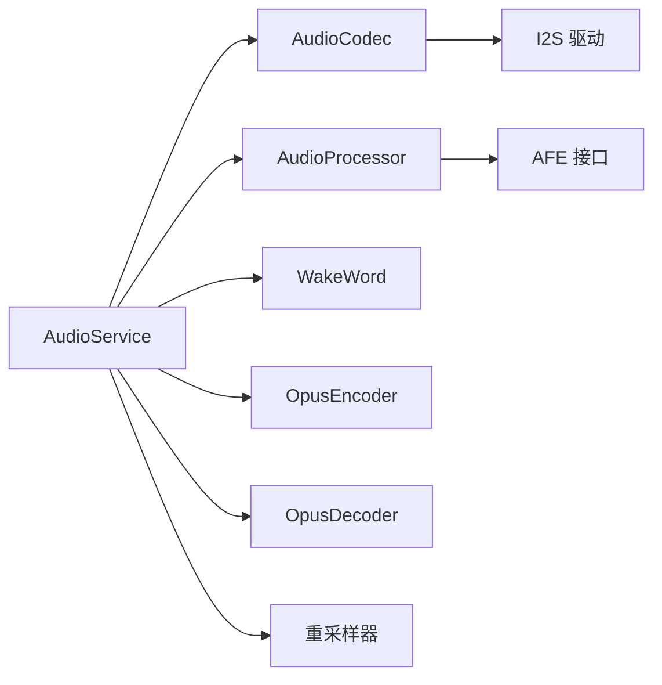

# 音频质量优化

<cite>
**本文引用的文件**
- [main/audio/README.md](file://main/audio/README.md)
- [main/audio/audio_service.h](file://main/audio/audio_service.h)
- [main/audio/audio_service.cc](file://main/audio/audio_service.cc)
- [main/audio/audio_codec.h](file://main/audio/audio_codec.h)
- [main/audio/audio_processor.h](file://main/audio/audio_processor.h)
- [main/audio/processors/afe_audio_processor.h](file://main/audio/processors/afe_audio_processor.h)
- [main/audio/processors/afe_audio_processor.cc](file://main/audio/processors/afe_audio_processor.cc)
- [main/audio/codecs/es8311_audio_codec.h](file://main/audio/codecs/es8311_audio_codec.h)
- [main/audio/codecs/es8311_audio_codec.cc](file://main/audio/codecs/es8311_audio_codec.cc)
- [main/audio/wake_words/afe_wake_word.h](file://main/audio/wake_words/afe_wake_word.h)
- [main/audio/processors/audio_debugger.h](file://main/audio/processors/audio_debugger.h)
- [main/audio/processors/audio_debugger.cc](file://main/audio/processors/audio_debugger.cc)
- [scripts/audio_debug_server.py](file://scripts/audio_debug_server.py)
- [scripts/acoustic_check/main.py](file://scripts/acoustic_check/main.py)
</cite>

## 目录
1. [简介](#简介)
2. [项目结构](#项目结构)
3. [核心组件](#核心组件)
4. [架构总览](#架构总览)
5. [详细组件分析](#详细组件分析)
6. [依赖关系分析](#依赖关系分析)
7. [性能考量](#性能考量)
8. [故障排查指南](#故障排查指南)
9. [结论](#结论)
10. [附录](#附录)

## 简介
本文件面向音频系统工程师与性能优化专家，围绕 XiaoZhi ESP32 项目的音频子系统，系统化梳理音频质量评估指标与测量方法（信噪比 SNR、总谐波失真 THD、动态范围、延迟等），给出音频延迟控制策略（缓冲区大小、任务优先级、中断优化）、资源管理优化（内存分配、CPU 负载均衡、功耗控制）、稳定性提升（异常处理、重试与降级）、性能监控与诊断工具（实时监控、日志分析、瓶颈定位），并提供跨硬件平台的优化建议与测试验证标准流程。

## 项目结构
音频相关代码集中在 main/audio 目录，采用模块化分层设计：
- 服务层：AudioService 统一编排编码、解码、播放、唤醒词检测与处理器
- 处理层：AudioProcessor 抽象接口，AfeAudioProcessor 提供 AEC/VAD/噪声抑制等实时处理
- 编解码层：ESP-ADF Opus 编解码器封装，配合采样率转换器
- 硬件抽象层：AudioCodec 抽象 I2S 读写；Es8311AudioCodec 具体驱动
- 唤醒词：AfeWakeWord 基于 AFE 的关键词检测
- 调试与监控：AudioDebugger（UDP 发送 PCM）、audio_debug_server.py（WAV 接收与保存）

图表来源
- [main/audio/audio_service.h](file://main/audio/audio_service.h#L105-L195)
- [main/audio/audio_service.cc](file://main/audio/audio_service.cc#L62-L123)
- [main/audio/processors/afe_audio_processor.h](file://main/audio/processors/afe_audio_processor.h#L17-L48)
- [main/audio/wake_words/afe_wake_word.h](file://main/audio/wake_words/afe_wake_word.h#L22-L63)
- [main/audio/codecs/es8311_audio_codec.h](file://main/audio/codecs/es8311_audio_codec.h#L13-L42)

章节来源
- [main/audio/README.md](file://main/audio/README.md#L1-L88)
- [main/audio/audio_service.h](file://main/audio/audio_service.h#L1-L195)
- [main/audio/audio_service.cc](file://main/audio/audio_service.cc#L1-L732)

## 核心组件
- AudioService：音频中枢，负责初始化编解码器、启动三类任务（输入/输出/编解码）、队列管理、事件调度、电源管理定时器、回调注册与统计信息维护。
- AudioProcessor/AfeAudioProcessor：实时音频处理（AEC、VAD、噪声抑制等），通过 AFE 接口按块喂入/取数，内部线程持续 fetch 输出并按帧长度回调上层。
- WakeWord/AfeWakeWord：独立于主处理链路运行，检测关键词后可单独编码并推送至发送队列。
- AudioCodec/Es8311AudioCodec：I2S 双工通道抽象，支持输入/输出使能、音量/增益控制、设备状态更新与 PA 放大器控制。
- Opus 编解码与采样率转换：统一以 16kHz 帧长进行编码，解码时根据包内采样率动态重建解码器与输出重采样器。
- 调试与监控：AudioDebugger 将 PCM 数据经 UDP 发送到 PC 端 audio_debug_server.py，后者保存为 WAV 文件，便于离线分析。

章节来源
- [main/audio/audio_service.h](file://main/audio/audio_service.h#L105-L195)
- [main/audio/audio_service.cc](file://main/audio/audio_service.cc#L62-L123)
- [main/audio/audio_processor.h](file://main/audio/audio_processor.h#L11-L27)
- [main/audio/processors/afe_audio_processor.h](file://main/audio/processors/afe_audio_processor.h#L17-L48)
- [main/audio/processors/afe_audio_processor.cc](file://main/audio/processors/afe_audio_processor.cc#L13-L75)
- [main/audio/codecs/es8311_audio_codec.h](file://main/audio/codecs/es8311_audio_codec.h#L13-L42)
- [main/audio/codecs/es8311_audio_codec.cc](file://main/audio/codecs/es8311_audio_codec.cc#L70-L98)
- [main/audio/processors/audio_debugger.h](file://main/audio/processors/audio_debugger.h#L10-L22)
- [main/audio/processors/audio_debugger.cc](file://main/audio/processors/audio_debugger.cc#L16-L66)
- [scripts/audio_debug_server.py](file://scripts/audio_debug_server.py#L11-L55)

## 架构总览
音频服务采用“多任务 + 多队列”的流水线架构：
- 输入链路：AudioInputTask 从 AudioCodec 读取原始 PCM，喂给 WakeWord 或 AudioProcessor，再进入编码队列。
- 编解码链路：OpusCodecTask 并行处理编码（PCM->Opus）与解码（Opus->PCM），分别写入发送队列与播放队列。
- 输出链路：AudioOutputTask 从播放队列取出 PCM，经 AudioCodec 播放。
- 动态采样率：输入/输出分别在必要时通过重采样器转换到目标采样率。
- 功耗管理：空闲超时自动关闭 ADC/DAC，周期性检查恢复。

图表来源
- [main/audio/README.md](file://main/audio/README.md#L26-L84)
- [main/audio/audio_service.cc](file://main/audio/audio_service.cc#L230-L446)

章节来源
- [main/audio/README.md](file://main/audio/README.md#L1-L88)
- [main/audio/audio_service.cc](file://main/audio/audio_service.cc#L125-L167)

## 详细组件分析

### AudioService：音频中枢与队列调度
- 关键职责
  - 初始化编解码器、Opus 编解码器与重采样器
  - 启动三类任务：AudioInputTask、AudioOutputTask、OpusCodecTask
  - 维护四条核心队列：编码队列、解码队列、播放队列、测试队列
  - 事件组控制：唤醒词检测、语音处理、音频测试运行状态
  - 电源定时器：空闲超时自动关闭输入/输出通道
- 性能要点
  - 队列容量上限与等待条件避免阻塞与溢出
  - 编解码任务并发执行，提高吞吐
  - 采样率变化时重建解码器与输出重采样器，保证兼容性
- 调试统计
  - 记录输入/解码/编码/播放计数，辅助性能分析

图表来源
- [main/audio/audio_service.h](file://main/audio/audio_service.h#L164-L195)
- [main/audio/audio_service.cc](file://main/audio/audio_service.cc#L125-L167)
- [main/audio/audio_service.cc](file://main/audio/audio_service.cc#L327-L446)

章节来源
- [main/audio/audio_service.h](file://main/audio/audio_service.h#L105-L195)
- [main/audio/audio_service.cc](file://main/audio/audio_service.cc#L62-L123)
- [main/audio/audio_service.cc](file://main/audio/audio_service.cc#L125-L167)
- [main/audio/audio_service.cc](file://main/audio/audio_service.cc#L327-L446)

### AudioProcessor 与 AfeAudioProcessor：实时处理与帧对齐
- 设计模式
  - AudioProcessor 为抽象接口，AfeAudioProcessor 基于 AFE 实现
  - 内部线程持续 fetch，按块喂入，按帧长度回调上层
- 关键行为
  - 根据 frame_duration_ms 计算帧样本数，按帧输出
  - VAD 状态变化回调通知上层
  - 支持启用/禁用设备 AEC（取决于编译选项）
- 优化点
  - 输入/输出缓冲区预分配，减少频繁分配
  - 严格检查运行状态，避免停止后继续处理

图表来源
- [main/audio/audio_processor.h](file://main/audio/audio_processor.h#L11-L27)
- [main/audio/processors/afe_audio_processor.h](file://main/audio/processors/afe_audio_processor.h#L17-L48)
- [main/audio/processors/afe_audio_processor.cc](file://main/audio/processors/afe_audio_processor.cc#L13-L75)

章节来源
- [main/audio/audio_processor.h](file://main/audio/audio_processor.h#L11-L27)
- [main/audio/processors/afe_audio_processor.h](file://main/audio/processors/afe_audio_processor.h#L17-L48)
- [main/audio/processors/afe_audio_processor.cc](file://main/audio/processors/afe_audio_processor.cc#L13-L75)

### WakeWord 与 AfeWakeWord：低功耗关键词检测
- 特性
  - 独立于主处理链路运行，降低主链路压力
  - 支持将关键词前后 PCM 缓存并编码为 Opus 包
  - 检测到关键词后触发回调
- 优化
  - 使用静态任务栈与条件变量，避免忙等
  - 输入缓冲区保护，防止越界

章节来源
- [main/audio/wake_words/afe_wake_word.h](file://main/audio/wake_words/afe_wake_word.h#L22-L63)

### AudioCodec 与 Es8311AudioCodec：硬件抽象与功耗控制
- 能力
  - I2S 双工通道创建与启用
  - 输入/输出使能、音量/增益设置
  - 设备状态与 PA 放大器联动
- 功耗优化
  - 通过电源定时器在空闲时关闭输入/输出通道
  - 仅在需要时打开设备句柄，减少常驻开销

章节来源
- [main/audio/audio_codec.h](file://main/audio/audio_codec.h#L17-L62)
- [main/audio/codecs/es8311_audio_codec.h](file://main/audio/codecs/es8311_audio_codec.h#L13-L42)
- [main/audio/codecs/es8311_audio_codec.cc](file://main/audio/codecs/es8311_audio_codec.cc#L70-L98)
- [main/audio/audio_service.cc](file://main/audio/audio_service.cc#L682-L695)

### 编解码与采样率转换：帧长与缓冲区管理
- 帧长与队列上限
  - OPUS_FRAME_DURATION_MS 默认 60ms，队列容量按最大时长折算
  - 编码/解码/播放队列均有限制，避免内存膨胀
- 编解码器配置
  - 编码：16kHz 单声道，VBR+DTX，帧时长由宏映射
  - 解码：按包内采样率与帧时长动态重建
- 重采样
  - 输入/输出分别在采样率不一致时进行重采样，确保链路稳定

章节来源
- [main/audio/audio_service.h](file://main/audio/audio_service.h#L39-L76)
- [main/audio/audio_service.cc](file://main/audio/audio_service.cc#L66-L84)
- [main/audio/audio_service.cc](file://main/audio/audio_service.cc#L448-L482)

## 依赖关系分析
- 组件耦合
  - AudioService 对 AudioCodec、AudioProcessor、WakeWord、Opus 编解码器、重采样器存在直接依赖
  - 处理器与唤醒词通过回调与服务层解耦
- 外部依赖
  - ESP-ADF：Opus 编解码、AFE 语音增强、采样率转换
  - ESP-IDF：FreeRTOS、I2S、定时器、日志
- 潜在风险
  - 队列满/空导致阻塞或丢包
  - 采样率切换频繁造成重建开销
  - 电源定时器与任务调度的竞态

图表来源
- [main/audio/audio_service.cc](file://main/audio/audio_service.cc#L62-L123)
- [main/audio/processors/afe_audio_processor.cc](file://main/audio/processors/afe_audio_processor.cc#L67-L75)
- [main/audio/codecs/es8311_audio_codec.cc](file://main/audio/codecs/es8311_audio_codec.cc#L100-L156)

章节来源
- [main/audio/audio_service.cc](file://main/audio/audio_service.cc#L62-L123)
- [main/audio/processors/afe_audio_processor.cc](file://main/audio/processors/afe_audio_processor.cc#L67-L75)
- [main/audio/codecs/es8311_audio_codec.cc](file://main/audio/codecs/es8311_audio_codec.cc#L100-L156)

## 性能考量
- 延迟控制
  - 帧长：OPUS_FRAME_DURATION_MS=60ms，影响端到端时延与带宽占用的权衡
  - 队列长度：MAX_SEND_PACKETS_IN_QUEUE/MAX_DECODE_PACKETS_IN_QUEUE 限制并发包数，避免堆积
  - 任务优先级：AudioInputTask/OpusCodecTask/AudioOutputTask 分别设置为 8/2/4，确保实时性
  - 中断与 DMA：I2S DMA 描述符与帧数配置需与采样率匹配，避免欠采样/过采样
- 资源管理
  - 内存：预分配输出缓冲区，减少碎片；队列容量上限控制峰值内存
  - CPU：AfeAudioProcessor 内部线程 fetch，避免主线程阻塞；Opus 编解码任务独立执行
  - 功耗：AUDIO_POWER_TIMEOUT_MS=15000ms，空闲自动关闭输入/输出通道
- 稳定性
  - 异常处理：编解码失败、队列满/空、采样率重建失败均有日志与降级路径
  - 重试与降级：解码失败时记录错误并跳过，保持链路可用

章节来源
- [main/audio/audio_service.h](file://main/audio/audio_service.h#L39-L76)
- [main/audio/audio_service.cc](file://main/audio/audio_service.cc#L125-L167)
- [main/audio/codecs/es8311_audio_codec.cc](file://main/audio/codecs/es8311_audio_codec.cc#L100-L156)

## 故障排查指南
- 实时监控与日志
  - 使用 CONFIG_USE_AUDIO_DEBUGGER 将 PCM 通过 UDP 发送到 PC 端
  - audio_debug_server.py 接收并保存为 WAV 文件，便于离线分析
- 常见问题定位
  - 音频无声：检查 AudioCodec 输入/输出使能与电源定时器是否提前关闭
  - 延迟过大：检查帧长、队列长度、任务优先级与 I2S DMA 设置
  - 断续/爆音：检查重采样器配置与编解码器帧大小一致性
  - 唤醒词误检/漏检：调整 AFE 参数（VAD、AEC 模式）与模型选择
- 工具链
  - acoustic_check：基于 Qt GUI + Matplotlib + UDP + AFSK 解码的实时监听与绘图系统（用于特定场景的辅助分析）

章节来源
- [main/audio/processors/audio_debugger.h](file://main/audio/processors/audio_debugger.h#L10-L22)
- [main/audio/processors/audio_debugger.cc](file://main/audio/processors/audio_debugger.cc#L16-L66)
- [scripts/audio_debug_server.py](file://scripts/audio_debug_server.py#L11-L55)
- [scripts/acoustic_check/main.py](file://scripts/acoustic_check/main.py#L1-L19)

## 结论
XiaoZhi ESP32 的音频子系统通过清晰的模块划分与多任务流水线实现了高实时性的语音采集、处理、编码、传输与播放。通过合理的帧长与队列上限、独立的任务与回调机制、以及电源定时器的智能功耗控制，系统在资源受限的嵌入式平台上实现了较好的稳定性与可维护性。结合本文提供的评估指标、延迟控制策略、资源优化与监控诊断方法，可在不同硬件平台与应用场景下进一步提升音频质量与用户体验。

## 附录

### 音频质量评估指标与测量方法
- 信噪比 SNR
  - 方法：测量纯净音与含噪声信号的功率比，可使用 FFT 分析基波与噪声能量
  - 关注点：AEC/VAD/噪声抑制对 SNR 的改善
- 总谐波失真 THD
  - 方法：输入单一频率纯音，测量输出中各次谐波能量占比
  - 关注点：编解码器量化与 DAC 非线性引入的失真
- 动态范围 DR
  - 方法：测量最小可检测信号与最大不失真信号之间的差值
  - 关注点：ADC/DAC 动态范围与前置放大器增益设置
- 延迟 Latency
  - 方法：端到端时延 = 采集->处理->编码->网络->解码->播放，可通过时间戳与示波器/逻辑分析仪对比
  - 关注点：帧长、队列长度、任务优先级、I2S DMA 设置
- 音质主观评价
  - 方法：MOS 量表或 ABX 对比测试
  - 关注点：不同场景（安静/嘈杂/远场/近讲）下的感知差异

### 音频延迟控制策略
- 帧长与队列
  - 适当缩短 OPUS_FRAME_DURATION_MS 降低端到端时延，但会增加带宽与 CPU 开销
  - 控制 MAX_SEND_PACKETS_IN_QUEUE/MAX_DECODE_PACKETS_IN_QUEUE，避免队列堆积
- 任务优先级与调度
  - AudioInputTask/OpusCodecTask/AudioOutputTask 优先级应满足实时性需求
  - I2S DMA 描述符与帧数与采样率匹配，避免中断抖动
- 中断处理优化
  - 降低中断优先级与处理函数复杂度，避免打断关键任务
  - 使用 DMA 自动清零/自动清除标志位，减少 CPU 干预

### 音频资源管理优化
- 内存分配策略
  - 预分配缓冲区，减少动态分配次数与碎片
  - 限制队列长度，控制峰值内存占用
- CPU 负载均衡
  - 将计算密集型任务（编解码、重采样）分配到独立任务
  - 利用 AFE 硬件加速与 DSP 接口
- 功耗控制
  - 空闲超时关闭输入/输出通道
  - 降低采样率与帧长在待机模式

### 音频稳定性提升技术
- 异常处理
  - 编解码失败、队列满/空、采样率重建失败均有日志与降级路径
- 重试机制
  - 解码失败时跳过并继续处理后续包，避免整条链路阻塞
- 降级策略
  - 无可用处理器时退化为直通播放/录音
  - 低电量/过热时降低采样率或暂停非关键功能

### 音频性能监控与诊断
- 实时监控
  - 使用 AudioDebugger 将 PCM 通过 UDP 发送至 PC 端，结合 audio_debug_server.py 保存为 WAV 文件
  - 在应用层记录发送/接收队列长度与处理耗时
- 日志分析
  - 关注编解码错误码、队列溢出警告、采样率重建日志
- 性能瓶颈定位
  - 通过任务堆栈与调度日志判断 CPU 占用热点
  - 使用 I2S DMA 中断统计与 CPU 使用率工具定位瓶颈

### 不同硬件平台的优化建议
- ESP32-S3/P4
  - 更高的主频与更大的缓存有利于 AFE 与编解码性能
  - 合理利用多核调度，将编解码与处理任务绑定到不同核心
- ESP32-C3/C5
  - 降低帧长与采样率，减少 CPU 压力
  - 优先使用硬件加速与 DMA，减少 CPU 干预
- 通用建议
  - 选择合适的 I2S 时钟倍数与位宽，确保稳定
  - 在不同温度/电压条件下校准 ADC/DAC 增益与音量

### 音频质量测试与验证标准流程
- 准备阶段
  - 固件烧录与环境准备（PC 端 UDP 接收工具）
- 测试项
  - 延迟测试：端到端时延测量与抖动评估
  - 容量测试：长时间连续运行（>1 小时）无崩溃/卡顿
  - 带宽测试：不同帧长下的网络吞吐与丢包率
  - 音质测试：SNR/THD/DR 测量与 MOS 主观评分
- 验证步骤
  - 使用 audio_debug_server.py 保存 WAV 文件，离线分析
  - 记录关键指标与日志，形成报告
  - 在不同硬件平台重复验证，形成对比数据