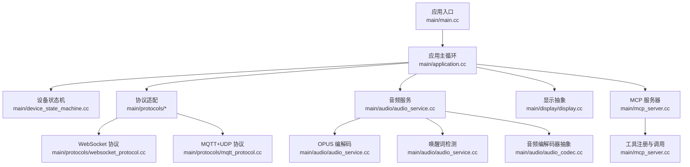
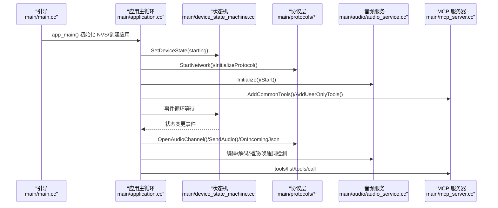
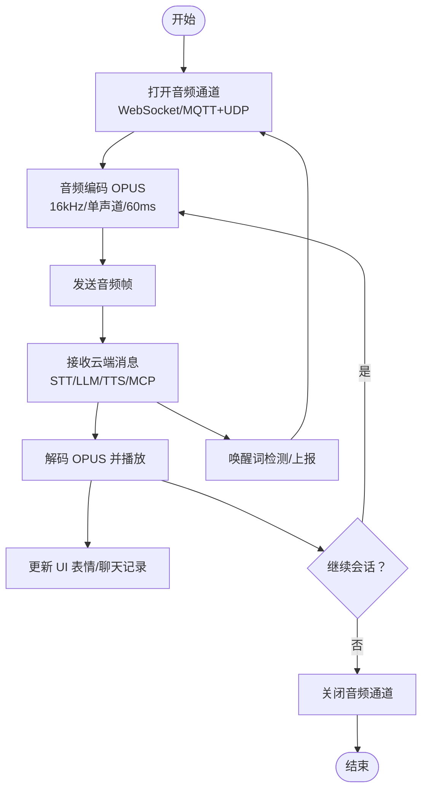
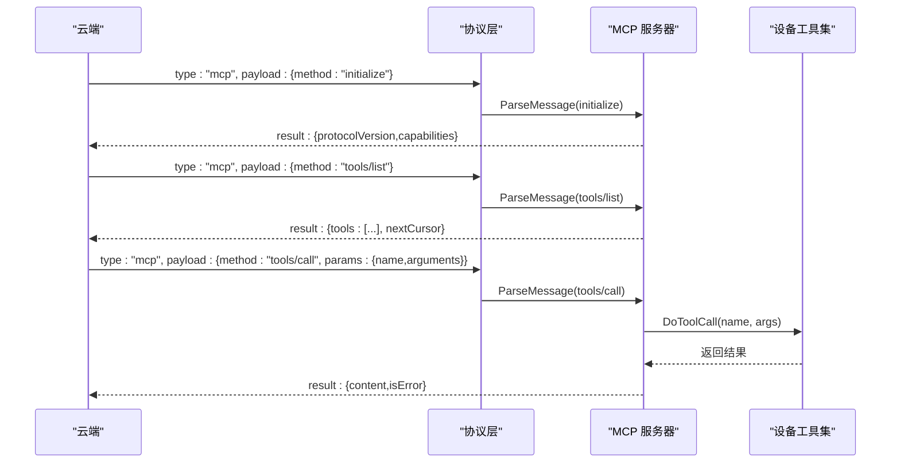
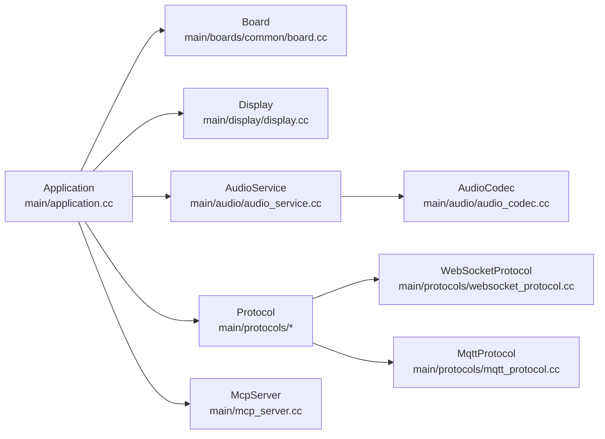

# 核心功能

<cite>
**本文引用的文件**
- [README.md](file://README.md)
- [main/main.cc](file://main/main.cc)
- [main/application.cc](file://main/application.cc)
- [main/settings.cc](file://main/settings.cc)
- [main/mcp_server.cc](file://main/mcp_server.cc)
- [main/audio/audio_service.cc](file://main/audio/audio_service.cc)
- [main/audio/audio_codec.cc](file://main/audio/audio_codec.cc)
- [main/protocols/mqtt_protocol.cc](file://main/protocols/mqtt_protocol.cc)
- [main/protocols/websocket_protocol.cc](file://main/protocols/websocket_protocol.cc)
- [main/display/display.cc](file://main/display/display.cc)
- [main/boards/common/board.cc](file://main/boards/common/board.cc)
- [main/device_state_machine.cc](file://main/device_state_machine.cc)
- [docs/mcp-protocol.md](file://docs/mcp-protocol.md)
- [docs/websocket.md](file://docs/websocket.md)
- [docs/mqtt-udp.md](file://docs/mqtt-udp.md)
</cite>

## 目录
1. [简介](#简介)
2. [项目结构](#项目结构)
3. [核心组件](#核心组件)
4. [架构总览](#架构总览)
5. [详细组件分析](#详细组件分析)
6. [依赖关系分析](#依赖关系分析)
7. [性能考量](#性能考量)
8. [故障排查指南](#故障排查指南)
9. [结论](#结论)
10. [附录](#附录)

## 简介
本项目是一个基于 ESP32 的智能语音交互终端，支持 Wi-Fi/ML307 Cat.1 4G 网络、离线语音唤醒（ESP-SR）、双协议通信（WebSocket/MQTT+UDP）、OPUS 音频编解码、流式 ASR+LLM+TTS 语音交互架构、3D Speaker 说话人识别、OLED/LCD 显示与 Emoji、电池管理、多语言支持，以及设备侧 MCP 控制与云侧 MCP 扩展能力。项目提供完整的设备侧应用入口、协议适配层、音频处理流水线、显示与系统状态管理、以及 MCP 服务器与工具集，覆盖从硬件抽象到云端扩展的全链路。

## 项目结构
项目采用模块化组织，核心目录与职责如下：
- main：应用入口、设备状态机、协议适配、音频服务、显示与系统信息、MCP 服务器、OTA 等
- main/boards：硬件抽象层与各型号板卡配置
- main/protocols：WebSocket 与 MQTT+UDP 协议实现
- main/audio：音频编解码（OPUS）、唤醒词检测（ESP-SR/AFE）、音频处理器、音频队列与编解码任务
- main/display：显示抽象与 OLED/LCD/Emoji 支持
- docs：协议与使用文档（MCP、WebSocket、MQTT+UDP）

图表来源
- [main/main.cc](file://main/main.cc#L15-L30)
- [main/application.cc](file://main/application.cc#L61-L163)
- [main/device_state_machine.cc](file://main/device_state_machine.cc#L108-L131)
- [main/protocols/websocket_protocol.cc](file://main/protocols/websocket_protocol.cc#L23-L76)
- [main/protocols/mqtt_protocol.cc](file://main/protocols/mqtt_protocol.cc#L55-L152)
- [main/audio/audio_service.cc](file://main/audio/audio_service.cc#L62-L123)
- [main/audio/audio_codec.cc](file://main/audio/audio_codec.cc#L29-L67)
- [main/mcp_server.cc](file://main/mcp_server.cc#L33-L126)

章节来源
- [main/main.cc](file://main/main.cc#L15-L30)
- [main/application.cc](file://main/application.cc#L61-L163)
- [main/device_state_machine.cc](file://main/device_state_machine.cc#L108-L131)

## 核心组件
- 应用入口与主循环：负责 NVS 初始化、应用实例创建与运行、事件驱动的状态机推进与协议交互
- 设备状态机：定义设备生命周期状态与合法转换，驱动 UI 与资源管理
- 协议适配层：WebSocket 与 MQTT+UDP 双协议支持，统一音频通道打开/关闭与消息路由
- 音频服务：OPUS 编解码、唤醒词检测（ESP-SR/AFE）、音频处理器、输入/输出队列与定时器
- 显示与系统信息：抽象显示接口、状态栏更新、系统信息 JSON 输出
- MCP 服务器：工具注册、能力通告、工具调用、用户工具扩展
- 硬件抽象：板卡 UUID 生成、显示/摄像头/Led/温度/电量等能力探测与 JSON 输出

章节来源
- [main/application.cc](file://main/application.cc#L61-L163)
- [main/device_state_machine.cc](file://main/device_state_machine.cc#L108-L131)
- [main/protocols/websocket_protocol.cc](file://main/protocols/websocket_protocol.cc#L83-L201)
- [main/protocols/mqtt_protocol.cc](file://main/protocols/mqtt_protocol.cc#L215-L295)
- [main/audio/audio_service.cc](file://main/audio/audio_service.cc#L62-L123)
- [main/mcp_server.cc](file://main/mcp_server.cc#L33-L126)
- [main/boards/common/board.cc](file://main/boards/common/board.cc#L15-L23)

## 架构总览
系统采用“事件驱动 + 状态机 + 协议适配 + 音频流水线”的架构。应用主循环监听事件组，驱动状态机切换，按需打开/关闭音频通道，通过协议层与云端交互，音频服务负责 OPUS 编解码与唤醒词检测，MCP 服务器提供设备侧工具能力，显示与系统信息模块负责 UI 更新与诊断输出。

图表来源
- [main/main.cc](file://main/main.cc#L15-L30)
- [main/application.cc](file://main/application.cc#L61-L163)
- [main/device_state_machine.cc](file://main/device_state_machine.cc#L108-L131)
- [main/protocols/websocket_protocol.cc](file://main/protocols/websocket_protocol.cc#L83-L201)
- [main/protocols/mqtt_protocol.cc](file://main/protocols/mqtt_protocol.cc#L215-L295)
- [main/audio/audio_service.cc](file://main/audio/audio_service.cc#L125-L167)
- [main/mcp_server.cc](file://main/mcp_server.cc#L33-L126)

## 详细组件分析

### 语音交互架构（流式 ASR+LLM+TTS）
- 流程概览：设备通过协议层打开音频通道，音频服务将麦克风数据编码为 OPUS，周期性发送至云端；云端返回 STT 文本、LLM 情感与 TTS 控制消息，设备解码并播放，同时更新 UI 表情与聊天记录。
- 关键点：
  - OPUS 编码：采样率 16kHz、单声道、帧时长 60ms，编码器/解码器动态配置
  - 音频通道：WebSocket（二进制协议版本 1/2/3）或 MQTT+UDP（UDP 加密传输）
  - 唤醒词检测：离线 ESP-SR/AFE 检测，触发后可发送唤醒词音频与“listen detect”消息
  - 服务器 AEC：可选设备端 AEC 或服务端 AEC，通过配置与时间戳配合

图表来源
- [main/audio/audio_service.cc](file://main/audio/audio_service.cc#L62-L123)
- [main/protocols/websocket_protocol.cc](file://main/protocols/websocket_protocol.cc#L28-L76)
- [main/protocols/mqtt_protocol.cc](file://main/protocols/mqtt_protocol.cc#L166-L190)
- [docs/websocket.md](file://docs/websocket.md#L295-L305)
- [docs/mqtt-udp.md](file://docs/mqtt-udp.md#L176-L224)

章节来源
- [main/audio/audio_service.cc](file://main/audio/audio_service.cc#L62-L123)
- [main/protocols/websocket_protocol.cc](file://main/protocols/websocket_protocol.cc#L28-L76)
- [main/protocols/mqtt_protocol.cc](file://main/protocols/mqtt_protocol.cc#L166-L190)
- [docs/websocket.md](file://docs/websocket.md#L295-L305)
- [docs/mqtt-udp.md](file://docs/mqtt-udp.md#L176-L224)

### 3D Speaker 说话人识别
- 功能定位：云端 3D Speaker 说话人识别用于区分不同用户，结合唤醒词检测与识别结果，实现个性化交互与权限控制。
- 实现要点：
  - 唤醒词音频可先于“listen start”发送，用于声纹训练/识别
  - 云端识别结果通过 MCP 或 JSON 消息下发，设备据此更新 UI 或执行差异化策略
- 使用场景：家庭成员区分、权限控制、个性化问候与偏好记忆

章节来源
- [docs/websocket.md](file://docs/websocket.md#L183-L195)
- [docs/mqtt-udp.md](file://docs/mqtt-udp.md#L120-L173)

### 双协议通信支持（WebSocket/MQTT+UDP）
- WebSocket 协议
  - 支持二进制协议版本 1/2/3，版本 2/3 可携带时间戳，利于服务端 AEC
  - 通过“hello”握手协商传输参数与会话 ID，音频以二进制帧传输，文本帧承载 JSON 控制消息
- MQTT+UDP 协议
  - MQTT 传输控制消息与会话管理，UDP 传输加密 OPUS 音频
  - 通过“hello”消息下发 UDP 服务器地址、端口、AES 密钥与随机数，建立加密通道
- 选择策略：根据部署环境与网络条件选择更合适的协议组合

章节来源
- [main/protocols/websocket_protocol.cc](file://main/protocols/websocket_protocol.cc#L83-L201)
- [main/protocols/mqtt_protocol.cc](file://main/protocols/mqtt_protocol.cc#L215-L295)
- [docs/websocket.md](file://docs/websocket.md#L1-L496)
- [docs/mqtt-udp.md](file://docs/mqtt-udp.md#L1-L393)

### OPUS 音频编解码
- 编码：16kHz 采样率、单声道、帧时长 60ms，动态帧大小与输出缓冲区
- 解码：按服务器参数动态重建解码器，必要时进行输出重采样
- 队列与任务：输入/输出/编码/解码/播放队列分离，定时器监控音频电源状态，避免空闲时功耗浪费

章节来源
- [main/audio/audio_service.cc](file://main/audio/audio_service.cc#L62-L123)
- [main/audio/audio_service.cc](file://main/audio/audio_service.cc#L327-L446)
- [main/audio/audio_codec.cc](file://main/audio/audio_codec.cc#L29-L67)

### 显示系统支持（OLED/LCD、Emoji 显示）
- 抽象接口：Display 提供状态、通知、表情、聊天消息与主题设置等接口
- 硬件适配：各板卡通过具体实现（如 OLED/LCD）提供分辨率、亮度、主题等能力
- Emoji：通过字体与图标库支持表情渲染与显示

章节来源
- [main/display/display.cc](file://main/display/display.cc#L23-L61)
- [main/boards/common/board.cc](file://main/boards/common/board.cc#L56-L68)

### 电池管理与系统信息
- 电池/温度：Board 抽象提供电量与温度探测接口，具体板卡可实现
- 系统信息 JSON：输出固件版本、芯片信息、分区表、显示信息等，便于诊断与远程运维

章节来源
- [main/boards/common/board.cc](file://main/boards/common/board.cc#L48-L54)
- [main/boards/common/board.cc](file://main/boards/common/board.cc#L70-L178)

### 多语言支持
- 本地化资源：locales 目录包含多语言字符串与声音资源，应用通过语言配置加载对应资源
- 语言切换：界面与提示音随语言配置动态切换

章节来源
- [README.md](file://README.md#L23-L36)

### 设备侧 MCP 控制与云侧 MCP 扩展
- 设备侧 MCP：注册常用工具（设备状态、音量、屏幕亮度、拍照解释等），用户工具（系统信息、重启、固件升级、屏幕截图/预览等）
- 云侧 MCP：通过 WebSocket/MQTT 下发 tools/call，设备执行工具并返回 JSON-RPC 结果
- 能力通告：通过“hello”消息中的 features 字段声明支持 MCP

图表来源
- [docs/mcp-protocol.md](file://docs/mcp-protocol.md#L1-L270)
- [main/mcp_server.cc](file://main/mcp_server.cc#L353-L436)
- [main/mcp_server.cc](file://main/mcp_server.cc#L511-L563)
- [main/protocols/websocket_protocol.cc](file://main/protocols/websocket_protocol.cc#L148-L165)
- [main/protocols/mqtt_protocol.cc](file://main/protocols/mqtt_protocol.cc#L100-L132)

章节来源
- [docs/mcp-protocol.md](file://docs/mcp-protocol.md#L1-L270)
- [main/mcp_server.cc](file://main/mcp_server.cc#L33-L126)
- [main/mcp_server.cc](file://main/mcp_server.cc#L353-L436)
- [main/mcp_server.cc](file://main/mcp_server.cc#L511-L563)

### Wi-Fi/ML307 Cat.1 4G 连接
- 网络事件：扫描、连接、断开、注册中、SIM/模组错误等事件通过回调驱动 UI 与状态机
- 4G/蜂窝：ML307 Cat.1 模块支持，注册失败/超时/无 SIM 等错误有专门提示

章节来源
- [main/application.cc](file://main/application.cc#L101-L156)
- [docs/websocket.md](file://docs/websocket.md#L369-L378)
- [docs/mqtt-udp.md](file://docs/mqtt-udp.md#L280-L293)

### 离线语音唤醒（ESP-SR）
- 唤醒词模型：ESP-SR/AFE/自定义唤醒词模型自动识别
- 触发行为：检测到唤醒词后可发送唤醒词音频与“detect”消息，随后打开音频通道开始识别

章节来源
- [main/audio/audio_service.cc](file://main/audio/audio_service.cc#L697-L731)
- [docs/websocket.md](file://docs/websocket.md#L183-L195)

### 设备侧 MCP 工具清单（示例）
- 常用工具：获取设备状态、设置音量、设置屏幕亮度、拍照并解释
- 用户工具：获取系统信息、重启、固件升级、屏幕截图/预览、设置资源下载地址

章节来源
- [main/mcp_server.cc](file://main/mcp_server.cc#L33-L126)
- [main/mcp_server.cc](file://main/mcp_server.cc#L128-L301)

## 依赖关系分析
- 应用层依赖：Application 依赖 Board、Display、AudioService、Protocol、McpServer、OTA 等
- 协议层：WebSocket/MQTT+UDP 分别依赖各自网络栈与 JSON 解析
- 音频层：AudioService 依赖 OPUS 编解码、唤醒词检测、音频处理器与编解码器抽象
- MCP 层：依赖 Application 的消息转发与工具注册

图表来源
- [main/application.cc](file://main/application.cc#L61-L163)
- [main/boards/common/board.cc](file://main/boards/common/board.cc#L15-L23)
- [main/display/display.cc](file://main/display/display.cc#L23-L61)
- [main/audio/audio_service.cc](file://main/audio/audio_service.cc#L62-L123)
- [main/audio/audio_codec.cc](file://main/audio/audio_codec.cc#L29-L67)
- [main/protocols/websocket_protocol.cc](file://main/protocols/websocket_protocol.cc#L23-L76)
- [main/protocols/mqtt_protocol.cc](file://main/protocols/mqtt_protocol.cc#L55-L152)
- [main/mcp_server.cc](file://main/mcp_server.cc#L33-L126)

章节来源
- [main/application.cc](file://main/application.cc#L61-L163)

## 性能考量
- 音频实时性：OPUS 60ms 帧与时钟定时器驱动，避免阻塞；解码/重采样按需重建，降低开销
- 事件驱动：事件组与 FreeRTOS 定时器减少轮询，提高响应效率
- 功耗管理：音频输入/输出空闲超时自动关闭，降低功耗
- 协议选择：MQTT+UDP 适合高实时性音频，WebSocket 适合广泛兼容与简单部署

## 故障排查指南
- 网络连接问题
  - Wi-Fi/4G 注册失败、SIM 错误、模组初始化失败等均有专门错误提示与 UI 展示
  - 协议层断开自动重连（MQTT），WebSocket 断开触发通道关闭回调
- 音频问题
  - OPUS 解码失败、序列号异常、解密失败等会记录错误日志并丢弃异常包
  - 输入/输出超时自动关闭音频 IO，避免长时间占用
- MCP 问题
  - tools/call 参数缺失或工具不存在会返回 JSON-RPC 错误
  - 初始化失败或能力通告异常可通过日志定位

章节来源
- [main/application.cc](file://main/application.cc#L101-L156)
- [main/protocols/mqtt_protocol.cc](file://main/protocols/mqtt_protocol.cc#L85-L98)
- [main/protocols/websocket_protocol.cc](file://main/protocols/websocket_protocol.cc#L168-L173)
- [main/audio/audio_service.cc](file://main/audio/audio_service.cc#L380-L392)
- [main/mcp_server.cc](file://main/mcp_server.cc#L511-L563)

## 结论
本项目通过清晰的模块划分与事件驱动架构，实现了从硬件抽象到云端扩展的完整语音交互链路。双协议通信满足不同部署需求，OPUS 编解码与唤醒词检测保障了音质与体验，MCP 协议为设备侧控制与云侧扩展提供了标准化接口。配合多语言、显示与系统信息能力，项目可快速适配多种硬件形态并拓展应用场景。

## 附录
- 实际使用场景与配置示例
  - 语音交互：通过 WebSocket/MQTT+UDP 打开音频通道，发送“hello”，随后发送“listen start”开始识别，接收 STT/LLM/TTS 消息并播放
  - MCP 控制：使用 tools/list 获取工具清单，tools/call 调用设备能力（如设置音量、拍照、重启等）
  - 4G/Wi-Fi：在 Wi-Fi 配置模式下进行网络连接，关注扫描/连接/断开事件与模组错误提示
  - 多语言：在 locales 目录下准备对应语言资源，应用按语言配置加载
- 参考文档
  - MCP 协议交互流程与消息格式
  - WebSocket 通信协议与二进制协议版本
  - MQTT+UDP 混合协议与加密传输

章节来源
- [docs/mcp-protocol.md](file://docs/mcp-protocol.md#L1-L270)
- [docs/websocket.md](file://docs/websocket.md#L1-L496)
- [docs/mqtt-udp.md](file://docs/mqtt-udp.md#L1-L393)