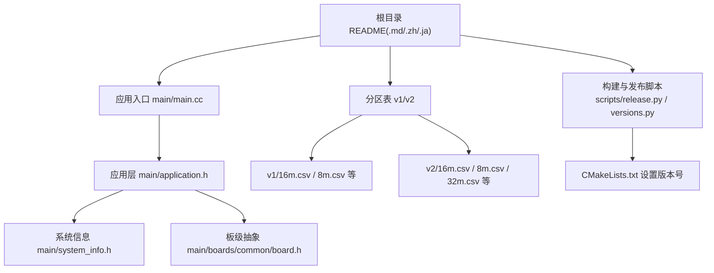
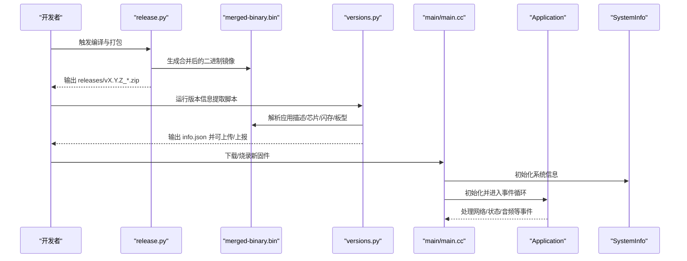
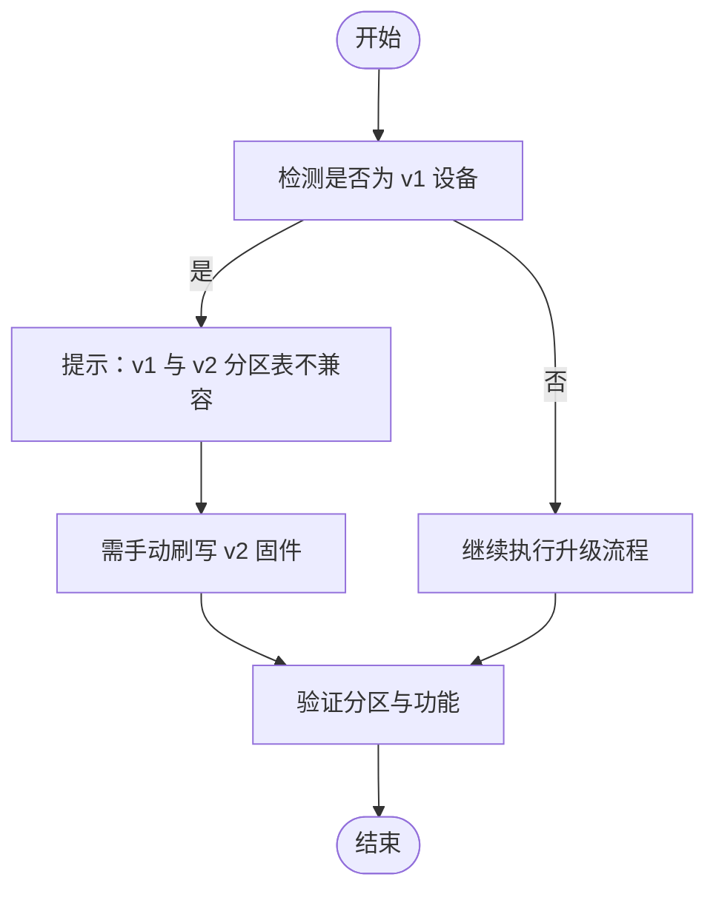
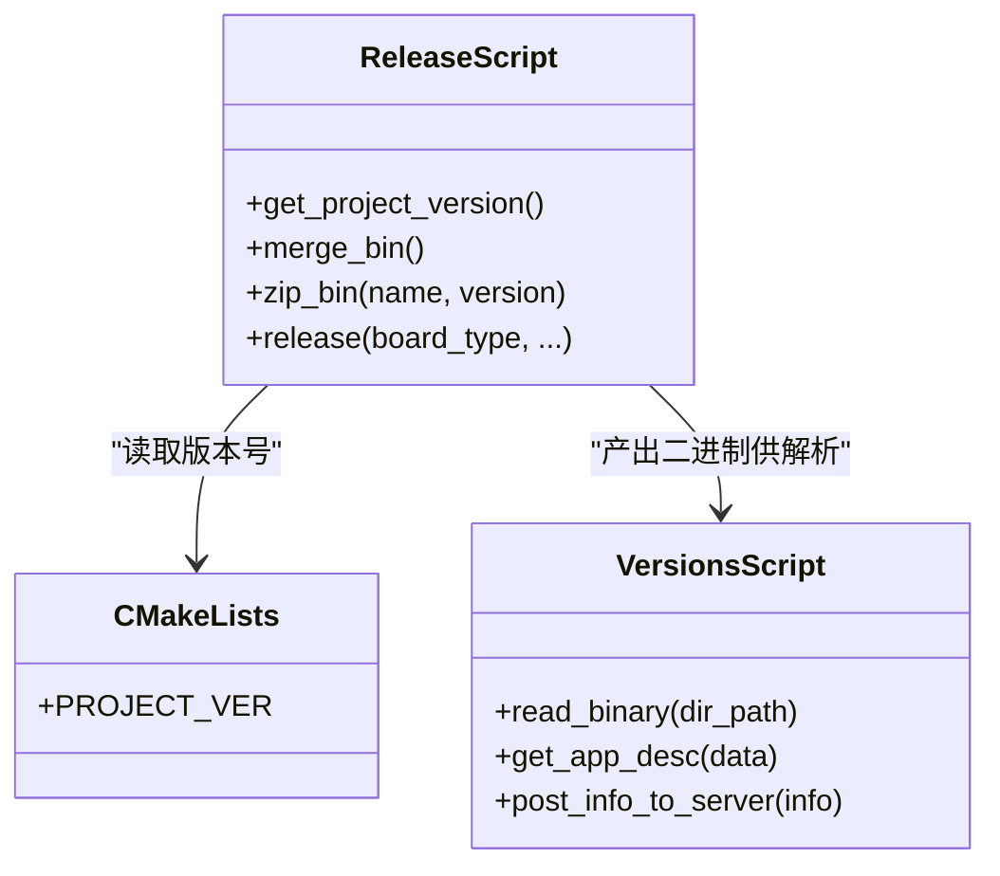
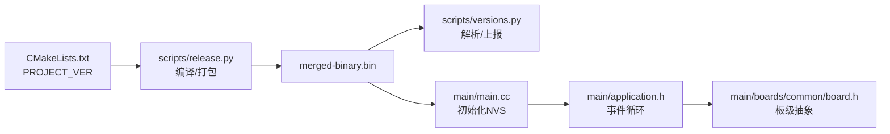

# 版本信息

<cite>
**本文引用的文件**
- [README.md](file://README.md)
- [README_ja.md](file://README_ja.md)
- [partitions/v2/README.md](file://partitions/v2/README.md)
- [partitions/v1/16m.csv](file://partitions/v1/16m.csv)
- [partitions/v2/16m.csv](file://partitions/v2/16m.csv)
- [partitions/v1/8m.csv](file://partitions/v1/8m.csv)
- [partitions/v2/8m.csv](file://partitions/v2/8m.csv)
- [CMakeLists.txt](file://CMakeLists.txt)
- [scripts/release.py](file://scripts/release.py)
- [scripts/versions.py](file://scripts/versions.py)
- [main/application.h](file://main/application.h)
- [main/main.cc](file://main/main.cc)
- [main/system_info.h](file://main/system_info.h)
- [main/boards/common/board.h](file://main/boards/common/board.h)
</cite>

## 目录
1. [简介](#简介)
2. [项目结构](#项目结构)
3. [核心组件](#核心组件)
4. [架构总览](#架构总览)
5. [详细组件分析](#详细组件分析)
6. [依赖关系分析](#依赖关系分析)
7. [性能考量](#性能考量)
8. [故障排查指南](#故障排查指南)
9. [结论](#结论)
10. [附录](#附录)

## 简介
本文件面向XiaoZhi ESP32项目的使用者与维护者，系统化梳理v1与v2版本之间的差异、分区表不兼容性与升级策略、v1稳定版本1.9.2的特性与切换方式、版本维护计划与截止日期、版本号管理与发布周期、功能与性能差异、版本兼容性矩阵、版本迁移最佳实践与常见问题。

## 项目结构
围绕版本信息的关键目录与文件如下：
- 文档与说明：根目录README与多语言README
- 分区表：v1与v2两套分区表，覆盖8M/16M/32M等规格
- 构建与发布：CMakeLists中版本号，scripts目录下的发布与版本信息脚本
- 应用入口与系统信息：main/main.cc与main/system_info.h
- 板级抽象：main/boards/common/board.h

图表来源
- [README.md](file://README.md#L15-L22)
- [partitions/v1/16m.csv](file://partitions/v1/16m.csv#L1-L9)
- [partitions/v2/16m.csv](file://partitions/v2/16m.csv#L1-L9)
- [CMakeLists.txt](file://CMakeLists.txt#L12-L13)
- [scripts/release.py](file://scripts/release.py#L32-L38)
- [main/main.cc](file://main/main.cc#L15-L30)
- [main/application.h](file://main/application.h#L42-L172)
- [main/system_info.h](file://main/system_info.h#L9-L21)
- [main/boards/common/board.h](file://main/boards/common/board.h#L49-L92)

章节来源
- [README.md](file://README.md#L15-L22)
- [partitions/v1/16m.csv](file://partitions/v1/16m.csv#L1-L9)
- [partitions/v2/16m.csv](file://partitions/v2/16m.csv#L1-L9)
- [CMakeLists.txt](file://CMakeLists.txt#L12-L13)
- [scripts/release.py](file://scripts/release.py#L32-L38)
- [main/main.cc](file://main/main.cc#L15-L30)
- [main/application.h](file://main/application.h#L42-L172)
- [main/system_info.h](file://main/system_info.h#L9-L21)
- [main/boards/common/board.h](file://main/boards/common/board.h#L49-L92)

## 核心组件
- 版本号与发布：CMakeLists中设置PROJECT_VER作为版本号；scripts/release.py负责编译、打包与命名；scripts/versions.py负责解析二进制镜像、提取芯片/闪存/板型信息并上报。
- 应用入口与运行时：main/main.cc初始化NVS并启动Application单例；Application封装事件循环、协议栈、OTA、音频、设备状态机等。
- 系统信息：SystemInfo提供芯片型号、MAC地址、内存统计等查询接口。
- 板级抽象：Board类统一抽象显示、音频编解码、网络、电源管理等能力，便于多硬件平台适配。

章节来源
- [CMakeLists.txt](file://CMakeLists.txt#L12-L13)
- [scripts/release.py](file://scripts/release.py#L32-L38)
- [scripts/versions.py](file://scripts/versions.py#L43-L59)
- [main/main.cc](file://main/main.cc#L15-L30)
- [main/application.h](file://main/application.h#L42-L172)
- [main/system_info.h](file://main/system_info.h#L9-L21)
- [main/boards/common/board.h](file://main/boards/common/board.h#L49-L92)

## 架构总览
下图展示从固件镜像到运行态的关键路径：构建与打包、版本信息提取、运行时初始化与事件循环。

图表来源
- [scripts/release.py](file://scripts/release.py#L41-L58)
- [scripts/versions.py](file://scripts/versions.py#L98-L159)
- [main/main.cc](file://main/main.cc#L15-L30)
- [main/application.h](file://main/application.h#L57-L64)
- [main/system_info.h](file://main/system_info.h#L11-L19)

章节来源
- [scripts/release.py](file://scripts/release.py#L41-L58)
- [scripts/versions.py](file://scripts/versions.py#L98-L159)
- [main/main.cc](file://main/main.cc#L15-L30)
- [main/application.h](file://main/application.h#L57-L64)
- [main/system_info.h](file://main/system_info.h#L11-L19)

## 详细组件分析

### v1 与 v2 分区表差异与不兼容性
- 不兼容性：v2引入“assets”分区以支持网络加载内容，v1使用“model”分区存储固定模型。二者布局不同，导致OTA直接从v1升级到v2不可行。
- v1分区布局（示例：16M）：nvs/otadata/phy_init/model/ota_0/ota_1
- v2分区布局（示例：16M）：nvs/otadata/phy_init/ota_0/ota_1/assets
- v2优势：动态内容更新、更灵活的资源利用、OTA资产更新能力；不同容量设备提供多种assets大小配置。

图表来源
- [README.md](file://README.md#L17-L19)
- [partitions/v2/README.md](file://partitions/v2/README.md#L94-L100)
- [partitions/v1/16m.csv](file://partitions/v1/16m.csv#L1-L9)
- [partitions/v2/16m.csv](file://partitions/v2/16m.csv#L1-L9)

章节来源
- [README.md](file://README.md#L17-L19)
- [partitions/v2/README.md](file://partitions/v2/README.md#L5-L11)
- [partitions/v1/16m.csv](file://partitions/v1/16m.csv#L1-L9)
- [partitions/v2/16m.csv](file://partitions/v2/16m.csv#L1-L9)

### v1 稳定版本 1.9.2 与分支切换
- v1稳定版本：1.9.2
- 切换到v1分支：通过版本控制命令切换至v1分支
- 维护计划：v1分支维护截止日期为2026年2月

章节来源
- [README.md](file://README.md#L21-L21)
- [README_ja.md](file://README_ja.md#L17-L21)

### 版本号管理与发布周期
- 版本号来源：CMakeLists中设置PROJECT_VER
- 发布脚本：scripts/release.py读取版本号，调用idf.py进行编译、合并二进制、打包zip
- 版本信息提取：scripts/versions.py解析merged-binary.bin中的应用描述、芯片ID、闪存容量、板型等，并可上报

图表来源
- [scripts/release.py](file://scripts/release.py#L32-L38)
- [scripts/release.py](file://scripts/release.py#L41-L58)
- [scripts/versions.py](file://scripts/versions.py#L43-L59)
- [CMakeLists.txt](file://CMakeLists.txt#L12-L13)

章节来源
- [CMakeLists.txt](file://CMakeLists.txt#L12-L13)
- [scripts/release.py](file://scripts/release.py#L32-L38)
- [scripts/release.py](file://scripts/release.py#L41-L58)
- [scripts/versions.py](file://scripts/versions.py#L43-L59)

### 功能差异与性能改进（基于文档与分区变化）
- v2新增assets分区，支持动态主题、唤醒词模型、语言包等网络加载内容，减少应用分区体积，提升可定制性与OTA灵活性
- v1采用固定model分区，内容相对静态，升级需整包刷写
- 性能方面：v2通过优化分区布局与assets内存映射，提升资源利用率与运行时访问效率

章节来源
- [partitions/v2/README.md](file://partitions/v2/README.md#L7-L11)
- [partitions/v2/README.md](file://partitions/v2/README.md#L77-L84)

### 升级策略与手动刷写指南（从v1到v2）
- 前置准备：备份v1设备上重要数据（如旧model分区相关内容）
- 选择分区表：根据设备闪存容量选择v2对应CSV配置
- 手动刷写：下载v2固件，使用合适工具对分区表与固件进行刷写
- 首次启动：设备自动下载所需assets；完成后验证各项功能

章节来源
- [README.md](file://README.md#L17-L19)
- [partitions/v2/README.md](file://partitions/v2/README.md#L94-L100)

### 版本兼容性矩阵（基于分区表与容量）
- 8M设备：v1使用model分区；v2使用assets分区（2MB）
- 16M设备：v1使用model分区；v2使用assets分区（8MB）
- 32M设备：v2使用assets分区（16MB）

章节来源
- [partitions/v1/8m.csv](file://partitions/v1/8m.csv#L1-L9)
- [partitions/v2/8m.csv](file://partitions/v2/8m.csv#L1-L9)
- [partitions/v1/16m.csv](file://partitions/v1/16m.csv#L1-L9)
- [partitions/v2/16m.csv](file://partitions/v2/16m.csv#L1-L9)
- [partitions/v2/README.md](file://partitions/v2/README.md#L44-L76)

### 运行时与系统信息
- 应用入口：main/main.cc初始化NVS后启动Application单例，进入事件循环
- 应用层：Application封装事件处理、协议栈、OTA、音频、设备状态机等
- 系统信息：SystemInfo提供芯片型号、MAC地址、内存统计等查询接口

章节来源
- [main/main.cc](file://main/main.cc#L15-L30)
- [main/application.h](file://main/application.h#L57-L64)
- [main/system_info.h](file://main/system_info.h#L11-L19)

## 依赖关系分析
- 构建链路：CMakeLists提供版本号 → scripts/release.py读取版本并编译打包 → 产出merged-binary.bin → scripts/versions.py解析二进制并上报
- 运行链路：main/main.cc初始化系统 → Application初始化并运行事件循环 → 通过Board抽象访问硬件能力

图表来源
- [CMakeLists.txt](file://CMakeLists.txt#L12-L13)
- [scripts/release.py](file://scripts/release.py#L32-L38)
- [scripts/versions.py](file://scripts/versions.py#L98-L159)
- [main/main.cc](file://main/main.cc#L15-L30)
- [main/application.h](file://main/application.h#L42-L172)
- [main/boards/common/board.h](file://main/boards/common/board.h#L49-L92)

章节来源
- [CMakeLists.txt](file://CMakeLists.txt#L12-L13)
- [scripts/release.py](file://scripts/release.py#L32-L38)
- [scripts/versions.py](file://scripts/versions.py#L98-L159)
- [main/main.cc](file://main/main.cc#L15-L30)
- [main/application.h](file://main/application.h#L42-L172)
- [main/boards/common/board.h](file://main/boards/common/board.h#L49-L92)

## 性能考量
- v2通过将模型与主题等静态内容迁移到assets分区，减少应用分区占用，提升OTA灵活性与资源利用率
- 不同容量设备的assets分区大小按需分配，兼顾ESP32-C3等受限平台的内存映射限制
- 运行时通过SystemInfo提供内存与任务统计，有助于评估系统负载与优化

章节来源
- [partitions/v2/README.md](file://partitions/v2/README.md#L77-L84)
- [partitions/v2/README.md](file://partitions/v2/README.md#L104-L106)
- [main/system_info.h](file://main/system_info.h#L11-L19)

## 故障排查指南
- 无法OTA从v1升级到v2：由于分区表不兼容，必须手动刷写v2固件
- 刷写后功能异常：检查所选分区表是否与设备闪存容量匹配；确认assets分区已正确下载与校验
- 版本信息上报失败：检查环境变量（服务器URL与Token）是否正确配置；查看脚本报错信息定位原因
- 运行时内存不足：参考SystemInfo输出的堆内存统计，评估任务与资源占用，必要时调整板级配置或降低并发

章节来源
- [README.md](file://README.md#L17-L19)
- [partitions/v2/README.md](file://partitions/v2/README.md#L94-L100)
- [scripts/versions.py](file://scripts/versions.py#L185-L221)
- [main/system_info.h](file://main/system_info.h#L19-L21)

## 结论
- v1与v2在分区表层面存在不兼容性，OTA直升级不可行，需手动刷写v2固件
- v1稳定版本为1.9.2，v1分支维护至2026年2月
- v2通过assets分区显著增强动态内容与OTA能力，适合追求灵活性与可定制性的用户
- 建议在升级前备份数据、核对分区表与容量匹配，并关注版本信息上报与系统内存统计

## 附录
- 版本维护截止日期：v1分支维护至2026年2月
- 版本号来源：CMakeLists中PROJECT_VER
- 发布产物命名：releases/v{版本号}_{变体名}.zip

章节来源
- [README.md](file://README.md#L21-L21)
- [README_ja.md](file://README_ja.md#L17-L21)
- [CMakeLists.txt](file://CMakeLists.txt#L12-L13)
- [scripts/release.py](file://scripts/release.py#L47-L58)