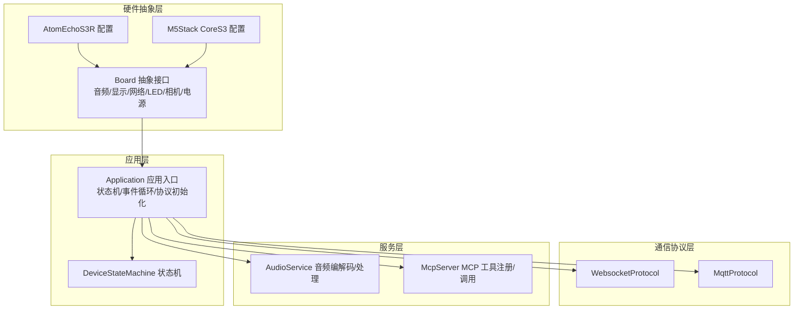
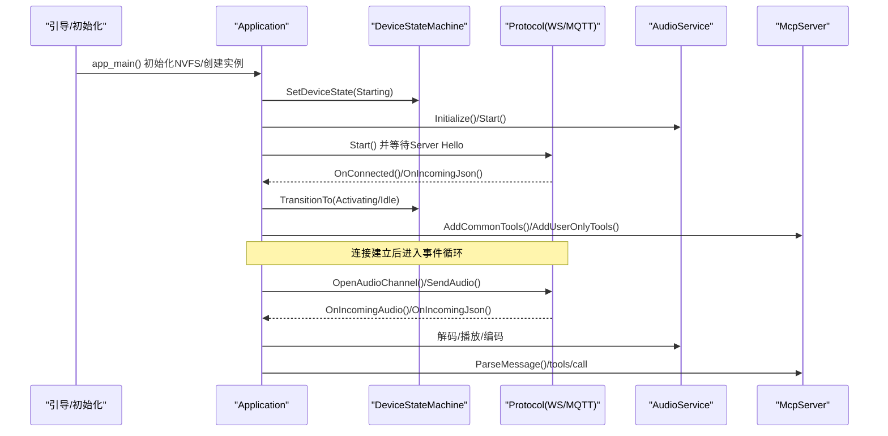
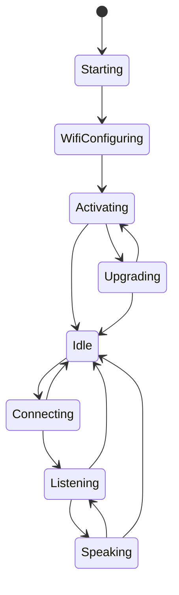
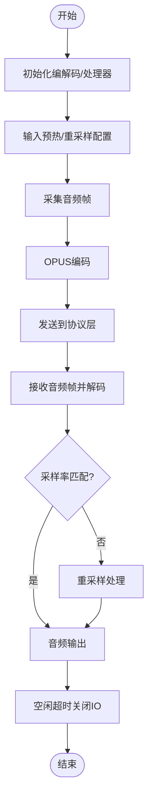
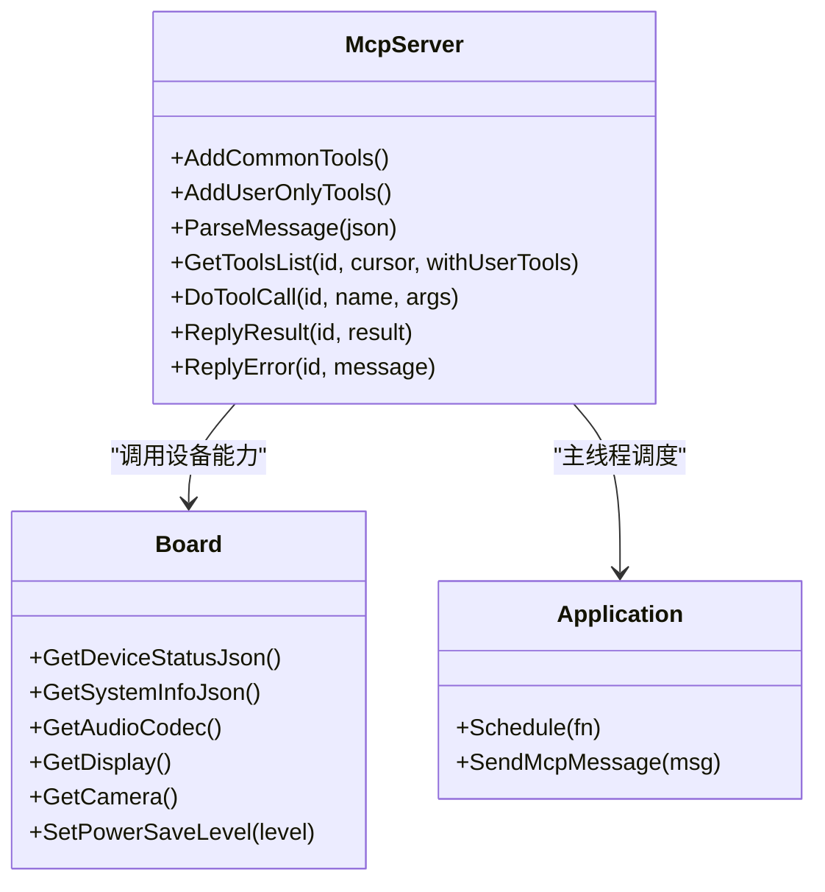
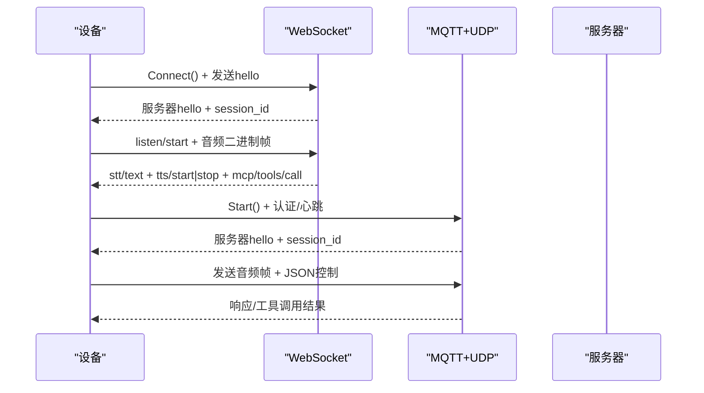
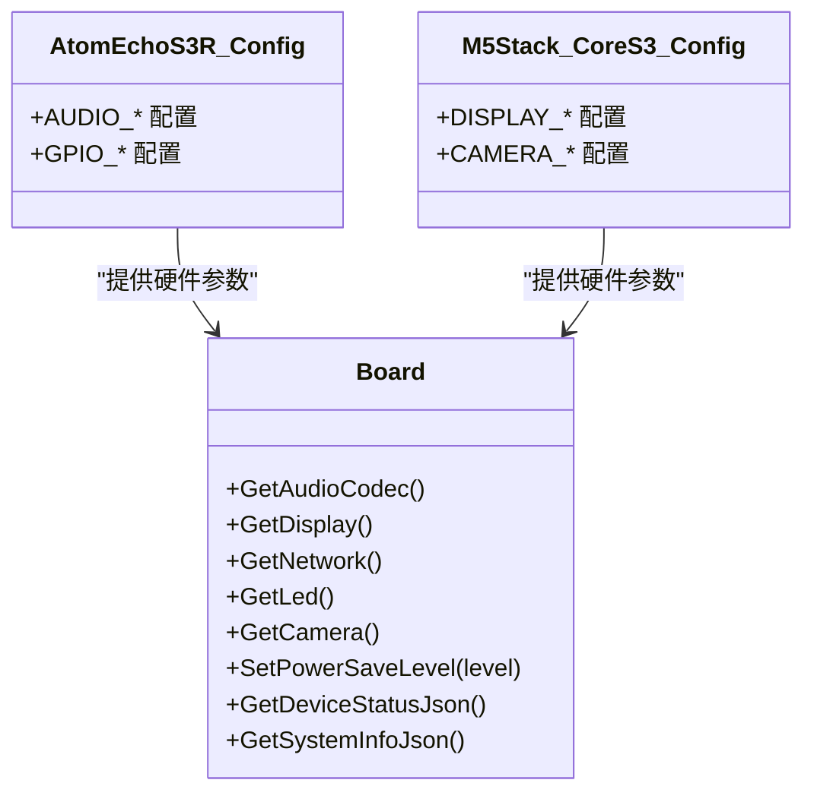
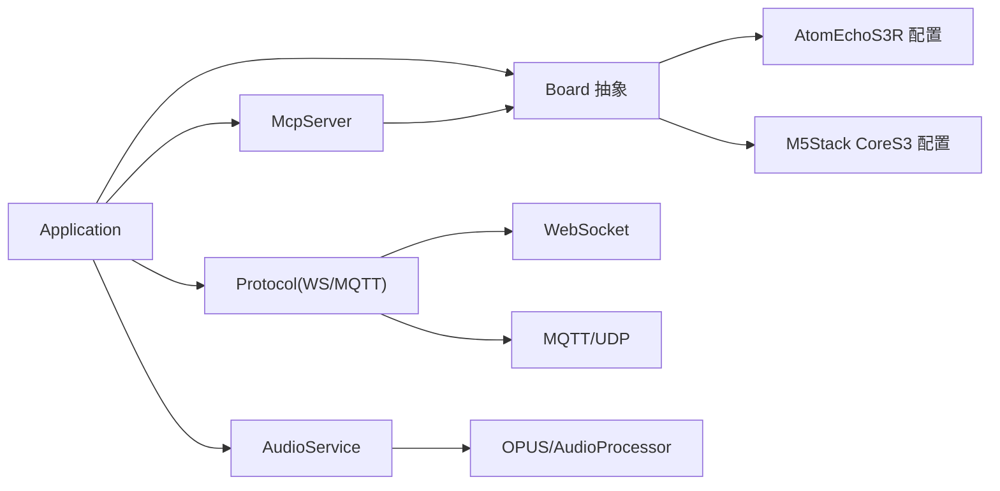

# 项目介绍

<cite>
**本文引用的文件**
- [README.md](file://README.md)
- [LICENSE](file://LICENSE)
- [main/main.cc](file://main/main.cc)
- [main/application.cc](file://main/application.cc)
- [main/device_state_machine.cc](file://main/device_state_machine.cc)
- [main/mcp_server.cc](file://main/mcp_server.cc)
- [main/audio/audio_service.cc](file://main/audio/audio_service.cc)
- [main/boards/common/board.h](file://main/boards/common/board.h)
- [main/boards/atom-echos3r/config.h](file://main/boards/atom-echos3r/config.h)
- [main/boards/m5stack-core-s3/config.h](file://main/boards/m5stack-core-s3/config.h)
- [main/protocols/websocket_protocol.h](file://main/protocols/websocket_protocol.h)
- [main/protocols/mqtt_protocol.h](file://main/protocols/mqtt_protocol.h)
- [docs/mcp-protocol.md](file://docs/mcp-protocol.md)
- [docs/websocket.md](file://docs/websocket.md)
- [CMakeLists.txt](file://CMakeLists.txt)
</cite>

## 目录
1. [引言](#引言)
2. [项目结构](#项目结构)
3. [核心组件](#核心组件)
4. [架构总览](#架构总览)
5. [详细组件分析](#详细组件分析)
6. [依赖关系分析](#依赖关系分析)
7. [性能考量](#性能考量)
8. [故障排查指南](#故障排查指南)
9. [结论](#结论)
10. [附录](#附录)

## 引言
XiaoZhi ESP32 AI聊天机器人是一个基于MCP（Model Context Protocol）的智能语音交互系统，融合AI大模型能力（如通义千问/Qwen、DeepSeek）与多终端控制，提供从语音交互到设备控制的完整解决方案。项目以开源MIT许可证发布，强调教育意义与实用价值，支持70+开源硬件平台，覆盖ESP32系列芯片（ESP32-C3/C3、ESP32-S3/S3、ESP32-P4/P4等），并通过MCP协议实现设备侧与云端侧的双向能力发现与工具调用。

项目核心价值主张：
- 以MCP协议为中心，统一设备侧工具能力与云端大模型能力的协作。
- 通过Websocket/MQTT+UDP双栈通信，适配不同网络环境与部署形态。
- 集成离线唤醒、语音编解码（OPUS）、显示与LED控制、电池管理、OTA升级等能力。
- 支持多语言、多终端联动，覆盖机器人、音箱、穿戴设备等多种形态。

**章节来源**
- [README.md](file://README.md#L11-L37)

## 项目结构
项目采用“硬件抽象层 + 应用层 + 协议层 + 服务层”的分层设计，配合丰富的硬件板子配置，实现跨平台适配与快速落地。

- 硬件抽象层（main/boards/common）：统一设备能力接口（音频编解码、显示、网络、LED、相机、电源管理等），屏蔽不同硬件差异。
- 应用层（main/application.cc、main/device_state_machine.cc）：负责应用生命周期、状态机、事件驱动、协议初始化与消息分发。
- 通信协议层（main/protocols/websocket_protocol.h、main/protocols/mqtt_protocol.h）：封装WebSocket与MQTT+UDP混合通信，承载语音、JSON控制与MCP消息。
- 服务层（main/audio/audio_service.cc、main/mcp_server.cc）：音频编解码与处理、MCP工具注册与调用、系统工具与用户工具。
- 文档与资源（docs/）：MCP协议交互说明、WebSocket通信规范、MQTT+UDP说明、多终端展示图与示例。

**图表来源**
- [main/boards/common/board.h](file://main/boards/common/board.h#L49-L85)
- [main/application.cc](file://main/application.cc#L61-L163)
- [main/device_state_machine.cc](file://main/device_state_machine.cc#L24-L131)
- [main/protocols/websocket_protocol.h](file://main/protocols/websocket_protocol.h#L13-L32)
- [main/protocols/mqtt_protocol.h](file://main/protocols/mqtt_protocol.h#L26-L62)
- [main/audio/audio_service.cc](file://main/audio/audio_service.cc#L40-L123)
- [main/mcp_server.cc](file://main/mcp_server.cc#L23-L126)
- [main/boards/atom-echos3r/config.h](file://main/boards/atom-echos3r/config.h#L4-L27)
- [main/boards/m5stack-core-s3/config.h](file://main/boards/m5stack-core-s3/config.h#L4-L66)

**章节来源**
- [main/main.cc](file://main/main.cc#L15-L30)
- [main/application.cc](file://main/application.cc#L61-L163)
- [main/boards/common/board.h](file://main/boards/common/board.h#L49-L85)
- [docs/mcp-protocol.md](file://docs/mcp-protocol.md#L1-L270)
- [docs/websocket.md](file://docs/websocket.md#L1-L496)

## 核心组件
- 应用入口与事件循环：负责NVFS初始化、应用实例创建与运行、事件组驱动的状态机切换与协议交互。
- 设备状态机：严格定义从启动、配置、激活、升级到空闲、连接、监听、说话等状态的合法转换，确保系统行为可预期。
- 音频服务：集成OPUS编解码、输入/输出队列、重采样、VAD、唤醒词检测、音频测试与功率管理。
- MCP服务器：注册设备侧工具（设备状态、音量、屏幕亮度、主题、拍照、截图、升级等），支持用户专用工具与能力发现。
- 通信协议：WebSocket与MQTT+UDP双栈，支持二进制协议版本（含时间戳），承载hello握手、JSON控制消息与MCP负载。

**章节来源**
- [main/main.cc](file://main/main.cc#L15-L30)
- [main/application.cc](file://main/application.cc#L57-L338)
- [main/device_state_machine.cc](file://main/device_state_machine.cc#L108-L131)
- [main/audio/audio_service.cc](file://main/audio/audio_service.cc#L40-L123)
- [main/mcp_server.cc](file://main/mcp_server.cc#L33-L126)
- [main/protocols/websocket_protocol.h](file://main/protocols/websocket_protocol.h#L13-L32)
- [main/protocols/mqtt_protocol.h](file://main/protocols/mqtt_protocol.h#L26-L62)

## 架构总览
系统以“应用层”为核心，向上对接协议层（WebSocket/MQTT+UDP），向下对接硬件抽象层（Board），中间穿插音频服务与MCP工具服务，形成完整的语音交互与设备控制闭环。

**图表来源**
- [main/main.cc](file://main/main.cc#L15-L30)
- [main/application.cc](file://main/application.cc#L61-L163)
- [main/application.cc](file://main/application.cc#L473-L610)
- [main/mcp_server.cc](file://main/mcp_server.cc#L353-L436)
- [docs/websocket.md](file://docs/websocket.md#L16-L79)

**章节来源**
- [main/application.cc](file://main/application.cc#L165-L338)
- [docs/websocket.md](file://docs/websocket.md#L16-L79)

## 详细组件分析

### 应用层与状态机
- 初始化阶段：NVS闪存初始化、应用实例创建、UI初始化、音频服务初始化、网络异步启动、时钟定时器与事件组。
- 事件循环：基于事件组的多源事件（网络、音频、定时、状态变更等）驱动状态机转换与协议交互。
- 状态机：严格的状态转换矩阵，避免非法状态跳转；支持状态变更回调，驱动UI与设备行为联动。
- 激活流程：OTA版本检查与升级、协议初始化、激活码/挑战流程、完成激活后进入空闲态并降低功耗。

**图表来源**
- [main/device_state_machine.cc](file://main/device_state_machine.cc#L40-L102)
- [main/application.cc](file://main/application.cc#L261-L321)

**章节来源**
- [main/application.cc](file://main/application.cc#L61-L163)
- [main/device_state_machine.cc](file://main/device_state_machine.cc#L108-L131)

### 音频服务与编解码
- OPUS编解码：支持编码帧时长与采样率配置，动态重采样适配不同设备与服务器参数。
- 输入/输出队列：分离编码队列、解码队列与播放队列，避免阻塞与延迟累积。
- 唤醒词与语音处理：集成唤醒词检测与音频处理器（AEC/降噪等），支持VAD状态回调与音频测试模式。
- 功耗管理：空闲超时自动关闭输入/输出，降低功耗。

**图表来源**
- [main/audio/audio_service.cc](file://main/audio/audio_service.cc#L62-L123)
- [main/audio/audio_service.cc](file://main/audio/audio_service.cc#L327-L446)
- [main/audio/audio_service.cc](file://main/audio/audio_service.cc#L682-L695)

**章节来源**
- [main/audio/audio_service.cc](file://main/audio/audio_service.cc#L40-L123)
- [main/audio/audio_service.cc](file://main/audio/audio_service.cc#L327-L446)

### MCP服务器与工具体系
- 工具注册：设备侧常用工具（设备状态、音量、屏幕亮度/主题、拍照、截图等）与用户专用工具（系统信息、重启、固件升级、屏幕快照/预览、资产下载URL等）。
- 能力发现：支持tools/list分页查询，结合withUserTools过滤用户专用工具。
- 工具调用：tools/call参数校验与类型转换，主线程安全执行，错误统一返回JSON-RPC错误。
- 能力扩展：支持vision能力（摄像头解释URL与Token），用于图像理解与场景控制。

**图表来源**
- [main/mcp_server.cc](file://main/mcp_server.cc#L33-L126)
- [main/mcp_server.cc](file://main/mcp_server.cc#L455-L509)
- [main/mcp_server.cc](file://main/mcp_server.cc#L511-L563)
- [main/boards/common/board.h](file://main/boards/common/board.h#L68-L84)
- [main/application.cc](file://main/application.cc#L61-L100)

**章节来源**
- [main/mcp_server.cc](file://main/mcp_server.cc#L33-L126)
- [main/mcp_server.cc](file://main/mcp_server.cc#L353-L436)
- [docs/mcp-protocol.md](file://docs/mcp-protocol.md#L1-L270)

### 通信协议：WebSocket与MQTT+UDP
- WebSocket：握手hello消息、二进制协议版本（含时间戳/负载大小）、JSON控制消息（STT/LLM/TTS/MCP/System/Custom）。
- MQTT+UDP：心跳与重连策略、AES加密上下文、UDP服务器地址与端口、序列号管理，适合高并发与低时延场景。
- 协议选择：根据OTA配置自动选择MQTT或WebSocket，默认优先MQTT；支持运行时切换。

**图表来源**
- [docs/websocket.md](file://docs/websocket.md#L16-L79)
- [docs/websocket.md](file://docs/websocket.md#L128-L292)
- [main/protocols/websocket_protocol.h](file://main/protocols/websocket_protocol.h#L13-L32)
- [main/protocols/mqtt_protocol.h](file://main/protocols/mqtt_protocol.h#L26-L62)

**章节来源**
- [docs/websocket.md](file://docs/websocket.md#L1-L496)
- [main/protocols/websocket_protocol.h](file://main/protocols/websocket_protocol.h#L13-L32)
- [main/protocols/mqtt_protocol.h](file://main/protocols/mqtt_protocol.h#L26-L62)

### 硬件抽象与多终端适配
- Board抽象：统一音频编解码、显示、网络、LED、相机、电源管理接口，支持多板子配置。
- 板子配置：以宏定义形式配置I2S、I2C、GPIO、显示尺寸与偏移、相机引脚等，适配不同硬件平台。
- 典型板子：AtomEchoS3R、M5Stack CoreS3等，覆盖不同显示、音频与外设组合。

**图表来源**
- [main/boards/common/board.h](file://main/boards/common/board.h#L49-L85)
- [main/boards/atom-echos3r/config.h](file://main/boards/atom-echos3r/config.h#L4-L27)
- [main/boards/m5stack-core-s3/config.h](file://main/boards/m5stack-core-s3/config.h#L4-L66)

**章节来源**
- [main/boards/common/board.h](file://main/boards/common/board.h#L49-L85)
- [main/boards/atom-echos3r/config.h](file://main/boards/atom-echos3r/config.h#L4-L27)
- [main/boards/m5stack-core-s3/config.h](file://main/boards/m5stack-core-s3/config.h#L4-L66)

## 依赖关系分析
- 应用层依赖硬件抽象层（Board）、协议层（WebSocket/MQTT）、服务层（AudioService/McpServer）。
- 协议层依赖网络库（WebSocket/MQTT/UDP）与JSON解析库（cJSON）。
- 服务层依赖音频编解码库（OPUS）、音频处理器（AFE/NoAudioProcessor）与唤醒词引擎（AFE/ESP/Custom）。
- 硬件抽象层通过各板子配置文件注入具体硬件参数，实现跨平台兼容。

**图表来源**
- [main/application.cc](file://main/application.cc#L61-L163)
- [main/protocols/websocket_protocol.h](file://main/protocols/websocket_protocol.h#L13-L32)
- [main/protocols/mqtt_protocol.h](file://main/protocols/mqtt_protocol.h#L26-L62)
- [main/audio/audio_service.cc](file://main/audio/audio_service.cc#L40-L123)
- [main/mcp_server.cc](file://main/mcp_server.cc#L23-L126)
- [main/boards/common/board.h](file://main/boards/common/board.h#L49-L85)
- [main/boards/atom-echos3r/config.h](file://main/boards/atom-echos3r/config.h#L4-L27)
- [main/boards/m5stack-core-s3/config.h](file://main/boards/m5stack-core-s3/config.h#L4-L66)

**章节来源**
- [main/application.cc](file://main/application.cc#L61-L163)
- [main/protocols/websocket_protocol.h](file://main/protocols/websocket_protocol.h#L13-L32)
- [main/protocols/mqtt_protocol.h](file://main/protocols/mqtt_protocol.h#L26-L62)
- [main/audio/audio_service.cc](file://main/audio/audio_service.cc#L40-L123)
- [main/mcp_server.cc](file://main/mcp_server.cc#L23-L126)
- [main/boards/common/board.h](file://main/boards/common/board.h#L49-L85)

## 性能考量
- 音频路径优化：OPUS编码帧时长与采样率配置、输入/输出队列容量与重采样策略，减少延迟与失真。
- 事件驱动与任务分离：音频输入/输出/编解码分别在独立任务中运行，避免阻塞主事件循环。
- 功耗管理：空闲超时自动关闭音频输入/输出，低功耗模式与性能模式动态切换。
- 协议版本选择：WebSocket适合简单场景，MQTT+UDP适合高并发与低时延，支持按部署场景灵活选择。

[本节为通用指导，无需具体文件引用]

## 故障排查指南
- 网络连接失败：检查WiFi配置、SIM卡状态、服务器地址与鉴权头；关注网络事件回调与错误告警。
- 音频无声/破音：核对采样率与帧时长配置、重采样链路、音频处理器开关与AEC设置。
- MCP工具调用失败：确认工具名称与参数schema、withUserTools权限、payload大小限制与JSON-RPC错误码。
- OTA升级失败：检查下载URL、分区有效性、版本校验与激活码流程；必要时手动刷写固件。

**章节来源**
- [main/application.cc](file://main/application.cc#L286-L297)
- [main/application.cc](file://main/application.cc#L398-L471)
- [main/mcp_server.cc](file://main/mcp_server.cc#L455-L509)
- [docs/websocket.md](file://docs/websocket.md#L369-L379)

## 结论
XiaoZhi ESP32 AI聊天机器人以MCP协议为核心，构建了从语音交互到设备控制的全栈方案。通过清晰的分层架构、完善的硬件抽象与丰富的工具体系，项目既满足教学与实验场景，也能支撑商业级产品落地。开源MIT许可与活跃的生态，使其成为学习AI硬件开发与多终端协同的理想载体。

[本节为总结性内容，无需具体文件引用]

## 附录
- 版本信息：项目版本在构建文件中声明，当前版本号可据此确认升级与兼容性。
- 开源许可：MIT许可证，允许自由使用、修改与分发，包括商业用途。
- 社区与生态：提供多语言文档、硬件展示图谱、相关服务端与客户端项目链接，便于二次开发与集成。

**章节来源**
- [CMakeLists.txt](file://CMakeLists.txt#L12-L14)
- [LICENSE](file://LICENSE#L1-L23)
- [README.md](file://README.md#L157-L163)